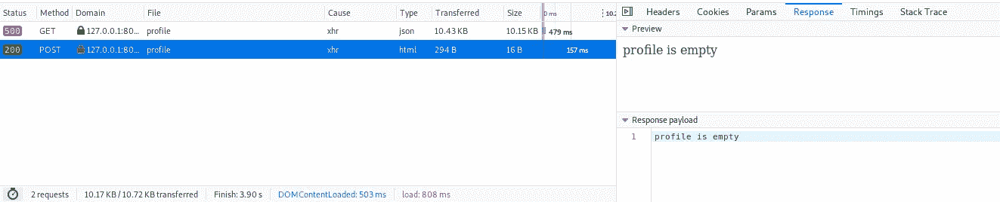
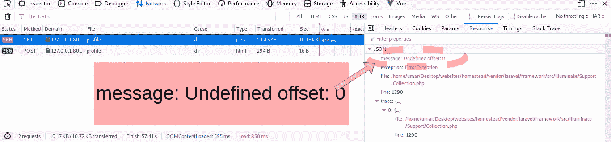
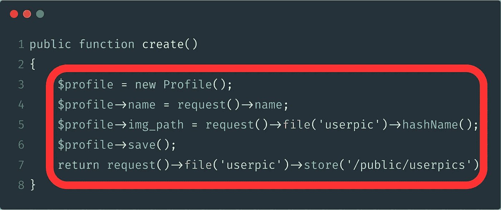

# Laravel 和 Vue:用 CRUD 管理面板创建作品集网站——第四章

> 原文：<https://itnext.io/laravel-and-vue-creating-a-portfolio-website-with-a-crud-admin-panel-chapter-four-db24fed8db50?source=collection_archive---------3----------------------->

## 更新报头并重构代码

**总结:**为了创建和显示概要文件，我们在 create route 上发布了一个表单。

**现在— :**

我们能否创建一个更新表单并将其发布到更新路线？**是的，但是……**

一定要吗？**否**

有一种更有效的方法来更新配置文件数据。我们可以保留和使用**相同的表单**用于创建和更新功能。我们必须改变控制器的功能。

我们需要在**Api.php**中更改 post 配置文件路由，以运行 ProfileController 的 store()函数，而不是 create()函数。

```
R̶o̶u̶t̶e̶:̶:̶p̶o̶s̶t̶(̶'̶/̶p̶r̶o̶f̶i̶l̶e̶'̶,̶ ̶'̶P̶r̶o̶f̶i̶l̶e̶C̶o̶n̶t̶r̶o̶l̶l̶e̶r̶@̶c̶r̶e̶a̶t̶e̶'̶)̶;̶
Route::*post*('/profile', 'ProfileController@**store**');
```

# 构建商店功能

## **我们想从商店得到什么()功能**:

1.  检查一下我们的数据库中是否有数据。
2.  如果数据库中没有任何数据，请将表单数据输入到数据库中。
3.  如果我们已经有数据，改变数据库中的数据。

## **1。让我们检查是否有任何档案数据**

这里我们必须收集一组数据。`Profile::all()`从概要文件模型(App\Profile.php)中收集所有数据，您可以使用`**isEmpty()**`来检查这个数据集合是否为空。

这里需要的是`Profile::all()->isEmpty()`；不过也可以把 **Profile::all()** 缩写成 **$profile** 然后用`**$profile->isEmpty()**`。

```
*public function* store(Request $request)
{
    **$profile = Profile::*all*();**
    *if* (**$profile->isEmpty()**) {
        return 'profile is empty';
    } *else* {
        return 'profile is not empty';
    }
}
```

**状态 200** —如果您清空表格，发布到路线将会显示:



**状态 500** :—关于获取配置文件数据，如果您清空表格，您将没有任何数据可呈现，因此在网络选项卡中会出现 500 错误:

> **消息:** **未定义的偏移量:0**

> 如果您访问 api/profile 路径，您会得到同样的错误。



这个错误是因为我们在配置文件表中没有任何数据，这意味着`Profile::all()`将产生一个**空数组** []。

而如果`Profile::all()`会产生一个空数组，那么**在**T6 肯定会没有数据

## 2.如果数据库中没有任何数据，请将表单数据输入到数据库中。

我们可以简单地从 create 函数中复制代码



```
*public function* store(Request $request)
{
    $profile = Profile::*all*();
    *if* ($profile->isEmpty()) {
        **$profile = *new* Profile();
        $profile->name = request()->name;
        $profile->img_path = request()->file('userpic')->hashName();
        $profile->save();
        *return* request()->file('userpic')->store('/public/userpics');**
    } *else* {
        *return* 'profile is not empty';
    }
}
```

虽然这可以工作，但是代码很难看。


如果你必须这样对待你的眼睛，你需要做一些叫做**重构的事情。这会减轻你的眼疲劳。**

## 重构

重构就是当你改变代码 ***的样子*** 但它有**同样的效果**。

我们可以使用`**$this->create()**`运行 create()函数

```
*public function* store(Request $request)
{
    $profile = Profile::*all*();
    *if* ($profile->isEmpty()) {
        ***$this*->create();**
    } *else* {
        *return* 'profile is not empty';
    }
}
```

> 代码解释:
> 
> `$this`指向同一控制器内的事物。
> 
> `create()`是 create 函数(我们在第三章中创建了)。

现在，如果 profile::all()中没有数据，store()函数将运行 create()函数。

> **测试:**截断表格，填写名称字段，选择一个文件并单击提交按钮。如果您在 network 选项卡中看到 200，则重构的 store 方法正在工作。

## 3.如果我们已经有数据，改变数据库中的数据。

指向 else {}中的 **update()** 函数

```
*public function* store(Request $request)
{
    $profile = Profile::*all*();
    *if* ($profile->isEmpty()) {
        *$this*->create();
    } *else* {
        ***$this*->update();**
    }
}
```

要使用更新功能，我们只需重新发布表单并插入数据。

因为我们只是简单地**重新发布表单**，我们可以使用与创建函数中的代码相同的代码来更新函数，只有一个**异常**。

例外是 create()代码以`$profile = new Profile()`开始，而 update()代码以`**Profile::findOrFail(1)**`开始

`**findOrFail(1);**`查找 id 为 1 的数据库表记录。接下来的几行代码将把数据设置到那个特定的行。

`**findOrFail(2);**`会查找 id 为 2 的数据库表记录，其他数字依此类推。

我们希望更改 id 为 1 的行，因为这是该行显示在网站上的数据。

```
*public function* update(Request $request, $id)
{
    $profile = **Profile::*findOrFail*(1);**
    $profile->name = request()->name;
    $profile->img_path = request()->file('userpic')->hashName();
    $profile->save();
    *return* request()->file('userpic')->store('/public/userpics');
}
```

现在发布表单将在网络选项卡中获得 500 状态，并显示以下消息:

> 消息:函数 App \ Http \ Controllers \ profile controller::update()的参数太少，传入了 0 个…而实际应为 2 个

让我们检查一下函数的顶部🔎

```
*public function* update(**Request $request, $id**)
```

在()内，它表示`**Request $request, $id**`。

这是 500 条信息中提到的两个论点。

**错误解释**:如果一个函数在()括号中有$variables，那么当代码运行时，它将保存$variables/ **参数**。人工翻译:

`public function speak($aStick)`表示**拿着棍子说话**

但是

`public function speak()`只是表示**说话**

一个人拿着棍子不能说话，除非有人递给他一根棍子。

就像这样，`**public function update(Request $request, $id)**` 不能工作，直到$request 和$id 被**传递给**它。

## **传递参数**

如果查看 store()函数，可以看到它在持有$request 的同时运行。因此，您只需通过在括号内编写$request 将$request 传递给更新函数

```
*public function* store(Request $request)
{
    $profile = Profile::*all*();
    *if* ($profile->isEmpty()) {
        *$this*->create();
    } *else* {
        *$this*->update(**$request**);
    }
}
```

现在，您将获得一个带有类似消息的 500 状态。这条消息将会说

> 通过 1 个，预期正好 2 个

另一个参数是$id。我们可以简单地在`else{}`中声明$id，就像这样:

```
*public function* store(Request $request)
{
    $profile = Profile::*all*();
    *if* ($profile->isEmpty()) {
        *$this*->create();
    } *else* {
        **$id = 1;**
        *$this*->update($request, **$id**);
    }
}
```

填写表格，点击提交，网络选项卡将显示状态 200。

刷新页面，您将看到使用表单所做的更改。

我们当前重构的代码正在工作👍 😃这意味着我们的 Store()函数正在工作👍 😄

然而，create()函数和 update()函数的最后 4 行是相同的。如果这对你来说是个问题，你需要**更多的重构**。

## 更多重构

这两个函数的最后 4 行执行与`**$profile**`相同的**操作**，因此我们应该将这两个函数的`$profile` 传递给一个包含这四行的新函数。

让我们创建一个名为 insertData 的函数，它接受$profile 作为参数。

```
*public function* create()
{
    $profile = *new* Profile();
    *$this*->insertData($profile);
}*public function* update(Request $request, $id)
{
    **$profile** = Profile::*findOrFail*(1);
    *$this*->insertData(**$profile**);
}

*public function* **insertData**(**$profile**) {
    $profile->name = request()->name;
    $profile->img_path = request()->file('userpic')->hashName();
    $profile->save();
    *return* request()->file('userpic')->store('/public/userpics');
}
```

您可以通过提交表单并重新加载页面来测试更新功能。

可以通过首先截断表，然后提交和重新加载来测试 create()函数。

现在，当我们想要创建或更新时，我们总共使用了 3 个函数:

*   为了创建，我们必须通过 store()，create()和 insertData()
*   为了更新，我们必须通过 store()，update()和 insertData()

如果你想消除中间人，你可以第三次重构。

# 消除中间功能

如果您觉得中间函数太短，不值得存在，您可以删除调用这些函数运行的代码行，并简单地复制和粘贴内部代码，如下所示:

```
*public function* store(Request $request)
{
    $profile = Profile::*all*();
    *if* ($profile->isEmpty()) {
        $̶t̶h̶i̶s̶-̶>̶c̶r̶e̶a̶t̶e̶(̶)̶;̶
        **$profile = *new* Profile();
        *$this*->insertData($profile);**
    } *else* {
        $̶i̶d̶ ̶=̶ ̶1̶;̶
        $̶t̶h̶i̶s̶-̶>̶u̶p̶d̶a̶t̶e̶(̶$̶r̶e̶q̶u̶e̶s̶t̶,̶ ̶$̶i̶d̶)̶;̶
        **$profile = Profile::*findOrFail*(1);
        *$this*->insertData($profile);**
    }
}
```

不再需要 create()和 update()函数。

*   您可以在没有 create()函数的情况下使用 CRUD 的 create 功能。

和

*   您可以在没有 update()函数的情况下使用 CRUD 的更新功能。

```
*public function* store(Request $request)
{
    $profile = Profile::*all*();
    *if* ($profile->isEmpty()) {
        $profile = *new* Profile();
        *$this*->insertData($profile);
    } *else* {
        $profile = Profile::*findOrFail*(1);
        *$this*->insertData($profile);
    }
}
```

您可以在括号()中设置$变量的含义，这样就可以进行更多的重构:

```
*public function* store(Request $request)
{
    $profile = Profile::*all*();
    *if* ($profile->isEmpty()) {
        ***$this*->insertData($profile = *new* Profile());**
    } *else* {
        ***$this*->insertData($profile = Profile::*findOrFail*(1));**
    }
}
```

> 记得在剪切和粘贴时去掉末尾的分号

通过所有这些重构，我们在 store()函数中使用`$profile`的次数从 10 次减少到了 4 次。

在下一章，我们将会看到**表单验证**。

[](/laravel-and-vue-creating-a-portfolio-website-with-a-crud-admin-panel-chapter-five-d4c6ceeff93c) [## Laravel 和 Vue:用 CRUD 管理面板创建作品集网站——第五章

### Laravel 表单验证、错误消息和处理成功

itnext.io](/laravel-and-vue-creating-a-portfolio-website-with-a-crud-admin-panel-chapter-five-d4c6ceeff93c)