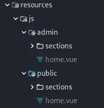
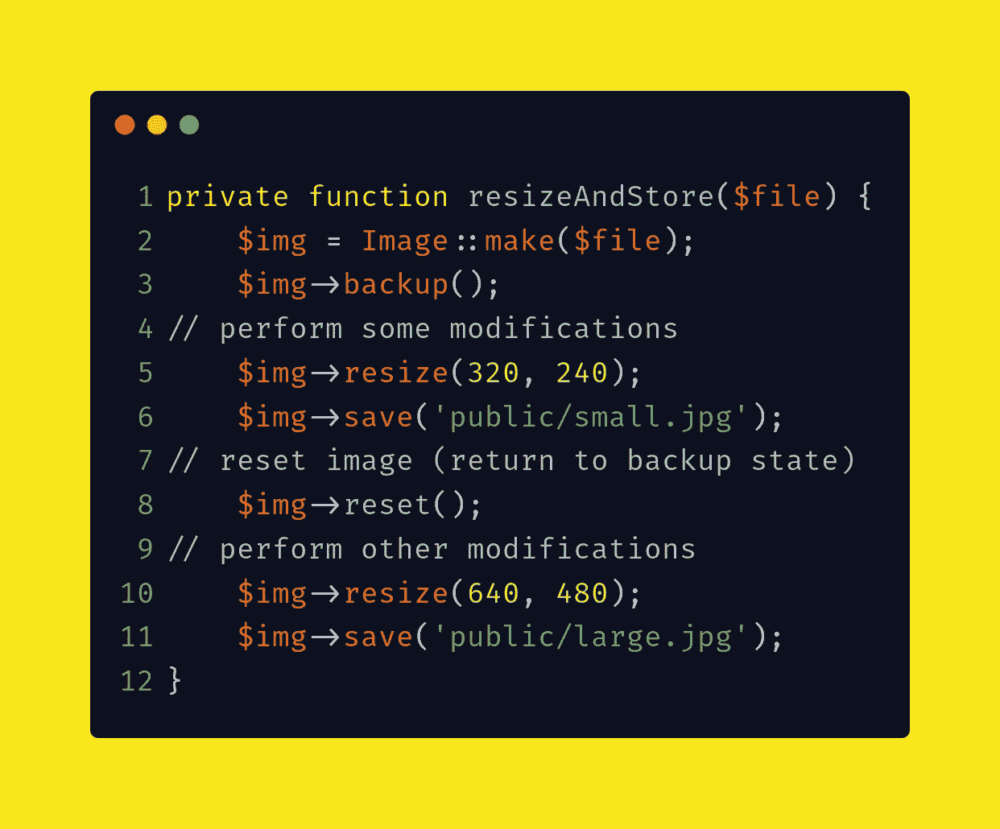

# Laravel 和 Vue:用 CRUD 管理面板创建作品集网站——第七章

> 原文：<https://itnext.io/laravel-and-vue-creating-a-portfolio-website-with-a-crud-admin-panel-chapter-seven-b473ee1ac816?source=collection_archive---------3----------------------->

## 构建投资组合

一旦你用刊头介绍了自己，你可能还想展示你参与过的任何项目。为此，你可以有一个投资组合部分，这就是我们现在要做的。

💡有一种不同的方法将组件包含在模板标签中，那就是**折叠空标签。**比如`**<masthead :profile="profile"></masthead>**`可以改成`**<masthead :profile="profile"/>**`

```
<div *id*="app">
    <masthead *:profile*="profile"/>
    <ProfileEditor/>
</div>
```

我们将致力于投资组合和投资组合编辑器组件，但在此之前，我们需要做好准备。

## 分离制备

是时候将报头组件和概要文件编辑器组件放入它们各自的文件夹中了。

所以让我们创建两个文件夹，一个名为 **public** ，一个名为 **admin** 。在这两个文件夹中，我们应该分别创建一个 **sections** 文件夹和一个 **home.vue** 文件。



管理和公共文件夹，每个文件夹都有一个文件夹和主文件夹部分

**公共文件夹:**我们需要将报头组件移动到**公共/部分**。公共文件夹的 **home.vue** 应该导入了报头组件。

> **澄清**:我们正在处理刚刚创建的公共文件夹，而不是 Laravel 的主公共文件夹

我们可以从 App.vue 中复制并粘贴所有与报头组件直接相关的内容，但有一个例外。例外是我们现在从`**"./sections/masthead"**`进口报头

resources/js/public/home.vue👇：

```
<template>
    <masthead *:profile*="profile"/>
</template><script>
    *import* masthead *from* "**./sections/masthead**";
    *export default* {
        name: "home",
        components: {
            masthead
        },
        data() {
            *return* {
                profile: {
                    type:Object
                }
            }
        },
        mounted() {
            *this*.getProfile();
        },
        methods: {
            getProfile() {
                axios.get('/api/profile')
                    .then(response => {
                        *console*.log(response.data);
                        *this*.profile = response.data;
                    })
                    .catch(error => {
                        *console*.log(error);
                    });
            },
        }
    }
</script>
```

管理文件夹:我们需要管理文件夹的 home.vue 以类似的方式构建。类似于公共文件夹的 home.vue，我们从`**"./sections/ProfileEditor"**`导入 ProfileEditor

resources/js/admin/home.vue👇：

```
<template>
    <ProfileEditor/>
</template><script>
    *import* ProfileEditor *from* "**./sections/ProfileEditor**";
    *export default* {
        name: "home",
        components: {
            ProfileEditor
        }
    }
</script>
```

## 作品集编辑器

既然我们已经将 Profile 和 ProfileEditor 组件移动到它们各自的文件夹中，我们可以清空 App.vue 并开始处理 PortfolioEditor

App.vue👇：

```
<template>
    <div *id*="app">
        <PortfolioEditor/>
    </div>
</template><script>
    *import* PortfolioEditor *from* "./PortfolioEditor"
    *export default* {
        name: "App",
        components: {
            PortfolioEditor
        },
        data() {
            *return* { }
        },
        mounted() { },
        methods: { },
    }
</script>
```

投资组合将由**投资组合项目组成。**组合项目将由一个**小图像**和一个**项目名称**组成。访问者将能够点击投资组合项目，并看到一个**大图像**与**描述**。

为此，我们需要一个包含三个字段的表单

1.  图像
2.  名字
3.  描述

## 1.图像

我们将上传图像，它将创建两个图像，一个小的和一个大的，所以我们将从一个非常简单的表单开始，包括一个**文件输入**和一个**按钮**

```
<form *enctype*="multipart/form-data">
    <input *type*="file" *@change*="selectFile" *name*="**itempic**">
    <button *@click.prevent*="onSubmit">Submit</button>
</form>
```

这类似于我们为 ProfileEditor 构建的表单，但是这次我们使用名称 **itempic。**这对功能没有影响，但为了便于理解，更改名称是有好处的。

selectFile 方法与 ProfileEditor 相同

```
selectFile(event) {
    *this*.file = event.target.files[0];
},
```

我们有一个更小的 onSubmit 方法，因为我们暂时只提交 itempic。与上次不同，我们没有将数据从 onSubmit 传递给不同的方法。

data()应该返回文件

```
data() {
    *return* {
        file: '',
    }
},
```

onSubmit 方法:

```
onSubmit() {
    *let* fd = *new* FormData();
    fd.append('itempic', *this*.file); **axios.post('api/portfolio', fd);**
},
```

在 api.php 创建路线

```
Route::*post*('/portfolio', 'PortfolioController@store');
```

创建控制器

```
php artisan make:controller PortfolioController --resource
```

## **小心—小心—小心—小心**


micha Parzuchowski 在 [Unsplash](https://unsplash.com?utm_source=medium&utm_medium=referral) 上拍摄的照片

你可能认为你可以复制 ProfileController 并修改它，使它显示为 PortfolioController，但是这两者之间有微妙而重要的区别，这就是为什么我们必须小心地做这件事。

我们需要一个 store()函数来调整大小和保存图像。让我们看看 ProfileEditor，并将`**resizeAndStore()**`的代码复制到 ProfileEdior 的存储函数中

```
*public function* store(Request $request) {
    *// open an image file* $img = Image::make($file);
    *// now you are able to resize the instance* $contents = $img->resize(240, 240)->encode();
    *//save* Storage::*put*($fullpath,$contents);
}
```

如果您现在发布一个文件，您将在“网络”选项卡中收到一条 500 消息和以下错误消息:

> 未定义的变量:文件

让我们来定义文件。同时，我们还应该定义`**$fullpath**`和它所包含的变量，即`**$dir**`和`**$hashName**`

> **边注** : $request 可以用来代替 request()。 **$request** 代表 **request()** 只要函数名的**括号()**说 **Request $request**

在 ProfileEditor 表单中提交的文件被附加为`**userpic**`。对于这个组件，我们使用单词`**itempic**` ，因此我们应该相应地更改`**$file**`行。

我们还应该将$dir 改为**‘public/item pics’**。

```
*public function* store(Request $request) {
    **$file = $request->itempic;
    $dir = 'public/itempics/';
    $hashName = $file->hashName();
    $fullpath = $dir.$hashName;**
    *// open an image file* $img = Image::make($file);
    *// now you are able to resize the instance* $contents = $img->resize(240, 240)->encode();
    *//save* Storage::*put*($fullpath,$contents);
}
```

现在发布一个文件，你会看到一个名为 **itempics** 的文件夹中的文件。

由于我们想要上传图像的一个大版本和一个小版本，我们可以尝试调整两次大小并保存两次:

```
*public function* store(Request $request) {
    $file = $request->itempic;
    $dir = 'public/itempics/';
    $hashName = $file->hashName();
    $fullpath = $dir.$hashName;*// open an image file* $img = Image::make($file);
    *// now you are able to resize the instance* $contents = $img->resize(240, 240)->encode(); **$contents2 = $img->resize(400, 400)->encode();***//save* Storage::*put*($fullpath,$contents);
    **Storage::*put*($fullpath,$contents2);**
}
```

这应该行得通吧？

**这样不行**:现在把文件贴出来，你会发现这样不行。您不会得到两幅图像，您只得到后来调整大小的图像，即$contents2。

**让我们看一下文档** : Image Intervention 的文档显示，如果使用 backup()和 resize()，您可以创建多个映像

```
// create an image
$img = Image::make('public/foo.jpg');// backup status
$img->backup();// perform some modifications
$img->resize(320, 240);
$img->invert();
$img->save('public/small.jpg');// reset image (return to backup state)
$img->reset();// perform other modifications
$img->resize(640, 480);
$img->invert();
$img->save('public/large.jpg');
```

让我们将这段代码用于我们的案例。我们可以把这个代码叫做**示例代码。**

## 改编“备份()和重置()”示例

我们应该创建一个名为`**resizeAndStore()**` 的函数，并从 store()函数中运行它，这样 store 函数就变成了:

```
*public function* store(Request $request) {
    $file = $request->itempic;
    $dir = 'public/itempics/';
    $hashName = $file->hashName();
    $fullpath = $dir.$hashName;
    **$this->resizeAndStore();**
}
```

resizeAndStore()中有**示例代码**:

```
*private function* **resizeAndStore**() {
    *// create an image* $img = Image::make('public/foo.jpg');
    *// backup status* $img->backup();
    *// perform some modifications* $img->resize(320, 240);
    $img->invert();
    $img->save('public/small.jpg');
    *// reset image (return to backup state)* $img->reset();
    *// perform other modifications* $img->resize(640, 480);
    $img->invert();
    $img->save('public/large.jpg');
}
```

在`**Image::make**` 括号`**()**`内，我们想要的是`**$file**` 所以我们应该把它作为一个参数传递。

```
*public function* store(Request $request) {
    **$file** = $request->itempic;
    $dir = 'public/itempics/';
    $hashName = $file->hashName();
    $fullpath = $dir.$hashName;
    $this->resizeAndStore(**$file**);
}*private function* resizeAndStore(**$file**) {
$img = Image::make(**$file**);
    ....
}
```

> ….表示剩余的代码行

我们需要保留备份和复位功能，我们可以删除反转功能。

> 反转功能以相反的颜色生成图像。例如，反转红色图像会产生蓝色图像。



我们可以看到该函数做了以下五件事:

1.  制造
2.  支持
3.  调整大小并保存**小图像。**
4.  重置
5.  调整大小并保存**大图。**

我们可以相应地重构函数

```
*private function* resizeAndStore($file) {
    $img = Image::make($file);
    $img->backup();
    $this->makeSmallImage();
    $img->reset();
    $this->makeLargeImage();
}*private function* makeSmallImage() {
    $img->resize(320, 240);
    $img->save('public/small.jpg');
}*private function* makeLargeImage() {
    $img->resize(640, 480);
    $img->save('public/large.jpg');
}
```

通过`**$img**`的论证

```
*private function* resizeAndStore($file) {
    $img = Image::make($file);
    $img->backup();
    $this->makeSmallImage(**$img**);
    $img->reset();
    $this->makeLargeImage(**$img**);
}*private function* makeSmallImage(**$img**) {
    $img->resize(320, 240);
    $img->save('public/small.jpg');
}*private function* makeLargeImage(**$img**) {
    $img->resize(640, 480);
    $img->save('public/large.jpg');
}
```

类似于上一章，我们应该`**resize()**` &`**encode()**``**$img**`然后使用`**Storage**` facade 保存。

```
**Storage::*put*($fullpath,$contents);** 
```

⏬

```
*private function* makeSmallImage($img) {
    $contents = $img->resize(**320, 240**)**->encode()**;
    **Storage::*put*($fullpath, $contents)**;
}

*private function* makeLargeImage($img) {
    $contents = $img->resize(**640, 480**)**->encode()**;
    **Storage::*put*($fullpath, $contents)**;
}
```

第九章将会和最后一章一样

```
$fullpath = $dir.$hashName;
```

每个功能的`**$dir**`与*略有不同*

```
**private function* makeSmallImage($img) {
    $dir = 'public**/**itempics**/small/**';
    $fullpath = $dir.$hashName;
    $contents = $img->resize(320, 240)->encode();
    Storage::*put*($fullpath, $contents);
}

*private function* makeLargeImage($img) {
    $dir = 'public/itempics/**large**/';
    $fullpath = $dir.$hashName;
    $contents = $img->resize(640, 480)->encode();
    Storage::*put*($fullpath, $contents);
}*
```

*让我们通过`**$hashName**`。我们也可以从`**store()**`函数中移除`**$dir**`和`**$fullpath**`。*

```
**public function* store(Request $request) {
    $file = $request->itempic;
    **$̶d̶i̶r̶ ̶=̶ ̶'̶p̶u̶b̶l̶i̶c̶/̶i̶t̶e̶m̶p̶i̶c̶s̶/̶'̶;̶**
    $hashName = $file->hashName();
    **$̶f̶u̶l̶l̶p̶a̶t̶h̶ ̶=̶ ̶$̶d̶i̶r̶.̶$̶h̶a̶s̶h̶N̶a̶m̶e̶;̶**
    $this->resizeAndStore($file, **$hashName**);
}*private function* resizeAndStore($file, **$hashName**) {
    ....
    $this->makeSmallImage($img, **$hashName**);
    ....
    $this->makeLargeImage($img, **$hashName**);
}*private function* makeSmallImage($img, **$hashName**) {
    ....}

*private function* makeLargeImage($img, **$hashName**) {
    ....}*
```

*现在我们有能力多次调整和保存图像。*

*是时候在数据库中保存路径了**，但是在此之前我们需要一个数据库表，所以让我们进行一次迁移。***

```
*php artisan make:migration **CreatePortfolioItemsTable***
```

*我们需要创建一个名为 img_path 的列。我们将使用同一列来显示大图像和小图像。*

```
**public function* up()
{
    Schema::create('portfolio_items', *function* (Blueprint $table) {
        $table->bigIncrements('id');
        **$table->string('img_path');**
        $table->timestamps();
    });
}*
```

*现在我们迁移*

```
*php artisan migrate*
```

*要提交图像并在 portfolio_items 表中找到 img_path，我们需要修改 store()函数，如下所示:*

```
**public function* store(Request $request) {
    $file = $request->itempic;
    $hashName = $file->hashName();
    $this->resizeAndStore($file, $hashName);
    **$item = *new* PortfolioItem();
    $item->img_path = $hashName;
    $item->save();**
}*
```

## *2.姓名和 3。描述*

*我们需要一个修改表的迁移*

```
***php artisan make:migration add_name_and_description_to_portfolio_items***
```

*本次迁移的`**up()**`功能用`**nullable()**`描述。*

```
**public function* up()
{
    Schema::table('portfolio_items', *function* (Blueprint $table) {
        $table->string('name');
        $table->string('description')->**nullable()**;
    });
}*
```

*`**nullable()**`表示该列可能为空，数据库不会因您提交空字段而给出错误。*

*默认情况下，您在提交一个空字段时会得到一个错误，因此您必须添加`**nullable()**`*

*在 vue 组件中，添加一个带有 v-model 名称的`**<input>**`字段和一个带有 v-model 描述的`**<textarea>**`字段。*

```
*<form *enctype*="multipart/form-data" *id*="portfolio-editor-form">
    <input *type*="file" *@change*="selectFile" *name*="itempic">
    **<input *type*="text" *v-model*="name">
    <textarea *v-model*="description"/>**
    <button *@click.prevent*="onSubmit">Submit</button>
</form>*
```

*在数据()中添加匹配的键*

```
*data() {
    *return* {
        file: '',
        **name: '',**
        **description: '',**
    }
},*
```

*修改 onSubmit 方法以附加附加名称和描述:*

```
*onSubmit() {
    *let* fd = *new* FormData();
    fd.append('itempic', *this*.file);
    **fd.append('name', *this*.name);
    fd.append('description', *this*.description);**
    axios.post('api/portfolio', fd);
},*
```

*这将转到存储函数*

```
**public function* store(Request $request) {
    $file = $request->itempic;
    $hashName = $file->hashName();
    $this->resizeAndStore($file, $hashName);
    **$item = *new* PortfolioItem();
    $item->img_path = $hashName;
    $item->description = request()->description;
    $item->name = request()->name;
    $item->save();**
}*
```

*让我们重构*

```
**public function* store(Request $request) {
    $file = $request->itempic;
    $hashName = $file->hashName();
    $this->resizeAndStore($file, $hashName);
    $this->storeDetails($hashName);
}*private function* storeDetails($hashName) {
    $item = *new* PortfolioItem();
    $item->img_path = $hashName;
    $item->description = request()->description;
    $item->name = request()->name;
    $item->save();
}*
```

*现在您也可以提交名称和描述了。*

*PortfolioEditor 尚未完成。我们还没有做:*

*   *前端验证*
*   *后端验证*
*   *读取、更新和删除功能*
*   *重构组合控制器*

*我们还将研究如何创建 Portfolio.vue 组件，它将包括*

*   *带文本的图像*
*   *具有更大图像和描述的模型*
*   *模态上的关闭按钮*

*这些是我们将在下一章中看到的东西*

*[](/laravel-and-vue-creating-a-portfolio-website-with-a-crud-admin-panel-chapter-eight-9750f15670dc) [## Laravel 和 Vue:用 CRUD 管理面板创建作品集网站——第八章

### 在 PortfolioEditor 中实现 CRUD 函数

itnext.io](/laravel-and-vue-creating-a-portfolio-website-with-a-crud-admin-panel-chapter-eight-9750f15670dc)*