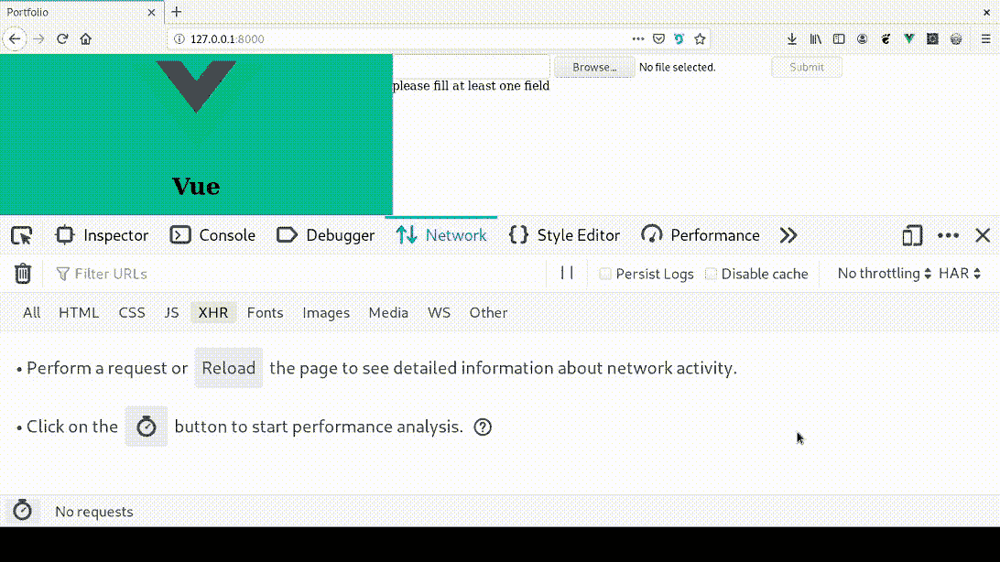
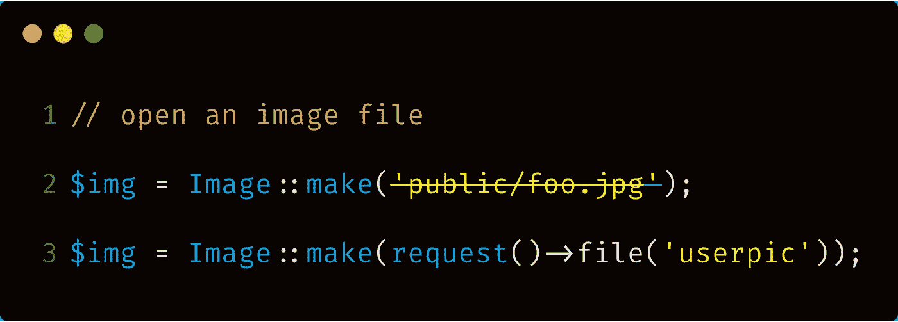
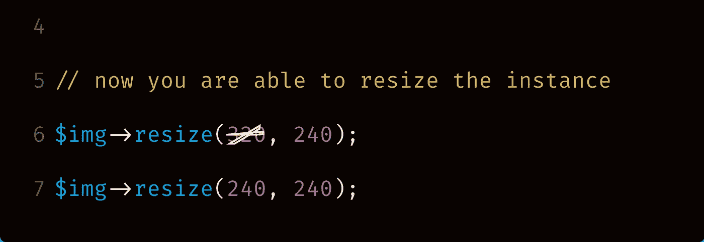
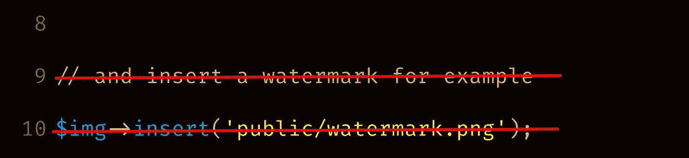

# Laravel 和 Vue:用 CRUD 管理面板创建作品集网站——第六章

> 原文：<https://itnext.io/laravel-and-vue-creating-a-portfolio-website-with-a-crud-admin-panel-chapter-six-6f7ed2b23b42?source=collection_archive---------1----------------------->

## 前端表单验证和调整图像大小

在上一章中，我们讨论了 Laravel 验证。我们验证了 ProfileEditor 组件的表单。验证是为了确保至少有一个字段被填充。

**现在:**我们想添加**前端表单验证**，我们也想**上传后调整图像大小**。

**前端表单验证原因**:服务器可能反应太慢。如果表单没有通过 Laravel 验证，我们将不得不等待服务器返回错误。

如果我们的服务器太慢或有其他问题，使返回太慢，我们可能会等待很长时间。

**调整图像大小的原因**:当您上传图像时，它会以上传时的尺寸显示在刊头上。图像大小可能不适合我们的想法。例如，您可能想要 200*300 的图像，但如果您上传 1000*1000 的图像，则会显示上传的尺寸。

虽然你可以使用 CSS 来调整图像的大小，但那只是在**外观中调整大小**。加载的图像文件仍然很大，需要很长时间才能加载。

因此，调整图像大小是必须的。

# 前端表单验证

我们需要两条验证规则。它们是:

1.  必须至少填写一个字段
2.  该文件必须是图像

我们可以有一个按钮，导致一个点击验证方法。让；让提交按钮指向验证方法。

```
<button *@click.prevent*="**validate**">Submit</button>
```

validate()方法应该是

```
validate() {
    *if* (*this*.name === '' && *this*.file.length <= 0) {
        *alert*('at least one field must be filled');
    }
    *if* (*this*.file.type !== "image/*") {
        *alert*('file must be an image')
    }
    *else* {
        *this*.onSubmit();
    }
},
```

数据应该是

```
data() {
    *return* {
        name: '',
        file: '',
    }
},
```

> **代码解释**:我们想要的是如果两个字段都是空的，那么**表单就不应该**提交。否则，您可以转到 onSubmit 方法。

现在，如果我们发布一个空的表单，我们将得到一个 JavaScript 警告，说**至少有一个字段必须填写。**如果我们输入一个文件而不是一个图像文件，我们会得到一个警告说**文件必须是一个图像**。

我们需要一种方法来确定这个消息是来自 vue 组件还是 Laravel 验证。

为了确保警报来自 vue 组件，我们可以临时在警报文本中添加单词 FRONT END(或任何其他合适的单词)。

```
*alert*("**FRONT END** At least one field must be filled out");
```

提交空表单，如果出现这样的警告框，则验证正在进行。

如果有效，请将警报改回:

```
*alert*("At least one field must be filled out");
```

## **警报问题**

虽然警告能够通知用户验证，但它们在所有浏览器中看起来并不相同。为了创建跨浏览器的统一外观，我们需要另一种方式来通知用户错误。

让我们创建一个显示错误的栏。在我们需要插入的表格下面。确保表单在 div/section 等中。因为 vue 模板只接受模板标签内的一个元素。

```
<template>
       <div>
          <form>....</form>
          **<div *id*="errorBar"></div>**
       </div>
</template>
```

为了显示错误，我们可以使用一个**计算属性。**计算的属性取决于其他数据。随着其他数据的更改，计算的属性也会相应地更改。

我们可以在`**errorBar**` 元素中包含`**{{validate}}**`，然后在`**computed**`块而不是方法块中计算`**{{validate}}**`。

```
**computed** :{
    validate(){
        *if* (*this*.name === '' && *this*.file.length <= 0) {
            *return* 'please fill at least one field';
        }
        *if* (*this*.file && !*this*.file.type.startsWith("image/")) {
            *return* 'file must be an image';
        }
        *else* {
            *this*.onSubmit();
        }
    }
},
```

现在错误信息将出现在**#错误栏中。**但是，我们会在解决第一个错误后立即提交表单。



所以我们需要找到一种方法将表单提交与计算的属性函数分开。

我们能做的是:

*   禁用按钮
*   解决错误后，启用该按钮


禁用很容易。您只需向按钮添加 disable 属性。

```
<button *@click.prevent*="onSubmit" ***disabled***>Submit</button>
```

然而，在我们的例子中，我们需要将禁用的属性**绑定到数据属性**。这意味着我们可以打开和关闭禁用属性。


照片由[卡里姆·曼吉拉](https://unsplash.com/@karim_manjra?utm_source=medium&utm_medium=referral)在 [Unsplash](https://unsplash.com?utm_source=medium&utm_medium=referral) 拍摄

如果 submitDisabled 为 true，则按钮具有 Disabled 属性。如果 submitDisabled 为 false，按钮将不具有 Disabled 属性。

```
<button *@click.prevent*="onSubmit" ***:disabled*="submitDisabled"**>Submit</button>data() {
    *return* {
        name: '',
        file: '',
        **submitDisabled: *true*,**
    }
},
```

因为默认情况下 data 属性为 true，所以页面将在禁用按钮的情况下加载。


但是我们如何启用按钮呢？

我们可以简单地将 else 块中的`**submitDisabled**`改为`**false**`。

```
computed :{
    validationErrors(){
        ***this*.submitDisabled = *true*;**
        *if* (*this*.name === '' && *this*.file.length <= 0) {
            *return* 'please fill at least one field';
        }
        *if* (*this*.file && !*this*.file.type.startsWith("image/")) {
            *return* 'file must be an image';
        }
        *else* {
            ***this*.submitDisabled = *false*;**
        }
    }
},
```

现在`**submitDisabled**`默认为`**true**`，在计算方法的开始处为`**true**`，如果验证通过则为`**false**`。这意味着只有当我们没有任何验证错误时，按钮才被启用。


## **设定误差线的样式**

```
<style *scoped*>
    #errorBar {
        background-color: #333;
        color: #fff;
        padding: 16px;
    }
</style>
```

## 重构 onSubmit 方法

在 onSubmit 方法变得太长之前，让我们重构它。

```
onSubmit() {
    *let* fd = *new* FormData();
    fd.append('name', *this*.name);
    fd.append('userpic', *this*.file);
    *this*.postProfile(fd);
},postProfile(fd) {
    axios.post('api/profile', fd)
        .then(*this*.$parent.getProfile())
        .catch(error => {
            *let* er = error.response.data.errors;
            *let* ov = Object.values(er);
            *alert*(ov.join(''));
        })
}
```

# 图像大小调整

目前，如果我们上传一个大图片，它会保持它的大小，这就是页面上显示的内容。这可能不符合网站的设计。我希望用户图片是 240 像素乘 240 像素。

我们需要图像干预库。我们可以使用 terminal/cmd 获得这个库

`php composer.phar require intervention/image`

如果这在获得干预/图像方面不起作用，我们可以尝试:

`composer require intervention/image`

现在我们必须改变如果`**request()**` 有 userpic 文件会发生什么。

在 ProfileController 的顶部，导入库

```
***use* Intervention\Image\Facades\Image;**
```

在官方干预图像网站上，显示的调整图像大小的方法如下:

```
// open an image file
$img = Image::make('public/foo.jpg');

// now you are able to resize the instance
$img->resize(320, 240);

// and insert a watermark for example
$img->insert('public/watermark.png');

// finally we save the image as a new file
$img->save('public/bar.jpg');
```

让我们把它应用到我们的案例中。

## 干预图像的适应

—我们要打开的图像是来自 request() 的 **userpic**



—我们想把它调整到**240 px*****240 px(宽*高)。我们可以将 320 的宽度改为 240。**



—我们不想要水印，所以我们可以删除整行(及其前面的注释)。



—对于存储，如果您看一下保存函数，它使用的是**完整路径(目录+文件名)**，这与我们之前使用的不同，即 store()函数

`**store('/public/userpics')**` vs `**$img->save('public/bar.jpg');**`

存储功能只是将上传的文件存储在一个目录中。

`**store()**`功能不适用于介入图像，您必须使用介入图像的`**save()**`功能。这就带来了一个问题，我们如何使用完整路径进行保存？

**我们如何使用完整路径进行保存？**

您可以看到在 save()中有一个字符串，即`**'public/bar.jpg'**` **。当我们想在数据库中存储一个名字时，我们已经在生成一个 hashName。我们可以使用相同的函数替换字符串。**

```
**$hashName = request()->file('userpic')->hashName();** **$img->save($hashName);**
```

现在将创建一个调整过大小的文件，并将其保存在 **public** 目录中。

我们希望它在一个 userpics 目录中，因为我们希望有一个专门存储 userpics 的文件夹。但是，如果我们执行`**$img->save('userpics/'.$hashName);**` 操作，您可能会在网络选项卡中看到以下错误:

> 消息:无法将图像数据写入路径

这是因为要使用保存功能，我们必须已经创建了文件夹。我们必须在公共文件夹中创建一个名为 userpics 的文件夹。

有一种更好的保存方式，您不必创建文件夹。这是用存储门面。记得在顶部导入存储门面`*use* Illuminate\Support\Facades\Storage;`

我们要用`Storage::put`。这可用于在完整路径下存储原始文件内容。

```
Storage::*put*($fullpath,$contents);
```

我们的原始文件内容将被编码成调整大小的文件

```
**$img = Image::make($file);
$contents = $img->resize(240, 240)->encode();**
Storage::*put*($fullpath,**$contents**);
```

完整路径将是 directory + hashname。我们可以把`request()->file('userpic')`缩短为`**request()->userpic;**`

```
**$file = request()->userpic;
$dir = 'public/userpics/';
$hashName = $file->hashName();
$fullpath = $dir.$hashName;**
```

我们最终得到以下结果:

```
if (request()->hasFile('userpic')) {
 $file = request()->userpic;
 $dir = 'public/userpics/';
 $hashName = $file->hashName();
 $fullpath = $dir.$hashName;$this->**resizeAndStore**($file, $fullpath);
 $profile->img_path = $hashName;
 }
```

resizeAndStore()是我们为了重构而必须创建的一个新函数

```
private function **resizeAndStore**($file, $fullpath) {
 // open an image file
 $img = Image::make($file);
 // now you are able to resize the instance
 $contents = $img->resize(240, 240)->encode();
 //save
 Storage::put($fullpath,$contents);
 }
```

确保 Masthead.vue 有这个来显示上传的图像

```

```

现在这将工作，我们将看到一个调整大小的图像，而不是原来的图像。

在下一章中，我们将开始投资组合的工作。

[](/laravel-and-vue-creating-a-portfolio-website-with-a-crud-admin-panel-chapter-seven-b473ee1ac816) [## Laravel 和 Vue:用 CRUD 管理面板创建作品集网站——第七章

### 构建投资组合

itnext.io](/laravel-and-vue-creating-a-portfolio-website-with-a-crud-admin-panel-chapter-seven-b473ee1ac816)