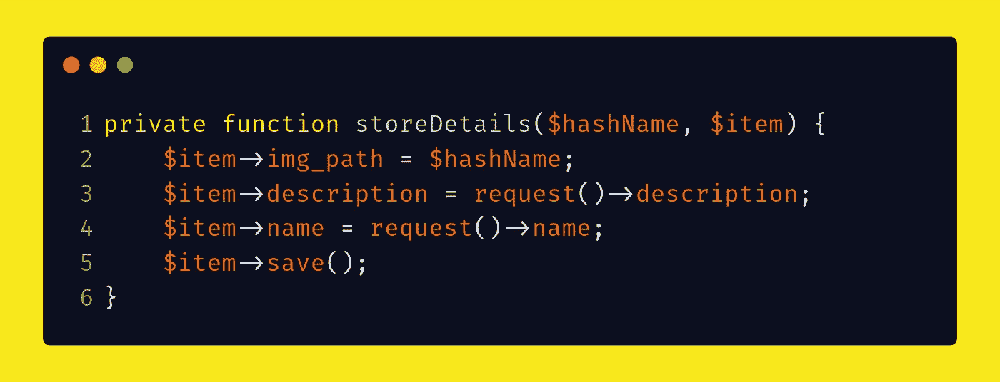

# Laravel 和 Vue:用 CRUD 管理面板创建作品集网站——第十章

> 原文：<https://itnext.io/laravel-and-vue-creating-a-portfolio-website-with-a-crud-admin-panel-chapter-ten-a669461c51ad?source=collection_archive---------1----------------------->

## 投资组合更新的后端验证()


约翰·萨尔维诺在 [Unsplash](https://unsplash.com?utm_source=medium&utm_medium=referral) 上拍摄的照片

我们已经完成了更新功能的前端验证，现在我们将重点放在后端验证上。我们还重构了 store()和 update()函数。这是更新函数的代码:

```
*public function* update(Request $request, $id) {
    $file = $request->itempic;
    $hashName = $file->hashName();
    $this->resizeAndStore($file, $hashName);
    $item = PortfolioItem::*find*($id);
    $this->storeDetails($hashName, $item);
}
```

我们现在将通过使用 FormRequest 以及`**hasFile**`和`**filled**`函数对此进行改进。

首先，我们必须通过在每一行前面加上两个`**/**`来注释掉这些行。**我们不移除线条。我们只是把它们注释掉。**

```
*public function* update(UpdatePortfolioItemRequest $request, $id) {
*//        $file = $request->itempic;
//        $hashName = $file->hashName();
//        $this->resizeAndStore($file, $hashName);
//        $item = PortfolioItem::find($id);
//        $this->storeDetails($hashName, $item);* 
    }
```

# 表单请求—更新 PortfolioItemRequest

我们需要的是创建一个表单请求

```
**php artisan make:request UpdatePortfolioItemRequest**
```

将 authorize 设置为 true

```
*public function* authorize()
{
    *return true*;
}
```

更改更新函数，使其接受 UpdatePortfolioItemRequest

```
p̶u̶b̶l̶i̶c̶ ̶f̶u̶n̶c̶t̶i̶o̶n̶ ̶u̶p̶d̶a̶t̶e̶(̶R̶e̶q̶u̶e̶s̶t̶ ̶$̶r̶e̶q̶u̶e̶s̶t̶,̶ ̶$̶i̶d̶)̶
*public function* update(**UpdatePortfolioItemRequest** $request, $id)
```

让我们考虑一下在**更新表单请求**中可以使用哪些**规则**💭

## UpdatePortfolioItemRequest —我们可以使用哪些规则？

如果我们看一下我们为创建功能(StorePortfolioItemRequest)制作的 FormRequest(在第八章),我们会发现这段代码:

```
*public function* rules()
{
    *return* [
        'itempic' => 'required',
        'name' => 'required|unique:portfolio_items',
    ];
}
```

我们**不能**对更新表单请求使用相同的代码。

1.  我们**不能拥有所需的 itempic**，因为用户可能不想更新 itempic，因此可能不会提交新的 item pic。为此，我们可以使用控制器中的`**$request->hasFile()**` 。

```
*// UpdatePortfolioItemRequest's rules()
public function* rules()
{
    *return* [
        **'̶i̶t̶e̶m̶p̶i̶c̶'̶ ̶=̶>̶ ̶'̶r̶e̶q̶u̶i̶r̶e̶d̶'̶,̶**
        'name' => 'required|unique:portfolio_items',
    ];
}// PortfolioController's update()
*public function* update(UpdatePortfolioItemRequest $request, $id) {
*//        $file = $request->itempic;
//        $hashName = $file->hashName();
//        $this->resizeAndStore($file, $hashName);
//        $item = PortfolioItem::find($id);
//        $this->storeDetails($hashName, $item);* ***if* ($request->hasFile('itempic')) {** **}**
    }
```

存储文件的**注释掉的代码行**可以移动到＄request->has file 块中，并且**取消注释**

```
*public function* update(UpdatePortfolioItemRequest $request, $id) {
*//        $item = PortfolioItem::find($id);
//        $this->storeDetails($hashName, $item);
        if* ($request->hasFile('itempic')) {
            **$file = $request->itempic;
            $hashName = $file->hashName();
            $this->resizeAndStore($file, $hashName);**
        }
    }
```

2.再次查看表单 Request，我们确实想要名称 `**required**`,因为我们不想提交一个空的名称字段——一个项目必须有一个名称。

3.我们确实希望名字是`**unique**` **。**

```
*// UpdatePortfolioItemRequest's rules()
public function* rules()
{
    *return* [
        'name' => 'required|unique:portfolio_items',
    ];
}
```

**问题**:如果你更新和你用了同一个名字，你会得到错误:

> 这个名字已经有人用了。

这是因为`**unique**`规则检查数据库表的每一行，并将其与表单输入进行匹配。现在，因为您插入的数据已经存在，所以会出现一个错误。

**解决方案**:你要说出唯一规则，避开当前项目的行。

我们必须小心语法

`'name' => 'required|unique:portfolio_items,name'.$id` ❎

`'name' => 'required|unique:portfolio_items,name**,**'.$id` ✅

**区别是逗号**

在结尾`**'**`之前必须有一个逗号

`**$id**`可以取自`**request()**`

```
*public function* rules()
{
    **$id = request()->id;**
    *return* [
        'name' => 'required|unique:portfolio_items,name,'.**$id**
    ];
}
```

# hasFile 和`filled`

除了`**hasFile('itempic')**` **，**我们还需要检查描述是否填写。

```
// PortfolioController's update()
*public function* update(UpdatePortfolioItemRequest $request, $id) {
*//        $item = PortfolioItem::find($id);
//        $this->storeDetails($hashName, $item);
        if* ($request->hasFile('itempic')) {
            $file = $request->itempic;
            $hashName = $file->hashName();
            $this->resizeAndStore($file, $hashName);
        }
        ***if* ($request->filled('description')) {

        }**
    }
```

如果没有填写描述，那么服务器得到的是空的，所以我们需要处理描述为空的情况

```
// PortfolioController's update()
*public function* update(UpdatePortfolioItemRequest $request, $id) {
*//        $item = PortfolioItem::find($id);
//        $this->storeDetails($hashName, $item);
        if* ($request->hasFile('itempic')) {
            $file = $request->itempic;
            $hashName = $file->hashName();
            $this->resizeAndStore($file, $hashName);
        }
        *if* ($request->filled('description')) {

        }
        ***if* ($request->description === *null*) {

        }**
    }
```

我们不需要`**has**`、`**hasFile**`或`**filled**` 来命名，因为:

*   通过 FormRequest ( `**required**`规则)检查名称是否存在，
*   名称不是文件
*   姓名必须已经填写(也由`**required**`规则完成)

我们可以插入更新的名称并保存它。

```
*public function* update(UpdatePortfolioItemRequest $request, $id) {
*//        $item = PortfolioItem::find($id);
//        $this->storeDetails($hashName, $item);
        if* ($request->hasFile('itempic')) {
            $file = $request->itempic;
            $hashName = $file->hashName();
            $this->resizeAndStore($file, $hashName);
        }
        *if* ($request->filled('description')) {

        }
        *if* ($request->description === *null*) {

        }
        **$item->name = $request->name;
        $item->save();**
    }
```

如果我们试图改变一个项目的细节，我们将会以这个 500 错误结束

> 消息:从空值创建默认对象

出现该错误的原因是`**$item**`的含义被注释掉了。让我们取消该行的注释。

```
*public function* update(UpdatePortfolioItemRequest $request, $id) {
        **$item = PortfolioItem::*find*($id);**
*//        $this->storeDetails($hashName, $item);
        if* ($request->hasFile('itempic')) {
            $file = $request->itempic;
            $hashName = $file->hashName();
            $this->resizeAndStore($file, $hashName);
        }
        *if* ($request->filled('description')) {

        }
        *if* ($request->description === *null*) {

        }
        $item->name = $request->name;
        $item->save();
    }
```

现在`**$item**` 被设置为我们试图更新的项目。如果我们现在更新，我们将能够更新投资组合项目的名称。**成功**😄

然而，对于`**description**`仍有工作要做

👷即如何处理填充描述和空描述

## 填补空白

填充描述-只需将`**$request**`的描述插入`**$item**`的描述中。

```
*if* ($request->filled('description')) {
    **$item->description = request()->description;**
}
```

空描述-使`**$item**` 描述为空。

```
*if* ($request->description === *null*) {
    $item->description = '';
}
```

## 一个注释掉了左边一行

```
*//        $this->storeDetails($hashName, $item);*
```

这当然指向 storeDetails 函数。我们从这个函数中唯一需要的是`**$item->img_path = $hashName**`



我们可以将`**$item->img_path = $hashName**` 复制粘贴到 hasFile 块中，并删除注释行

```
**/̶/̶ ̶$̶t̶h̶i̶s̶-̶>̶s̶t̶o̶r̶e̶D̶e̶t̶a̶i̶l̶s̶(̶$̶h̶a̶s̶h̶N̶a̶m̶e̶,̶ ̶$̶i̶t̶e̶m̶)̶;̶**
*if* ($request->hasFile('itempic')) {
    $file = $request->itempic;
    $hashName = $file->hashName();
    $this->resizeAndStore($file, $hashName);
    **$item->img_path = $hashName;**
}
```

现在一起:

```
*public function* update(UpdatePortfolioItemRequest $request, $id) {
    $item = PortfolioItem::*find*($id);
    *if* ($request->hasFile('itempic')) {
        $file = $request->itempic;
        $hashName = $file->hashName();
        $this->resizeAndStore($file, $hashName);
        $item->img_path = $hashName;
    }
    *if* ($request->filled('description')) {
        $item->description = $request->description;
    }
    *if* ($request->description === *null*) {
        $item->description = '';
    }
    $item->name = $request->name;
    $item->save();
}
```

# 列出清单——第十章结束

我们可以从列表中勾掉后端验证。

*   前端验证(用于更新 functionality)☑️
*   后端验证(用于更新 functionality)☑️
*   更新和删除功能

—

*   重构组合控制器

—

*   带文本的图像(Portfolio.vue)
*   具有更大图像和描述的模型(Portfolio.vue)
*   modal (Portfolio.vue)上的关闭按钮

在第十一章中，我们将为创建功能创建一个模式，完成更新功能并创建删除功能。

[](https://medium.com/@UmarCodes/laravel-and-vue-creating-a-portfolio-website-with-a-crud-admin-panel-chapter-11-20445acf83bb) [## Laravel 和 Vue:用 CRUD 管理面板创建作品集网站——第 11 章

### PortfolioEditor —添加模板，完成更新功能和实现删除功能

medium.com](https://medium.com/@UmarCodes/laravel-and-vue-creating-a-portfolio-website-with-a-crud-admin-panel-chapter-11-20445acf83bb)