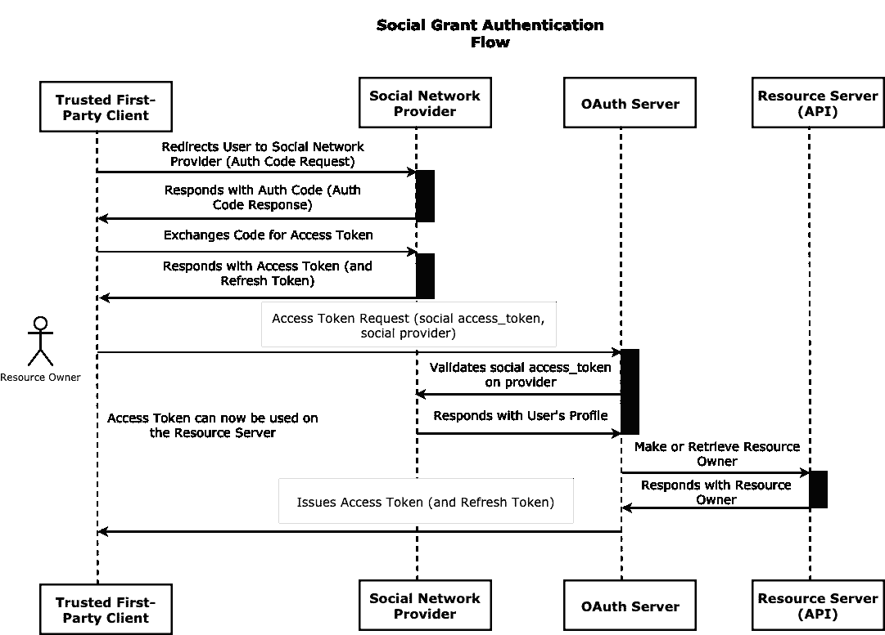

# 面向社交网络的 Laravel API 认证— OAuth2 社交授权

> 原文：<https://itnext.io/laravel-api-authentication-for-social-networks-oauth2-social-grant-3ec1085b58b6?source=collection_archive---------2----------------------->

## 使用 Laravel Passport 对您的第一方应用进行社交网络认证

图片由来自 Pixabay 的 Gerd Altmann 提供

社交网络已经成为我们在线存在的重要组成部分，越来越多的应用程序正在与谷歌和 Twitter 等流行的社交网络提供商集成，以验证其用户并授权访问资源。社交提供商的名单在不断增长，将他们集成到我们的应用程序中的需求也在不断增加。在本文中，我们将探讨如何在 Laravel Passport 中构建 OAuth2 社交网络授权。这将使用户能够使用他们的社交网络帐户在您的 API 上进行身份验证。

在开始之前，本文假设您熟悉 OAuth2，并且了解 Laravel Passport 的工作原理。如果您没有使用过 Passport，Laravel 文档是一个很好的起点。

 [## 面向网络工匠的 PHP 框架

### 面向 web 工匠的 PHP 框架。

laravel.com](https://laravel.com/docs/5.8/passport) 

## OAuth 术语的快速复习

*   资源所有者:可以授权访问受保护资源的实体。通常这是最终用户。
*   客户端:代表资源所有者请求访问受保护资源的应用程序。
*   资源服务器:托管受保护资源的服务器。这是 API 服务器
*   授权服务器:认证资源所有者并在获得适当授权后发布访问令牌的服务器
*   访问令牌:用于访问资源服务器上受保护资源的令牌。

# 语境

[OAuth2 规范](http://tools.ietf.org/html/rfc6749)定义并描述了客户端应用获取访问令牌的多种方式。这个令牌本质上标识了用户访问受保护资源的权限。这些由规范定义的获取访问令牌的方法被称为**授权**。

这些授权中的每一个都有特定的用例，并且只适合在它们被定义的上下文中使用。该规范没有准确定义社交网络上下文，但它定义了一个与我们的用例足够接近的上下文，即**受信任的第一方客户端的资源所有者凭证授权**。*展望未来，术语* ***资源所有者*** *和* ***用户*** *可以互换使用。*

传统上，要为第一方客户机验证 API 上的用户，您需要使用资源所有者凭证授权。这允许您的用户通过提供凭据(通常是用户名和密码)来获得令牌，从而进行身份验证。让我们看看使用这个授权获得令牌的请求格式。

客户端向授权服务器发送包含以下主体参数的 POST 请求:

*   值为`password`的`grant_type`
*   `client_id`用客户的 ID
*   `client_secret`与客户的秘密
*   `username`用用户的用户名
*   `password`用用户的密码
*   带有由空格分隔的范围列表。

> 你会注意到这个授权接受了一个`client_secret`，但是有一个关于第一方客户端的安全问题，比如不能安全存储这个的本地应用和 spa。这一点的安全含义超出了本文的范围，但是有一些方法可以减轻这一点，比如使用代理后端与授权服务器进行交互。然而，为了演示本文背后的思想，我们将假设第一方客户能够保守秘密。

对于社交网络来说，使用用户名和密码作为凭证是违反直觉的，并且违背了整合社交认证的初衷。如前所述，规范没有定义社交网络授权，所以我们将自己实现一个。

# 社交网络资助

为了创建我们的社交网络授权，我们可以定制资源所有者凭证授权以适应我们的用例，并根据其结构构建授权。让我们定义使用社交网络身份验证时的典型身份验证流程，这将告诉我们如何定制授权许可并识别可能成为凭据候选的元素。

## 流动

*   客户端向社交网络提供商(例如 Google)发出请求
*   用户在提供者上进行身份验证，并获得一个用于获取令牌的临时访问代码
*   客户端将该代码交换为访问令牌，并且现在可以使用该访问令牌在所请求的范围内访问社交网络提供商上的受保护资源。

然而，上一步获得的访问令牌仅对社交网络提供商有效，它不能用于访问我们的资源服务器上受保护的资源。因为我们现在有效地充当了授权服务器，所以我们需要一种方法来认证用户并向他们颁发在我们的资源服务器上有效的访问令牌。在上面的认证流程的最后，我们得到了一个访问令牌，它本质上代表了试图访问我们的 API 的用户。这个访问令牌现在可以成为用户凭证的一部分。

但是访问令牌本身是没有用的，我们知道它是授权给哪个社交网络提供商的。网络**提供商**和从该提供商获得的接入令牌**是用户凭证的两个很好的候选。**

既然我们已经确定了哪些元素应该构成社交网络上下文中的凭证，我们现在可以继续定义请求结构，以便使用我们的定制授权从我们的授权服务器获取访问令牌:

*   值为`social`的`grant_type`
*   `client_id`用客户的 ID
*   `client_secret`与客户的秘密
*   `provider`用社会提供者的名字
*   `access_token`使用来自社交提供商的访问令牌
*   带有由空格分隔的范围列表。

下面是身份验证过程的图示:

# 履行

现在，我们已经为从授权服务器获取访问令牌的身份验证请求定义了某种可接受的结构，我们可以继续执行这个授权了。首先，我们将安装 Laravel passport 包。Passport 将作为一座桥梁，帮助我们管理我们的客户，生成访问令牌并授权对我们的 API 的请求。(参见[安装](https://laravel.com/docs/5.8/passport)获取说明)我们还需要 Laravel[sociate](https://laravel.com/docs/5.8/socialite)包来帮助我们在各种社交网络上验证用户。

一旦我们安装并配置了 Laravel passport 和 socialite，下一个合乎逻辑的步骤就是创建我们的 Social Grant 并在授权服务器上启用它，以便它能够响应访问令牌请求。

授权服务器中的授权实现了`respondToAccessTokenRequest` 方法，该方法处理对指定授权的访问令牌的请求。对于我们的目的来说，`validateUser`方法是最重要的。

在这个授权中，我们需要一种方法通过用户的访问令牌来检索用户，这意味着验证他们的凭证。该授权依赖于`SocialUserProvider`,该`SocialUserProvider`针对社交网络提供商验证来自社交网络提供商的给定访问令牌。如果访问令牌无效，`validateUser`方法返回一个`UserEntityInterface`的实例或者抛出一个`OAuthServerException`。SocialUserProvider 实现了一个 SocialUserProvider 接口。该接口声明了一个方法`getUserEntityByAccessToken`,用于从提供者那里检索社交用户:

SocialUserProvider 实现:

首先，我们尝试使用 Laravel Socialite 通过用户的访问令牌从社交网络提供商那里检索用户。如果操作成功，我们将把社交网络提供商的用户转换成资源服务器上的资源所有者，并将实体返回给授权服务器。如果操作不成功，我们抛出一个`OAuthServerException`异常。

接下来，我们在我们的资源服务器上定义了`UserRepository`实现，以从一个社交用户检索或创建一个资源所有者:

最后，我们将在服务提供商的授权服务器上启用这种授权，以便它能够响应访问令牌请求:

授权服务器现在可以向资源所有者发布新的访问和刷新令牌，身份验证流程完成。

# 请求所有范围

当您在第一方客户端上对用户进行身份验证时，您可能希望为应用程序支持的所有范围授权访问令牌。对于资源所有者凭证和客户端凭证授权来说尤其如此。因为我们的社会授权是一种资源所有者凭证授权，所以我们可以在授权服务器上启用这种行为，以便它可以根据请求将所有范围授予这种授权类型。为此，我们将在授权服务器上扩展由 Laravel passport 实现的`ScopeRepository`，覆盖`finalizeScopes`方法并在授权上注入修改后的`ScopeRepository`。`ScopeRepository`上的`finalizeScopes`方法根据应用程序支持的范围和授权类型过滤范围:

我们本质上只是让所有范围的请求都传递给 Passport，并让它处理范围检查。如果范围是星号`*`，Passport 将允许所有范围。对于此范围，资源服务器上令牌实例的`can`方法将始终返回 true。由于我们不希望在授权服务器上的所有授权类型上都允许这种行为，而是在社交授权上，所以当我们在服务提供者中启用授权时，我们将只在该授权上设置它:

如果您感兴趣，可以在 Github 上找到代码。

 [## orobogenius/laravel-oauth 2-social-grant-demo

### 使用 Laravel Passport-orobogenius/Laravel-OAuth2-Social-grant-demo 验证您的 oauth 2 服务器上的社交用户

github.com](https://github.com/orobogenius/laravel-oauth2-social-grant-demo) 

# 结论

我们已经讨论了如何在您的 OAuth 服务器上从第三方应用程序认证社交网络用户。这是通过在授权服务器上创建和启用社会授权类型来实现的。在实践中，这个解决方案并不局限于 OAuth，它还可以在 OAuth 的上下文之外使用，来验证 API 上的社交网络用户。关键元素是来自提供商的**社交网络提供商**和**访问令牌**，它们将用于在向用户发放访问令牌(和刷新令牌)之前验证提供商上的用户。

感谢阅读，我希望这篇文章是有帮助的。