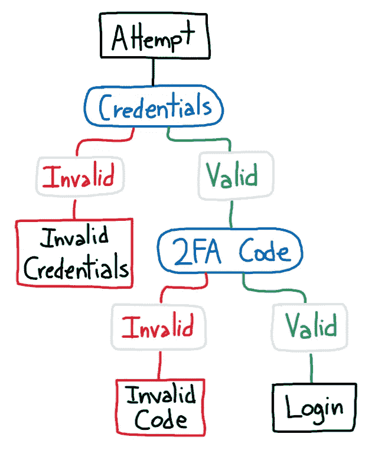
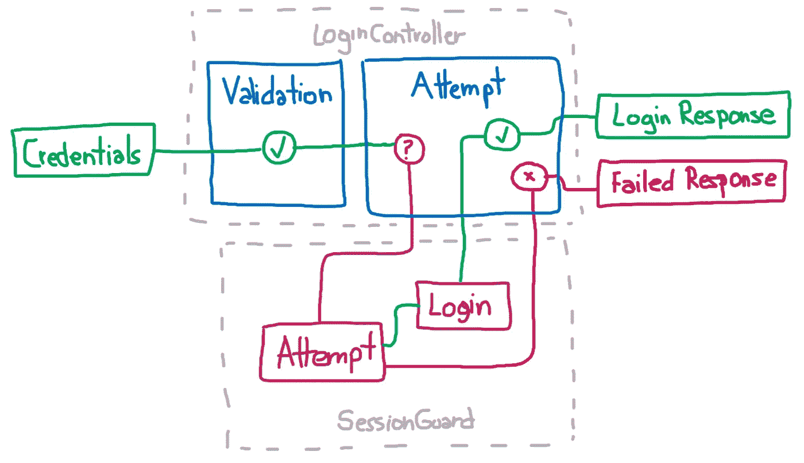
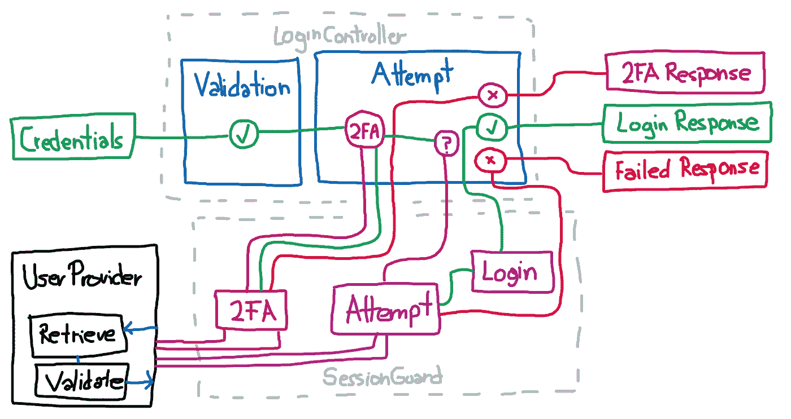
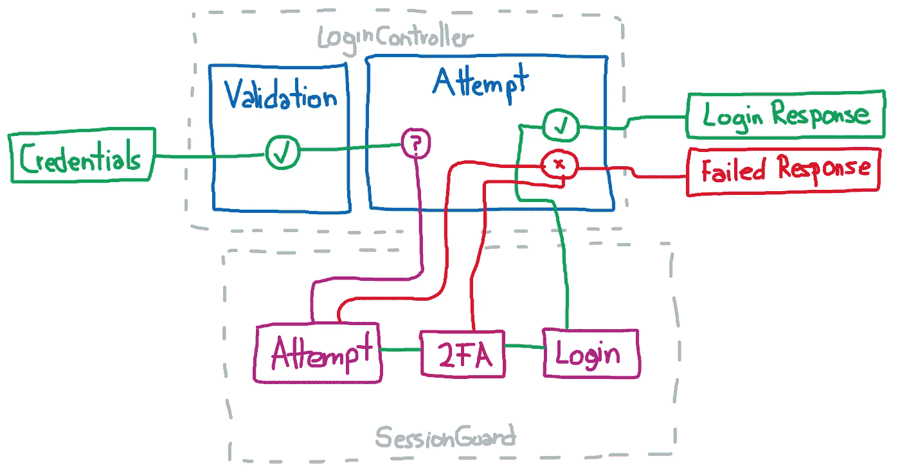
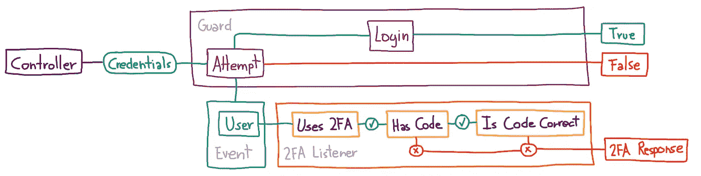

# Laravel:为所有用户提供免费的 2FA

> 原文：<https://itnext.io/laravel-free-two-factor-authentication-5a4be723dfa7?source=collection_archive---------2----------------------->

## “我要用 21 点和赌棍建一个我自己的主题公园”

莫妮卡·索罗在 [Unsplash](https://unsplash.com?utm_source=medium&utm_medium=referral) 上的照片

嗨！我来自未来。

你应该使用 [Laragear 双因子](https://github.com/Laragear/TwoFactor)。别担心，工作原理差不多，但是它积极支持和兼容新的 Laravel 版本。

目前还没有很多针对 PHP 的双因素认证包。我发现大多数在两种产品之间有所不同:

*   给你所有的 OTP 工具，这样你就可以通过蛮力把它塞进你的应用程序。
*   把 TOTP 的逻辑推向任何免费或付费的东西，像 [Twilio Authy](https://www.twilio.com/authy/pricing) 、 [Auth0](https://auth0.com/pricing/) 、 [Onelogin](https://www.onelogin.com/product/pricing) 、 [Dashlane](https://www.dashlane.com/business/pricing) 、 [1password](https://1password.com/business/) 、 [Firebase](https://firebase.google.com/docs/auth) ，凡是你能想到的。

我不反对这两种包装。一点也不。我觉得 [Spomky Labs 的 OTP](https://github.com/Spomky-Labs/otphp) 挺全的， [Antonio Oribeiro 的 2FA-二维码](https://github.com/antonioribeiro/google2fa#qr-code-packages)包里工具很多，但是我只需要一辆自行车，不需要后面全营的坦克。

如果你想一想，你是在用时间支付*通过自己实现整个事情并将其紧密耦合到你的应用程序代码，或者用金钱支付*为了一个简单的实现并利用服务的逻辑，这也涵盖了“如果”( what if)场景和支持。**

在我的国家，作为一个穷人，那里的最低工资大约是 2 美元，从长远来看，为用户的登录付费是不在我的考虑范围之内的。将 OTP 的整个实现推成只使用两种方法也不是，因为我只需要 TOTP，但是仍然有很多很酷的工具。

在 Reddit 上询问是否有人知道 Laravel 的插件包，结果没有令人满意的回应后，我决定打开我的编辑器开始编码。而瓦拉，**拉拉加德出生**。

> 你只是想要解决方案？[只要抓住包裹就完事了](https://github.com/DarkGhostHunter/Laraguard)。

# 我是怎么到那里的？这是什么地方？

让我们从基础开始，这样我们就在同一页上了。

当另一个人知道某人的密码时，很容易登录并做他们想做的任何事情。为了避免这一点，双因素认证，也称为“2FA”，诞生了。

2FA 的概念很简单:用户必须使用另一个“设备”，如电话，确认他是证书的颁发者。如果您从等式中取出密码和设备，则无法进行身份验证。

许多 2FA 策略和实现中的一个被称为 [TOTP](https://en.wikipedia.org/wiki/Time-based_One-time_Password_algorithm) ，即“基于时间的一次性密码”。正如你所读到的，二级密码是由一个只在给定时间段内有效的设备生成的，并且不能使用超过一次，以避免窃听和暴力攻击。

TOTP 机制由三个关键部分组成:

*   保存共享机密的存储。
*   验证代码的逻辑。
*   记忆所用代码以避免再次使用的存储器。

## 添加中间步骤

在 Laravel 中实现 2FA 的问题是认证被创建为仅**一步**。换句话说，一旦凭证被发送，没有办法在认证机制*中优雅地*调解:如果这些确实是正确的，用户将被认证，否则不会。句号。

不需要重新布线就能进入下一步？

同样，守卫的`attempt()`方法负责在凭证有效时将用户持久化到应用程序中，仅在完全成功时返回`true`,或者在失败时返回`false`。

不过，有一些方法可以添加一个“中间”步骤。

添加双因素身份验证的最*方法是沿着您想要保护的所有路由插入一个中间件，如果用户使用 2FA 登录，则保存到会话或缓存中，或者向他询问正确的代码。对我来说，这就像每次你去洗手间的时候，夜总会的保镖都要你出示身份证一样。不用了，谢谢。*

另一种方式，也可能是更合适的方式是处理登录尝试本身。第一种方法是向 Guard 添加一个宏或新方法，并编辑您的登录控制器，要求 Guard 在尝试登录用户之前检查 2FA。听起来像是一个简单的方法，但是这意味着用一个方法调用来编辑登录控制器，这个方法调用是对*契约*之外的会话守卫(或者任何病房)的调用。你换了守卫，2FA 就不管用了。

> 如果在用户被验证之前，契约有一个回调函数来触发，那就太酷了。在不破坏认证的情况下，我所能做的最好的事情就是[将经过验证的事件添加到框架中](https://github.com/laravel/framework/pull/31357)。

现在，想象一下我们必须做的恶作剧，仅仅是让一个宏检查用户的 2FA。是的，因为这发生在任何尝试之前，所以我们总共需要检索用户两次:一次检查 2FA，另一次正确验证其余的凭证。

用火杀死它。

另一个解决方案是扩展防护的`attempt()`方法，不仅验证用户，还检查 2FA。这允许只从用户提供者那里检索用户一次，但问题是我们不知道登录尝试失败的原因，因为我们只收到了`true`或`false`。

听起来很正常。提示:不是的。

如果您想知道尝试失败的原因，您必须在 Guard 中创建另一个公共方法(在任何契约之外)来检查最后一次尝试失败的原因:如果是因为需要 2FA 而没有收到代码，则它收到了一个代码并且是错误的，或者其余的凭证是不正确的。

然后，我发现会话防护使用事件。你猜怎么着。

我用了事件。

# 救援事件！

我的包所做的相对简单:注册一个监听器，该监听器连接到`Validated`事件、[(已经在 Laravel 6.15](https://github.com/laravel/framework/blob/8cbe385362e6bbbd811c96e11336339da17221ac/src/Illuminate/Auth/SessionGuard.php#L376-L392) 中引入)和`Attempting`事件。

简而言之，一旦使用事件数据检索到用户，我们将确保在继续登录过程之前问他一个代码。我们可以使用侦听器通过强制抛出一个请求这个 2FA 代码的响应来停止身份验证。

接下来，我们将检查它是否也发布了他的 2FA 代码，以及继续操作是否正确，否则我们将把他踢出局，要求他提供正确的代码。

就是这样。当然，你必须添加四行代码来实现预期的功能，但是这确实比重新连接整个登录控制器或者编辑保护本身要好。

就这样吗？不，还有更多:

*   与任何引发事件的守卫合作。
*   没有中间件。没有控制器。没有路线。
*   带有恢复代码。
*   可以“记住”一个设备不要每次都询问 2FA 代码。
*   开箱即用的 URIs 和二维码。
*   没有讨厌的 OTP 逻辑，没有人会使用。

试一试，然后告诉我你的想法。

 [## 黑暗幽灵/拉腊瓜德

### 通过 TOTP 为您的所有用户提供开箱即用的双重身份认证。此软件包静默启用身份验证…

github.com](https://github.com/DarkGhostHunter/Laraguard)