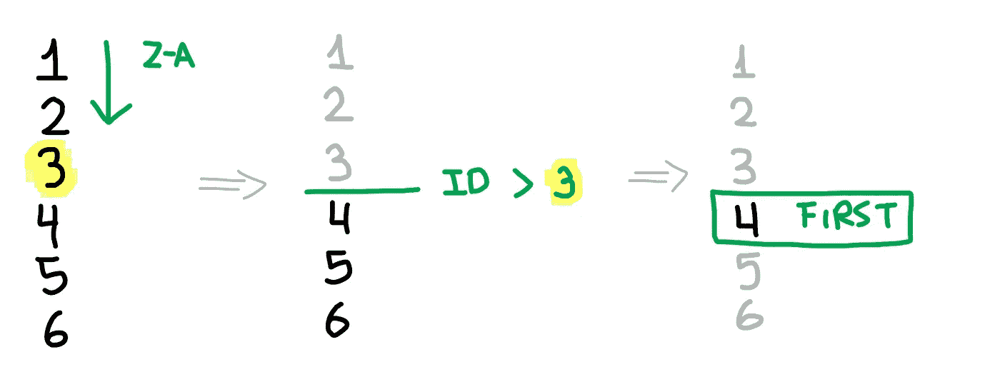
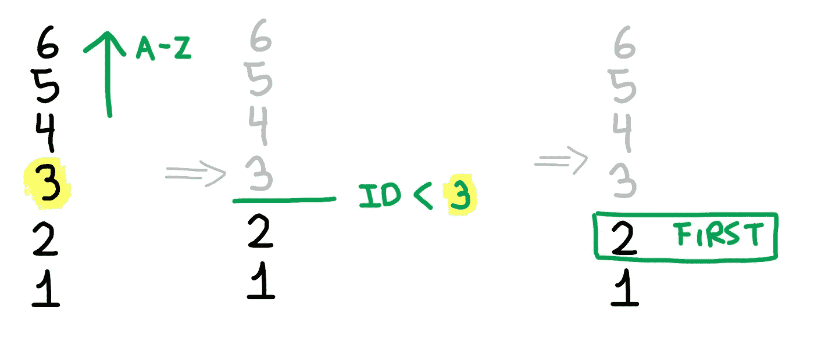

# Laravel:获取上一条和下一条记录

> 原文：<https://itnext.io/laravel-getting-the-previous-and-next-records-60a8cf109daa?source=collection_archive---------3----------------------->

## 一些简单的查询就是你所需要的


照片由[阿里萨·查塔萨](https://unsplash.com/@golfarisa?utm_source=medium&utm_medium=referral)在 [Unsplash](https://unsplash.com?utm_source=medium&utm_medium=referral) 上拍摄

我需要为我的播客应用程序完成的任务之一是在播客视图中显示同一节目的下一个和上一个播客。

前端的计划很简单:有两个链接到这些邻居记录的按钮，所以用户可以遍历播客，而不必求助于手动寻找它们。


虽然这听起来很容易，但考虑到没有标准的 SQL 查询可以在一个简单的语句中跨所有引擎做到这一点，这并不容易。我的意思是，我们不能只是把这些告诉数据库，然后期望引擎知道我们在做什么。

```
SELECT *
FROM 'podcasts'
WHERE podcasts.id = 4
WITH NEXT, PREV
```

换句话说，我们无法执行任何查询来检索给定记录的下一个记录和前一个记录，因为 SQL 不知道什么是有效的“邻居”记录，更不知道如何对它们进行本机排序，因为最后一个记录因引擎而异。

当然，对于一个给定的问题，总是有不止一个解决方案。在这种情况下，我在许多解决方案之间循环，但我最终得到了一个不太复杂的解决方案，它可以不受阻碍地工作，并且是 SQL 引擎不可知的:SQLite、MySQL、MariaDB、PostgreSQL、SQL Server 等等。

# 两个 SQL 查询来规则它们

我们不会为了在一行中完成所有事情而强行在数据库和复杂查询的原始 SQL 调用中使用我们的方法，我们将只再发出两个查询:一个用于下一条记录，另一个用于上一条记录。

什么被认为是下一个和上一个？嗯，你可以说下一个 id，这是一个有效的答案，考虑到旧的记录将有一个较低的 ID，而新的记录将有一个最大的 ID。

在这些查询中，我们对表进行反向排序，使当前记录成为“上限”，然后我们取列表中的第一条记录。

```
$podcast = Podcast::find(4);$next = Podcast::where('id', '>', $podcast->id)
    ->oldest('id')
    ->first();$prev = Podcast::where('id', '<', $podcast->id)
    ->latest('id')
    ->first();
```

## 我不明白你想做什么

为了获得下一个播客，我们将首先从最老的表开始排序，这意味着“按升序排序 ID”。然后，我们将只根据大于播客 ID 的列表进行筛选。第一条记录将是具有较大 ID 的第一条记录:



在之前的播客中，我们做了相反的事情。我们从最新的 ID 开始排序(降序)，筛选出小于播客 ID 的 ID，并取出列表中的第一个 ID:



这样，如果播客的 ID 为`3`，我们可以安全地将 ID 为`2`的记录作为“下一个”，将 ID 为`4`的记录作为“上一个”。

# 利大于弊

这种方法解决了许多其他解决方案存在的问题。

*   不需要增加或减少 ID，因为这是非常不可靠的，可能会返回意外的结果或逸出合理的数据。
*   我们可以进一步过滤查询，在本例中，对于播客节目，它属于另一个`where`子句。
*   如果模型使用软删除，软删除的记录将不会被考虑，因为雄辩将自动应用范围。
*   如果我们分别检查最后一个或第一个记录，我们可以安全地期待下一个和前一个记录的`null`。


或者，如果使用 UUID 或其他非顺序列，可以使用时间戳(默认情况下是`created_at`和`updated_at`)。

如果这些查询没有命中索引或主键，那么当表变大时，SQL 查询会变得更慢，因为它需要扫描整个表。

```
$next = Podcast::where('created_at', '>', $podcast->created_at)
    ->oldest()
    ->first();
```

您*可以*使用缓存，或者在某个地方永久存储这些信息，但是如果记录被修改或删除，您将不得不触发更新。这可以通过添加复合索引或主键来永久修复。

添加复合索引或主键可以避免在有大量记录的表上停留几秒钟的请求，这也使得对显示 UUID 的查询更快，因为[复合索引可以使用第一列](https://use-the-index-luke.com/sql/where-clause/the-equals-operator/concatenated-keys)工作。

比方说，我们使用 UUID，我们想过滤他们的节目 UUID 的播客。

```
$next = Podcast::where('show_uuid', $podcast->show_uuid)
    ->where('created_at', '>', $podcast->created_at)
    ->oldest()
    ->first();
```

如果我们现在在数据库中托管 1，000 条记录，上述操作将花费大量时间，但是这两列上的索引可以使它更快，并且也可以使过滤节目更快。

```
Schema::create('podcasts', function (Blueprint $table) {
    // ... $table->index(['show_uuid','created_at']);
});
```

同样，我认为这是在一些网站上克服这个问题的好方法，不需要过度设计 SQL 查询。

这段代码可以在我的 Laravel 的 [Laratraits 包中找到，还有很多其他有用的工具。如果你不想重新发明轮子，就去看看吧。](https://github.com/DarkGhostHunter/Laratraits)

[](https://github.com/DarkGhostHunter/Laratraits) [## 黑暗幽灵之旅

### Laratraits 是一个 Laravel 包，包含有用的特征和一些类，可以和你的模型、控制器一起使用

github.com](https://github.com/DarkGhostHunter/Laratraits)