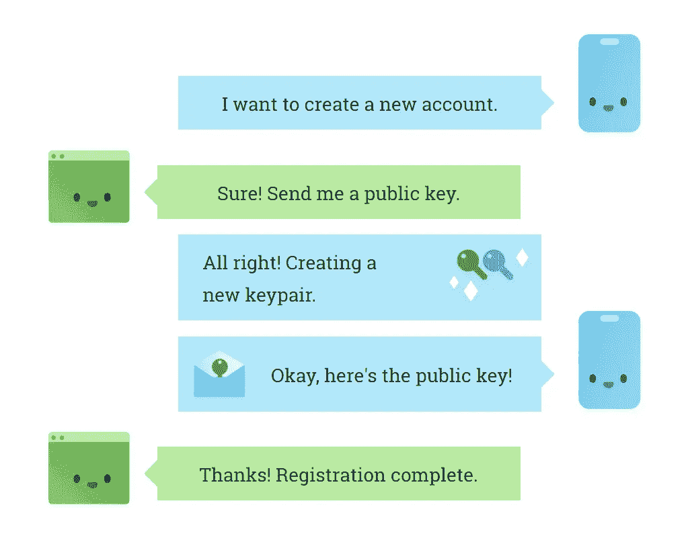
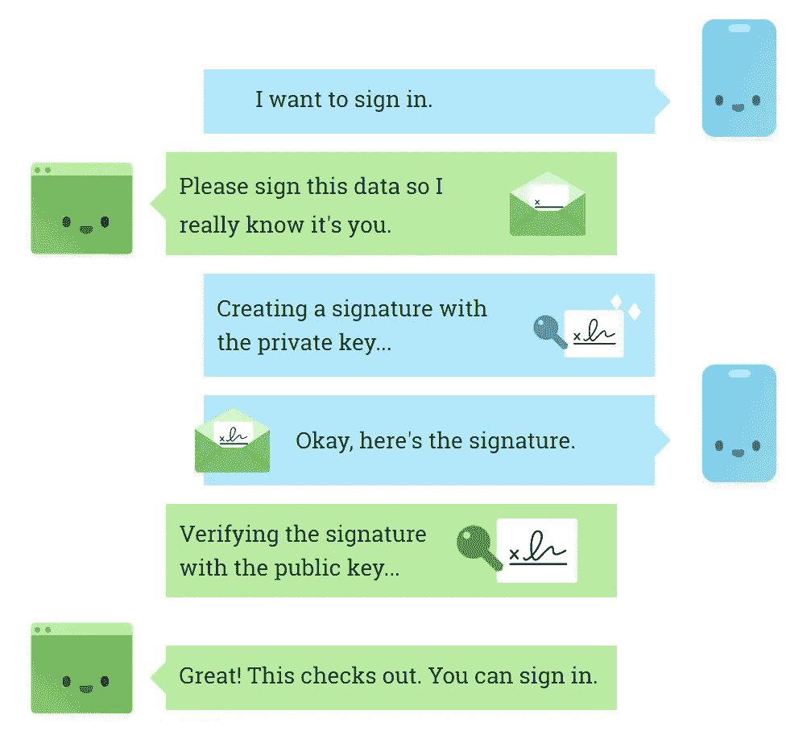
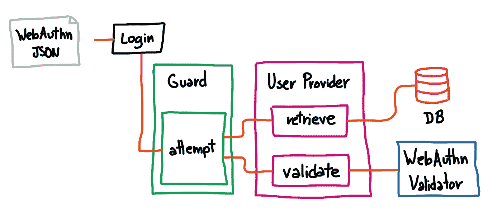

# Laravel:用指纹登录用户

> 原文：<https://itnext.io/laravel-login-users-with-their-fingerprints-5161ecdca63b?source=collection_archive---------2----------------------->

再见密码，终于！


乔治·普伦查斯在 [Unsplash](https://unsplash.com?utm_source=medium&utm_medium=referral) 的照片

> 如果您想让这个包现在就开始开发，[前往 Larapass 存储库并将其安装到您的应用程序中](https://github.com/DarkGhostHunter/Larapass)。但你是为了整个故事而来的，不是吗？

很久很久以前，在一个很远很远的服务器上，有一个人在使用电脑。当他去洗手间时，有人进入并编辑了那台电脑里的东西，因为他可以。这种访问是在一个简单的 4 针密码的保护下进行的。没有人知道，直到为时已晚。

不仅负责那个电脑账户的用户被诬告，他没有做错任何事，也不可能知道，而且也没有办法确定真正的罪犯。当我们意识到我们无法有效地防止同样的问题在任何其他航站楼再次发生时，这还不算什么。身份认证流程深入系统内部，我们不能简单地将其拔出。

因为我要从头开始重新编写内部应用程序，所以在讨论谁有权限使用它时，就提到了这个事件。密码可以被窃听，共享，写在纸上。一个简单的解决方案是强制规定 16 个字符和奇怪的代码和数字，每月自动循环，但我回答说:

> 这只是将问题从终端转移到了用户身上，密码不仅会被写入，而且会保存在手边，这是我们试图避免的。密码不是魔鬼，但在这种情况下，它们确实是魔鬼。

2FA 认证器是一个细微的差别，因为你也需要事先输入密码(这就是为什么它首先被称为 2FA)，每次使用手机或其他认证器时都需要推送一个代码，这使它更安全，但也更麻烦。

我不得不研究另一种既不会给用户也不会给系统本身带来负担的方法。这比你每次想登录的时候都要检查电子邮件，或者在某人的脖子上戴一个定制的钥匙发生器要容易得多。

我可以想象有人在任何终端上用自己的设备登录，比如他的智能手机或 USB Key，而不是询问密码。与原生 Android 和 iOS 应用具有相同的行为，但在您的站点中，无需从头开始编写自定义应用。

这就是 WebAuthn 的用武之地。

# 每个人都可以轻松登录

简而言之，WebAuthn 是标准的，即[将认证提升了一个层次，更接近用户](https://www.w3.org/TR/webauthn-1/#use-cases)。API [是一个推荐标准](https://www.w3.org/TR/webauthn-1/)，在撰写本文时已经成为适用于所有最新浏览器(甚至移动浏览器)的[。](https://caniuse.com/#search=webauthn)



证明— webauth.guide

一部分工作是由一段 Javascript 代码完成的，这段代码在浏览器(也就是设备)和服务器之间进行调解。这使得它与设备内验证(如指纹、PIN 或模式)或 USB keys 兼容。我只能假设它的受欢迎程度已经高到足以保证一个[向后兼容的“版本 2”](https://www.w3.org/TR/webauthn-2/)在工作中。



Asserion —网站认证指南

WebAuthn 的核心是私钥-公钥组合。基本上，设备用私钥签署数据，将其发送到服务器，服务器用之前保存的公钥检查数据。

签名检查只能以一种方式进行，私钥永远不会离开用户设备，公钥也不会离开应用程序。

我制作的包解决了这些 WebAuthn 场景，而无需对框架本身进行黑客攻击:[输入 Larapass](https://github.com/DarkGhostHunter/Larapass) 。

# 拉腊帕斯:网络认证的真实路线

如果你没有读过我的文章[关于](https://medium.com/p/4510f721d8ff) [Laravel 认证](https://medium.com/p/f2386eaebcad) [如何工作的，要点相对简单:守卫检查凭证，用户提供者检查用户是否存在以及这些凭证是否有效，然后守卫“认证”用户，在应用程序生命周期中保持他。](https://medium.com/p/d691224f3afb)

会话防护通过*将用户保存*到会话中来加强这一点，并且它包括一个中间件来检查用户是否在上述会话中被认证。

> Guard 检查凭证，用户提供者检查用户是否存在以及这些凭证是否有效，然后 Guard“验证”用户。

WebAuthn 的问题不在于注册，你仍然需要像任何注册程序一样手动完成，而是如何处理登录。WebAuthn 数据基本上是一种加密编码的 JSON 有效负载。有一个使用中间件的[不错的包，但是在我的情况下，我决定选择**真正的路线**。](https://packagist.org/packages/asbiin/laravel-webauthn)

一个很重要的问题:当用户试图进行身份验证时，在哪里检查凭证？**在用户提供者**中。那是真实的 rute。

好吧，我们知道*在哪里*，但不知道*如何*。我们需要创建一个可以读取 WebAuthn 凭证的用户提供者，这是 JSON 有效负载。为此，我们可以扩展 Laravel 附带的雄辩用户提供程序。

```
<?phpnamespace App\Auth\UserProvidersuse Illuminate\Auth\EloquentUserProvider;class WebAuthnProvider extends EloquentUserProvider
{
    //
}
```

现在，我们需要一个 WebAuthn 验证器。我偶然发现的是 Spomky Labs 的 [WebAuthn 包，但是看在上帝的份上，这是一个令人讨厌的包。我会把我的想法放在回购中，但与此同时，我成功地将它整合到了 Laravel 中。](https://github.com/web-auth)

我们使用*断言*验证器(WebAuthn 对“登录”的别称)，然后完成。我将把这段代码留到以后再说，但是它看起来像这样:

```
public function __construct(
    AuthenticatorAssertionResponseValidator $validator)
{
    $this->validator = $validator;
}public function validateCredentials(
    UserContract $user, 
    array $credentials)
{
    return $this->validator->check($credentials);
}
```

这样，我们现在就可以对照先前“证明”(注册)中保存的数据进行检查。流程是这样的:



认证的非常简单的流程表示。

最酷的是，我们不需要编写文本墙来使它在控制器上工作，或者创建一个新的中间件:我们只需要添加 WebAuthn 验证器和**告诉用户提供者使用它来处理来自请求**的数据，这就是那个奇怪的 JSON 有效负载。

除了使用默认的会话防护外，它还可以使用您想要创建的任何其他防护。例如，您可以创建一个名为`webauthn`的新防护，通过 WebAuthn 对用户进行专门的身份验证，而不需要使用额外的中间件或其他东西来中断您的应用程序，并且使用相同的会话处理程序。

```
Auth::guard('webauthn');
```

因为这基本上是有一些新代码行的雄辩的用户提供者，如果需要的话，我们总是可以“回退”到密码或者完全禁用它。见鬼，我们甚至可以在里面画一匹小马。

# 管理凭据

WebAuthn 的要点是在本地管理凭证。不，没有任何合理的东西被保存到应用程序中，只有*公钥*。

我们可以简单地使用数据库来保存用户可能拥有的所有凭证，例如，使用他的台式机、笔记本电脑、手机甚至 USB key 登录。

Larapass 背后的理念也是凭证管理。如果用户的设备被盗，我们可以安全地将其从应用程序中删除，或者将其列入黑名单以避免假冒，直到他找回设备，甚至清除所有已知的设备。

```
// Ad a credential manually if you know what you're doing.
$user->addCredential($credentialSource);// Remove one credential by its ID.
$user->removeCredential($credentialId);// Or remove them all.
$user->flushCredentials();
```

# 网络认证的三大障碍

WebAuthn 并不是没有任何小“问题”。只是今天大多数从头开始创建的应用程序都围绕着经典的用户名+密码组合，因为它非常容易实现和维护，尤其是在

使用 WebAuthn 时，会出现三个警告，您可以随意解决，或者根本不解决。


[Bermix 工作室](https://unsplash.com/@bermixstudio?utm_source=medium&utm_medium=referral)在 [Unsplash](https://unsplash.com?utm_source=medium&utm_medium=referral) 拍摄的照片

## 设备相关

WebAuthn 的第一个问题是设备依赖性。例如，如果您丢失了您的设备、USB 密钥，或者您的计算机被完全格式化，您显然会丢失您的私钥。没有它，任何使用你的设备登录的东西都将无法工作，所以它将由应用程序本身来提供恢复或注册另一个设备的方法。就个人而言，一封带有注册新设备链接的简单电子邮件可以避免这种情况，因为这被认为是你在一个安全的设备中打开你的电子邮件。

从这个意义上说，密码缓解了这个问题，因为你可以在任何地方使用它们，但这又让用户必须记住另一条信息，并且与电子邮件相同的可能性越来越大。此外，没有什么能保证连接和设备至少和您自己的设备一样安全。

从等式中去掉密码构成了另一个小障碍。

## 无密码注册

另一个问题是没有密码的注册，这是整体安全的最佳解决方案，因为少了一个攻击面。

要做到这一点，您需要首先将用户保存在某个地方(比如缓存或数据库本身)，验证电子邮件存在并且用户不是机器人，然后注册设备。这是一个新的步骤，但你必须遵守，因为否则他将永远被锁定，并不得不再次注册，或者在最好的情况下，重新发送注册电子邮件。

我们可以一步完成所有工作，但他启动注册的设备可能不安全。

您可以通过向用户提供一次性登录电子邮件来缓解这个问题，这样他就可以做他需要的任何事情。

## 编码和解码

出于某种原因，WebAuthn 背后的人认为将一些字符串编码成二进制形式是一个好主意，而不是让验证者(浏览器)自己来回做这件事。

您的身份验证流程必须准备好将这些字符串来回编码解码成您可以使用的内容。这个非官方的[网站](https://webauthn.guide/)解释了很多你需要注意的东西。每个人都必须面对的前端诡计。

**2020 年 7 月 4 日更新:**幸运的是，我添加了一个脚本来处理 Larapass 的前端集成。[下面是详细内容](https://github.com/DarkGhostHunter/Larapass/releases/tag/v1.1.0)。

# 无论如何，WebAuthn 是继花生酱之后最好的

对于任何应用程序来说，一劳永逸地摆脱密码可能是最好的事情。考虑到智能手机的激增，将身份认证绑定到设备上已经成为有史以来最好的想法。也许这就是为什么在过去十年里，使用社交账户(脸书、Instagram、Twitter、谷歌、 *Apple ID* 等等)登录变得如此有用，因为没有附加密码，只有你已经登录的社交档案本身。

这可能就是为什么 WebAuthn 以前没有吸引力的原因。不是每个人都有(像样的)智能手机，USB Keys 和支持该方案的协议远在两者之间，实施成本(和头痛)只适用于高安全性的应用程序，如银行系统、健康监测和电子商务软件，在这些类别中，钓鱼网站激增，可以获得对用户的真正优势，特别是那些移动重要信息或大数字的巨鲸。

现在，用你的智能手机认证你的宠物博客在安全方面很有意义…只要你不给出你的电子邮件密码。

如果你愿意用，就去 [Larapass 库](https://github.com/DarkGhostHunter/Larapass)安装，然后告诉我你的想法。

[](https://github.com/DarkGhostHunter/Larapass) [## 黑暗幽灵/拉腊帕斯

### 仅使用用户的设备、指纹或生物特征数据对用户进行身份验证。再见密码！这将启用 WebAuthn…

github.com](https://github.com/DarkGhostHunter/Larapass)