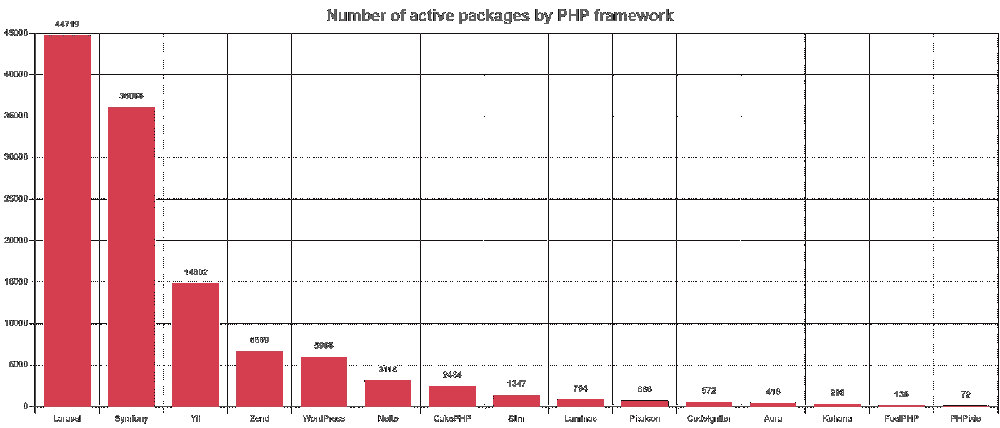
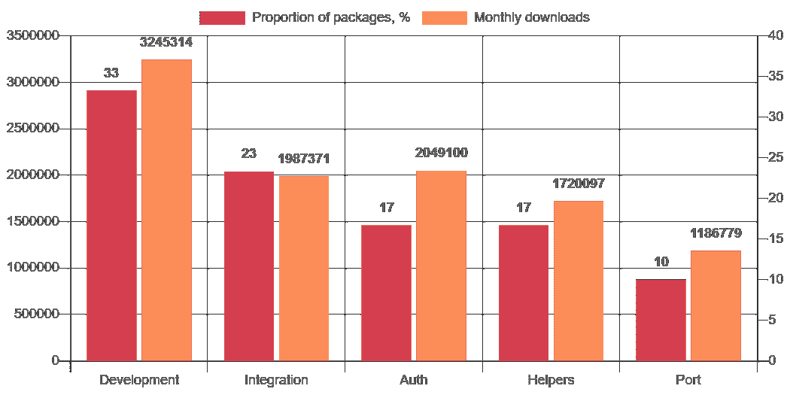
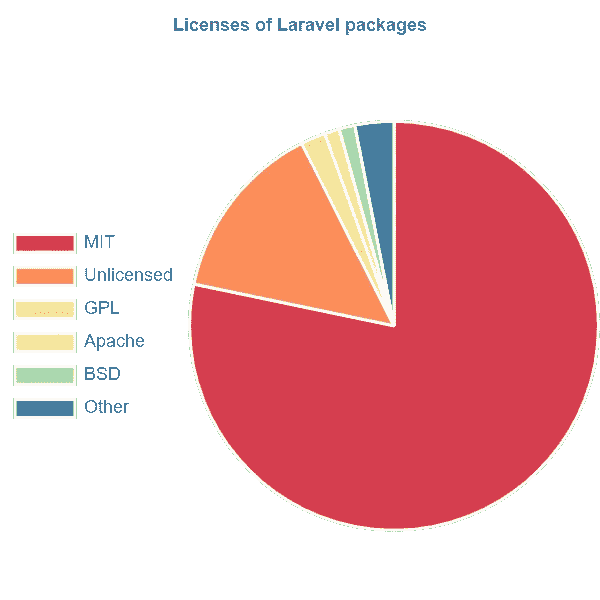
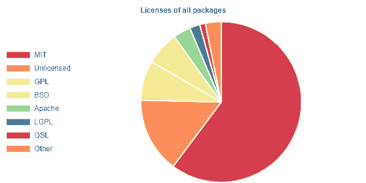
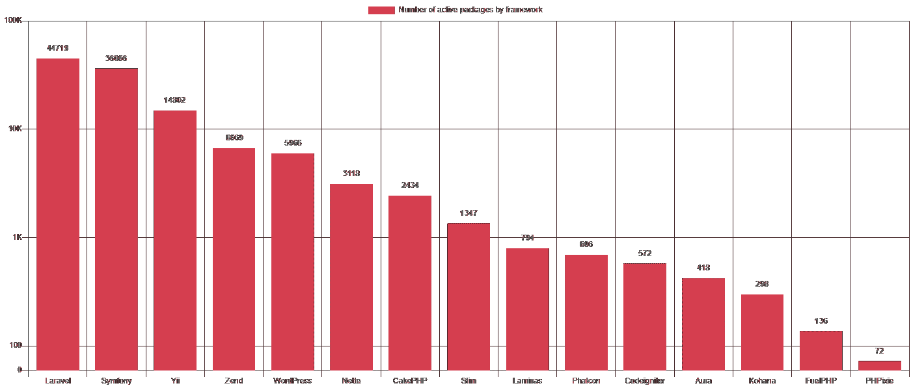
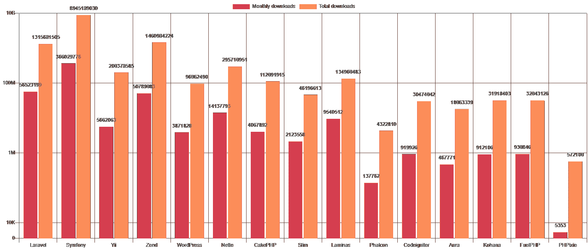

# Laravel 包装生态系统

> 原文：<https://itnext.io/laravel-package-ecosystem-4afd53fad192?source=collection_archive---------1----------------------->



包裹在 [Laravel](https://laravel.com/) 场景中扮演着重要角色。多大和哪些包裹？为了找到答案，我们从[Packagist.org](https://packagist.org/)API 中提取数据，并过滤掉 Laravel 包。

我们是如何识别拉弗尔包裹的？通过看`composer.json`。如果`name`、`description`、`keywords`或`type`字段包含字符串`laravel`，我们就将一个包归类为属于 Laravel 生态系统。如果它有`laravel/framework`或者任何一个`illuminate/*`子树分支作为依赖，我们也认为它是一个 *Laravel* 包。最后，字段`extra`中的`laravel`键也是一个触发器。

虽然这些标准并不保证一个包是 Laravel-only，但它们确实表明该包是在考虑 Laravel 的情况下制作的。

# 最受欢迎的套餐

通过天真地查看下载最多的包列表，我们看到了相当多不令人兴奋的结果——核心包和在 Laravel 项目之外大量使用的包。

```
| Package                 | Monthly downloads |
|-------------------------|-------------------|
| nesbot/carbon           | 4084214           |
| laravel/framework       | 2987907           |
| laravel/tinker          | 2455355           |
| fideloper/proxy         | 2376631           |
| nunomaduro/collision    | 1510258           |
| intervention/image      | 1099989           |
| facade/ignition         | 966800            |
| facade/flare-client-php | 934651            |
| composer/installers     | 803222            |
| illuminate/support      | 756189            |
```

或许一个更有趣的 toplist 应该是去掉了这些“假阳性”的 toplist。我们手工过滤掉了前 30 个为 Laravel 项目设计并被故意安装的包。我们还对这些包的用途进行了粗略的分类。

```
|    | Package                      | Monthly | Total    | Purpose |
|----|------------------------------|---------|----------|---------|
| 1  | maatwebsite/excel            | 680466  | 17769696 | port    |
| 2  | laravelcollective/html       | 678048  | 21785383 | helper  |
| 3  | barryvdh/laravel-ide-helper  | 644297  | 18918427 | dev     |
| 4  | barryvdh/laravel-debugbar    | 625080  | 19404288 | dev     |
| 5  | laravel/passport             | 552633  | 10099903 | auth    |
| 6  | beyondcode/laravel-dump-s... | 530901  | 11035024 | dev     |
| 7  | sentry/sentry-laravel        | 455879  | 8440070  | integ   |
| 8  | laravel/ui                   | 433850  | 1599042  | auth    |
| 9  | barryvdh/laravel-cors        | 400920  | 10823255 | helper  |
| 10 | laravel/socialite            | 394471  | 10166784 | auth    |
| 11 | laravel/slack-notificatio... | 385921  | 7172937  | integ   |
| 12 | tymon/jwt-auth               | 359693  | 9107092  | auth    |
| 13 | barryvdh/laravel-dompdf      | 349572  | 8006731  | port    |
| 14 | laravel/helpers              | 337956  | 1692185  | helper  |
| 15 | spatie/laravel-permission    | 308453  | 5224001  | auth    |
| 16 | laravel/horizon              | 304864  | 4599598  | integ   |
| 17 | laravel/dusk                 | 256261  | 4542482  | dev     |
| 18 | laravel/nexmo-notificatio... | 238192  | 6080124  | integ   |
| 19 | laravel/telescope            | 227966  | 2289576  | dev     |
| 20 | bugsnag/bugsnag-laravel      | 223167  | 6544766  | dev     |
| 21 | yajra/laravel-datatables-... | 212985  | 5644721  | integ   |
| 22 | aws/aws-sdk-php-laravel      | 212260  | 7070121  | integ   |
| 23 | orchestra/testbench-core     | 199780  | 1864659  | dev     |
| 24 | orchestra/testbench          | 195269  | 2279889  | dev     |
| 25 | symplify/package-builder     | 193661  | 1484783  | dev     |
| 26 | laravel/scout                | 177270  | 3391042  | integ   |
| 27 | barryvdh/laravel-snappy      | 156741  | 3651684  | port    |
| 28 | webpatser/laravel-uuid       | 153883  | 4774711  | helper  |
| 29 | spatie/laravel-medialibrary  | 149290  | 2293823  | helper  |
| 30 | spatie/laravel-activitylog   | 148932  | 2387978  | dev     |The ones who had to be cut off to fit: 
- beyondcode/laravel-dump-server
- laravel/slack-notification-channel
- laravel/nexmo-notification-channel
- yajra/laravel-datatables-oracle
```

目的解释:

*   **auth** —认证和授权
*   开发 —开发和调试工具
*   **助手** —支持和简化工作
*   integ —与其他服务整合
*   **端口** —以各种形式进口和/或出口

开发工具是这个列表中最流行的，其次是集成。



我们期望在顶部看到更多的 [Spatie](https://spatie.be/open-source/packages) 包，但是结果是 maatwebsite/excel 和 Barry vd 的工具。Heuvel 使用更普遍。

# 供应商概述

总共有来自 23167 个不同开发者的 47337 个 Laravel 包。分布相当均匀，有很多小玩家。

一半的软件包(23668 个)是由 3927 个顶级开发者制作的，这远远超过了如果遵守[普赖斯定律](https://dariusforoux.com/prices-law/)的情况。15042 的开发者只发布了一个包。

如果我们按照包的数量对包开发者进行分类，我们会看到一些非常陌生的名字。这里是最多产的软件包开发者以及他们的软件包的下载总数。

```
|    | Developer              | Count | Daily | Monthly | Total    |
|----|------------------------|-------|-------|---------|----------|
| 1  | socialiteproviders     | 159   | 10645 | 256409  | 5826725  |
| 2  | bantenprov             | 132   | 0     | 5       | 3160     |
| 3  | spatie                 | 124   | 89124 | 2746665 | 43095685 |
| 4  | railken                | 119   | 0     | 11082   | 313129   |
| 5  | laravel-enso           | 95    | 1519  | 29456   | 879635   |
| 6  | amethyst               | 92    | 1232  | 8118    | 100819   |
| 7  | faustbrian             | 85    | 152   | 2639    | 52698    |
| 8  | artisanry              | 78    | 129   | 1190    | 11938    |
| 9  | sukohi                 | 75    | 58    | 1773    | 53805    |
| 10 | anomaly                | 59    | 198   | 6095    | 974489   |
| 11 | sanatorium             | 59    | 0     | 0       | 20       |
| 12 | laravel-notificatio... | 54    | 3107  | 99536   | 1621420  |
| 13 | hnhdigital-os          | 54    | 38    | 1571    | 20304    |
| 14 | arcanedev              | 53    | 3875  | 127702  | 3293360  |
| 15 | inetstudio             | 53    | 241   | 3870    | 77009    |
| 16 | larakit                | 49    | 1     | 410     | 18540    |
| 17 | orchestra              | 48    | 21569 | 544696  | 7606461  |
| 18 | abuseio                | 45    | 1     | 951     | 78289    |
| 19 | genealabs              | 43    | 3219  | 87234   | 1215349  |
| 20 | smorken                | 41    | 36    | 985     | 14277    |laravel-notification-channels had to be cut off
```

显然有相当多的开发者制造了大量的组件，并在没有太多广告的情况下将它们发布出来。要查看更多更知名的名字以及它们之间的比较，让我们按总下载量对列表进行排序。

```
|    | Developer         | Count | Daily  | Monthly | Total     |
|----|-------------------|-------|--------|---------|-----------|
| 1  | laravel           | 39    | 364375 | 9832728 | 225867755 |
| 2  | illuminate        | 33    | 244509 | 7210832 | 197044965 |
| 3  | nesbot            | 1     | 179106 | 4084214 | 112631927 |
| 4  | barryvdh          | 19    | 82289  | 2246578 | 63115434  |
| 5  | spatie            | 124   | 89124  | 2746665 | 43095685  |
| 6  | fideloper         | 3     | 100748 | 2376631 | 41313378  |
| 7  | intervention      | 7     | 46259  | 1260102 | 33891504  |
| 8  | composer          | 1     | 10603  | 803222  | 26065561  |
| 9  | league            | 7     | 18996  | 731742  | 24433630  |
| 10 | nunomaduro        | 19    | 68333  | 1734552 | 23394056  |
| 11 | laravelcollective | 6     | 32460  | 710099  | 23285426  |
| 12 | maatwebsite       | 6     | 27955  | 717140  | 18258360  |
| 13 | cocur             | 1     | 19246  | 491761  | 16609476  |
| 14 | jenssegers        | 15    | 24263  | 544700  | 16468485  |
| 15 | beyondcode        | 29    | 14221  | 677724  | 12648233  |
| 16 | laracasts         | 11    | 10352  | 317232  | 12119703  |
| 17 | graham-campbell   | 36    | 11092  | 291114  | 10184667  |
| 18 | facade            | 5     | 67794  | 1915933 | 9860242   |
| 19 | yajra             | 19    | 17794  | 446360  | 9792222   |
| 20 | tymon             | 2     | 11437  | 359693  | 9107116   |
```

如果按照每月下载量来排序，情况会略有不同。

```
|    | Developer         | Count | Daily  | Monthly | Total     |
|----|-------------------|-------|--------|---------|-----------|
| 1  | laravel           | 39    | 364375 | 9832728 | 225867755 |
| 2  | illuminate        | 33    | 244509 | 7210832 | 197044965 |
| 3  | nesbot            | 1     | 179106 | 4084214 | 112631927 |
| 4  | spatie            | 124   | 89124  | 2746665 | 43095685  |
| 5  | fideloper         | 3     | 100748 | 2376631 | 41313378  |
| 6  | barryvdh          | 19    | 82289  | 2246578 | 63115434  |
| 7  | facade            | 5     | 67794  | 1915933 | 9860242   |
| 8  | nunomaduro        | 19    | 68333  | 1734552 | 23394056  |
| 9  | intervention      | 7     | 46259  | 1260102 | 33891504  |
| 10 | composer          | 1     | 10603  | 803222  | 26065561  |
```

这些发行版极其头重脚轻。不管你是按每日、每月还是总下载量订购，超过一半的下载量都流向了排名前 6 的软件包开发者。例如，在 565 万次每日包下载中，有 285 万次在 [laravel](https://packagist.org/packages/laravel/) 、 [illuminate](https://packagist.org/packages/illuminate/) 、 [nesbot](https://packagist.org/packages/nesbot/) 、 [spatie](https://packagist.org/packages/spatie/) 、 [fideloper](https://packagist.org/packages/fideloper/) 和 [barryvdh](https://packagist.org/packages/barryvdh/) 之间分配。

我们可以用与[赫希指数](https://en.wikipedia.org/wiki/H-index)相近的东西来评估场景的深度。只有 317 个开发者获得了 317 或更多的日下载量。1118 家厂商获得了 1118 次或更多的月下载量，总下载量为 3003 次。

# 许可选择

我们的许可概述不是很精确，因为不同的字符串用于同一个许可，例如`gpl-3.0`、`gpl 3.0`、`gpl3`、`gplv3`，甚至`gnu general public license version 3`等等。



幸运的是，主要结论很清楚，因为字符串`mit`是 37502 个 Laravel 包的许可。6304 个包是未经许可的，500 多个包分别在 Apache 2.0 和 GPL 3.0 下获得许可。而且 BSD 2，BSD 3，GPL 2.0 的套餐也有几百个。

79%的 Laravel 包是 MIT 许可的，14%是未许可的，其他许可只在 2%或更少的项目中使用。这可能部分是受 Laravel 的影响，它本身是麻省理工学院许可的。在所有软件包中，麻省理工学院许可证的流行程度要小得多——60%。



# 拉勒维尔外

不同框架的包的数量显示了社区在框架工具开发中的参与程度，以及他们有多愿意与他人共享他们的代码。我们还统计了被丢弃的包裹及其百分比，以了解哪些社区正在蓬勃发展，哪些社区正在步履蹒跚。

```
|    | Framework     | Packages | Abandoned | Aband. % |
|----|---------------|----------|-----------|----------|
| 1  | Laravel       | 47337    | 2618      | 5,5%     |
| 2  | Symfony       | 39428    | 3362      | 8,5%     |
| 3  | Yii           | 15354    | 552       | 3,6%     |
| 4  | ZendFramework | 7459     | 790       | 10,6%    |
| 5  | WordPress     | 6446     | 480       | 7,4%     |
| 6  | Nette         | 3460     | 342       | 9,9%     |
| 7  | CakePHP       | 2607     | 173       | 6,6%     |
| 8  | Slim          | 1411     | 64        | 4,5%     |
| 9  | Laminas       | 811      | 17        | 2,0%     |
| 10 | Phalcon       | 726      | 40        | 5,5%     |
| 11 | Codeigniter   | 663      | 91        | 13,7%    |
| 12 | Aura          | 450      | 32        | 7,1%     |
| 13 | Kohana        | 341      | 43        | 12,6%    |
| 14 | FuelPHP       | 148      | 12        | 8,1%     |
| 15 | PHPixie       | 73       | 1         | 1,4%     |
```



另一方面，总下载量反映了包在日常项目开发中的重要性。

请记住，这些下载数字代表了与框架相关的所有包，而不仅仅是核心包。就像上面列出的包数一样。将一个包分类为属于某个框架的标准在这里是。一个包可以属于多个框架的生态系统。

```
|    | Framework     | Monthly   | Total      |
|----|---------------|-----------|------------|
| 1  | Symfony       | 366029776 | 8945189030 |
| 2  | Laravel       | 56523199  | 1315681505 |
| 3  | ZendFramework | 50789083  | 1460984224 |
| 4  | Nette         | 14137793  | 295710951  |
| 5  | Laminas       | 9540512   | 134960483  |
| 6  | Yii           | 5662063   | 200378585  |
| 7  | CakePHP       | 4067892   | 112091915  |
| 8  | WordPress     | 3871828   | 96962490   |
| 9  | Slim          | 2123558   | 46196613   |
| 10 | FuelPHP       | 930846    | 32043126   |
| 11 | Codeigniter   | 919926    | 30474042   |
| 12 | Kohana        | 912106    | 31918403   |
| 13 | Aura          | 467771    | 18063339   |
| 14 | Phalcon       | 137762    | 4322810    |
| 15 | PHPixie       | 5353      | 572100     |
```



应该注意的是，顶部的位置并不意味着 Symfony 项目下载了最多的包，因为一些 Symfony 核心是由 Laravel 使用的，并且许多 Symfony 包也可以在 Laravel 项目中使用。

同样值得注意的是，Zend 包的月下载量几乎和 Laravel 一样多，尽管这个项目已经不再维护。

作为告别，我们将留给你下载最多的 PHP 软件包列表。

```
|    | Package                           | Monthly | Total     |
|----|-----------------------------------|---------|-----------|
| 1  | symfony/polyfill-mbstring         | 7943600 | 210645235 |
| 2  | psr/log                           | 7768451 | 238663129 |
| 3  | symfony/polyfill-ctype            | 7284741 | 110601284 |
| 4  | psr/container                     | 6847606 | 119345271 |
| 5  | symfony/console                   | 6713344 | 199367074 |
| 6  | guzzlehttp/guzzle                 | 6607580 | 168514253 |
| 7  | symfony/finder                    | 6486878 | 176261290 |
| 8  | psr/http-message                  | 6384401 | 164860087 |
| 9  | guzzlehttp/promises               | 6372505 | 149984782 |
| 10 | guzzlehttp/psr7                   | 6350221 | 161806561 |
| 11 | doctrine/instantiator             | 6199120 | 180684872 |
| 12 | symfony/process                   | 6167368 | 169254030 |
| 13 | phpdocumentor/reflection-docblock | 6140913 | 165150240 |
| 14 | monolog/monolog                   | 6109702 | 196673732 |
| 15 | symfony/event-dispatcher          | 6098870 | 190433052 |
| 16 | webmozart/assert                  | 5905460 | 144395517 |
| 17 | doctrine/lexer                    | 5895066 | 157678399 |
| 18 | ralouphie/getallheaders           | 5861396 | 66293788  |
| 19 | doctrine/inflector                | 5743593 | 171588858 |
| 20 | phpdocumentor/type-resolver       | 5706391 | 136101740 |
```

本文中显示的数据主要由 Gatis uspulnieks 在 2020 年 4 月和 5 月编制，作为其论文“Laravel package development and usage”的一部分。

相关消息来源:

*   https://github.com/Larzs/packagist-packages-data[原始数据](https://github.com/Larzs/packagist-packages-data)
*   杰森·麦克里里的相关文章【https://jasonmccreary.me/articles/laravel-numbers/ 
*   本文作者: [Juris Evertovskis](https://twitter.com/TontonsB)
*   数据的编译器:[Gatisüpulnieks](https://twitter.com/larzsss)
*   我们最新的微型包装[https://github.com/crudly/encrypted](https://github.com/crudly/encrypted)
*   https://github.com/GlaivePro/Invytr 加蒂斯[制造的包装](https://github.com/GlaivePro/Invytr)
*   我们最傻最受欢迎的套餐:[https://github.com/GlaivePro/Hidevara](https://github.com/GlaivePro/Hidevara)