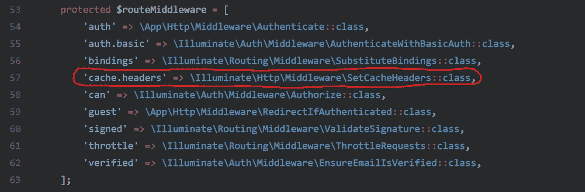
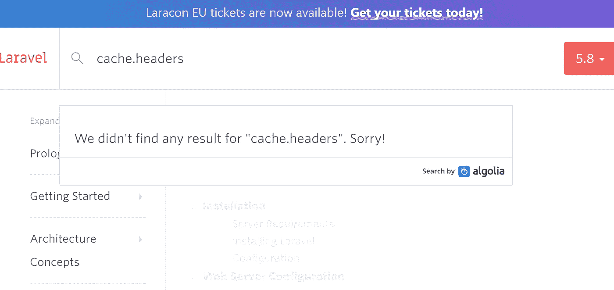
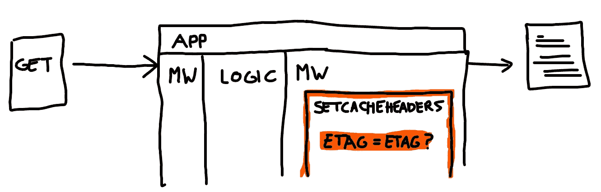

# Laravel:隐藏的 SetCacheHeaders 中间件

> 原文：<https://itnext.io/laravel-the-hidden-setcacheheaders-middleware-4cd594ba462f?source=collection_archive---------0----------------------->

## 永远不要试图重新发明轮子。



找到你了！

Laravel 内部已经注册了很多有用的中间件，比如[认证机制](https://laravel.com/docs/5.8/authentication#protecting-routes)、[授权](https://laravel.com/docs/5.8/authorization#via-middleware)、一个[节流器](https://laravel.com/docs/5.8/routing#rate-limiting)，甚至还有一个负责使[路由模型绑定](https://laravel.com/docs/5.8/routing#route-model-binding)成为可能的中间件。实际上，您的中间件需求已经得到满足。除了一个。

在 Laravel 中，有一个中间件没有受到关注。叫`SetCacheHeaders`，别名为`cache.headers`。并且，在文档中没有提到它。我不是在开玩笑，伙计们:



## 谁，何时，如何？

快速浏览一下 [api 文档](https://laravel.com/api/5.6/)和[源代码库](https://github.com/laravel/framework/)说这个中间件是在[冗长的讨论](https://github.com/laravel/framework/pull/22389)后[于 2017 年圣诞节前](https://github.com/laravel/framework/commit/df06357d78629a479d341329571136d21ae02f6f#diff-cd155bc0da2b7d6ddf490bf346992653)添加的，但是为什么没有人谈论它是个谜，因为它看起来非常……*方便*。无论如何，写完这篇文章后，我对文档的 [PR 被接受了，所以](https://github.com/laravel/docs/pull/5114)[你现在应该在文档](https://laravel.com/docs/5.8/responses#attaching-headers-to-responses)里找到了。

简单地浏览一下中间件，我们就知道可以用它来**将缓存头添加到响应**中，从而省去我们创建自己的中间件的工作。

## 在响应中缓存？你什么意思？

如果你这样问，就意味着你不知道什么是 HTTP 缓存控制指令。

> 简而言之，缓存控件是一种告诉浏览器应用程序发送的响应是否应该缓存以及在什么条件下缓存的方式，因此它可以决定是否应该再次接收完整的响应。

这是一个非常以浏览器为中心的机制，稍后你会明白为什么。在 Google Developers 上有一篇[非常好的文章，它将教你如何工作，你绝对应该读一读。我会等的。](https://developers.google.com/web/fundamentals/performance/optimizing-content-efficiency/http-caching)

准备好了吗？既然我们知道了 *HTTP 缓存控件*是如何工作的，我们就可以理解这个中间件试图实现什么。或者跳过*有用的*部分的下一节。

# SetCacheHeaders 中间件是如何工作的？

让我们检查一下[的源代码](https://github.com/laravel/framework/blob/5.8/src/Illuminate/Http/Middleware/SetCacheHeaders.php)。

如您所见，在这个中间件的`handle()`方法中有五个主要语句。试图用语言描述每个人做了什么:

1.  它从检查请求是`GET`还是`HEAD`开始。你不能缓存一个`POST`响应，因为这个方法意味着*改变了*事情。
2.  检查是否向中间件传递了任何参数，并使用方便的`parseOptions()`方法将它们解析成响应头。
3.  如果已经设置了`etag`选项，它将自动散列响应内容，以便可以快速与请求发送的`etag`进行比较。
4.  它将在[响应](https://github.com/symfony/symfony/blob/3.3/src/Symfony/Component/HttpFoundation/Response.php#L952)头中设置`Cache-Control`选项。
5.  最后，它将[检查响应是否未被修改](https://github.com/symfony/symfony/blob/3.3/src/Symfony/Component/HttpFoundation/Response.php#L1079)。如果不是，它将删除内容，只返回`etag`，节省宝贵的千字节。

重点是第三点和第五点。浏览器将使用缓存响应的`etag`向应用程序发出请求，如果最初的响应也是这样。您的应用程序将接收到`etag`，**处理整个请求**，最后，在响应的`etag`中再次散列内容。通过比较这两个`etag`,应用程序可以知道它是否应该再次发送整个响应，或者只发送同一个`etag`,告诉浏览器内容没有改变。



etag 在此应用程序中如何工作的艺术表现。

强调“处理整个请求”是关键部分。除非整个响应就绪，否则应用程序或浏览器不会知道内容是否已经更改，这意味着:**您的所有应用程序逻辑将从头到尾运行**。如果你需要一个更主动的缓存，你可以把目光投向令人敬畏的 [Spatie 的响应缓存](https://github.com/spatie/laravel-responsecache)。

就我个人而言，我认为缓存控件是一个利基标题。如果我想实现这种技术，最好在服务器中缓存响应，然后添加`etag`以节省两端的时间。

# 使用 SetCacheHeaders 中间件

既然我们知道了这个中间件是做什么的，就很容易使用它了。让我们用一个简单的真实世界的例子，比如我的永恒播客应用程序。

> 我是我的播客应用程序，主页上有一个很大的最新发布的播客列表，根据用户认证和订阅的播客而有所不同。我的指标显示，每次播客发布之间至少有 5 分钟。

让我们看看 Google 的[流程图，看看使用什么缓存控制策略](https://developers.google.com/web/fundamentals/performance/optimizing-content-efficiency/http-caching?hl=en#defining_optimal_cache-control_policy):


谷歌开发者——谷歌(2019)

好了，我们明白了:

*   如果最新发布的播客仍然是相同的，那么`no-cache`和`etag`将允许用户刷新页面(甚至在到期时间之前),而无需下载整个页面。
*   `private`表示主页是针对每个用户的，应该只在用户设备中缓存，而不是在代理服务器中缓存。
*   `max-age=300`将设置 5 分钟的到期时间，因为过了这个时间之后肯定会有新的播客发布。

```
Route::get('/', 'PodcastController@index')
    ->middleware('cache.headers:no-cache,private,max-age=300;etag');
```

仅此而已。不需要创建自己的中间件或侵入 Apache 或 NGINX，这是现成可用的。