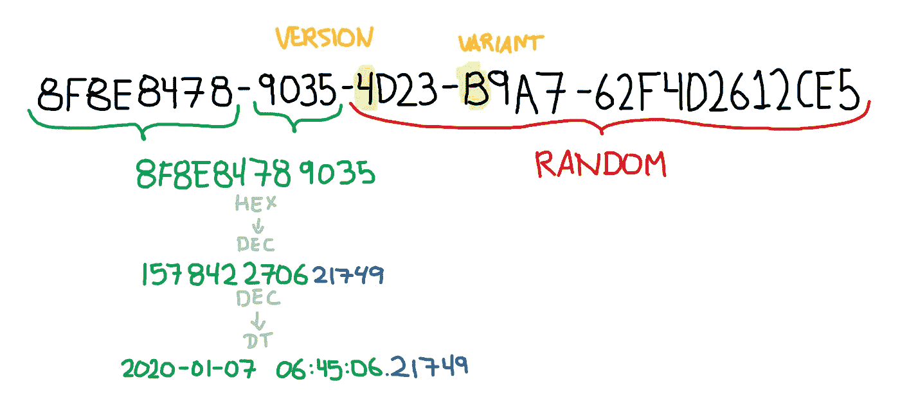

# 拉勒维尔:神秘的“有序的 UUID”

> 原文：<https://itnext.io/laravel-the-mysterious-ordered-uuid-29e7500b4f8?source=collection_archive---------0----------------------->

## UUID 最好的 v4 和 UUID 最好的 v1，但顺序相反


马库斯·斯皮斯克在 [Unsplash](https://unsplash.com?utm_source=medium&utm_medium=referral) 上的照片

[在应用程序的公共部分与 UUID 合作](https://medium.com/p/9f2b93cf6795)是隐藏一个表可能拥有的记录的真实数量的最简单的方法，出于隐私和安全的原因，同时保持一个特定的记录可从外部检索而不给出太多信息。

你不需要自己创建 UUID，或者添加一个包。Laravel 6.0 已经附带了一个助手，允许创建两种类型的 UUID:

*   [UUID v4](https://laravel.com/docs/5.7/helpers#method-str-uuid) ，基于全部 122 位的随机性。
*   [有序 UUID](https://laravel.com/docs/5.7/helpers#method-str-ordered-uuid) ，基于 48 位时间戳和 72 位随机性。

正如你所读到的,“有序的 UUID”有点新。它介于 UUID v1(基于时间，可猜测)和 UUID v4(基于随机，不太可能猜测)之间。这台 UUID 的特别之处在于……嗯，它可以方便地**订购**。换句话说，您可以从最新的或最早的开始对它们进行排序，而不必调用其他列，因为第一个字节是从它生成时起的时间戳。

虽然它的随机性比*小*，但它可以变得**非常可靠**，因为在‭4.722.366.482.869.645.213.695‬碰撞的几率是每 0.00001 秒(十[微秒](https://en.wikipedia.org/wiki/Microsecond))一次。我的基准是什么？赢得强力球或看一部好的《星球大战》电影的可能性。

# “我自己的 UUID 之路”的数据库领域

在继续之前，必须了解 SQL 数据库引擎和 UUIDs 之间的关系。你看，一些引擎让开发人员处理它，因为它被认为是非标准的 SQL 数据类型，而其他引擎提供了一种方法来*处理*它们，但不是完全处理。

*   对于 UUID，微软 SQL Server 有一个名为 [uniqueidentifier](https://docs.microsoft.com/en-us/sql/t-sql/data-types/uniqueidentifier-transact-sql?view=sql-server-ver15) 的列。它还提供了一种[创建完全随机的 GUID](https://docs.microsoft.com/en-us/sql/t-sql/functions/newid-transact-sql?view=sql-server-ver15) 的方法。
*   MySQL 什么都不做。你*应该*使用 16 字节的二进制列。有一个函数[创建一个 UUID v1](https://dev.mysql.com/doc/refman/8.0/en/miscellaneous-functions.html#function_uuid) 并且[在插入](https://dev.mysql.com/doc/refman/8.0/en/trigger-syntax.html)之前触发它。
*   **MariaDB** 与 MySQL 处于相同的状态，但是[提供了有效使用 UUID 的指南](https://mariadb.com/kb/en/guiduuid-performance/)。
*   **PostgreSQL** 有一个[特殊的列类型来处理 UUID](https://www.postgresql.org/docs/9.1/datatype-uuid.html) 。加载`[uuid-ossp](https://www.postgresql.org/docs/9.4/uuid-ossp.html)` [扩展](https://www.postgresql.org/docs/9.4/uuid-ossp.html)将允许您创建任何 UUID，并且[在向表中插入记录时将其定义为默认的](https://dba.stackexchange.com/questions/122623/default-value-for-uuid-column-in-postgres)。

您很大程度上依赖于应用程序本身来创建您的 UUID，这可能是好的，也可能不是。对我来说，让数据库而不是应用程序来处理 UUID 的创建和解析使它不依赖于应用程序。如果有一天我们改变了应用程序，你将不得不以某种方式添加一个 UUID 函数，如果它不可用的话。

如果您有可能在插入记录之前创建一个触发器，以便在数据库中自动创建一个 UUID，我认为您应该这样做。最初几分钟，它会走在滚烫的熔岩上，但是一旦你出去了，你就再也不会回去了。

> 注意，大多数数据库告诉你不要使用`CHAR`而是`BINARY`，因为 UUID 本身是一个二进制字符串。如果您对 36 个字符使用`*CHAR*`，那么对于 UUID，您将从 16 个字节跳到 288 个字节。你已经被警告了。

# 两全其美，两全其美之外

`Str::orderedUuid()`返回类似 UUID v4 的东西，但它不是真正的*UUID。这是因为它是在标准 [RFC 4122](https://tools.ietf.org/html/rfc4122) 之外生成的，但是仍然在 UUID v4 领域之内，所以没有机器在验证它时会有问题。*

这些数据是如何产生的？嗯，制作 UUID 的“编解码器”被称为`[TimestampFirstCombCodec](https://github.com/ramsey/uuid/blob/master/src/Codec/TimestampFirstCombCodec.php)`，它将时间戳的 48 位放在第一个字节而不是最后一个字节。

检查整个过程:

1.  它根据给定的“散列”(随机字节)加上时间戳创建一个随机字符串。
2.  之后，它将时间戳从最后一个交换到第一个。
3.  将 UUID v4 标识符(版本和变体)添加到字符串中。
4.  返回字符串

最后，你会得到这样的结果:



这个图像是不言自明的:我们有 48 位来定义时间戳，精度为 0.00001。去掉版本和变体，2 个字节标识它是 UUID v4，我们剩下 72 位的随机性。

# 在模型中使用它

如果您有一个包含 UUID 列的模型，您可以让 Laravel 使用 Trait 或覆盖 construct 方法来填充 UUID。

一个特性将允许您在多个模型中重用相同的初始化逻辑，

```
// app/FillWithUuid.phptrait FillWithUuid
{
    public function initializeFillWithUuid()
    {
        $this->attributes['uuid'] = Str::orderedUuid();
    }
}
```

虽然构造覆盖仅适用于特定的模型:

```
// app/MyModel.phppublic function __construct(array $attributes = [])
{
    $attributes['uuid'] = Str::orderedUuid(); parent::__construct($attributes);
}
```

当通过`creating`事件创建一个模型时，你也可以使用特征的`boot()`方法，比如`bootFillWithUuid()`，来添加 UUID，这对于一些人来说可能看起来更干净。

正如我之前所写的，时间戳在其他任何事情之前。这意味着您可以要求数据库按存储 UUID 的列对记录进行排序，大多数情况下，该列具有相同的名称。例如，按照它们被*持久化*到数据库的时间对它们进行排序:

```
MyModel::limit(15)->orderByDesc('uuid')->get();
```

如果在`uuid`列上有一个索引(或唯一索引),这种类型的查询会变得非常快，因为数据库不会扫描整个表来检索结果，但是索引本身与整个表相比会变得非常小。

> 从某种角度来看，一个包含 1，000，000 行的表的 UUIDs 索引大约为 16MB。如果像存储字符串一样存储，索引权重大约为 288MB。不要把 UUID 像绳子一样储存起来。**从不**。

为了确保万无一失，我让 SQLite 向我解释它如何使用`uuid`列上的惟一索引从`test_table`表中检索记录。

```
EXPLAIN QUERY PLAN
SELECT * FROM test_table ORDER BY uuid DESC LIMIT 15// Without index
>> SCAN TABLE test_table
>> USE TEMP B-TREE FOR ORDER BY// With index on "uuid"
>> SCAN TABLE test_table 
>> USING INDEX test_table_uuid_unique
```

# 警告

有两件事你必须意识到这一点”UUID 命令道。

首先，时间戳不使用碳甚至日期工厂。这意味着:你将得到你的**服务器的真实时间戳**。在某些边缘情况下，这种行为可能会破坏测试。幸运的是你可以创建自己的 UUID 工厂，`[Str](https://github.com/laravel/framework/blob/6.x/src/Illuminate/Support/Str.php#L640-L649)`[助手允许](https://github.com/laravel/framework/blob/6.x/src/Illuminate/Support/Str.php#L640-L649)的东西。对于大多数人来说，这是微不足道的。

第二点，也是最明显的一点，有序 UUID 公开了时间戳本身，因此任何看到 UUID 的人都可以知道记录是何时保存到数据库中的，但不知道表中有多少记录。如果您需要完全随机的标识符，您应该**使用 UUID v4，同时使用`created_at`列从最新或最老的开始排序您的记录。**