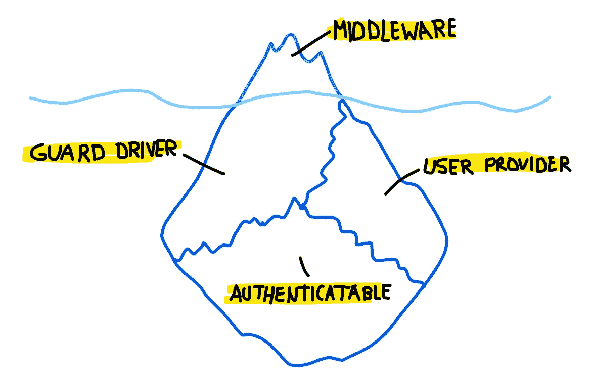
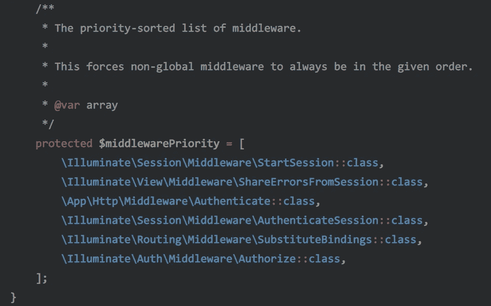
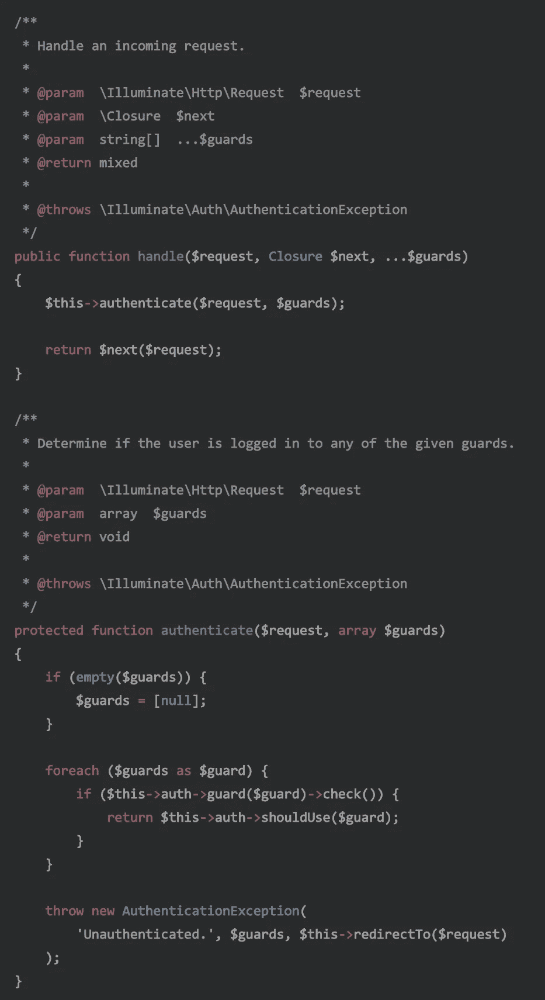
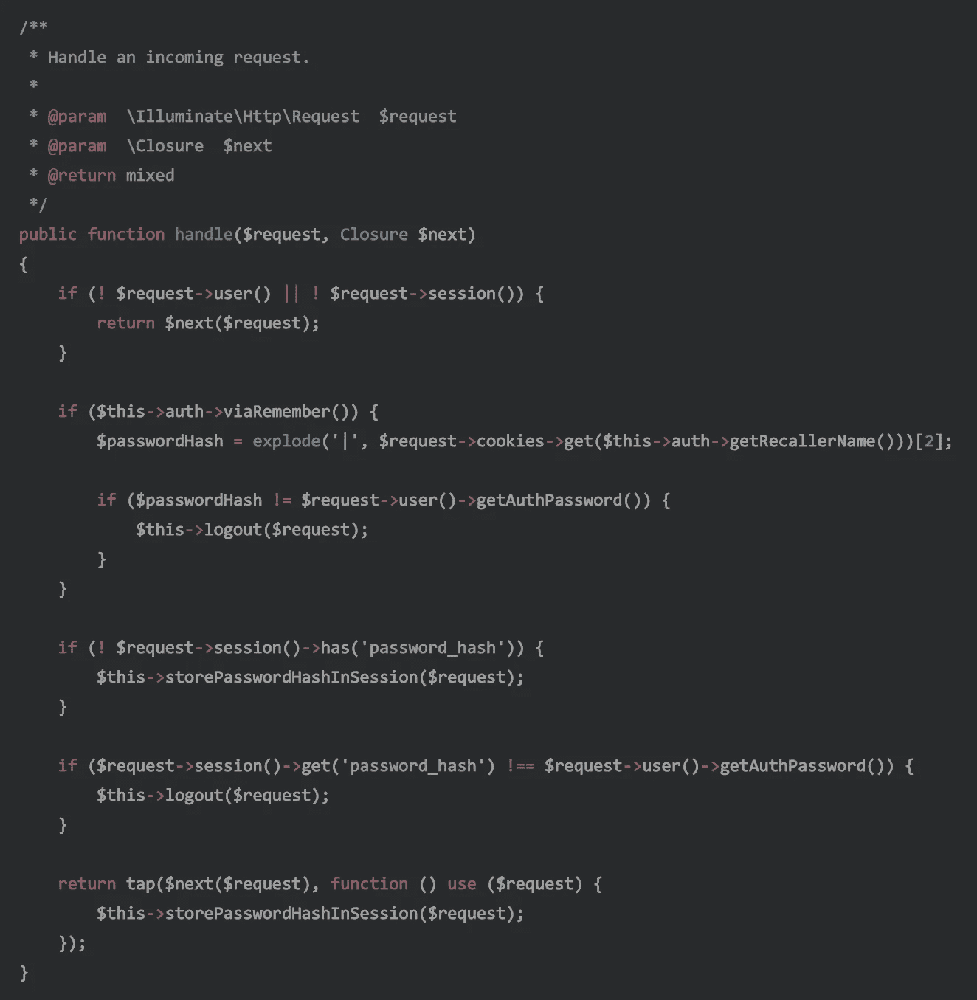

# Laravel:认证的力量(第 1 部分)

> 原文：<https://itnext.io/laravel-the-power-of-authentication-part-1-4510f721d8ff?source=collection_archive---------2----------------------->

## 忘记在你的控制器中使用讨厌的逻辑。学真道！


照片由 [Fancycrave](https://unsplash.com/@fancycrave?utm_source=medium&utm_medium=referral) 在 [Unsplash](https://unsplash.com?utm_source=medium&utm_medium=referral) 上拍摄

作为我的文章[关于认证如何在 Laravel](https://medium.com/@DarkGhostHunter/laravel-making-your-own-passwordless-auth-guard-b7740c89adf8) 中工作的*的后续*，这里我将写一下认证机制的活动部分，比如认证中间件、防护、驱动程序、用户提供者和可认证者。

简而言之，身份验证系统基本上是一个中间件，它查看请求的任何资源(cookie、请求头、会话等)以获取访问凭证(用户 ID 和密码、令牌等)。如果找到它们，它将从应用程序(数据库、外部 api 等)中提取具有这些凭证的用户，并在请求生命周期或后续请求中保持其可用性。

> 我谦恭地建议您至少了解一下[会话](https://laravel.com/docs/session)和[请求](https://laravel.com/docs/requests)是如何工作的，以及[应用程序生命周期](https://laravel.com/docs/5.8/lifecycle)。最后一段只是冰山一角。

但是认证系统不仅仅是一个中间件。一旦过了那一关，事情就变得非常非常复杂了。幸运的是，这只是乍一看令人望而生畏，在下一系列文章中，我将揭示身份验证系统是如何工作的，而不会用复杂的概念来轰炸。

现在，想象一下这个:



对于门外汉来说，认证系统是什么的崇高表现。是的，冰山一角。

# 认证中间件

实际上，有两个中间件用于身份验证。第一个是`Authenticate`，它代表认证机制中的主要齿轮，还有`AuthenticatedSession`中间件，它有点像*利基—* 我们稍后会谈到它。

如果您在您的`app\Http\Kernel.php`中看到中间件优先级，您会看到`Authenticate`就在`AuthenticatedSession`之前。如果不是，那么检查一下它扩展的内核。



app\Http\Kernel.php

这个数组定义了中间件在另一个之前的顺序。这避免了当一个中间件需要其他中间件提供的东西时的冲突。我个人认为 Laravel 可以有一个中间件属性来要求其他的，但是对于当前版本来说这已经足够了——大量的中间件意味着你可能做得有些过头了。

# 它从认证开始

当您在路由或控制器中设置`auth`中间件时，传入的请求将由`Authenticate`类处理。当应用程序实例化它时，它接收`AuthManager`服务，并且这个服务返回一个以它的名字命名的守卫。

该中间件将尝试检查在您的配置文件中设置的默认身份验证机制，否则它将循环您在中间件参数中设置的每个身份验证，如下例所示:

```
Route::get('private')
    ->uses('PrivateController@show')
    ->middleware('auth:token,session,telepathy,hunch,whatever');
```

当它按顺序循环通过每个认证守卫时，它基本上调用`AuthManager`内每个守卫的`check()`方法，返回一个 boolean 应用程序将使用返回`true`的第一个身份验证，如果没有人说有一个用户已经过身份验证，它将返回一个`AuthenticationException`，因为没有身份验证能够判断谁正在访问该路由。



照明/认证/中间件/认证

如果用户没有通过`redirectTo()`方法进行身份验证，该异常将接收您希望重定向到的 URL，该方法接收请求作为参数。例如，您可以根据请求的位置将用户重定向到不同的 URL。

## 那么，身份验证会话是做什么的呢？

[该中间件默认情况下是禁用的](https://github.com/laravel/laravel/blob/master/app/Http/Kernel.php#L34)，但启用它将允许用户在密码更改时从所有其他设备注销。

快速浏览一下`handle()`方法告诉我们，这个`AuthenticateSession`试图通过比较用户先前存储在会话中的密码散列来验证用户身份——您将需要使用`SessionGuard`或类似的使用会话。因此，如果用户更改数据库中的密码哈希，所有其他会话都将自动失效，因为这些会话使用的是旧的密码哈希。



照明/会话/中间件/认证会话

如果你不知道，Laravel 不会强制用户只能在一个设备上进行身份验证。这意味着，一个用户可以在世界的不同地方打开多个会话，即使该用户更改了他的密码。

为了解决这个问题，Laravel 允许这个中间件与`[logoutOtherDevices()](https://github.com/laravel/framework/blob/5e87f2df072ec4a243b6a3a983a753e8ffa5e6bf/src/Illuminate/Auth/SessionGuard.php#L543)` [方法](https://github.com/laravel/framework/blob/5e87f2df072ec4a243b6a3a983a753e8ffa5e6bf/src/Illuminate/Auth/SessionGuard.php#L543)结合使用，当用户登录时，[将使其他设备中的会话无效。这个可以放在你的`LoginController`上。](https://laravel.com/docs/5.8/authentication#invalidating-sessions-on-other-devices)

Laracast 中有一个很好的视频，讲述了这一点以及如何注销所有其他设备，所以请查看它以了解更多细节。如果你不想，这里是要点:当它收到密码，它重新散列并保存到数据库，从而使其他会话无效，因为散列不相等。

好了，中间件已经介绍完了，下一步是理解警卫驱动和用户提供者。