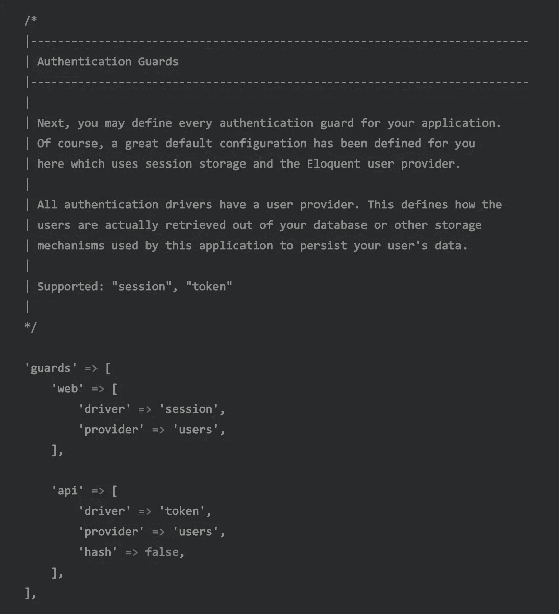
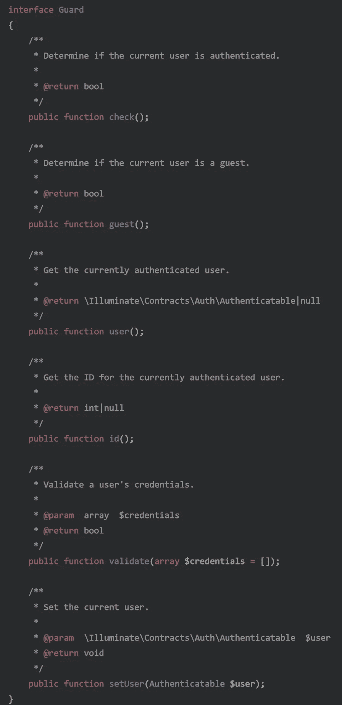
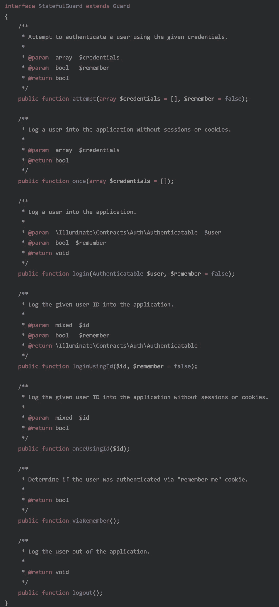
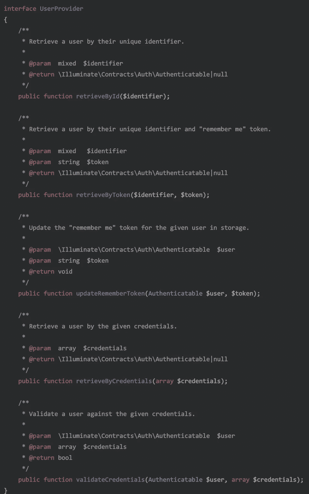
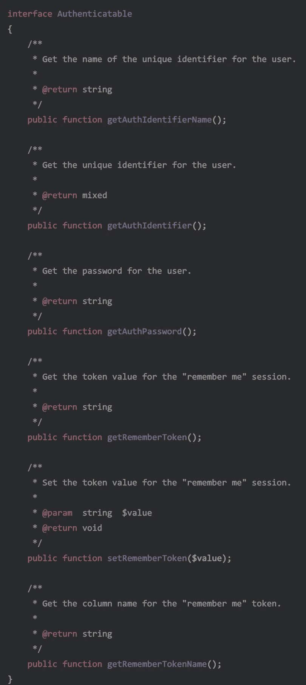

# Laravel:认证的力量(第 2 部分)

> 原文：<https://itnext.io/laravel-the-power-of-authentication-part-2-f2386eaebcad?source=collection_archive---------5----------------------->

## 忘记使用您的控制器来手动登录您的用户，学习真正的方法！


[库坦乌拉尔](https://unsplash.com/@kutanural?utm_source=medium&utm_medium=referral)在 [Unsplash](https://unsplash.com?utm_source=medium&utm_medium=referral) 上拍照

作为我的文章[关于认证如何在 Laravel](https://medium.com/@DarkGhostHunter/laravel-making-your-own-passwordless-auth-guard-b7740c89adf8) 中工作的*的后续*，这里我将写一下认证机制的活动部分，比如认证中间件、防护、驱动程序、用户提供者和可认证者。

现在我们知道了[我们的认证中间件做了什么](https://medium.com/p/4510f721d8ff)，下一部分是知道什么是认证防护。

# 那么，什么是认证守卫呢？

身份验证警卫负责:

1.  在请求中查找凭据。
2.  使用凭据检索用户。
3.  比较和验证凭证。
4.  返回已验证的用户以供进一步使用。

为了完成这些任务，Guard 概念由两个移动部分组成:Guard 驱动程序**和用户提供程序**。这两者有明确的[关注点分离](https://en.wikipedia.org/wiki/Separation_of_concerns):一个定位并验证凭证，另一个“提供”或“定位”这些凭证的用户，后者必须符合`Authenticatable`契约(或者接口，如果你愿意的话)。****

如果你看到[你的](https://github.com/laravel/laravel/blob/master/config/auth.php) `[auth.php](https://github.com/laravel/laravel/blob/master/config/auth.php)` [配置文件](https://github.com/laravel/laravel/blob/master/config/auth.php)，你会看到一个名为`guards`的键。在这里，每个守卫的名字都会有一个`driver`和一个`provider`。这允许你在不影响其他驱动程序的情况下交换它们，或者用其他驱动程序和提供程序创建其他防护。想象一下，警卫拿着一个司机的包，司机拿着一个标签。



config/auth.php

例如，在我们的`web` guard 中，您可以将“用户”提供者更改为一个假想的“外部”提供者，该提供者将从 Twitter、Firebase、Auth0 或任何其他地方提取用户，并保持相同的“会话”驱动程序以保持用户登录。这个“外部”提供者将用户数据保存在缓存或数据库中，以避免在每次请求时调用外部 API:

```
'guards' => [
    // ... 'web' => [
        'driver' => 'session',
        'provider' => 'external'
    ],
```

如果您不理解配置文件，请不要担心，我们将在最后一部分再次讨论这个问题。

# 警卫司机

所有的守卫都遵从[底座](https://github.com/laravel/framework/blob/master/src/Illuminate/Contracts/Auth/Guard.php) `[Guard](https://github.com/laravel/framework/blob/master/src/Illuminate/Contracts/Auth/Guard.php)` [接口](https://github.com/laravel/framework/blob/master/src/Illuminate/Contracts/Auth/Guard.php)。这个接口为做三件事奠定了基础:检查是否有用户通过了身份验证，验证传递的凭证并返回当前通过身份验证的用户。



照明/合同/授权/警卫

这是 Laravel 附带的`[TokenGuard](https://github.com/laravel/framework/blob/master/src/Illuminate/Auth/TokenGuard.php)`[使用的。守卫检查请求头中的`token`，并提取匹配的用户。如果令牌不存在或不正确，身份验证将失败。](https://github.com/laravel/framework/blob/master/src/Illuminate/Auth/TokenGuard.php)

这个接口是由另一个`[StatefulGuard](https://github.com/laravel/framework/blob/master/src/Illuminate/Contracts/Auth/StatefulGuard.php)`扩展的。顾名思义，它添加了一些方法来方便地对用户进行身份验证，在后续请求中保持身份验证，并使身份验证无效。这主要分别通过`login()`、`viaRemember()`和`logout()`方法完成。



照明/合同/授权/国家警卫

这是通过`[SessionGuard](https://github.com/laravel/framework/blob/master/src/Illuminate/Auth/SessionGuard.php)`实现的。顾名思义，它使用应用程序的会话处理程序来保存和识别身份验证信息。这允许在会话有效且未过期的情况下保持用户登录，因为它会检查这一点以持续拉出用户。

所有这些保护方法通常调用用户提供者，它负责检索`Authenticatable`用户，不管它是什么，比如 API 或 moon。

## 有状态和无状态的区别

如果你不明白其中的区别，这里有一个提示。有状态保护提供了保持用户登录的方法，为了实现这一点，有状态保护提供了类似`attempt()`和`login()`的方法，负责检查特定用户是否拥有正确的凭证，并在下一个请求中保持身份验证，例如使用会话和记住令牌。

随后的请求不会询问用户密码，而是记住令牌。无论哪种方式，有状态防护都将使用用户提供程序，使用记住令牌来检索用户。

同时，只要用户的凭证是正确的，无状态保护(如果您愿意，也可以称为“简单保护”)就会对用户进行身份验证，这是用户必须在每个请求中设置的。当您使用外部 API 时，这种情况会经常发生，这需要在所有请求的请求头中设置一个特殊的令牌，以标识发出请求的用户。

# 用户提供者

`[UserProvider](https://github.com/laravel/framework/blob/master/src/Illuminate/Contracts/Auth/UserProvider.php)` [接口](https://github.com/laravel/framework/blob/master/src/Illuminate/Contracts/Auth/UserProvider.php)设置识别和检索想要被认证的用户的基础。无论你做什么来完成它都是你自己的事情，只要它返回实现`Authenticatable`契约的实例。



照明/合同/授权/用户提供者

这个用户提供者必须通过 ID(在数据库中通常是主列)和令牌来检索用户，这允许用户通过多个请求被“记住”或被认证，而不暴露其他凭证。这个最后的凭证通常是默认的`users`表中的“remember_token”列。同样，您使用什么来持久化和检索令牌是您自己的事情。

它还负责通过凭据组合(如用户名、密码和其他信息)检索用户，并验证这些凭据的正确性，例如检查密码是否匹配。

例如，`[EloquentUserProvider](https://github.com/laravel/framework/blob/5.8/src/Illuminate/Auth/EloquentUserProvider.php#L106-L132)`接收一组凭证来构建查询，该查询检查是否找到了这些凭证的用户。之后，用户再次被接收，但是带有凭证以比较这些凭证是否相同。

# 可信的

当一切正常时，我们将检索用户，它应该是 `[Authenticatable](https://github.com/laravel/framework/blob/master/src/Illuminate/Contracts/Auth/Authenticatable.php)`的一个[实例。这个接口基本上是一个契约，它迫使开发人员使用通用的方法来管理凭证，如密码、记住令牌及其用于身份验证的唯一标识符。](https://github.com/laravel/framework/blob/master/src/Illuminate/Contracts/Auth/Authenticatable.php)

虽然惟一标识符通常是数据库中的主列，但并不局限于此。在一个极端的例子中，您可以将他的标识符设置为远程 API 的唯一 UUID。



照明/合同/授权/可认证

这一点非常重要:**认证机制与实现**相关联，而不是硬编码到类中。如果将来您想要将您的*可认证的*用户的位置从 Firebase 或 Auth0 更改到您的本地数据库，您将需要将用户提供者从`firebase`更改为`eloquent`，就这样。

换句话说，安全驱动程序不关心用户从哪里取出(API、远程数据库等)，用户提供者也不关心用户凭证从哪里取出(cookie、会话、请求头，谁知道呢)。这允许保持您的网站功能不变，而不必求助于几乎重新连接整个认证过程。

在下一部分，我们把所有的东西粘在一起。

[](/laravel-the-power-of-authentication-part-3-d691224f3afb) [## Laravel:认证的力量(第 3 部分)

### 忘记使用您的控制器来手动登录您的用户，学习真正的方法！

itnext.io](/laravel-the-power-of-authentication-part-3-d691224f3afb)