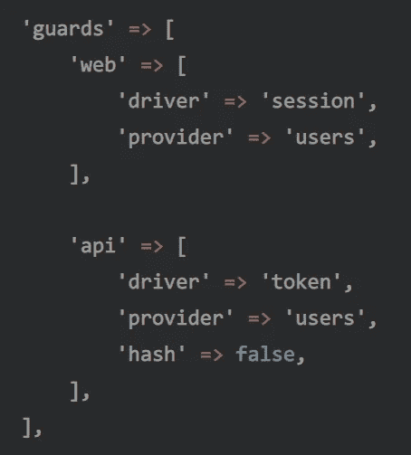
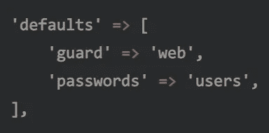

# Laravel:认证的力量(第 3 部分)

> 原文：<https://itnext.io/laravel-the-power-of-authentication-part-3-d691224f3afb?source=collection_archive---------3----------------------->

## 忘记使用您的控制器来手动登录您的用户，学习真正的方法！。


照片由 [Cytonn 摄影](https://unsplash.com/@cytonn_photography?utm_source=medium&utm_medium=referral)在 [Unsplash](https://unsplash.com?utm_source=medium&utm_medium=referral) 上拍摄

作为我的文章[关于认证如何在 Laravel](https://medium.com/@DarkGhostHunter/laravel-making-your-own-passwordless-auth-guard-b7740c89adf8) 中工作的*的后续*，这里我将写一下认证机制的活动部分，比如认证中间件、防护、驱动程序、用户提供者和可认证者。

[我们理解所有的运动部件](https://medium.com/p/f2386eaebcad/)，但是我们需要把它们粘在一起。在第三部分也是最后一部分，我们将通过在应用程序中注册它们并使用配置来了解如何做到这一点。

这种粘合是由`[AuthManager](https://github.com/laravel/framework/blob/master/src/Illuminate/Auth/AuthManager.php)`悄悄完成的，这是一种负责注册和实例化身份验证防护的服务，就像开箱即用的那些一样，它使用配置文件来知道到底在做什么，否则它将绕着圈子运行。

# 了解配置

该配置以一种简单的方式工作:您注册一个防护名称，比如“web ”,然后设置防护驱动程序和将与该防护一起使用的提供者(不是用户提供者),默认情况下分别是“session”和“users”。



config/auth.php

然后，在您的代码中，您可以检查一个用户是否通过其名称`Auth::guard('web')->check()`被验证进入一个特定的守卫。

然而，配置需要一个缺省值，当您没有在代码中发出保护名时，将会使用这个缺省值。幸运的是，这是在第一个键中设置的，对于简单的应用程序来说很好。



config/auth.php

回到防护配置，提供者在这个配置文件中注册。这个提供者键的目的之一是封装真正的用户提供者，并将配置数组传递给它。例如，`users`提供者使用`eloquent`作为用户提供者，它接收整个密钥配置，其中包含`model`密钥，该密钥将用于知道从数据库中检索哪个模型。

没有必要为您的其他模型创建另一个身份验证机制或提供程序；您可以在这里更改它，这样就设置好了。

# 注册自定义身份验证防护驱动程序和用户提供程序

假设我们已经创建了一种方法，通过请求中的特殊头来验证用户，并从外部 API 中提取用户。让我们称它们为`HeaderGuard`，它实际上是守卫驱动程序，以及`ApiUserProvider`，它将从外部 API 拉用户。

现在我们已经把它们放在代码中的某个地方了，我们需要把它们注册到应用程序中，否则它永远不知道什么时候使用它。关于[添加新的保护驱动](https://laravel.com/docs/5.8/authentication#adding-custom-guards)和[注册自定义用户提供者](https://laravel.com/docs/5.8/authentication#adding-custom-user-providers)的文档非常简单。

## 注册割台防护装置

在[我们的](https://github.com/laravel/laravel/blob/master/app/Providers/AuthServiceProvider.php) `[AuthServiceProvider](https://github.com/laravel/laravel/blob/master/app/Providers/AuthServiceProvider.php)`中，我们将使用服务容器注册我们的`HeaderGuard`，而不是手动实例化它——你可以这样做，但我认为这种方式更方便。这将简化我们注入任何我们的安全驱动程序可以使用的服务的工作，例如，请求和各自的用户提供者。

如果有一天或下一分钟，我们想在我们的防护中添加一个服务，比如缓存管理器，我们只需简单地改变我们防护中的`_construct`方法参数，然后就到此为止。

```
Auth::extend('header', function ($app, $name, array $config) {
    return $app->make(\App\Auth\HeaderGuard::class, [        
        'name' => $name,
        'config' => $config,
        'provider' => $app['auth']->createUserProvider(
            $config['provider'] ?? null
        )
    ]);
});
```

注意，我们手动告诉服务容器使用 AuthManager 的`createUserProvider`来解析我们的`HeaderGuard`中的`$provider`。该方法根据给定的名称创建用户提供程序，如果没有设置名称，它将使用默认名称。

现在我们已经有了我们的防护驱动程序，我们可以通过在我们的配置文件中编写`header`作为我们的“驱动程序”来使用它，但是它仍然会从数据库中获取用户，因为它使用`users`提供程序，并且它使用`eloquent`用户提供程序从数据库中获取用户。我们不想那样！

## 注册用户提供者

现在我们需要注册我们的`ApiUserProvider`。这可以通过添加以下内容来实现:

```
Auth::provider('external-api', function ($app, $config) {
    return $app->make(\App\Auth\ApiUserProvider::class, [
        'config' => $config,
    ]);
});
```

这段代码将把`external-api`用户提供者附加到返回`ApiUserProvider`的闭包上，这个闭包也由服务容器解析。

顺便说一下，这些闭包将被注册在一个名为`customCreators`和`customProviderCreators`的数组中，该数组位于`[AuthManager](https://github.com/laravel/framework/blob/master/src/Illuminate/Auth/AuthManager.php)`[类](https://github.com/laravel/framework/blob/master/src/Illuminate/Auth/AuthManager.php)中。

就个人而言，我喜欢一种不太直接的注册服务的方式(除非必要)。在本例中，我“优化”了新的安全驱动程序和用户提供程序的注册，方法是在服务解决之前[推送这些注册](https://laravel.com/docs/5.8/container#container-events):

我没有在每次应用程序启动时解析`AuthManager`服务，而是使用服务提供者的`register()`方法。在这里，我告诉服务容器只在需要使用认证机制时添加我们的驱动程序和用户提供者。

这样就不需要像在公共路由中那样调用认证中间件；我们可以跳过实例化 Auth Manager 和每个使用它的类。酷，*玛尔性能*！

## 把两者都当作守卫

现在这些都设置好了，我们只需要在配置中添加它们。我们可以只改变驱动程序和现有的警卫提供者，或命名我们自己的。我将选择后者，并且不将 if 设置为缺省值，因为我将对其他路由集使用该保护。

```
'guards' => [ // ... 'remote' => [
        'driver' => 'header',
        'provider' => 'external-provider',
    ], 'providers' => [ // ... 'external-provider' => [
            'driver' => 'external-api',
        ], ],],
```

然后，一切都准备好了，用你这样的警惕:

```
Route::prefix('external')
    ->middleware('auth:remote')
    ->group(function() { Route::get('/'->uses(function () {
            // ...
        }); Route::get('dashboard')->uses(function () {
            // ...
        });});
```

差不多就是这样。同样，试图重新发明轮子并在控制器中创建自己的认证逻辑是一种糟糕的做法。使用这些移动的齿轮，你就不需要在你的代码中做更多的改变。[这样就可以了](https://www.youtube.com/watch?v=4u0NRgMyzEM)。

希望你已经学到了一些东西，可以用在你未来的项目中。下次见。