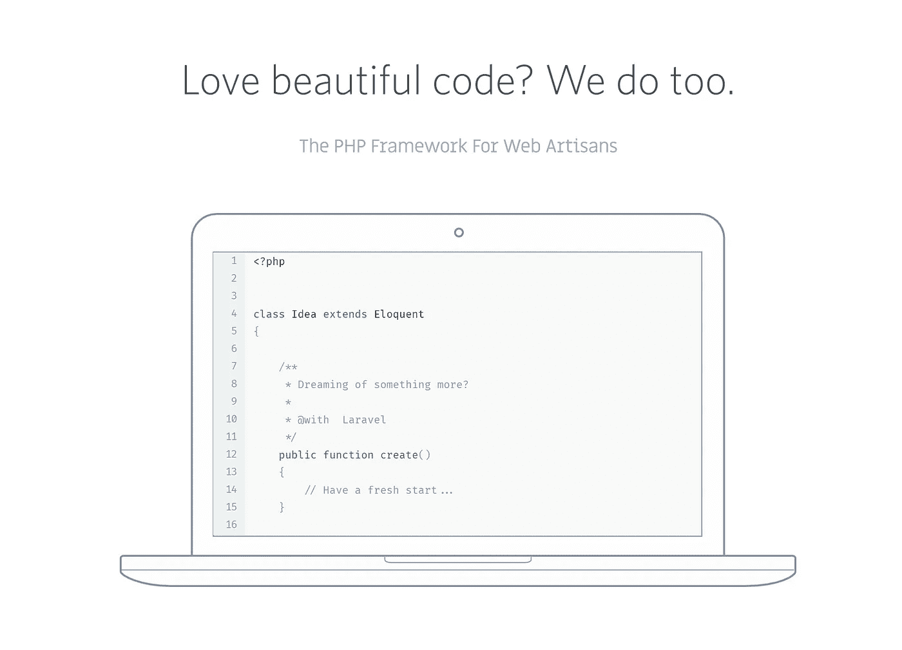
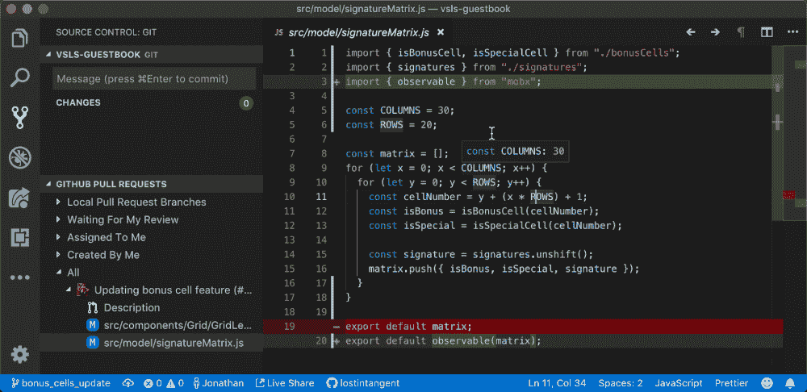
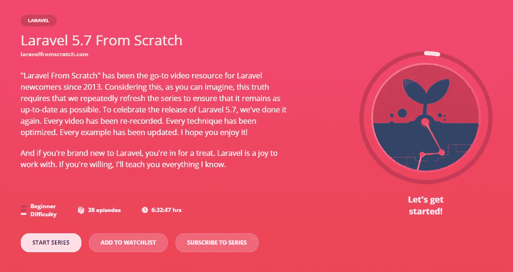
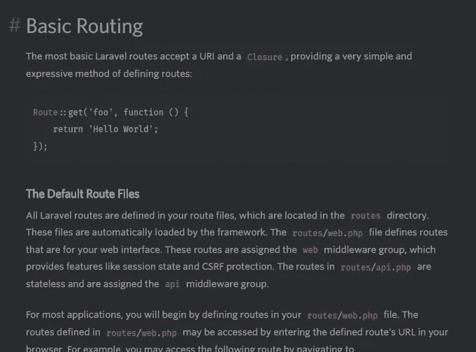
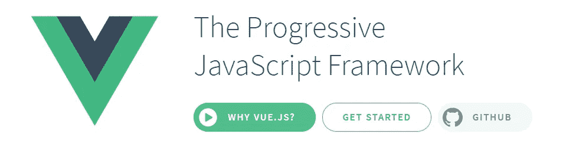

# 拉勒维尔:它是什么，在哪里学习

> 原文：<https://itnext.io/laravel-what-is-and-where-to-learn-72f5c130d0ee?source=collection_archive---------6----------------------->

## 如果你还不知道从哪里开始，这是一个终极指南。

如果你正在读这篇文章，你可能是来这里寻找如何制作自己的 web 应用程序的。请继续阅读这篇简短的介绍，这样我就可以告诉你下一步应该做什么。继续读，别担心。


照片由[布伦丹·丘奇](https://unsplash.com/@bdchu614?utm_source=medium&utm_medium=referral)在 [Unsplash](https://unsplash.com?utm_source=medium&utm_medium=referral) 上拍摄

# 那么，拉弗尔是什么？

Laravel 是一个 PHP *框架*。通俗地说，Laravel 提供了一个 web 应用程序的“框架”,而不是从第一行到最后一行都编程。



你的工作是如何把那个骨架变成一个人。Laravel 包含并简化了 web 应用程序从 HTTP 请求开始到逻辑结束的大部分常见任务。例如:

*   你需要签到吗？**认证**开箱即用。
*   需要使用 Cookies 和会话？ **Cookie** 和**会话**管理也开箱即用。
*   编写 HTML 视图的简单语法？**刀片模板引擎**可以帮你解决。
*   与数据库对话的简单方法？**不再有原始 SQL 调用**！雄辩术将允许你以灵活的方式做到这一点，并保护你免受 SQL 注入。

所有这些以及更多这些*工具*都可以使用清晰易懂的语法为您的应用进行编码，如下所示:

```
$playlists = $request->user()->playlists()->all()
```

这段代码将获得经过身份验证的用户的所有播放列表，而不需要告诉什么用户，什么 SQL 语法，也没有无法识别的方法。

> *还不明白概念？想象你必须创造你的房子。你可以去离你最近的五金店买一扇你喜欢的现成的门，而不是去森林里砍木头，用木头做一扇门。连门把手都换了！*

# 我该怎么学？

我尝试过很多小项目，我个人认为最好的学习方法是列出**待办事项**清单:它很小，简单，非常直接，它允许你在用其他概念轰炸你之前学习框架的基本*内部工作方式*。

你还可以做一些更令人生畏的事情，比如一个**博客**、一个**图片库**、一个**作品集**等等。我推荐除了小而简单之外的任何东西，这样你不用写代码就能理解。[这些项目](https://www.google.com/search?q=laravel+todo+tutorial)有 [千种](https://www.google.com/search?q=laravel+blog+tutorial) [教程，如果你需要有人牵着你的手。](https://www.google.com/search?q=laravel+gallery+tutorial)



Visual Studio 代码智能化的一个例子(来自他们的博客)

一个非常普遍的建议是使用一个 [IDE](https://wikipedia.org/wiki/Integrated_development_environment) 进行 PHP 开发，因为它将帮助你更快地编码，减少猜测，并且有很多工具可供使用，比如代码补全——当你自动或手动键入一些东西时，你会得到建议——并且如果你键入了错误的东西，会得到警告。

PHPStorm 和 [Sublime Text](https://www.sublimetext.com/) 都是付费的(分别有免费的测试版和试用版),但是非常有用和清晰。 [Eclipse](https://www.eclipse.org/downloads/) 、 [Atom](https://atom.io/) 和 [Visual Studio Code](https://code.visualstudio.com/) 都是免费的，后者[有一个 Laracast 视频](https://laracasts.com/series/visual-studio-code-for-php-developers)，如果你预算紧张但时间不够，它会成为你最喜欢的 PHP IDE。

> 嘶！当你是它的时候，我建议你为你的 IDE 选择一个漂亮的深色主题，这样你就不会灼伤你的眼睛。

# 哪里可以学？

你可能想从[从头开始学习 Laravel](http://laravelfromscratch.com/)开始，学习 Laravel 的官方课程。有时候系列会落后一个版本，但是基本都是一样的。如果是这样的话，应该补充最新的[Laravel](http://whatsnewinlaravel.com)的新内容。



如果你喜欢 Laracast，并想学习其他相关的东西，如测试、支付和其他主题，不要害羞，如果它对你有帮助，就订阅吧。

当然，我不会阻止你去查看 [Udemy](https://www.udemy.com/topic/laravel/) 、 [Lynda](https://www.lynda.com/Laravel-training-tutorials/2779-0.html) 以及其他许多提供 Laravel 课程的网站，甚至 Youtube。一定要检查那些最新的，因为最近的版本通常有更多的好东西让你的生活更简单。

# 有手册什么的吗？

当然啦！官方文档就在这里。它涵盖了几乎所有的细节，从安装到应用程序生命周期的结束，留下了一些高级的东西供高级开发人员使用，如合同、服务容器、包开发等。一切都解释的很清楚，不用成为 PHP 专家也能理解。



简单看一下官方文档，路由部分。是的，我用的是[黑暗阅读器](https://darkreader.org/)。

我的拙见是至少阅读一下标题，这样你就可以对框架的功能有一个清晰的了解。当你从零开始创建一个特性，而不知道 Laravel 已经为你做了，这是非常令人沮丧的，有时会比你预期的好得多(特别是在错误处理方面)。

# 我根本不懂 PHP，或者编程。我能做什么？

了解一些编程基础知识是必要的。PHP 本身是一门不难学的语言，它保护你免于许多事情(比如内存管理)，并且它在如何做事方面提供了灵活性。

请原谅*大写锁定是为了酷*的巡航控制，但我不得不这样评论:

> 如果你不擅长解决问题，或者依赖于从网上复制粘贴解决方案，编程可能不适合你…但是你可以试试！

好吧，很抱歉。每个人都是从底层开始的。说到开始，PHP 从业者是一个很好的免费资源。

当然，互联网上有很多免费和付费的教程和课程，可以帮助你理解一般的编程，以及 PHP 和其他语言。一旦你掌握了基本概念，你就可以回到这里。

## 嘿！我不是一个十足的笨蛋！…但是仍然

如果你*知道一些 PHP* ，那么 [PHP 的正确方法](https://phptherightway.com/)实际上就是**手册**。保持密切关注，因为它将帮助您理解最佳实践，使用 PHP，因为你应该和不死的尝试。

如果你有更多的经验，但是你的代码很快就变成了意大利面条，你可能想看看 [PHP 设计模式](https://designpatternsphp.readthedocs.io)。这些是构建你的代码并保持它可理解的策略。，而你坚持干而实。

# 我有时读的那个“Vue”是什么？

[Vue.js](https://vuejs.org/) 是一个面向前端的 JavaScript 框架。它非常易于使用，能够实现更好的交互和反应，但将前端与后端分离开来。想想[单页面应用](https://en.wikipedia.org/wiki/Single-page_application)和 [AJAX](https://en.wikipedia.org/wiki/Ajax_(programming)) 。



如果您是 Laravel 的新手，那么您应该坚持不使用任何 JavaScript 来编写您的应用程序，除非最终有必要。如果需要，使用普通的 JavaScript，而不是 jQuery、React、Vue 或其他框架。这将让你更好地掌握后端。

一旦你理解了 Laravel，像 Vue.js 这样的前端框架可以成为你的下一个大盟友，让你的网站变得时髦和现代。

# 我对我的下一个项目有一个好主意！我能在拉勒维尔做吗？

最好说明框架不允许你做什么:一个原生的移动应用，或者桌面软件。

Laravel 擅长于成为一个 web 应用程序，或者一个微小的 web API，绑定到 HTTP 请求和预定的作业。

> 对于 API 方面的东西，如果你需要更快的东西， [Lumen](https://lumen.laravel.com/) 就像是 Laravel 的骨头，没有太多额外的逻辑开销。建议仅在您完全了解 Laravel 的工作方式，并且您可以自己完成大部分工作时使用。

如果您需要一个现有系统的界面和管理应用程序，比如显示您的电子邮件服务器的统计数据，或者您的恒温器的仪表板，只要系统提供一个 API 来与 Laravel 通信，它就可以工作。由于流行的 [GuzzleHTTP 包](http://docs.guzzlephp.org/en/stable/)，HTTP 协议很容易管理，但是如果你有另一个(如 RPC、SMTP、FTP 等)，你可能想将社区制作的另一个 Composer 包集成到 Laravel 中，甚至是 PHP 扩展。

再次强调，Laravel 不是瑞士军刀，**它是一个网络应用框架**。如果你想做出一个关键的商业决策，你可能想为你的特定项目探索更多的语言选项，比如 Node.js、C++、C#、Go、Python 等等。

# 我看到一些“作曲家”包。那些是什么？

Composer 是一个 PHP 的包管理系统。Composer 包就像社区和公司编写的独立工具，用于支持或扩展 PHP 项目。甚至 Laravel 本身就是作曲家包！

例如，Laravel 在他的*清单*中包含了 [Carbon](https://carbon.nesbot.com/) 包，它作为一个依赖项被自动下载。Carbon 允许你流畅地操纵时间，就像使用`today()->addHours(10)`得到今天上午 10:00，而不是从头开始编写时间相关函数。一些包可能依赖于一个或多个包，但是原理是一样的。

如果您需要一些已经编码的功能，并且不想在接下来的几年里从头开始，您也可以自己添加其他 Composer 包。Laravel 也有官方包，[可以在 Github 库](https://github.com/laravel)中找到。

# 如何“下载”或“安装”Laravel 以便开始编码？

查看 [Laravel 官方文档](https://laravel.com/docs/)，或[PHP 从业者](https://laracasts.com/series/php-for-beginners)。您需要的一切都在那里，从一开始到您可能需要的最后一段代码。

你还应该[在你的机器](https://phptherightway.com/#getting_started)上安装 PHP，然后[安装 Composer](https://getcomposer.org/) 。编码快乐！