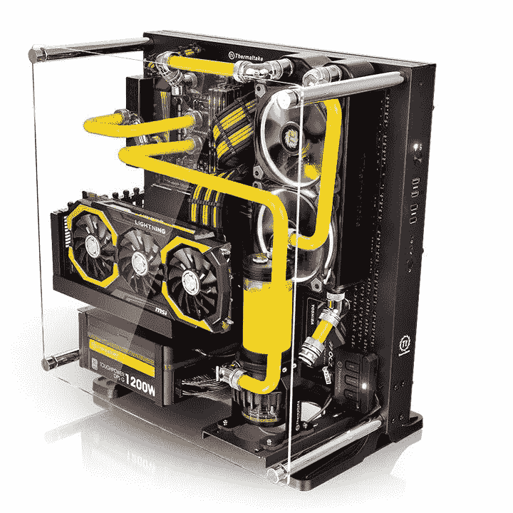
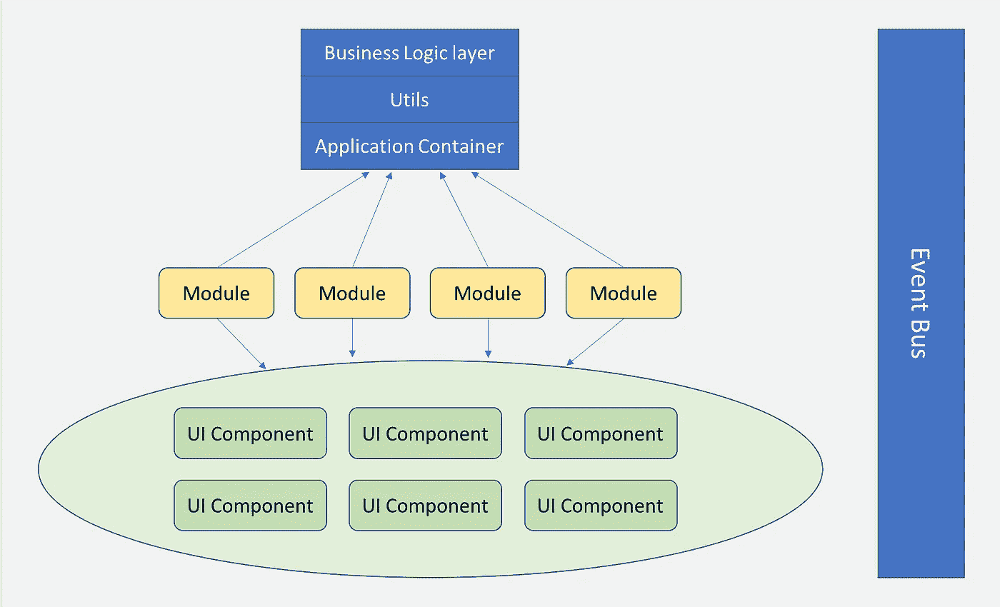
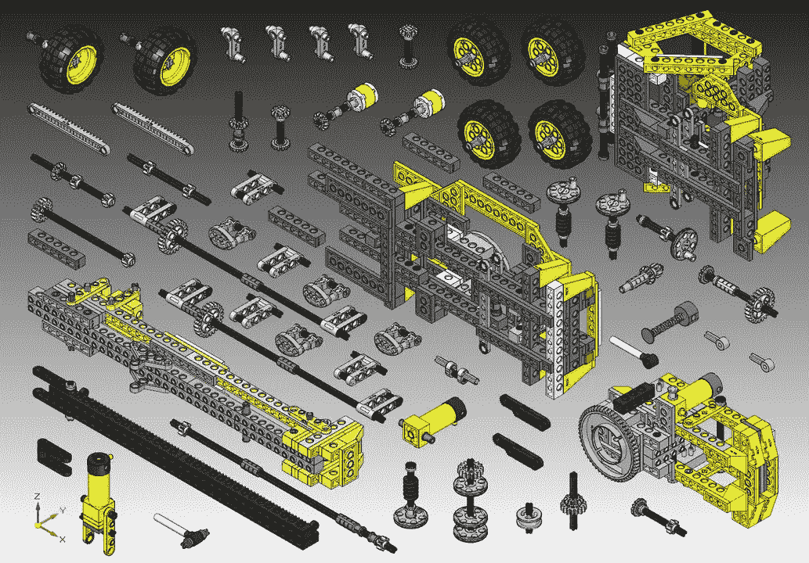
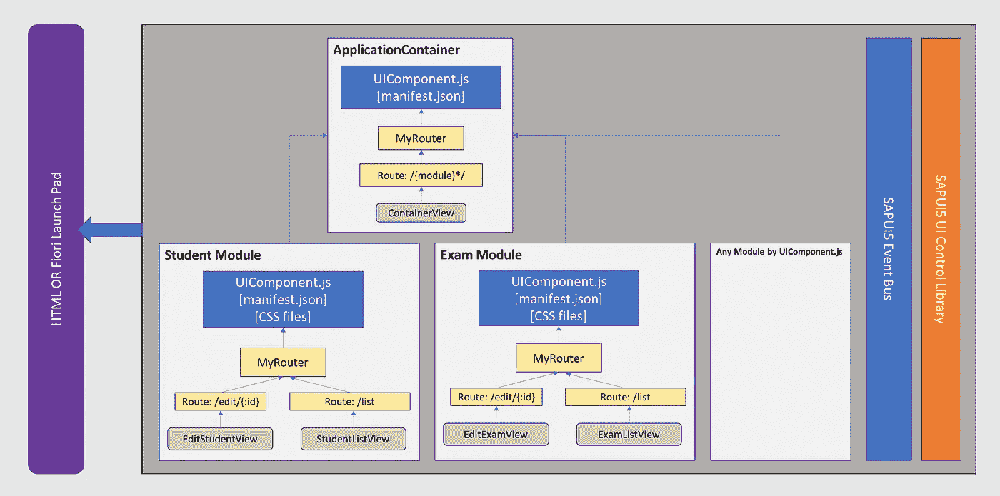
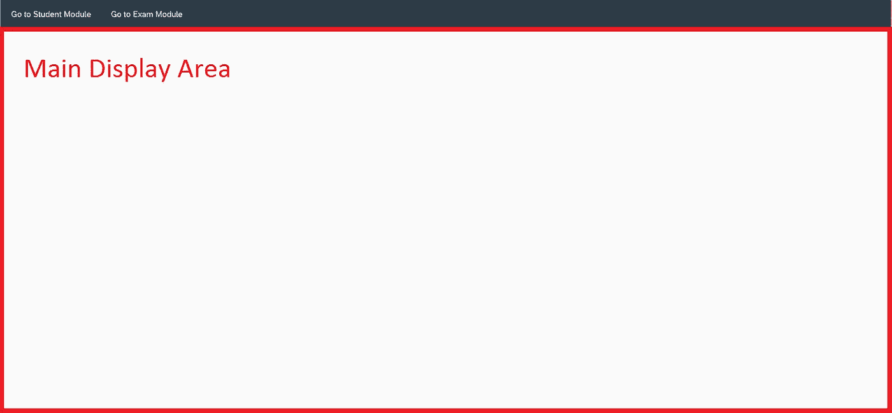

# SAP UI5 中的大规模前端架构和模块化设计

> 原文：<https://itnext.io/large-scale-front-end-architecture-in-sap-ui5-207ce0ddbe0?source=collection_archive---------5----------------------->

简单介绍一下我，我是 SAP 的首席前端开发人员。在我的职业生涯中，我参与了许多大型复杂的前端应用。几年前，我开始了 SAP UI5 之旅。欢迎你在 LinkedIn[https://www.linkedin.com/in/haojia](https://www.linkedin.com/in/haojia)和 GitHub [haojia321](https://github.com/haojia321) 上关注我。

今天，我想分享一些我在设计大规模前端架构以及如何在 SAP UI5 中实现它方面的经验。所以会有两个话题:1。大规模前端架构的总体设计。2.如何在 SAP UI5 中实现？

## 第一部分。大规模前端架构的总体设计

所有好的应用程序应该:

1.  易于修改和扩展。
2.  便于多个团队同时工作，而不用担心弄乱应用程序的其他部分。
3.  易于人们理解的设计。

我通过将应用分成多个**模块**和**将应用逻辑抽象**到不同层来实现。

[**模块化设计**](https://en.wikipedia.org/wiki/Modular_design#In_computer_hardware) 在我们的日常生活中无处不在。我想以模块化硬件计算机为例:



计算机硬件的模块化设计

电脑机箱内有很多组件:CPU、硬盘、显卡和散热风扇等。如果我认为 CPU 是我的电脑的性能瓶颈，我可以简单地买一个更好的 CPU 来取代旧的。那简单又快速。我不需要担心它会损坏电脑的其他组件。现在回到我们的前端世界。我如何确定应该把哪些部分放入一个模块中？嗯，这要视情况而定，但是我的指导方针是你应该把那些密切相关的 UI 页面合并到一个模块中。图表应该是这样的:



前端应用中的模块化设计



可重用 UI 组件

*   应用程序容器根据需要创建和呈现其他模块。应用程序容器只做这个，不做别的。
*   每个模块不应该知道彼此。
*   应该有一个全局级的 EventBus 通信机制。每个模块只能通过 **EventBus** 进行通信。
*   与模块化设计相比，UI 组件粒度更小。UI 组件应该是可以跨所有模块重用的通用 UI 元素。它可以是一个按钮，列表或警告弹出窗口等。这里有一个关于 [*UI 组件*](https://guide.meteor.com/ui-ux.html#components) 的很好的指南。

## 第二部分。如何在 Open UI5 或 SAP UI5 中实现


打开 UI5

本部分的先决条件是你应该对 open UI5 或 SAP UI5 框架有基本的了解。如果你不知道，我强烈建议你先停下来查看一下 [*打开 UI5*](http://openui5.org/) *文档。*

**2.1 概述**



UI5 中的大规模架构

[我在 github 中创建了一个演示来演示实现](https://github.com/haojia321/modular-design-in-sap-ui5)。在这个演示中，我创建了 ApplicationContainer 模块和两个子模块，Student 和 Exam。

*   学生模块有两个页面:编辑学生和搜索学生。
*   考试模块有两个页面:编辑考试和搜索考试。
*   ApplicationContainer 有一个菜单栏和主显示区。
*   ApplicationContainer 只有一个路由模式:“{module}&:all*:”。它将适合所有的页面。它所做的就是根据需要加载模块，并将模块渲染到相应的 UI 区域。
*   用户点击菜单栏中的链接后，每个模块将根据需要呈现在主显示区域中。
*   为了简化演示，主显示区每次只能显示一个模块。其他模块可以呈现在主显示区域，但是它们将被隐藏。



演示的用户界面

**2.2 如何构建模块**

UI5 推荐使用 UIComponent.js 和 manifest.json 来设置项目。我的实现遵循它。**【注:UI5 中的 UIComponent.js 与我们在第 1 部分提到的 UI 组件设计是不同的概念。相应的术语在 UI5 中称为 UI 控件。SAP UI5 有一个非常健壮的** [**UI 控件库**](https://openui5.hana.ondemand.com/#/controls) **。]**

我利用 UIComponent.js 实现了一个模块设计。UIComponent.js 的好处是:

*   它在框架层次上与其他模块相隔离。
*   它可以像插入/拔出 USB 驱动器一样轻松更换。
*   每个模块加载自己的 css 文件和 i18n 标签。
*   每个模块捆绑自己的资源文件，带来更好的网络性能。
*   每个模块都可以单独测试。

**2.3 如何在 ApplicationContainer 中渲染显示模块**

我创建了一个 ComponentLoader 控件。ApplicationContainer 组成 ComponentLoader。它使用 ComponentLoader 将相应的组件呈现和显示到特定的 DIV/control 中。请检查我的演示代码了解更多细节。

**2.4 导航**

UI5 使用路由模式来表示浏览器 url 地址。让我们仔细看看路线模式:

*   学生模块有 2 条路线，模式是:“编辑/{id}”和“学生搜索”。
*   考试模块有 2 条路线，模式为:“编辑/{id}”和“搜索”。
*   ApplicationContainer 只有一种模式“{module}&:all*:”

如您所见，学生和考试模块都有路由模式“edit/{id}”。因此，当您在浏览器 url 地址栏中输入“edit/{id}”时，ApplicationContainer 不知道应该选择哪个模块并进行初始化。那么我们如何解决这个问题呢？我想出了以下一些方法:

**方法 1:** [根据 SAPUI5 文档](https://openui5.hana.ondemand.com/#/topic/2c66fb3eb775426087401117cfa6a94e)，可以在模块路由配置文件中定义一个父路由。但是这不是一个好主意，因为这个模块将与一个特定的父模块耦合。这将限制模块的可重用性。子模块(学生和考试模块)不应该知道父模块(应用程序容器)。

**方法 2(演示使用了这种方法):**

所以我创建了一个名为 ModularRouter 的新路由器，它是从 sap.m.routing.Router 扩展而来的。

1.  ModularRouter 在运行时向模块的路由模式添加前缀。前缀值由模块的创建者传递，在本例中是 ApplicationContainer。
2.  ModularRouter 接受一个回调函数，该函数将在路由器初始化后被调用。当您在创建了一个模块并呈现到页面中之后想要做一些事情时，这非常有用。

让我们来看看 application container manifest . JSON:

```
"sap.ui5": {
    "_version": "1.1.0",
    ***"componentUsages": {
        "student": {
            "name": "com.haojia.test.student",
            "componentData": {
                "routePatternPrefix": "student&/"
            }
        },
        "exam": {
            "name": "com.haojia.test.exam",
            "componentData": {
                "routePatternPrefix": "exam&/"
            }
        }
    }***,
    "dependencies": {
        "minUI5Version": "1.30",
        "libs": {
            "sap.m": {}
        },
        ***"components": {
            "com.haojia.test.student": {}
        }***
    },
    "rootView": "com.haojia.test.applicationContainer.view.App",
    "routing": {
        "config": {
            "routerClass": "com.haojia.test.util.ModularRouter",
            "viewType": "XML",
            "viewPath": "com.haojia.test.adminLayout.view",
            "transition": "show",
            "controlId": "app",
            "clearTarget": true,
            "controlAggregation": "pages"
        },
        "routes": [{
            "name": "App",
            ***"pattern": "{module}&:all*:"***
        }]
    }
}
```

注意粗体的文字。作为父模块，它将学生模块定义为依赖模块。并通过 [componentData](https://openui5.hana.ondemand.com/#/api/sap.ui.core.Component/methods/getComponentData) 传递 routePatternPrefix。通过这样做，我们可以动态地向路由模式添加前缀，以解决多模块模式冲突问题。

每个模块都有自己的路由器和模式定义。但是浏览器的 url 栏对每个模块都是全局的。也就是说，一个 url 可以被多个模块匹配。所以模式 X 有可能同时被 ApplicationContainer 和 Student 模块匹配。为了利用这一点，ApplicationContainer 只有一个路由模式:“{module}&:all*:”。这是一个模糊模式匹配，将匹配每个模块。

我们举一个真实的 url 例子，假设浏览器地址栏中当前的 url 是[http://www . haojia . space #/student&/edit/ABC](http://www.haojia.space#/student&/edit/abc)

1.  因为 ApplicationContainer 的路由模式是“{module}&:all*:”，所以模式将匹配，并且{module}参数是“student”。ApplicationContainer 将基于{module}参数创建和呈现学生模块。
2.  然后创建学生模块。编辑路由模式是“edit/{id}”，但是由于我们在 manifest.json 中定义了***routePatternPrefix***，它的运行时路由模式现在是“student & /edit/{id}”。宾果，该网址将匹配编辑路线没有冲突了！

2.5 模块间的导航

模块互不认识。但是如果你需要从模块 A 导航到模块 B 呢？我们使用 SAP EventBus 进行跨模块通信。模块 A 将事件发布到 ApplicationContainer。然后，ApplicationContainer 相应地呈现目标模块 B。