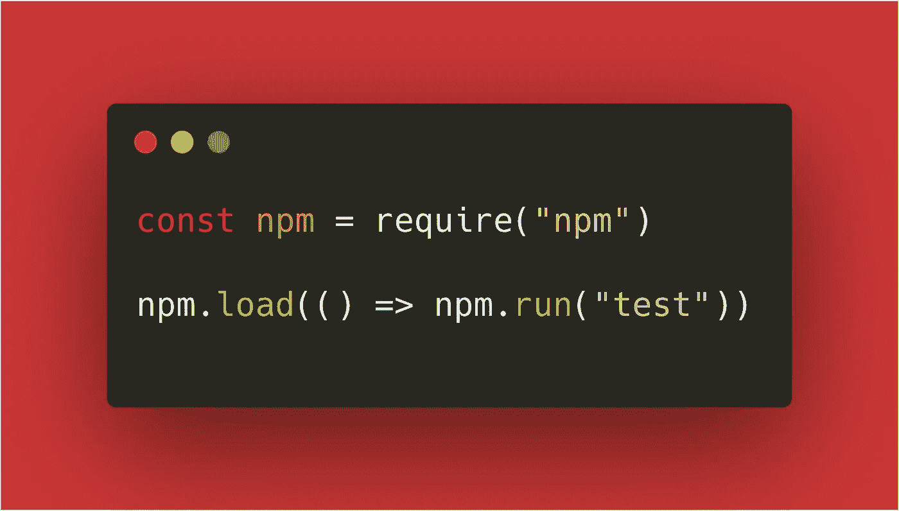
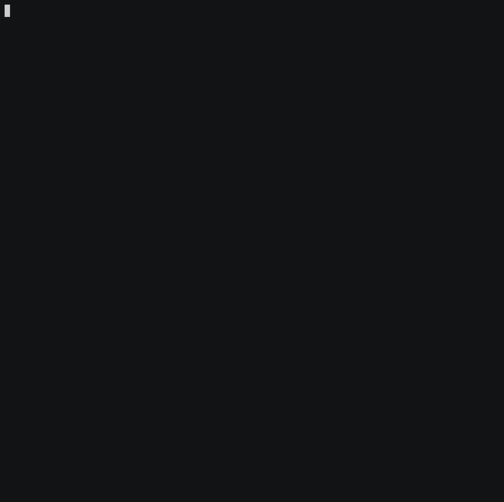

# 使用“npm.run()”以编程方式启动“$ npm run”

> 原文：<https://itnext.io/launching-npm-run-programmatically-with-npm-run-f2a1b8a569a6?source=collection_archive---------2----------------------->

不需要 *child_process.exec()* 等。*前期*和*后期*剧本也很受尊重。在 [dev.to](https://dev.to/noriste/launching-npm-run-programmatically-with-npm-run-3mmc) 上阅读此处。



*已弃用！请检查出* [*图*](https://fig.io/) *或* [*倪*](https://github.com/antfu/ni) *作为可能的替代品！*

# 我的问题

在开发 cypress-wait-until 库的时候，我想把测试视频上传到 cypress 仪表盘上。这样做非常简单，我只需要更新我的 package.json 专用脚本:

```
{
  "scripts": {
    // from
    "cy:run": "cypress run" // to
    "cy:run": "cypress run --record --key YOUR_SECRET_KEY"
  }
}
```

但是我不得不面对一个大问题:YOUR_SECRET_KEY 环境变量只能在 Travis 构建中使用，而不能在本地使用。如果您在本地机器上运行它，而没有定义 YOUR_SECRET_KEY， *cypress run* 命令就会失败。

有很多解决上述问题的方法(比如 *child_process.exec* )，但是所有的方法都有成本和一些需要管理的影响。更多:我还需要改变管理 package.json 脚本的方式。

我希望有一个**透明的解决方案**，允许我将 YOUR_SECRET_KEY 设置为可选的，但不改变我的脚本管理。

# 作为本地依赖项的 Npm

在谷歌搜索时，我发现了一个有趣的解决方案:在本地安装 Npm 并利用它的 API。工作原理:

*   首先，安装 npm

```
$ npm install --save-dev npm
```

*   然后，创建一个. js 文件

```
$ touch index.js && open index.js
```

*   导入 npm

```
const npm = require("npm");
```

*   让 npm 加载当前项目

```
npm.load();
```

*   向 *npm.load()* API 传递一个回调，并运行您的

```
npm.load(() *=>* npm.run("SCRIPT_NAME"));
```

关于 *npm.run()* API 的一些注意事项:

*   不提前调用 *npm.load* 就无法运行。如果您尝试这样做，您会得到一个“错误:在使用这个命令之前调用 npm.load(config，cb)”错误
*   第一个参数是脚本名，如果你需要传递一些选项，你必须传递一个字符串数组

```
npm.run("test param"); // Error: missing script: test paramnpm.run("test", "param"); // "param" is passed to the "test" script
```

*   [*前置*和*后置* package.json 脚本](https://docs.npmjs.com/misc/scripts)也被启动

我分享了一个[NPM-run-programmable-example](https://github.com/NoriSte/npm-run-programmatically-example)存储库，你可以在那里使用它，这里有一个存储库终端会话的 gif 记录:


你也可以在 [asciicinema](https://asciinema.org/) 上[观看同样的视频](https://asciinema.org/a/274563)。

# 该解决方案如何满足我的需求

我这样解决了原来的问题:

*   我增加了一个*cy:run-upload-videos*脚本来代替 *cy:run*

```
{
  "scripts": {
    "cy:run-uploading-videos": "node cypress-run.js",
    "cy:run": "cypress run"
  }
}
```

*   cypress-run.js 文件如下所示

```
const npm = require('npm');
npm.load(() => {
  const key = process.env.CYPRESS_RECORD_KEY;
  const options = key ? ['--record', '--key', key] : [];
  npm.run('cy:run', ...options);
});
```

因此，我可以在本地启动通常的 *cy:run* 脚本，并在 Travis 上启动*cy:run-uploading-videos*🎉(无需重复 *cypress run* 调用，该调用将来可能有更多参数)。

# 我可以用 npm.run()做什么？

我的一个想法是 [nprr](https://github.com/NoriSte/nprr) ，一个用自动完成增强 npm 运行的工具。当你不记得你想要运行的脚本的名字的时候，你有过这种感觉吗？于是你打开 package.json 文件，寻找脚本名然后运行……好了， [nprr](https://github.com/NoriSte/nprr) 解决了这个问题！观看它的运行:



你也可以在 [asciicinema](https://asciinema.org/) 上[看同样的视频](https://asciinema.org/a/274468)。

可能性是无限的，如果你以编程的方式利用 npm，请留下你的实验/包/工具等的评论。😊

你好👋我是 Stefano Magni，我是一名充满激情的 **JavaScript 开发人员**，一名 **Cypress 大使、**和一名**导师**。我喜欢创造高质量的产品，测试和自动化一切，学习和分享我的知识，帮助别人，在会议上发言和面对新的挑战。我在意大利比特币初创公司 [Conio](https://conio.com/it/?source=post_page---------------------------) 工作。
你可以在 [Twitter](https://twitter.com/NoriSte?source=post_page---------------------------) 、 [GitHub](https://github.com/NoriSte?source=post_page---------------------------) 、 [LinkedIn](https://www.linkedin.com/in/noriste/?source=post_page---------------------------) 上找到我。你可以找到我最近所有的文章/演讲等等。这里。