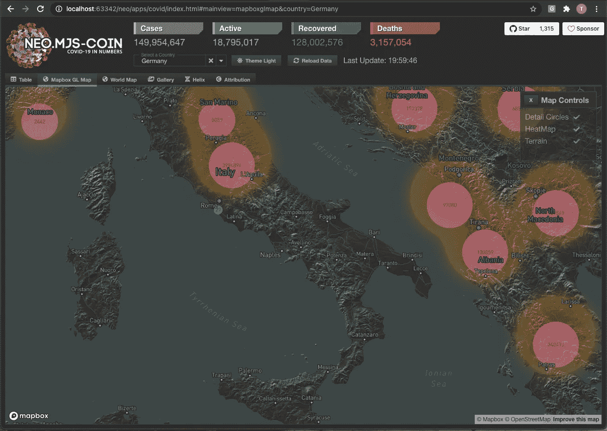
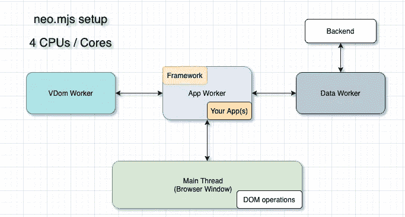

# 卡片布局项目和选项卡的惰性加载→ neo.mjs v2.0.10

> 原文：<https://itnext.io/lazy-loading-for-card-layout-items-and-tabs-neo-mjs-v2-0-10-2bd1c16cd458?source=collection_archive---------2----------------------->

虽然只呈现活动的卡片并有选择地从 DOM 中移除不活动的卡片同时保持它们的 JS 实例是不错的，但是在需要的时候延迟加载卡片的 JS 模块就更好了。

# 内容

1.  介绍
2.  问题是
3.  解决方案
4.  它是如何在引擎盖下工作的？
5.  让我们看看它的实际效果吧！
6.  在线演示
7.  接下来是什么？
8.  最后的想法

# 1.介绍

您现在很可能已经见过 Covid Dashboard 演示应用程序:



该应用程序在应用程序[工人](https://developer.mozilla.org/en-US/docs/Web/API/Worker)内部运行。所有组件都在那里。



因此，应用程序工作人员是主要参与者:

[](https://surma.dev/things/actormodel/) [## “一名演员、一名模特和一名建筑师走上网络……”-苏尔马·德夫

### 旧的都是新的。让我们从 70 年代拿一个并发模型，在 2017 年应用到 web 上。为什么？嗯…

surma.dev](https://surma.dev/things/actormodel/) 

# 2.问题是

这个应用的主要选项卡包含大量内容，因此根据需要为每个选项卡延迟加载相关的 JS 模块可以加快初始渲染。

虽然我们能够在视图控制器(不同的演示应用程序)中轻松地动态导入(延迟加载)JS 模块:

对卡片布局项目或标签做同样的事情实际上很棘手。

让我们来看看旧版本的 Covid Dashboard MainContainer:

我们在顶部有相当多的静态导入，它们被分配给每个选项卡的模块配置。

以前可以实现卡片的延迟加载，但这需要为每个标签添加一个虚拟组件，然后为您的`tab.Container`添加一个`activeIndexChange`监听器，并检查视图控制器内部被激活的标签是否是第一次被激活。如果是这样，延迟加载模块并替换组件。

是的…不太方便，所以需要一个通用的解决方案。

# 3.解决方案

让我们来看看**新**版本的 Covid Dashboard MainContainer:

每个选项卡顶部的静态导入都消失了。

而不是直接分配一个模块

```
module: TableContainer
```

我们现在可以选择为模块配置使用基于函数的值。

```
module: () => import('./TableContainer.mjs')
```

您可能想知道为什么我们存储整个导入语句，而不仅仅是路径。这是为了给 [webpack](https://github.com/webpack/webpack) 一个公平的机会来计算出所需的分割块。

我们现在可以使用`activeIndex: null`最初不渲染或延迟加载任何标签页主体。

# 4.它是如何在引擎盖下工作的？

大部分逻辑应用于[布局。卡片](https://github.com/neomjs/neo/blob/dev/src/layout/Card.mjs):

方法变成了`async`，所以我们可以使用:

```
module = await module();
```

对于基于功能的模块配置。一旦模块被加载，我们就创建一个实例并把它放到布局所有者的`items`数组和`vdom`配置中。

[选项卡。集装箱](https://github.com/neomjs/neo/blob/dev/src/tab/Container.mjs):

这种方法现在也被`async`采用。我们希望在触发`activeIndexChange`事件之前，等到卡片布局完成，并且有一个潜在的延迟加载。

为了支持惰性加载**初始**活动选项卡(例如，在 covid 应用程序中，初始活动索引依赖于路线)，我们不再检查在方法开始时`oldVaue !== undefined`是否存在。

covid 应用程序有一个边缘情况:当加载没有默认路线的应用程序时，主视图控制器现在会立即触发路线更改。在这个时间点上，`cardContainer`还不存在。

所以我认为在这里应用一个`constructed`监听器不会有什么坏处，因为你可能也会这么做。

[集装箱。底座](https://github.com/neomjs/neo/blob/dev/src/container/Base.mjs):

这里的线索是:

```
if (!lazyLoadItem) {
    item = ***Neo***[item.className ? 'create' : 'ntype'](item);
} else {
    item.vdom = {removeDom: true};
}
```

如果我们延迟加载一个项目，我们添加一个只包含`removeDom`标志的对象作为`vdom`。

`removeDom`旗帜是 [neo.mjs](https://github.com/neomjs/neo) 项目最强大的方面之一。我们可以动态地将它分配给虚拟 dom 中任何级别的任何节点。通过这样做，这个节点将从真正的 DOM 中删除，同时保持`vdom`的内部结构不变。

对于我们的`tab.Container`示例:如果我们将索引更改为例如 3，我们可以确定该索引处的`vdom`项目是我们想要更改的项目。如果我们不从 DOM 中移除不活动的卡片(卡片布局有一个`removeInactiveCards`配置)，不添加占位符会导致卡片项目比标签标题按钮少。

这面旗帜确实在很多地方被使用。也许最明显的例子是:一个按钮有一个`iconCls`和一个`text`配置。如果没有设置`iconCls`，相关的`vdom`节点将获得`removeDom`标志。因此，当我们更改`text`配置时，我们可以确保它匹配按钮的第二个虚拟子节点。如果没有`iconCls`，我们将从`vdom`中删除虚拟节点本身，那么`text`配置的每次更改都必须检查第一个子节点是否是图标或标签。

您的组件越复杂，这个标志就越强大。

# 5.让我们看看它的实际效果吧！

下面是开发模式版本的视频。在这种模式下，我们运行真正的代码，没有任何构建或编译，所以我们可以看到每个模块文件都是自己加载的。调试的完美省时器。

这种模式在 Chrome、Edge 和几天前的 Safari(科技预览版)中都可以使用

[](https://levelup.gitconnected.com/safari-webkit-about-to-release-support-for-js-modules-inside-the-worker-scope-9dd33fc20190) [## Safari (Webkit)即将在 worker 范围内发布对 JS 模块的支持

### 这是让 UI 开发回到它该在的地方的一大步:浏览器。

levelup.gitconnected.com](https://levelup.gitconnected.com/safari-webkit-about-to-release-support-for-js-modules-inside-the-worker-scope-9dd33fc20190) 

dist/production build (webpack)显然适用于所有主流浏览器。

我刚刚注意到，动态加载的 JS 分割块不再出现在“JS”或“XHR”下，而是出现在“其他”开发工具标签中。

老实说:我不知道这是否与 Chromium 或 webpack 的变化有关。感觉就是不对。

# 6.在线演示

这个演示不是为手机而精心制作的。桌面谢谢。

开发模式(Chromium 或 Safari Tech 预览版)
[neo.mjs/apps/covid/](https://neomjs.github.io/pages/node_modules/neo.mjs/apps/covid/index.html#mainview=helix)

分销/生产(所有主要浏览器)
[neo.mjs/dist/production/apps/covid/](https://neomjs.github.io/pages/node_modules/neo.mjs/dist/production/apps/covid/index.html#mainview=helix)

# 7.接下来是什么？

由于 Covid Dashboard 现在使用新的延迟加载技术，独立回购也需要进行调整。

相同的变化应适用于多窗口 covid 应用程序(框架和独立回购版本)

我还想增强现实世界演示应用程序(再次 2 个版本)。

之后，我对想法持开放态度。

您可以在版本 2 发布公告中找到潜在的路线图项目:

[](/the-webworkers-driven-ui-framework-neo-mjs-version-2-release-announcement-b91b476d6f16) [## webworkers 驱动的 UI 框架 neo.mjs 第 2 版发布公告

### 新产品的概念必须是颠覆性的，否则就没什么必要。然而，使用它们的方法…

itnext.io](/the-webworkers-driven-ui-framework-neo-mjs-version-2-release-announcement-b91b476d6f16) 

本文里面提到:
**欢迎你来影响路线图！**

# 8.最后的想法

您可以在此处找到 neo.mjs 项目:

[](https://github.com/neomjs/neo) [## 近地天体

### neo.mjs 使您能够使用一个以上的 CPU 创建可扩展的高性能应用程序，而无需使用…

github.com](https://github.com/neomjs/neo) 

该框架以及所有演示应用程序都是开源的→麻省理工学院许可的。

一些开发人员向我提出了一个问题:

“鸢，你在独自推动这个项目，因为它在财务上不可持续，你甚至不能全职做这个项目。
它到底怎么会进化得这么快？”

我的回答总是一样的:
“没有 XML。实际上没有。一切都是基于 JSON 的。就这么简单。”

**想一想。**

问候&快乐编码，
托拜厄斯