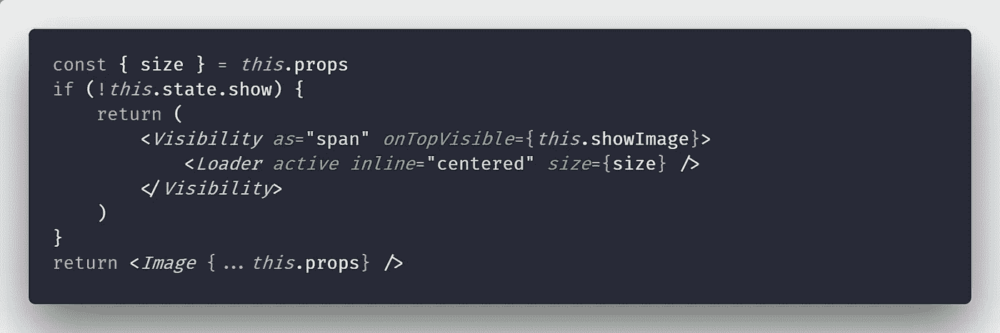

# 使用 React 和语义 UI 延迟加载图像

> 原文：<https://itnext.io/lazy-loading-images-with-react-and-semantic-ui-28a780bb3b3a?source=collection_archive---------5----------------------->



图片构成了网站内容的大部分，因此在页面加载时间中起着很大的作用。这对于像现在大多数登陆页面一样的单页面网站来说尤其成问题。这个问题的解决方案是*延迟加载图像*，即文件夹下的图像*稍后异步加载。延迟加载有两种主要方式:*

1.  延迟加载图像，直到上述文件夹内容被加载，然后加载所有图像
2.  延迟加载图像，直到它出现在用户的视窗中

使用[语义 UI](https://semantic-ui.com/behaviors/visibility.html#lazy-loading-images) ，当图像在视窗中时，延迟加载图像真的很容易:改为将图像`src`定义为`data-src`，然后给图像附加一个可见性处理程序:

```
$('.demo.items .image img')
  .visibility({
    type       : 'image',
    transition : 'fade in',
    duration   : 1000
  })
;
```

使用 React 和它的 [React 语义 UI 端口](https://react.semantic-ui.com)延迟加载图像有点不同，因为我们不会使用`jQuery`，而是使用 React 组件。我们可以创建一个`LazyImage` React 组件，当图像在视口中时加载它。为此，我们使用了`Visibility`组件，当组件的顶部边缘在视口中时，它有一个回调函数:

```
import PropTypes from 'prop-types'
import { Visibility, Image, Loader } from 'semantic-ui-react'

export default class LazyImage extends React.Component {
    static propTypes = {
        src: PropTypes.string.isRequired,
        size: PropTypes.string,
    }

    static defaultProps = {
        size: `medium`,
    }

    state = {
        show: false,
    }

    showImage = () => {
        this.setState({
            show: true,
        })
    }

    render() {
        const { size } = this.props
        if (!this.state.show) {
            return (
                <Visibility as="span" onTopVisible={this.showImage}>
                    <Loader active inline="centered" size={size} />
                </Visibility>
            )
        }
        return <Image {...this.props} />
    }
}
```

用法与[语义 UI React 的图像](https://react.semantic-ui.com/elements/image)组件完全相同，我们只是将`props`转发给它:

```
<LazyImage
    src="https://source.unsplash.com/random/400x300"
    size="mini"
    rounded
/>
```

如果图像不在视窗中，我们渲染一个`Loader`。你可能想知道为什么我们要这样做，因为如果图像不在视窗中，根据定义*它是不可见的*，我们渲染什么作为它的占位符并不重要。这在理论上是正确的，但是我注意到当图像在初始视口中并且使用服务器端渲染时，你仍然可以看到一个`Loader`。服务器将为`Loader`提供服务，这需要几分之一秒的时间，直到应用程序被重新水合并且`Visibility`处理程序被连接。

最初发布于 [cmichel.io](https://cmichel.io/lazy-load-images-with-react/)

