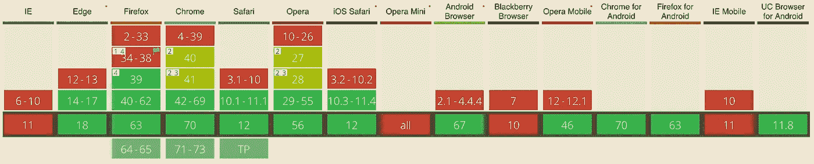

# 使用 WebPack 和动态导入延迟加载聚合填充

> 原文：<https://itnext.io/lazy-loading-polyfills-4b85c4951e73?source=collection_archive---------1----------------------->


[形象信用](https://medium.com/beginners-guide-to-mobile-web-development/introduction-to-polyfills-their-usage-9cd6db4b1923)

我们都喜欢 ES6，有了 [Babel](https://babeljs.io) ，我们能够在还不支持它的浏览器中使用最新的语法。然而，一些浏览器不仅缺乏对最新语法的支持，而且还缺乏一些更新的功能，这些功能是 Babel 无法通过简单的代码转换来添加的。

这种特性的一个很好的例子是异步的`[fetch](https://caniuse.com/#feat=fetch)`，这在例如 IE 11 中是不可用的。



在这种情况下，我们需要导入一个库，只有在不支持它的浏览器中运行时，它才会添加一个缺失的特性。这种常见的技术被称为[聚合填充](https://en.wikipedia.org/wiki/Polyfill_(programming))。

对于`fetch`有一个很好的聚合填充，叫做`[whatwg-fetch](https://www.npmjs.com/package/whatwg-fetch)`，所以在这种情况下我们通常会做的是安装包:

```
npm i --save whatwg-fetch
```

然后在入口文件(`index.js`)中引用它，以确保它在应用程序的其余部分加载之前执行:

```
import 'whatwg-fetch'
```

这样我们不需要在任何其他模块中引用它，并且当浏览器已经本地支持`fetch`时，包本身什么也不做。

# 绩效

这对你的应用性能有什么影响？`whatwg-fetch`包大约是 8k (3k gzipped)，所以很可能不会有很大的影响，但仍然需要所有浏览器进行不必要的加载和处理，这感觉有点浪费。

值得庆幸的是 ES6 [**动态导入**](https://github.com/tc39/proposal-dynamic-import) 提议(这里也可以阅读)，加上 Webpack 分块，非常方便，允许我们只在真正需要的时候懒惰地加载这些依赖项。

换句话说，动态导入不是引用一个模块，而是返回一个`Promise`，一旦模块被完全加载，它就会被满足:

```
import('module/path/file.js')
  .then(someModule => someModule.foo())
  .catch((e) => console.error(e))
```

这允许我们等待执行应用程序的其余部分，直到惰性加载的模块完全可用。

# 惰性装填聚合填料

假设您的应用程序已经在使用 Webpack 和 babel，您需要做的第一件事就是在 Babel 中启用动态导入支持:

```
npm i --save-dev @babel/plugin-syntax-dynamic-import
```

然后将其添加到`babel.config.js`

```
plugins: [
  '@babel/plugin-syntax-dynamic-import'
]
```

我们现在可以只在需要的时候修改`index.js`和延迟加载`fetch` polyfill:

```
if (!window.fetch) {
  fetch.push(import(/* webpackChunkName: "polyfill-fetch" */ 'whatwg-fetch'))
}
```

Webpack 很聪明，知道当解析动态导入时，我们不需要立即使用这个文件。所以它会自动将它移到一个单独的块中。运行 build 后，我们将得到:

```
app.js
polyfill-fetch.js
```

使用`webpackChunkName`指令定义这个附加文件的名称，如果需要，我们可以将许多聚合填充组合成一个块。太棒了。

# 等待加载所需的聚合填料

然而，我们可能无法继续应用程序，直到这样一个多填充加载。假设我们的`index.js`看起来很受欢迎:

```
import 'whatwg-fetch'import app from './app.js'app()
```

现在，由于我们正在延迟加载`fetch`，我们将等到它可用:

```
import app from './app.js'const polyfills = []if (!window.fetch) {
  polyfills.push(import(/* webpackChunkName: "polyfill-fetch" */ 'whatwg-fetch'))
}Promise.all(polyfills)
  .then(app)
  .catch((error) => {
    console.error('Failed fetching polyfills', error)
  })
```

如果`polyfills`数组为空，将立即执行`app`。否则，对于缺少`fetch`的浏览器来说，它会一直等到加载完毕。

# 等一堆 polyfills

如果您需要等待一组聚合填充，您可能需要处理将它们加载到单独文件中的逻辑:

```
// polyfills/a.jsconst polyfillA = []if (*condition*) {
  polyfillA.push(import(/* webpackChunkName: "polyfill-a" */ 'a..'))
}export default polyfillA// polyfills/b.jsconst polyfillB = []if (*condition*) {
  polyfillB.push(import(/* webpackChunkName: "polyfill-b" */ 'b..'))
  polyfillB.push(import(/* webpackChunkName: "polyfill-b" */ 'c..'))
}export default polyfillB
```

然后可以连接成一个`polyfills/index.js`

```
import polyfillA from './a'
import polyfillB from './b'export default [
  ...polyfillA,
  ...polyfillB
]
```

并在`index.js`中并行加载

```
import polyfills from './polyfills'
import app from './app.js'Promise.all(polyfills)
  .then(app)
  .catch((error) => {
    console.error('Failed fetching polyfills', error)
  })
```

# 替代解决方案

最受欢迎的替代解决方案之一是 [polyfill.io](https://polyfill.io) 服务，它使用基于用户代理识别的服务器端特征检测。虽然也可以使用类似于本文中介绍的[客户端特性检测](https://polyfill.io/v2/docs/examples#feature-detection)。

使本解决方案更好的是:

*   完全受控的客户端功能检测
*   完全受控的 polyfill 库选择(和版本)
*   网络包摇树
*   纯粹使用您自己的域(以防 [polyfill.io](https://polyfill.io) 被您的客户端防火墙阻止)

# 结论

对于运行现代浏览器的大多数用户来说，将聚合填充拆分为单独的块有助于限制应用程序的大小。但仍能让老年人使用。

延迟并行加载 polyfills 限制了它们的负面影响，特别是对于 HTTP1.0，但是请记住，旧浏览器通常会一次下载大约 4 个 javascript 文件。

看看实施所述解决方案的[演示项目](https://github.com/pkuczynski/medium-lazy-load-polyfills)。

*感谢* [*马特恩*](https://medium.com/u/c8ff24782d8f?source=post_page-----4b85c4951e73--------------------------------) *对本文的校对。*