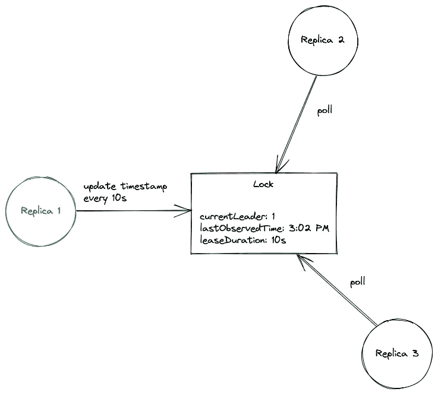

# 使用 client-go 在 Kubernetes 进行领导人选举

> 原文：<https://itnext.io/leader-election-in-kubernetes-using-client-go-a19cbe7a9a85?source=collection_archive---------0----------------------->

*如果你想了解领导人选举以及 Kubernetes 的工作方式，那么我希望这篇文章对你有用。在这篇文章中，我们将讨论高可用性系统中领导者选举背后的思想，并探索 kubernetes/client-go**库的* [*以在 Kubernetes 控制器的上下文中理解它。*](https://github.com/kubernetes/client-go)

# 介绍

随着对可靠系统和基础设施需求的增加，术语“高可用性”近年来越来越流行。在分布式系统中，高可用性通常处理最大化正常运行时间和使系统容错。高可用性中一个常见的实践是使用冗余来最大限度地减少单点故障。为冗余准备您的系统和服务可能就像在负载平衡器后面部署更多的 it 副本一样简单。虽然这种配置可以用于许多应用程序，但有些用例需要跨副本仔细协调，才能使系统正常工作。

一个很好的例子就是将 Kubernetes 控制器部署为多个实例。为了防止任何意外行为，领导者选举过程必须确保领导者在副本中被选出，并且是唯一主动协调集群的领导者。其他实例应该保持非活动状态，但准备好在主实例失败时接管。

# Kubernetes 的领导人选举

Kubernetes 的领导人选举过程很简单。它从创建一个锁对象开始，其中的领导者定期更新当前的时间戳，作为通知其他复制品关于其领导地位的一种方式。这个锁对象可能是一个`Lease`、`ConfigMap`或一个`Endpoint`，它也持有当前领导者的身份。如果领导者未能在给定的时间间隔内更新时间戳，则认为它已经崩溃，此时非活动副本通过用它们的身份更新锁来竞争获得领导权。成功获得锁的 pod 将成为新的领导者。



在我们处理任何代码之前，让我们先看看这个过程的运行情况！

第一步是建立一个当地的 Kubernetes 集群。我将使用[类型的](https://kind.sigs.k8s.io/docs/user/quick-start/)，但是你可以随意选择一个你喜欢的本地 k8s 发行版。

```
$ kind create cluster
Creating cluster "kind" ...
 ✓ Ensuring node image (kindest/node:v1.21.1) 🖼
 ✓ Preparing nodes 📦
 ✓ Writing configuration 📜
 ✓ Starting control-plane 🕹️
 ✓ Installing CNI 🔌
 ✓ Installing StorageClass 💾
Set kubectl context to "kind-kind"
You can now use your cluster with:kubectl cluster-info --context kind-kindNot sure what to do next? 😅  Check out [https://kind.sigs.k8s.io/docs/user/quick-start/](https://kind.sigs.k8s.io/docs/user/quick-start/)
```

我们将使用的示例应用程序可以在[这里](https://github.com/mayankshah1607/k8s-leader-election)找到。它使用 [kubernetes/client-go](https://github.com/kubernetes/client-go) 来执行领导者选举。让我们在集群上安装应用程序:

```
# Setup required permissions for creating/getting Lease objects
$ kubectl apply -f rbac.yaml
serviceaccount/leaderelection-sa created
role.rbac.authorization.k8s.io/leaderelection-role created
rolebinding.rbac.authorization.k8s.io/leaderelection-rolebinding created# Create deployment
$ kubectl apply -f deploy.yaml
deployment.apps/leaderelection created
```

这将创建一个包含 3 个单元(副本)的部署。如果您等待几秒钟，您应该会看到它们处于`Running`状态。

```
❯ kubectl get pods
NAME                              READY   STATUS    RESTARTS   AGE
leaderelection-6d5b456c9d-cfd2l   1/1     Running   0          19s
leaderelection-6d5b456c9d-n2kx2   1/1     Running   0          19s
leaderelection-6d5b456c9d-ph8nj   1/1     Running   0          19s
```

一旦您运行了您的 pod，让我们尝试查看他们作为领导者选举过程的一部分创建的`Lease`锁对象。

```
$ kubectl describe lease my-leaseName:         my-lease
Namespace:    default
Labels:       <none>
Annotations:  <none>
API Version:  coordination.k8s.io/v1
Kind:         Lease
Metadata:
...
Spec:
  Acquire Time:            2021-10-23T06:51:50.605570Z
  Holder Identity:         leaderelection-56457b6c5c-fn725
  Lease Duration Seconds:  15
  Lease Transitions:       0
  Renew Time:              2021-10-23T06:52:45.309478Z 
```

根据这一点，我们目前的领袖吊舱是`leaderelection-56457bc5c-fn725`。让我们通过查看 pod 日志来验证这一点。

```
# leader pod
$ kubectl logs leaderelection-56457b6c5c-fn725I1023 06:51:50.605439       1 leaderelection.go:248] attempting to acquire leader lease default/my-lease...
I1023 06:51:50.630111       1 leaderelection.go:258] successfully acquired lease default/my-lease
I1023 06:51:50.630141       1 main.go:57] still the leader!
I1023 06:51:50.630245       1 main.go:36] doing stuff...# inactive pods
$ kubectl logs leaderelection-56457b6c5c-n857k
I1023 06:51:55.400797       1 leaderelection.go:248] attempting to acquire leader lease default/my-lease...
I1023 06:51:55.412780       1 main.go:60] new leader is %sleaderelection-56457b6c5c-fn725# inactive pod
$ kubectl logs leaderelection-56457b6c5c-s48kx
I1023 06:51:52.905451       1 leaderelection.go:248] attempting to acquire leader lease default/my-lease...
I1023 06:51:52.915618       1 main.go:60] new leader is %sleaderelection-56457b6c5c-fn725
```

尝试删除 leader pod 来模拟坠机，如果选出了新的 leader，则检查`Lease`对象；)

# 深潜代码

> 这个项目的代码可以在[这里](https://github.com/mayankshah1607/k8s-leader-election)找到。

这里的基本思想是使用分布式锁定机制来决定哪个进程成为领导者。获得锁的进程开始执行所需的任务。`main`函数是我们应用程序的入口。这里，我们创建一个对 lock 对象的引用，并开始一个领导者选举循环。

[https://github . com/mayankshah 1607/k8s-leader-election/blob/master/main . go # L66-L95](https://github.com/mayankshah1607/k8s-leader-election/blob/master/main.go#L66-L95)

我们首先解析`lease-name`和`lease-namespace`标志来获取副本必须使用的锁对象的名称和命名空间。环境变量`POD_NAME`的值(填充在 [deploy.yaml](https://github.com/mayankshah1607/k8s-leader-election/blob/master/deploy.yaml#L26) 清单中)将用于识别`Lease`对象中的领导者。最后，我们使用这些参数创建一个锁对象来启动领导者选举过程。

在`runLeaderElection`函数中，我们通过调用`RunOrDie`来启动领导者选举循环。我们传递一个`LeaderElectionConfig`给它:

[https://github . com/mayankshah 1607/k8s-leader-election/blob/master/main . go # L41-L64](https://github.com/mayankshah1607/k8s-leader-election/blob/master/main.go#L41-L64)

现在，我们来看看`RunOrDie`在 client-go 中的实现。

[https://github . com/kubernetes/client-go/blob/master/tools/leader election/leader election . go # L218-L227](https://github.com/kubernetes/client-go/blob/master/tools/leaderelection/leaderelection.go#L218-L227)

它使用我们传递给它的`LeaderElectorConfig`创建一个`*LeaderElector`,并调用它的`Run`方法:

[https://github . com/kubernetes/client-go/blob/56656 ba 0 e 04 ff 501549162385908 F5 b 7d 14 F5 DC 8/tools/leader election/leader election . go # L200-L213](https://github.com/kubernetes/client-go/blob/56656ba0e04ff501549162385908f5b7d14f5dc8/tools/leaderelection/leaderelection.go#L200-L213)

此方法负责运行领导者选举循环。它首先试图获取锁(使用`le.acquire`)。成功后，它运行我们之前配置的`OnStartedLeading`回调，并定期更新租约。在获取锁失败时，它简单地运行`OnStoppedLeading`回调并返回。

实现`[acquire](https://github.com/kubernetes/client-go/blob/56656ba0e04ff501549162385908f5b7d14f5dc8/tools/leaderelection/leaderelection.go#L243)`和`[renew](https://github.com/kubernetes/client-go/blob/56656ba0e04ff501549162385908f5b7d14f5dc8/tools/leaderelection/leaderelection.go#L265)` 方法最重要的部分是对`[tryAcquireOrRenew](https://github.com/kubernetes/client-go/blob/56656ba0e04ff501549162385908f5b7d14f5dc8/tools/leaderelection/leaderelection.go#L317)`的调用，它持有锁定机制的核心逻辑。

## 乐观锁定(并发控制)

领导者选举过程利用了 Kubernetes 操作的原子性质，以确保没有两个副本可以同时获得`Lease`(否则会导致竞态条件和其他意外行为！).每当`Lease`被更新(更新或收购)时，上面的`resourceVersion`字段也会被 Kubernetes 更新。当另一个进程试图同时更新`Lease`时，Kubernetes 检查被更新对象的`resourceVersion`字段是否与当前对象匹配——如果不匹配，更新就会失败，从而防止并发问题！

# 摘要

在这篇文章中，我们讨论了领导者选举的概念，以及为什么它对于分布式系统的高可用性至关重要。我们看了一下这是如何在 Kubernetes 中使用`Lease`锁实现的，并尝试使用 [kubernetes/client-go](https://github.com/kubernetes/client-go/blob/master/tools/leaderelection/leaderelection.go) 库自己实现它。此外，我们还试图理解 Kubernetes 如何使用原子操作和乐观锁定方法来防止并发性引起的问题。

> 还请注意，这篇文章中使用的代码不是一个生产就绪的解决方案，它是为了以一种简单的方式演示领导者选举而编写的！

如果你觉得这篇文章有帮助，请考虑鼓掌并与你的朋友和同事分享。您可以在以下网址找到我:

*   推特—[https://twitter.com/mayankshah__](https://twitter.com/mayankshah__)
*   LinkedIn—[https://www.linkedin.com/in/mayankshah1607/](https://www.linkedin.com/in/mayankshah1607/)
*   GitHub—[https://github.com/mayankshah1607](https://github.com/mayankshah1607)

*感谢您花时间阅读本文！*

# 参考

*   [https://kubernetes . io/blog/2016/01/simple-leader-election-with-kubernetes/](https://kubernetes.io/blog/2016/01/simple-leader-election-with-kubernetes/)
*   [https://medium . com/hybrid-cloud-hobbist/leader-election-architecture-kubernetes-32600 da 81 e3c](https://medium.com/hybrid-cloud-hobbyist/leader-election-architecture-kubernetes-32600da81e3c)
*   [https://carlosbecker.com/posts/k8s-leader-election/](https://carlosbecker.com/posts/k8s-leader-election/)
*   [https://tae sunny . github . io/kubernetes/kubernetes-controllers-leader-election-with-go-library/](https://taesunny.github.io/kubernetes/kubernetes-controllers-leader-election-with-go-library/)