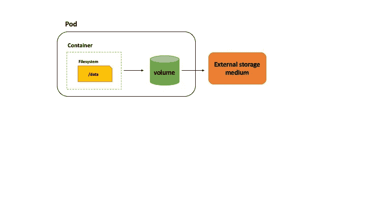

# 教程:Kubernetes 卷的基础(第 1 部分)

> 原文：<https://itnext.io/learn-about-the-basics-of-kubernetes-persistence-part-1-b1fa2847768f?source=collection_archive---------0----------------------->

我们继续我们的“果壳中的库伯内特”之旅，这一部分将涵盖库伯内特卷！

 [## “果壳中的库伯内特”——博客系列

### 本系列将涵盖 Kubernetes 的“广度”和核心/基础主题(见下一节)。它会…

medium.com](https://medium.com/@abhishek1987/kubernetes-in-a-nutshell-blog-series-c3a97fce9445) 

您将了解到:

*   概述`Volume`以及为什么需要它们
*   如何使用`Volume`
*   帮助探索`Volume`的实用实例


代码可从 GitHub 上的[获得](https://github.com/abhirockzz/kubernetes-in-a-nutshell/blob/master/volumes-1)

> *很高兴通过*[*Twitter*](https://twitter.com/abhi_tweeter)*获得您的反馈，或者发表评论！*

# 先决条件:

你将需要`minikube`和`kubectl`。

将`[minikube](https://kubernetes.io/docs/tasks/tools/install-minikube/)`作为单节点 Kubernetes 集群安装在您计算机上的虚拟机中。在 Mac 上，您可以简单地:

```
curl -Lo minikube https://storage.googleapis.com/minikube/releases/latest/minikube-darwin-amd64 && chmod +x minikubesudo mv minikube /usr/local/bin
```

安装`[kubectl](https://kubernetes.io/docs/tasks/tools/install-kubectl/)`与你的 AKS 集群交互。在 Mac 上，您可以简单地:

```
curl -LO https://storage.googleapis.com/kubernetes-release/release/$(curl -s [https://storage.googleapis.com/kubernetes-release/release/stable.txt)/bin/darwin/amd64/kubectl](https://storage.googleapis.com/kubernetes-release/release/stable.txt)/bin/darwin/amd64/kubectl)chmod +x ./kubectlsudo mv ./kubectl /usr/local/bin/kubectl
```

# 概观

存储在 Docker 容器中的数据是短暂的，也就是说，它只在容器存活之前存在。Kubernetes 可以重启一个失败或崩溃的容器(在同一个`Pod`中)，但是你最终仍然会丢失你可能已经存储在容器文件系统中的任何数据。Kubernetes 在`Volume` s 的帮助下解决了这个问题，它支持多种类型的`Volume` s，包括外部云存储(例如 [Azure Disk](https://azure.microsoft.com/services/storage/disks/?WT.mc_id=mediumblog-abhishgu) ，Amazon EBS，GCE 持久盘等。)、网络文件系统，如 Ceph、GlusterFS 等。以及其他选项，如`emptyDir`、`hostPath`、`local`、`downwardAPI`、`secret`、`config`等。

# 如何使用卷？

使用`Volume`相对简单——看看这个部分`Pod`规范作为例子

```
spec:
  containers:
  - name: kvstore
    image: abhirockzz/kvstore:latest
    volumeMounts:
    - mountPath: /data
      name: data-volume
    ports:
    - containerPort: 8080
  volumes:
    - name: data-volume
      emptyDir: {}
```

请注意以下事项:

*   `spec.volumes` -声明可用卷、其`name`(例如`data-volume`)和其他(卷)特定特征，例如在这种情况下，其指向 Azure 磁盘
*   `spec.containers.volumeMounts` -它指向在`spec.volumes`(例如`data-volume`)中声明的卷，并确切地指定它想要在容器文件系统中的什么位置挂载该卷(例如`/data`)。



一个`Pod`可以有多个`Volume`在`spec.volumes`中声明。这些`Volume`中的每一个都可以被`Pod`中的所有容器访问，但是并不是所有容器都必须挂载或使用所有的卷。如果需要，`Pod`中的容器可以将多个卷挂载到其文件系统的不同路径中。此外，不同的容器可能同时装载一个卷。

# 对卷进行分类的另一种方式

我喜欢把它们分为:

*   **短暂的** — `Volume`与`Pod`生存期紧密相关(如`emptyDir`卷)，即如果`Pod`被移除(出于任何原因)，它们将被删除。
*   **持久性** — `Volume`用于长期存储，独立于`Pod`或`Node`生命周期。在托管 Kubernetes 产品的情况下，这可能是`NFS`或基于云的存储，如 Azure Kubernetes 服务、Google Kubernetes 引擎等。

让我们以`emptyDir`为例

# 运行中的 emptyDir 卷

一个`emptyDir`卷开始是空的(因此得名！)并且本质上是短暂的，即只在`Pod`活着的时候存在。一旦`Pod`被删除，那么`emptyDir`数据也被删除。这在一些场景/需求中是非常有用的，比如临时缓存，一个`Pod`中多个容器的共享存储等等。

为了运行这个例子，我们将使用一个简单的、过于简化的键值存储，它为

*   添加键值对
*   读取键的值

> [*这里是代码*](https://github.com/abhirockzz/kubernetes-in-a-nutshell/blob/master/volumes-1/main.go) *如果你感兴趣的话*

# 初始部署


如果尚未运行，启动`minikube`

```
minikube start
```

部署`kvstore`应用程序。这将简单地创建一个带有一个应用实例(`Pod`)的`Deployment`和一个`NodePort`服务

```
kubectl apply -f [https://raw.githubusercontent.com/abhirockzz/kubernetes-in-a-nutshell/master/volumes-1/kvstore.yaml](https://raw.githubusercontent.com/abhirockzz/kubernetes-in-a-nutshell/master/volumes-1/kvstore.yaml)
```

> *为了简单起见，YAML 文件直接从*[*GitHub repo*](https://github.com/abhirockzz/kubernetes-in-a-nutshell)*中引用，但是你也可以把文件下载到你的本地机器上，以同样的方式使用它。*

确认它们已被创建

```
kubectl get deployments kvstoreNAME      READY   UP-TO-DATE   AVAILABLE   AGE
kvstore   1/1     1            1           28skubectl get pods -l app=kvstoreNAME                       READY   STATUS    RESTARTS   AGE
kvstore-6c94877886-gzq25   1/1     Running   0          40s
```

> 如果你不知道什么是 `*NodePort*` *服务，那也没关系——这将在后续的博客文章中介绍。暂时只理解为是一种访问我们 app 的方式(这里是 REST 端点)*

检查由`NodePort`服务生成的随机端口的值——您可能会看到与此类似的结果(使用不同的 IP、端口)

```
kubectl get service kvstore-serviceNAME              TYPE       CLUSTER-IP      EXTERNAL-IP   PORT(S)          AGE
kvstore-service   NodePort   10.106.144.48   <none>        8080:32598/TCP   5m
```

检查`PORT(S)`列以找出随机端口，例如，在这种情况下是`32598`(`8080`是我们的应用程序公开的容器内的内部端口——忽略它)

现在，您只需要使用`minikube ip`获得`minikube`节点的 IP 地址

> 如果你使用的是 VirtualBox 虚拟机，这可能会返回类似 `*192.168.99.100*` *的东西*

在随后的命令中，用 minikube 虚拟机 IP 替换`host`,用随机端口值替换`port`

创建几个新的键值对条目

```
curl http://[host]:[port]/save -d 'foo=bar'
curl http://[host]:[port]/save -d 'mac=cheese'
```

例如

```
curl http://192.168.99.100:32598/save -d 'foo=bar'
curl http://192.168.99.100:32598/save -d 'mac=cheese'
```

访问键`foo`的值

```
curl [http://[host]:[port]/read/foo](http://[host]:[port]/read/foo)
```

您应该会得到您为`foo` - `bar`保存的值。这同样适用于`mac`，即你将得到`cheese`作为它的值。程序将键值数据保存在`/data`中——让我们通过直接查看`Pod`中的 Docker 容器来确认这一点

```
kubectl exec <pod name> -- ls /data/foo
mac
```

`foo`、`mac`是以按键命名的单个文件。如果我们进一步挖掘，我们也应该能够确认它们各自的值

确认`mac`键的值

```
kubectl exec <pod name> -- cat /data/mac`cheese
```

正如所料，您得到了`cheese`作为答案，因为这是您之前存储的内容。如果你试图寻找一个你还没有存储的键，你会得到一个错误

```
cat: can't open '/data/moo': No such file or directory
command terminated with exit code 1
```

# 杀死容器；-)


好的，目前为止一切顺利！使用一个`Volume`可以确保数据在容器重启/崩溃时得到保存。让我们“欺骗”一下，手动杀死 Docker 容器。

```
kubectl exec [pod name] -- psPID   USER     TIME  COMMAND
  1   root     0:00 /kvstore
  31 root      0:00  ps
```

> *注意进程 ID 为* `*kvstore*` *的应用程序(应该是* `*1*` *)*

在不同的终端中，在 pod 上设置一个观察器

```
kubectl get pods -l app=kvstore --watch
```

我们杀死了我们的应用程序进程

```
kubectl exec [pod name] -- kill 1
```

你会注意到 Pod 会经历几个阶段(如`Error`等)。)然后返回到`Running`状态(由 Kubernetes 重新启动)。

```
NAME                       READY     STATUS    RESTARTS   AGE
kvstore-6c94877886-gzq25   1/1       Running   0         15m
kvstore-6c94877886-gzq25   0/1       Error     0         15m
kvstore-6c94877886-gzq25   1/1       Running   1         15m
```

执行`kubectl exec <pod name> -- ls /data`以确认尽管容器重启，数据实际上仍然存在。

# 删除 Pod！

但是数据不会在 Pod 的生命周期后继续存在。为了确认这一点，让我们手动删除`Pod`

```
kubectl delete pod -l app=kvstore
```

您应该会看到如下确认消息

```
pod "kvstore-6c94877886-gzq25" deleted
```

Kubernetes 将再次重启`Pod`。几秒钟后，您可以确认同样的情况

```
kubectl get pods -l app=kvstore
```

> *你应该会在* `*Running*` *状态下看到一个新的* `*Pod*`

*获取 pod 名称并再次查看文件*

```
*kubectl get pods -l app=kvstore
kubectl exec [pod name] -- ls /data/store*
```

*不出所料，`/data/`目录将为空！*

# *对持久存储的需求*

*简单的(短暂的)`Volume`与`Pod`同生共死——但是这对大多数应用程序来说是不够的。为了具有弹性、可靠性、可用性和可伸缩性，Kubernetes 应用程序需要能够跨 pod 作为多个实例运行，这些 pod 本身可能被调度或放置在 Kubernetes 集群中的不同节点上。我们需要的是一个稳定的、持久的存储，比运行 Pod 的`Pod`甚至`Node`更持久。*

*正如本博客开头所提到的，使用`Volume`很简单——不仅仅是像我们刚刚看到的那样的临时存储，甚至是长期的持久存储。*

*这里有一个(虚构的)例子，说明如何使用 [Azure Disk](https://azure.microsoft.com/services/storage/disks/?WT.mc_id=devto-blog-abhishgu) 作为部署到 [Azure Kubernetes 服务](https://azure.microsoft.com/services/kubernetes-service/?WT.mc_id=devto-blog-abhishgu)的应用程序的存储介质。*

```
*apiVersion: v1
kind: Pod
metadata:
  name: testpod
spec:
  volumes:
  - name: logs-volume
    azureDisk:
          kind: Managed
          diskName: myAKSDiskName
          diskURI: myAKSDiskURI
  containers:
  - image: myapp-docker-image
    name: myapp
    volumeMounts:
    - mountPath: /app/logs
      name: logs-volume*
```

*就这样吗？不完全是！😉这种方法有局限性。这一点以及更多内容将在本系列的下一部分讨论——敬请关注！*

**

*我真的希望你喜欢这篇文章，并从中学到了一些东西😃😃如果你做了，请喜欢并跟随！*