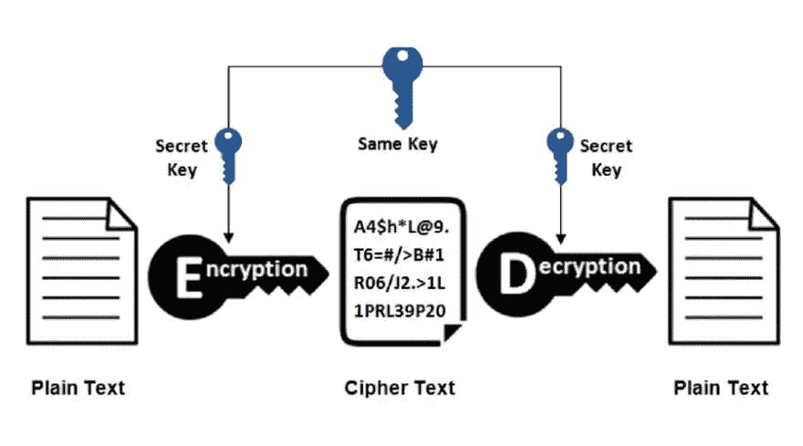
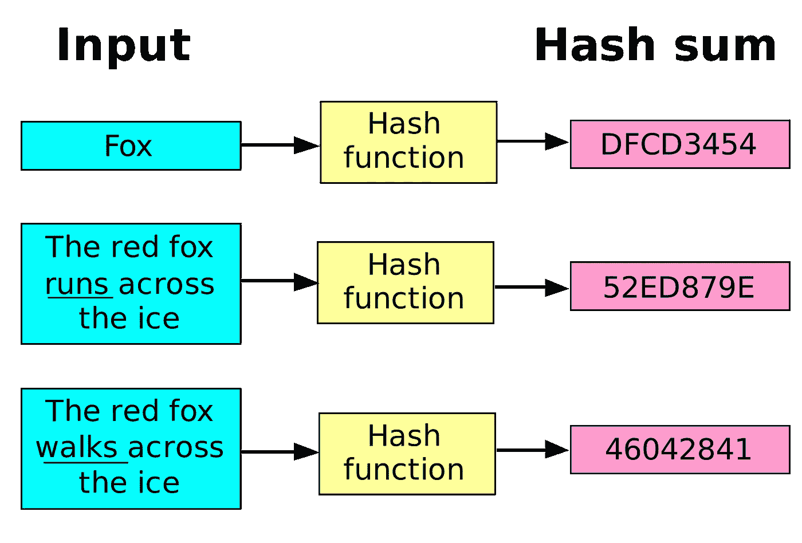
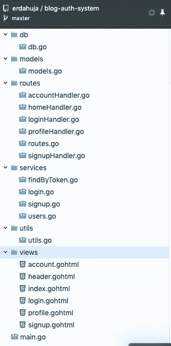
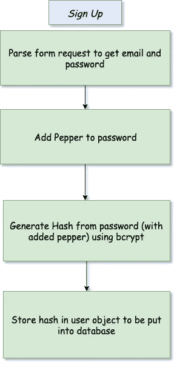
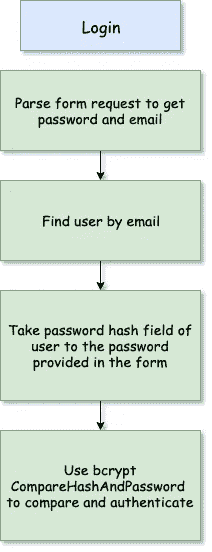
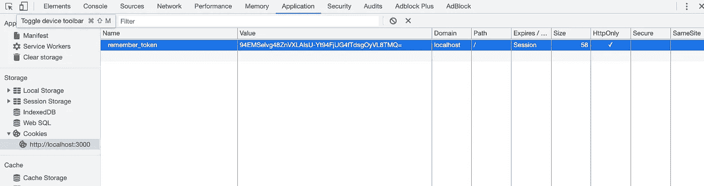

# 学习和建立网络认证系统(通用原则)

> 原文：<https://itnext.io/learn-and-build-web-authentication-system-universal-principles-f23438cd44d2?source=collection_archive---------5----------------------->


# 什么是认证？

服务器基本上是愚蠢的计算机程序，它们在服务一次后就不记得是谁和什么发出了请求。客户机和服务器之间通过 HTTP 模型的通信是[无状态的](https://developer.mozilla.org/en-US/docs/Web/HTTP/Overview#HTTP_is_stateless_but_not_sessionless)，因为如果没有某种认证，服务器无法为每个请求确认客户机(用户代理)的身份。此外，他们还背负着过多的责任，比如不向其他人展示你的个人 Twitter DM，记住你在亚马逊上添加到购物车的东西，保护你在 DEV 文章上的草稿不被其他人复制，防止你黑掉前任的脸书。所有这些都需要一种方式来告诉服务器你是谁，应该为你提供什么。

身份验证不仅仅是存储“用户电子邮件”。电子邮件和用户名是你在网上为自己创建的面向公众的数字身份。其他人也可以看到并使用它。因此，我们还使用密码和令牌来保护您的非公共资源。

# 密码

存储密码的最基本也是最不安全的方法就是按原样保存。保存后，您可以查询并匹配用户提供的密码。这种方法非常糟糕，因为密码可以通过网络窃取，也可以在数据库遭到黑客攻击时窃取。大多数人在多个服务上使用同一个密码，你可能会把所有的密码都暴露给在你的网站上注册的所有用户。

> *用明文存储密码是一种罪过。*”—j✝️**

*一种方法是**加密**密码，然后存储起来。*

**

**加密和解密**

1.  *您选择了一个密钥，您将使用该密钥混合密码来生成一个使用算法的随机字符串。*
2.  *这个密码(乱码文本)将被存储在数据库中。*
3.  *认证时:*

*   *您可以使用相同的密钥解密数据库中的密码，以生成一个值，并将其与用户提供的密码相匹配。*
*   *或者，您可以在输入时使用相同的密钥加密密码，并将其与数据库中存储的值进行匹配。*

*有许多加密算法可以作为 [go](https://golang.org/pkg/crypto/) 库使用。你可以在你选择的其他语言中找到相同的内容。这种方法的缺点是，如果你能解密出密码的原文，黑客也能。如果他们能够猜出一个密钥，那么您数据库中的每个其他用户也会受到威胁。*

# *散列法*

*使用散列函数可以在不解密口令的情况下比较用于认证的口令。哈希函数使用一些预定义的算法将随机长度的字符串转换为固定长度的字符串。*

**

*散列法*

1.  *与加密不同，哈希函数生成的文本是不可逆的。*
2.  *对于可变长度的输入，输出将是固定长度的。*
3.  *即使输入文本的微小变化也会产生完全不同的*散列*。*
4.  *对于相同的输入，生成相同的散列。我们可以用盐和胡椒来防止这种情况。*

# *盐和胡椒*

*在传递给哈希函数之前，我们需要在密码中添加一些字节。因为散列不能被解密，但是一个人仍然可以生成一个[彩虹表](https://en.wikipedia.org/wiki/Rainbow_table)，这是一个预先计算的常用密码及其散列函数的表。黑客可以将哈希值与数据库哈希值进行匹配，并能够说出密码。如果在保存哈希之前将唯一的随机字符串添加到密码中，这将被阻止。
`saltedhash(password) = hash(password || salt)`*

1.  *每个密码的 salt 都是唯一的。因此，所有的散列都是唯一的。*
2.  *salt 不是私有实体，它可以作为 hash 的一部分与 hash 一起保存，或者保存在不同的字段中。*
3.  *如果两个用户使用相同的密码，当添加 salts 时，他们生成的哈希将会不同。*

****Pepper*** 也是添加到密码中的随机字符串，它们与 salt 的不同之处在于，它们对每个用户都不是唯一的，它们在所有应用程序中都是相同的。它们不一定存储在数据库中。我们将在应用程序演示中使用它们作为环境变量。*

# *把手放在某物或者某人身上*

1.  *注册一个在线免费的 [postgres 数据库](https://www.elephantsql.com/)服务并获得`host, port, username, dbname and password`。*
2.  *在这里从 github [派生并克隆项目。](https://github.com/erdahuja/blog-auth-system)*
3.  *编辑数据库凭据(或使用提供的凭据)。*
4.  *运行在项目的根`go run main.go`。*
5.  *该项目包括主页，登录，注册，个人资料和帐户页面。要导航到个人资料和帐户页面，您需要一个令牌(稍后解释)。*
6.  *每次重启服务器时，数据库都会重置。你可以在根的`main.go`中注释掉 so 的代码`setUpDB`。*

**

*项目结构*

*为了理解散列的应用，我们首先需要像密码和密码散列这样的字段。*

# *用户模型*

> **gorm 标签(* `*gorm:"-"*` *)忽略密码字段，因为我们从不在数据库中存储密码。我们将存储明确定义的密码散列。**

# *注册流程*

**

*使用`[bcrypt.GenerateFromPassword(password, cost)](https://godoc.org/golang.org/x/crypto/bcrypt#GenerateFromPassword)`获得密码的散列值。第二个参数是成本，即散列密码所需的工作量。将来当计算机变得更强大时，这种情况就会改变。现在默认成本是 10。*

*登录服务*

*上面的代码片段使用了注册步骤。您可以在路径`/dev-blog/services/signup.go`的项目资源库中找到完整的工作。*

# *登录过程*

**

*使用`[bcrypt.CompareHashAndPassword(password, cost)](https://godoc.org/golang.org/x/crypto/bcrypt#CompareHashAndPassword)`将散列密码与其纯文本密码进行比较。*

*上面的代码片段使用了注册步骤。您可以在路径`/dev-blog/services/login.go`的项目库中找到完整的工作。*

# *Web 服务器是无状态*

*服务器独立处理每个请求。它不保存来自客户端请求的任何数据。每个请求都从服务器获得它所需要的一切，并得到响应。
如何让服务器记住你前段时间在网站上做了什么？坦率地说，我们没有。我们让客户在每个请求中告知他们是谁以及他们需要什么资源。浏览时每次登录都是一项繁琐的任务，因此在登录一次后，我们会登录一个 [**cookie**](https://dev.to/dpkahuja/!%5BCookie%5D(https://thepracticaldev.s3.amazonaws.com/i/p4rl31fjyk2yegfb536g.png)) (存储在计算机中的数据)，因此每次浏览一个网站时，浏览器都会将 cookie 和每个请求一起发送到链接的网站。我们将使用此 cookie 数据来验证用户。这个存储在 cookie 中的认证数据被称为一个`Remember Token`。我们之前已经在用户模式中添加了这一点。*

*记住令牌是一系列特定长度的随机字节。
我们使用以下代码片段创建它:*

```
*// GenerateRememberToken returns a 32 bytes random token string using
// crypto/rand packages
func GenerateRememberToken() string {
    // create a placeholder of 32 bytes (big enough)    
    b := make([]byte, 32) 
    _, err := rand.Read(b) // Fill it with random bytes
    Must(err)
    return base64.URLEncoding.EncodeToString(b) // encoded string
}*
```

*将该令牌添加到用户对象(RememberToken)的字段中，并保存到数据库。*

*以下代码片段有助于为网站设置 cookie。*

```
*cookie := http.Cookie{
        Name:     "remember_token",
        Value:    user.RememberToken,
        HttpOnly: true,
                Expires: time.Now().Add(24 * time.Hour),
    }
    http.SetCookie(w, &cookie)*
```

*在浏览器中看到 cookie 并修改它是非常容易的。为了保护我们的 cookie 不被临时修改，我们可以使用一些选项，比如 HttpOnly(不允许 javascript 修改 cookie)或者**而不是**以纯文本的形式存储记住的令牌。这是您的可编辑 cookie:*

**

*我们宁愿保存相同令牌的散列，并在每次请求时将它与 cookie 提供的令牌进行比较。
如果我们使用 bcrypt 散列，我们将:*

1.  *使用电子邮件从数据库中查找用户*
2.  *使用 salt 散列用户的密码，salt 是 PasswordHash 字段的一部分*
3.  *比较，但在记住令牌的情况下，我们无法从数据库中查找用户，因为我们没有在数据库中存储 remember token(只有它的散列)，我们需要一种方法来首先从 cookie 中散列值，然后找到用户。像 [crypto/hmac](https://golang.org/pkg/crypto/hmac/#New) 这样简单的散列函数就可以了。*

```
*// Hash generates hash for given input with secret key of hmac object
func Hash(token string) string {
       // sha256 is hashing algorithm
       // key can be taken from env variable too
    h := hmac.New(sha256.New, []byte("somekey"))
    h.Reset() // Clear previous leftover bytes
    h.Write([]byte(token))
    b := h.Sum(nil)
    return base64.URLEncoding.EncodeToString(b)
}*
```

**utils/utils.go**

*下面是我们将如何使用所有这些:*

*这些登录方法将在*登录*或*注册*后调用一次，一个记住令牌将作为 cookie 存储在浏览器中，其哈希版本将保存到数据库中。*

*现在，当用户访问个人资料或帐户等认证页面。我们可以使用令牌进入请求，并将其与存储在数据库中的散列版本进行比较。*

*因为我们知道在*中，散列*对于相同的输入字符串产生相同的输出。我们可以散列 cookie 中的记忆令牌并进行比较。*

*这些是构建认证系统的几个部分。完整的工作项目可在[这里](https://github.com/erdahuja/blog-auth-system)获得。这也有 go 中的 html 模板解析，我写了一个深入的指南[释放 SSR 的超能力](https://levelup.gitconnected.com/learn-and-use-templates-in-go-aa6146b01a38)(学习和使用 Go 中的模板)。*

*通过错误处理、每条路线的单独处理程序文件等，简化了项目结构以便于理解。谢谢你坚持到最后。*

**

*有不清楚的地方请随意评论或者在 [twitter](https://twitter.com/dpkahuja) 打个招呼。*

*我的另一项工作是[体验 Go 中的并发性](https://levelup.gitconnected.com/get-a-taste-of-concurrency-in-go-625e4301810f)*