# 通过互动游乐场学习 CSS Flexbox

> 原文：<https://itnext.io/learn-css-flexbox-with-interactive-playground-17bcf6aeb4b4?source=collection_archive---------1----------------------->


【https://unsplash.com/photos/dC6Pb2JdAqs 

如果您仍然使用浮动或表格来创建布局，可能您对 Flexbox 不太适应。在本文中，我们将使用一个交互式操场作为我们的实际例子。

布局非常直观——你必须使用所有这些属性来理解它是如何工作的。

我已经创建了[这个操场](http://flexbox.alexpermyakov.com)，我们将在演示中使用它。它包含了最小的属性集，但是一旦你掌握了它们，你就可以自己解决剩下的问题了。

我们将通过三个非常实际的使用案例来学习 Flexbox 的基础知识:

1.  导航栏。
2.  将任何内容垂直和水平居中。
3.  媒体对象。

# 1.导航栏

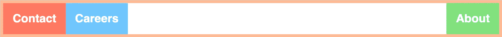

让我们为 navbar 创建一个典型的 HTML:

```
<div class="navbar">
  <div>Contact</div>
  <div>Careers</div>
  <div>About</div>
</div>
```

默认情况下，元素相互堆叠:


理解 Flexbox 有容器和项目的概念是很重要的。**通过对容器应用规则，它将改变其子容器的行为**。

使用 Flexbox 时，我们需要做的事情如下:

```
.navbar {
  display: flex;
}
```

它将立即改变项目的位置:

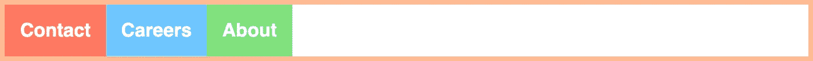

尽管它看起来很好很简单，但在实践中会引起巨大的混乱:你改变一个 CSS 属性，你的页面就会变成一堆窄栏。

为了理解它为什么这样工作，我们需要学习 Flexbox 的一个重要概念——主轴和横轴。一旦你知道它是如何工作的，你就不会再为 Flexbox 纠结了。

## 主轴和横轴。

当您应用`display: flex`时，Flexbox 额外应用另一个规则:`flex-direction: row`。

这将从左向右水平设置主轴**。**

如果我们想用 Flexbox，把元素放在对方身上呢？很简单，只要改变主轴的方向:

```
.navbar {
  display: flex;
  flex-direction: column;
}
```

我们开始吧:

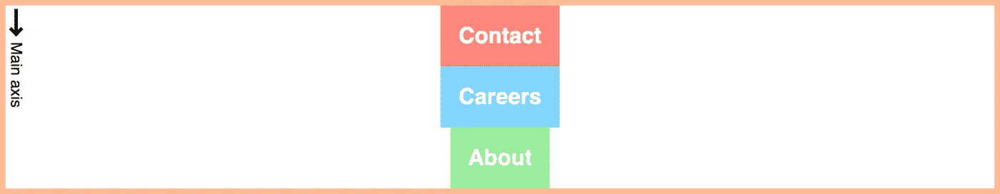

在图上，你可以看到主轴的方向。

`flex-direction: column`属性从上到下垂直设置主轴**。在[游乐场](https://flexbox.alexpermyakov.com/)中，你可以打开轴，玩其他游戏。**

[游乐场](https://flexbox.alexpermyakov.com/)也有每个属性的提示，包括名称和值:

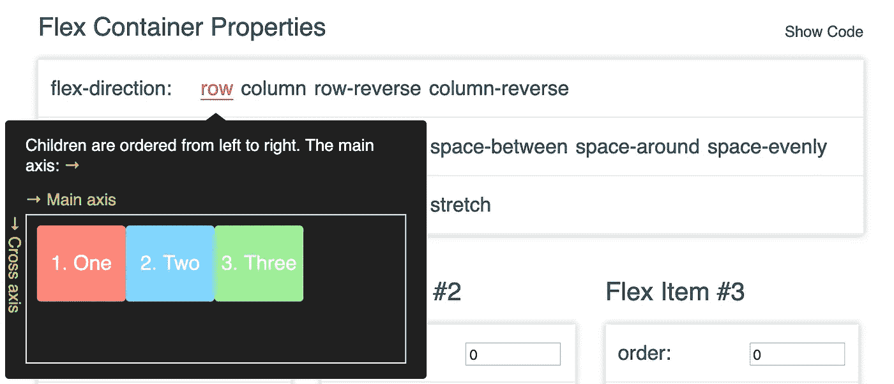

## 对齐内容

一旦我们知道主轴是什么，我们就可以沿着这个轴移动我们的项目。

justify-content 属性将项目沿主轴对齐。默认情况下，它有`justify-content: flex-start`值，将项目对齐到主轴的开始处。

让我们改变一下，让我们的项目沿着主轴居中:

```
.navbar {
  display: flex;
  flex-direction: row;
  justify-content: center;
}
```

很好地居中:

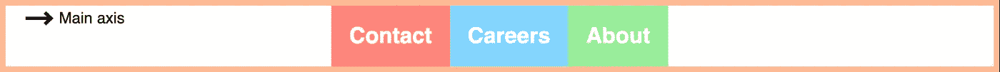

让我们将所有项目移至右侧:

```
.navbar {
  display: flex;
  flex-direction: row;
  justify-content: flex-end;
}
```

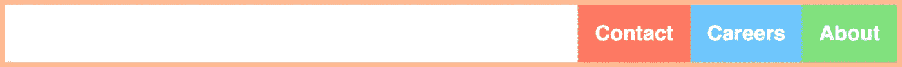

或者分配项目之间的空间:

```
.navbar {
  display: flex;
  flex-direction: row;
  justify-content: space-between;
}
```


最后一件事，如果我们想把`Contact`和`Careers`放在左边，而把`About`放在右边呢？只需使用`margin-left`:

```
.navbar {
  display: flex;
  flex-direction: row;
  justify-content: space-between;
}.navbar .about {
  margin-left: auto;
}
```

不要忘记 HTML 代码中该项目的`about`类。


在您继续之前，这是一个很好的时间去玩[我们的 flexbox 游乐场](https://flexbox.alexpermyakov.com/)，尝试重现上面所有的例子。

# 2.将任何内容垂直和水平居中

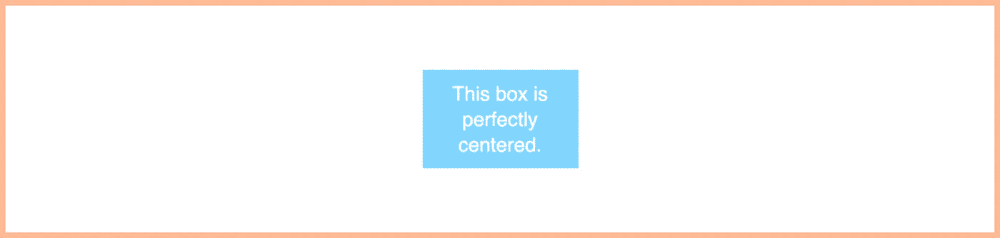

让我们为居中的框创建典型的 HTML:

```
<div class="box">
  <div>This box is perfectly centered.</div>
</div>
```

多年来，web 开发人员一直在努力完成这个如此简单的任务。CSS Flexbox 已经一劳永逸地解决了无论内容的高度或宽度，是内联还是块元素等等。

我们已经知道如何使用 justify-content 属性使内容沿主轴居中:

```
.box {
  display: flex;
  flex-direction: row;
  justify-content: center;
}
```

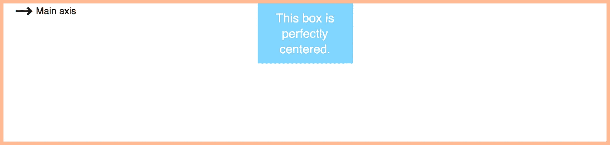

## 对齐项目

`flex-direction`设定主轴。实际上，它做得更多一点。它还设置了始终垂直于主轴的横轴。

**对齐项目类似于对齐内容，但它适用于横轴。**

我们可以通过使用`center`值来移动我们的盒子:

```
.box {
  display: flex;
  justify-content: center;
  align-items: center;
}
```

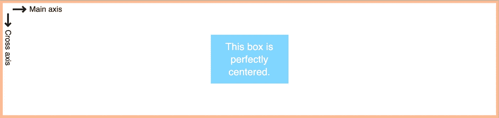

我们在这里说的是:Flexbox，水平和垂直居中。

# 3.媒体对象

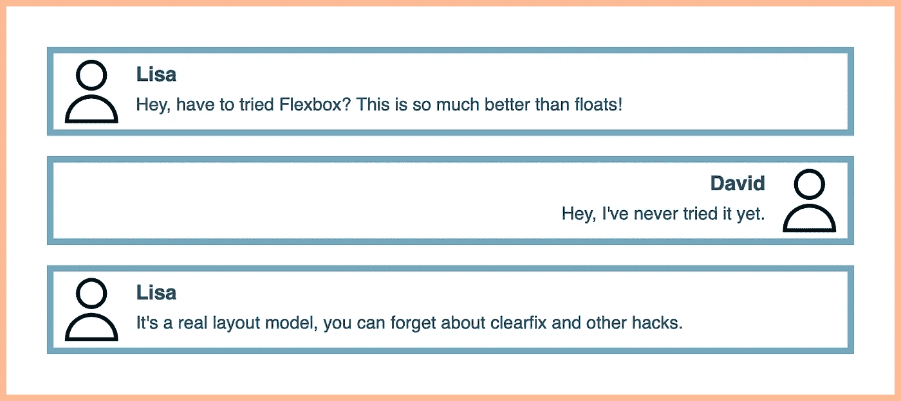

让我们为媒体对象创建典型的 HTML:

```
<div class="media-object">
  <div class="text">
    <h3>Liza</h3>
    <p>Hey, have to tried Flexbox? This is so much better than   floats!
   </p>
  </div>
</div>
```

在这一部分，我们将学习如何使用项目之间的剩余空间。当一些项目具有固定的大小，而另一个项目必须占用剩余的空间时，这一点非常重要。典型示例:

1.  媒体对象—图像具有固定的宽度，文本占据其余部分。
2.  页面布局—页脚和页眉具有固定的高度，主要区域占据其余部分。
3.  表单——标签需要多少就拿多少，输入需要剩余的。

在 Flexbox 时代之前，每个问题都应该有自己的文章。但是现在这么容易，简直可笑。所有这些不同的问题都可以用一行代码解决。

## flex 属性

如果我们想让一个元素占据整个可用空间，我们必须指定`flex`属性:

```
.media-object {
  display: flex;
}.media .text {
  flex: 1;
}
```

这么简单！

还有很大的改进空间。例如，如果我们开发一个聊天应用程序，我们希望交换每行上的图像和文本。

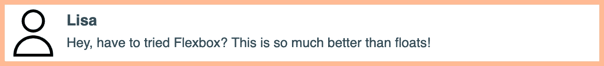

这是`order`属性的完美用例。注意，你不需要改变你的 HTML，只需要 CSS。

```
.media-object {
  display: flex;
}.media-object .text {
  flex: 1;
  text-align: right;
}.media-object .img {
  order: 1;
}
```

所有项目的默认`order`值等于 0。通过指定一个值，我们将项目进一步向主轴移动。

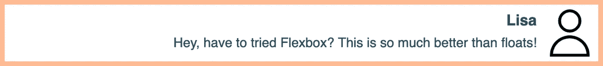

再说一次，它如此简单是因为 CSS Flexbox 旨在解决所有这些问题。

# 一次练习

使用[游乐场](https://flexbox.alexpermyakov.com/)中的`flex`和`order`属性。尝试创建一个响应式导航条，并改变`Products`和`About`项的顺序，如下图所示:

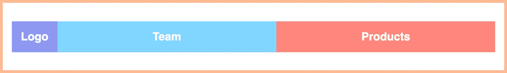

希望这篇文章能帮助你克服 CSS Flexbox 的学习曲线。你可以专注于创造一个更好的用户体验，而不是纠结于错误的浮动和位置绝对布局！

# 就是这样！

如果您有任何问题或反馈，请在下面的评论中告诉我，或者在 [Twitter](https://twitter.com/alex_permiakov) 上 ping 我。

## 如果这有用，请点击拍手👏下面扣几下，以示支持！⬇⬇ 🙏🏼

以下是我写的更多文章:

[](https://medium.freecodecamp.org/how-to-get-started-with-internationalization-in-javascript-c09a0d2cd834) [## 如何开始 JavaScript 的国际化

### 通过调整我们的应用程序以适应不同的语言和国家，我们提供了更好的用户体验。对用户来说更简单…

medium.freecodecamp.org](https://medium.freecodecamp.org/how-to-get-started-with-internationalization-in-javascript-c09a0d2cd834) [](https://medium.freecodecamp.org/15-useful-javascript-examples-of-map-reduce-and-filter-74cbbb5e0a1f) [## 如何用 JavaScript 中的 map()、reduce()和 filter()简化代码库

### 当你读到 Array.reduce 和它有多酷时，你发现的第一个，有时是唯一的例子是…

medium.freecodecamp.org](https://medium.freecodecamp.org/15-useful-javascript-examples-of-map-reduce-and-filter-74cbbb5e0a1f) [](https://medium.com/@alex.permyakov/production-ready-node-js-rest-apis-setup-using-typescript-postgresql-and-redis-a9525871407) [## 使用 TypeScript、PostgreSQL 和 Redis 设置生产就绪 Node.js REST APIs。

### 一个月前，我接到一个任务，要建立一个简单的搜索 API。它所要做的就是从第三方获取一些数据…

medium.com](https://medium.com/@alex.permyakov/production-ready-node-js-rest-apis-setup-using-typescript-postgresql-and-redis-a9525871407) 

感谢你阅读❤️