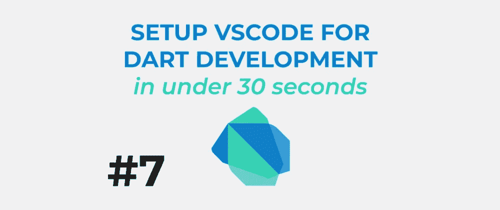

# 学习 Dart #7:在 30 秒内设置用于开发的 VSCode

> 原文：<https://itnext.io/learn-dart-7-setup-vscode-for-development-in-under-30-seconds-22884b37ec3?source=collection_archive---------3----------------------->

## 几个软件包使开发你的下一个应用成为可能

在今天的快速技巧中，我们将了解如何设置 Visual Studio 代码来构建您的 Dart 应用程序。这就像安装一些扩展一样简单，我们已经准备好了！

在下面的视频中了解更多信息:

→ [**在 YouTube 上观看**](http://bit.ly/2FpjFaw)

**订阅** [**我的 YouTube 频道**](http://bit.ly/2FpjFaw) **了解 Dart** 更多视频。谢谢！

**喜欢，分享** [**关注我**](https://twitter.com/creativ_bracket) 😍有关 Dart 的更多内容。

# 延伸阅读:

*   [**飞镖代码**—VS 代码](https://dartcode.org/)的飞镖和颤振支持
*   [**全栈 Web 开发带 Dart**](http://bit.ly/2FpjFaw)