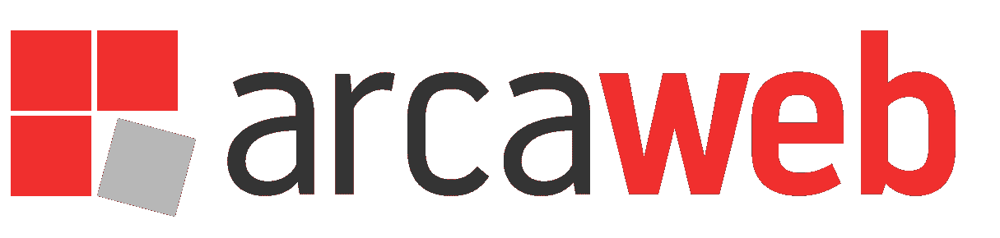
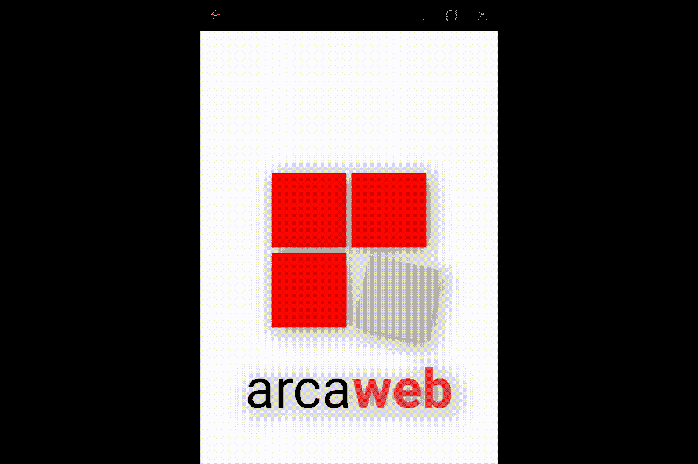
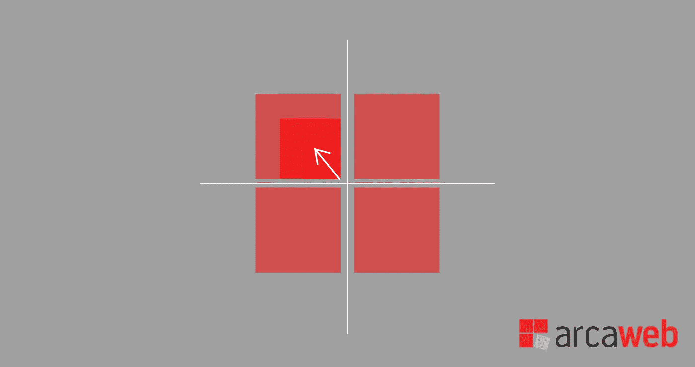
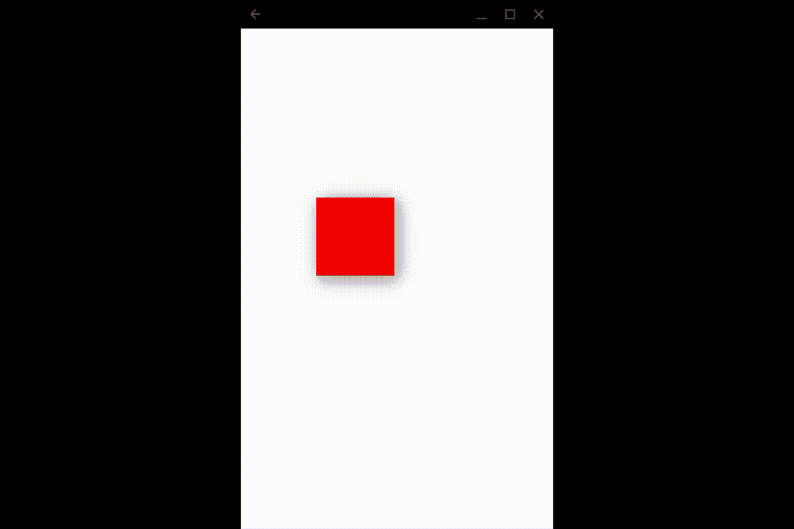
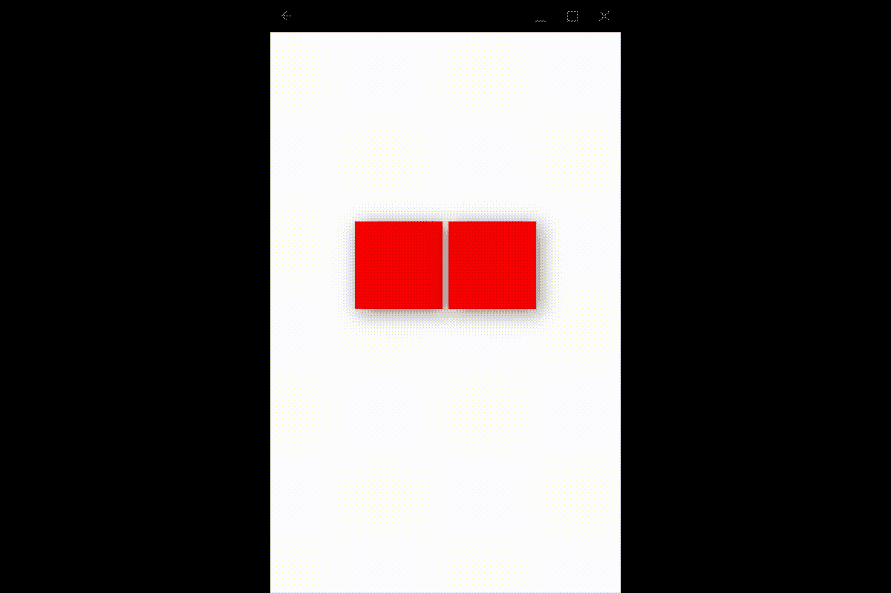

# 通过真实世界的例子学习复杂的动画[第 1 部分]

> 原文：<https://itnext.io/learn-flutter-complex-animations-with-a-real-world-example-part-1-906b60ecfa77?source=collection_archive---------2----------------------->


凯利·西克玛在 [Unsplash](https://unsplash.com?utm_source=medium&utm_medium=referral) 上的照片

在本教程中，我们将学习如何基于 Arcaweb 的徽标，使用 Flutter 构建一个复杂的动画。

[Arcaweb](https://www.arcaweb.ch/) 是一家瑞士公司，位于提契诺州 Agno 市中心，是瑞士科技界的活跃分子，为公司和初创企业开发软件解决方案。它的标志呈现三个红色方块和一个旋转的灰色方块；旁边是公司名称，有两种不同的文本格式:



Arcaweb 徽标

## 动画将遵循以下步骤:

第一步:四个方块(开始是红色的)将从屏幕的中央出现。这意味着左上角的方块将出现在右下角的内部区域(最靠近中心)；左下方的方块将从右上方的内部区域出现；所以。

第二步:文本将淡入(最初是淡出)。右下角的方块将从红色变为灰色，并旋转几度(例如 12 度)。

这是我们将要建造的:



我们将要制作的最终动画

# 辅导的

本教程分为两部分:

[—第 1 部分:设置项目，并制作左上角和右上角方块的动画。](https://medium.com/p/906b60ecfa77)

[——第 2 部分:制作左下方和右下方方块的动画，以及在文本中淡入淡出](/learn-flutter-complex-animations-with-a-real-world-example-part-2-e2ff8d1f785a?source=friends_link&sk=aca25799d1f6a74bfd1f0e9168776530)

# 让我们开始制作我们的动画吧！

*注意:你的机器需要安装 Flutter，强烈推荐基础知识。我会尽可能深入地解释每一步，但我可能会错过一些东西，所以大多数你知道最简单的本教程将为你寻找！*

*最终结果的源代码可以在 Github 上找到:*[https://github.com/juancurti/flutteranimationtutorial](https://github.com/juancurti/flutteranimationtutorial)

# 创建项目

首先，我们需要创建我们的项目。我们可以使用已经创建的项目，因为我们将在单个小部件上工作。

```
flutter create flutteranimationtutorial
```

让我们使用以下命令在 lib 文件夹中创建新视图:

```
touch lib/logoanimation.dart
```

现在，我们将用需要编译的基本代码填充 LogoAnimation 小部件:

```
import 'package:flutter/material.dart';class LogoAnimation extends StatefulWidget {
  LogoAnimation({Key key}) : super(key: key); @override
  _LogoAnimationState createState() => _LogoAnimationState();
}class _LogoAnimationState extends State<LogoAnimation> { @override
 void initState() {
   super.initState();
 } @override
 void dispose() {
   super.dispose();
 } @override
 Widget build(BuildContext context) {
   return Scaffold(
     backgroundColor: Colors.white,
     body: Container()
   );
 }}
```

最后，为了将它包含在我们的应用程序中，让我们从 main.dart 中调用它，用下面的代码替换 main 的内容:

```
import 'package:flutter/material.dart';
import 'package:flutteranimationtutorial/logoanimation.dart';void main() {
  runApp(StartApp());
}class StartApp extends StatelessWidget { @override
  Widget build(BuildContext context) {
    return MaterialApp(
      title: 'Flutter Animation Tutorial',
      home: LogoAnimation(),
      debugShowCheckedModeBanner: false,
    );
  }
}
```

此时，如果我们连接了一个设备，我们会看到一个空的应用程序，上面有一个白色的屏幕:

```
flutter run
```


空应用程序

# 实现动画

现在我们都设置好了，我们可以开始设计我们的标志了。正如我们所说，我们需要他们从中心变得更大。



解释每个立方体动画的图表

使用 AnimatedBilder，我们将改变每个方块的宽度和高度。为了仔细计划我们的动画，我们将使用 2 行(分别用于左上—右上和左下—右下)。这两行将使用堆栈上的定位部件来定位。

因此，首先，我们将把我们的容器()替换为一个堆栈小部件:

```
@override
Widget build(BuildContext context) {
  return Scaffold(
    backgroundColor: Colors.white,
    body: Stack(
      children: [],
    )
  );
}
```

现在我们可以将小部件添加到堆栈中，我们将从包含两个顶部方块的小部件开始。为了使它居中，我们将使用一行(由容器包裹以指定宽度):

```
Positioned(
  top: MediaQuery.of(context).size.height * 0.3,
  height: MediaQuery.of(context).size.height * 0.2,
  child: Container(
    width: MediaQuery.of(context).size.width,
    child: Row(
      mainAxisAlignment: MainAxisAlignment.center,
      children: [],
    )
  )
)
```

下一步是添加将容纳我们的正方形的区域，由宽度为 8 的边框分隔。

```
Container(
  width: MediaQuery.of(context).size.width * 0.3,
  height: MediaQuery.of(context).size.width * 0.3,
),
SizedBox(
  width: 8,
),
Container(
  width: MediaQuery.of(context).size.width * 0.3,
  height: MediaQuery.of(context).size.width * 0.3,
),
```

这些不是我们的方块，而是它的容器。在每个容器内，我们将放置一列，以利用**主轴对齐**和**交叉轴对齐**。这样，当我们的方块长大时，它将总是与我们告诉它的位置对齐。例如，为了增大左上角的正方形，我们将 mainAxisAlignment 设置为 end(底部),将 crossAxisAlignment 设置为 end(右侧),这样它将始终与屏幕中心对齐。

## 在继续之前，让我们开始定义我们的动画

首先，我们需要用 **TickerProviderStateMixin 扩展我们的类功能。**你会发现其他教程使用**SingleTickerProviderStateMixin**，但是因为我们要使用不止一个 **AnimationController** 我们需要切换到一个可以管理多个动画的。

因此，让我们将我们的类定义改为:

```
class _PlaygroundState extends State<Playground> with TickerProviderStateMixin {
```

现在我们将定义我们的 AnimationController 和我们的动画 <double>(Double，因为我们希望我们的动画值是 Double 类型，以便在宽度和高度上使用):</double>

```
AnimationController _squareTopLeftAnimCont;
Animation<double> _squareTopLeftAnim;
```

让我们定义一个方法来处理我们的动画，以及在我们不再使用它们时处理它们:

```
void _initAnimations() async {
}[@override](http://twitter.com/override)
  void dispose() {
    _squareTopLeftAnimCont?.dispose();
    super.dispose();
  }
```

现在让我们定义我们的第一个动画。我们将设置一个 **AnimationController** (带有我们动画的持续时间，以及需要引用我们的类的 vsync，感谢 TickerProviderStateMixin)和补间。补间定义初始值和最终值，以及对 animationController 的引用和曲线动画的类型。

```
_squareTopLeftAnimCont = AnimationController(
        duration: const Duration(milliseconds: 300), vsync: this);_squareTopLeftAnim = Tween<double>(begin: 0, end: 300).animate(
        CurvedAnimation(
            parent: _squareTopLeftAnimCont, curve: Curves.bounceOut));
```

## 动画的帮助方法

由于我们将使用多个动画，并且我们想在某些点上开始它们，我们将利用 **Future.delayed** 方法来延迟它们。我们将创建一个助手函数，它将允许我们在毫秒间隔后执行一段代码。在这段代码中，我们将首先检查我们的 animationController 是否仍然可用(因为在此期间，我们的小部件可能会因为任何原因而被关闭，比如用户导航到新的屏幕)，如果它存在，我们将使用**运行动画。**方法向前()。

```
void _executeAnimation({animation: AnimationController, interval: double}) {
    Future.delayed(Duration(milliseconds: interval), () {
      if (animation != null) {
        animation.forward();
      }
    });
  }
```

现在，让我们在 initAnimations()方法的底部添加一个调用来执行左上角容器的动画，我们仍然需要创建这个容器:

```
this._executeAnimation(animation: _squareTopLeftAnimCont, interval: 300);
```

## 我们的第一个广场

因此，正如我们所说的，我们将使用所需对齐的列。在内部，我们将对动画使用 AnimatedBuilder，构建一个容器，该容器将使用我们的动画值作为大小:

我们的正方形的原始期望大小是 media query . of(context). size . width * 0.3。我们将补间值设置为从 0 到 300，因此要达到 0.3 的值，我们需要做 300 / 1000。我们将增加一点来匹配可能的弹性动画，因此我们将设置 1200 而不是 1000:

```
width: MediaQuery.of(context).size.width * _squareTopLeftAnim.value / 1200,
```

我们要放入行中的第一个立方体如下:

```
Column(
 mainAxisAlignment: MainAxisAlignment.end,
 crossAxisAlignment: CrossAxisAlignment.end,
 children: [
  AnimatedBuilder(
    animation: _squareTopLeftAnim,
    builder: (ctx, ch) => Container(
     width: MediaQuery.of(context).size.width *
            _squareTopLeftAnim.value /
            1200,
     height: MediaQuery.of(context).size.width *
            _squareTopLeftAnim.value /
            1200,
     decoration: BoxDecoration(
       color: Color.fromRGBO(245, 0, 0, 1),
       boxShadow: [
        BoxShadow(
          color: Colors.black.withOpacity(.5),
          blurRadius: 20.0,
          spreadRadius: 0.0,
          offset: Offset(
           5.0,
           5.0,
          ),
        )
     ]
    )
   )
  )
 ],
),
```

在这一点上，如果我们运行我们的项目，我们可以看到我们的第一个广场是动画:



我们的第一个立方体是动画

## 添加第二个多维数据集

现在我们添加了第一个，我们可以添加第二个。如上所述，我们用一个 8 宽的 SizedBox 来分隔容器。因此，在这一点上，我们只需要复制我们所做的第一个广场和动画。

首先，我们为右上角的动画添加新的变量:

```
AnimationController _squareTopRightAnimCont;
Animation<double> _squareTopRightAnim;
```

在我们的 _initAnimations 中，我们需要设置这些变量并调用动画:

```
_squareTopRightAnimCont = AnimationController(
      duration: const Duration(milliseconds: 300),
      vsync: this,
    );_squareTopRightAnim = Tween<double>(begin: 0, end: 300).animate(
        CurvedAnimation(
            parent: _squareTopRightAnimCont, curve: Curves.bounceOut));
```

在 same _initAnimations 方法中，让我们在(**重要**)左上一个之后调用 executeAnimation:

```
//previous animation
this._executeAnimation(animation: _squareTopLeftAnimCont, interval: 300);//current animation
this._executeAnimation(animation: _squareTopRightAnimCont, interval: 500);
```

让我们把它也处理掉:

```
[@override](http://twitter.com/override)
  void dispose() {
    _squareTopLeftAnimCont?.dispose();
    _squareTopRightAnimCont?.dispose();
    super.dispose();
  }
```

现在，我们只需要添加缺失的立方体，就在 SizedBox(宽度:8)的下面:

```
Container(
  width: MediaQuery.of(context).size.width * 0.3,
  height: MediaQuery.of(context).size.width * 0.3,
  child: Column(
    mainAxisAlignment: MainAxisAlignment.end,
    crossAxisAlignment: CrossAxisAlignment.start,
    children: [
      AnimatedBuilder(
          animation: _squareTopRightAnim,
          builder: (ctx, ch) => Container(
                width: MediaQuery.of(context).size.width *
                    _squareTopRightAnim.value /
                    1200,
                height: MediaQuery.of(context).size.width *
                    _squareTopRightAnim.value /
                    1200,
                decoration: BoxDecoration(
                    color: Color.fromRGBO(245, 0, 0, 1),
                    boxShadow: [
                      BoxShadow(
                        color: Colors.black.withOpacity(.5),
                        blurRadius: 20.0,
                        spreadRadius: 0.0,
                        offset: Offset(
                          5.0,
                          5.0,
                        ),
                      )
                    ]),
              ))
    ],
  ),
)
```

现在，如果我们运行我们的应用程序，我们可以看到两个正方形动画:



2 个正方形的 Arcaweb 徽标动画

[继续第二部分，完成本教程](https://medium.com/p/e2ff8d1f785a/)