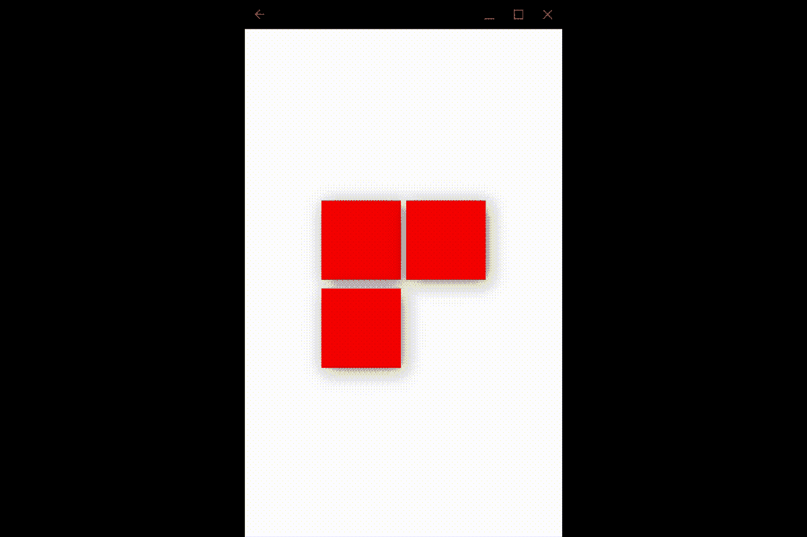
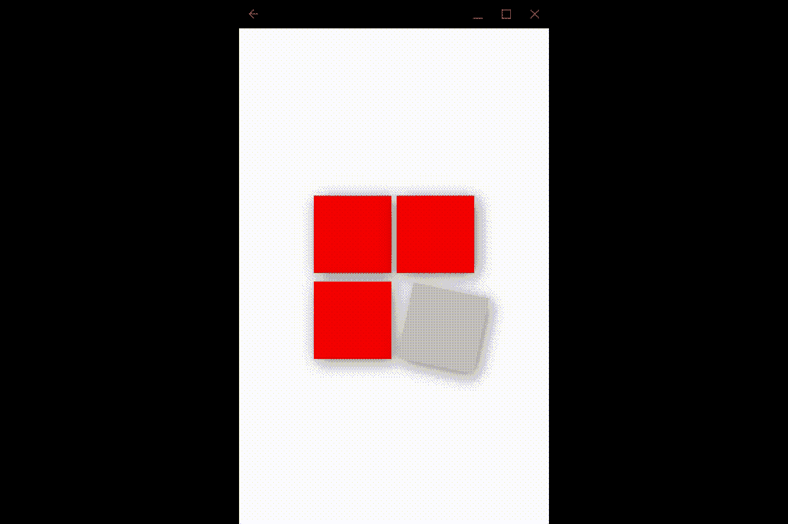

# 通过真实世界的例子学习复杂的动画[第 2 部分]

> 原文：<https://itnext.io/learn-flutter-complex-animations-with-a-real-world-example-part-2-e2ff8d1f785a?source=collection_archive---------6----------------------->


凯利·西克玛在 [Unsplash](https://unsplash.com?utm_source=medium&utm_medium=referral) 上的照片

这是教程的第二部分，分为两部分:

[—第 1 部分:设置项目，并制作左上角和右上角方块的动画。](/learn-flutter-complex-animations-with-a-real-world-example-part-1-906b60ecfa77?source=friends_link&sk=8ed010eac9673f78393ce7f3aba64a4c)

[——第 2 部分:制作左下角和右下角方块的动画，以及在文本中淡入淡出](/learn-flutter-complex-animations-with-a-real-world-example-part-2-e2ff8d1f785a?source=friends_link&sk=aca25799d1f6a74bfd1f0e9168776530)

我们正在为位于提契诺州阿格诺市中心的瑞士公司 Arcaweb 的标志制作一部动画。

最终的源代码可以在[https://github.com/juancurti/flutteranimationtutorial](https://github.com/juancurti/flutteranimationtutorial)上找到

我们的目标如下:


我们制作 Arcaweb 徽标动画的结果

此时，我们的动画看起来像这样:


此刻的动画

# 构建我们的底部方块:

现在，构建底部方块的过程几乎是相同的。几乎是，因为左下方的方块将保持不变，但我们将单独处理右下方，因为它也将呈现旋转动画，我们将不得不播放一点边距，以使它看起来完全符合我们的需要。
我们现在的目标是复制我们对过去的方块所做的，但保留右下角的方块为空。

像以前一样，让我们添加 animationController 和补间动画的变量:

```
AnimationController _squareBottomLeftAnimCont;
Animation<double> _squareBottomLeftAnim;
```

在我们的 _initAnimations 方法中添加(按照我们遵循的顺序)以下内容:

```
...
_squareBottomLeftAnimCont = AnimationController(
      duration: const Duration(milliseconds: 300),
      vsync: this,
    );_squareBottomLeftAnim = Tween<double>(begin: 0, end: 300).animate(
        CurvedAnimation(
            parent: _squareBottomLeftAnimCont, curve: Curves.bounceOut));
...
this._executeAnimation(animation: _squareBottomLeftAnimCont, interval: 600);
}
```

我们也将它添加到我们的 dispose 中，并遵守顺序，如下所示:

```
[@override](http://twitter.com/override)
  void dispose() {
    _squareTopLeftAnimCont?.dispose();
    _squareTopRightAnimCont?.dispose();
    _squareBottomLeftAnimCont?.dispose();
    super.dispose();
  }
```

现在，我们将在 Stack()小部件上添加缺失的方块，并放置一个小部件，就像我们对顶部方块所做的那样:

```
Positioned(
  top: 8 + (MediaQuery.of(context).size.height * 0.5),
  height: MediaQuery.of(context).size.height * 0.2,
  child: Container(
    width: MediaQuery.of(context).size.width,
    child: Row(
      mainAxisAlignment: MainAxisAlignment.center,
      crossAxisAlignment: CrossAxisAlignment.start,
      children: [
        Container(
          width: MediaQuery.of(context).size.width * 0.3,
          height: MediaQuery.of(context).size.width * 0.3,
          child: Column(
            mainAxisAlignment: MainAxisAlignment.start,
            crossAxisAlignment: CrossAxisAlignment.end,
            children: [
              AnimatedBuilder(
                  animation: _squareBottomLeftAnim,
                  builder: (ctx, ch) => Container(
                        width: MediaQuery.of(context).size.width *
                            _squareBottomLeftAnim.value /
                            1200,
                        height: MediaQuery.of(context).size.width *
                            _squareBottomLeftAnim.value /
                            1200,
                        decoration: BoxDecoration(
                            color: Color.fromRGBO(245, 0, 0, 1),
                            boxShadow: [
                              BoxShadow(
                                color: Colors.black.withOpacity(.5),
                                blurRadius: 20.0,
                                spreadRadius: 0.0,
                                offset: Offset(
                                  5.0,
                                  5.0,
                                ),
                              )
                            ]),
                      ))
            ],
          ),
        ),
        SizedBox(
          width: 8,
        ),
        Container(
          width: MediaQuery.of(context).size.width * 0.3,
          height: MediaQuery.of(context).size.width * 0.3,
        )
      ],
    ),
  ),
),
```

此时，当运行我们的应用程序时，我们将得到以下结果:



带有 3 个动画方块的应用程序

# 嵌套动画

对于我们的最后一个方块，我们将使用嵌套动画。这意味着使用一个动画包装另一个动画。为什么会这样？因为我们将在一边设置尺寸动画，在另一边设置旋转/颜色动画。

在构建小部件之前，我们需要像以前一样声明变量:

```
AnimationController _squareBottomRightAnimCont;
  Animation<double> _squareBottomRightAnim;AnimationController _squareColorAnimCont;
  Animation<double> _squareColorAnim;
```

现在，我们将在 _initController 中定义它们。请注意，我们要将颜色动画的补间值设置为 0 到 12，因为我们也要用它来旋转我们的正方形，我们将它旋转 12 度:

```
_squareBottomRightAnimCont = AnimationController(
      duration: const Duration(milliseconds: 300),
      vsync: this,
    );_squareBottomRightAnim = Tween<double>(begin: 0, end: 300).animate(
        CurvedAnimation(
            parent: _squareBottomRightAnimCont, curve: Curves.bounceOut));_squareColorAnimCont = AnimationController(
        duration: const Duration(milliseconds: 1800), vsync: this);_squareColorAnim = Tween<double>(begin: 0, end: 12).animate(
        CurvedAnimation(parent: _squareColorAnimCont, curve: Curves.bounceOut));
```

在我们的 _initAnimations 方法的末尾，我们将为右下角的方块调用 executeAnimation:

```
this._executeAnimation(
        animation: _squareBottomRightAnimCont, interval: 900);
```

为了触发旋转和颜色变化，我们将使用右下角的方形动画控制器的状态监听器。让我们在 _initAnimations 的底部添加以下内容:

```
_squareBottomRightAnimCont.addStatusListener((status) {
      if (status == AnimationStatus.completed) {
        _squareColorAnimCont.forward();
      }
    });
```

不要忘记处理它:

```
[@override](http://twitter.com/override)
  void dispose() {
    _squareTopLeftAnimCont?.dispose();
    _squareTopRightAnimCont?.dispose();
    _squareBottomLeftAnimCont?.dispose();
    _squareBottomRightAnimCont?.dispose();
    _squareColorAnimCont?.dispose();
    super.dispose();
  }
```

为了定位我们的正方形，我们将在堆栈小部件中使用 Positioned。但是我们将首先把它包装在一个 AnimatedBuilder 中，来处理我们的 _squareColorAnim。这个动画将帮助我们动态地改变容器的边距。让我们在 Stack()子部件的底部添加以下内容:

```
AnimatedBuilder(
  animation: _squareColorAnim,
  builder: (ctxc, chc) => Positioned(
    top: (_squareColorAnim.value) +
        8 +
        (MediaQuery.of(context).size.height * 0.5),
    left: (_squareColorAnim.value) +
        4 +
        MediaQuery.of(context).size.width * 0.5,
    child: ...
    )
  ),
)
```

正如我们所看到的，我们将使用我们的 squareColorAnim 的值，不仅用于旋转正方形和改变颜色，还用于帮助它在动画中正确定位。这是因为当我们旋转正方形时，角看起来会有点偏离几个像素。我们这样解决问题。

现在，让我们添加新定位的小部件的子部件，它是——和过去的正方形一样——一个容器，用 mainAxisAlignment 和 crossAxisAlignment 包装一列，监视屏幕的中心。在这种情况下，它会向左上方看(start 和 start)。该列将承载 AnimatedBuilder 和我们的最后一个动画，squareBottomRightAnim 来制作右下角大小的动画:

```
child: Container(
      width: MediaQuery.of(context).size.width * 0.3,
      height: MediaQuery.of(context).size.width * 0.3,
      child: Column(
        mainAxisAlignment: MainAxisAlignment.start,
        crossAxisAlignment: CrossAxisAlignment.start,
        children: [
          AnimatedBuilder(
              animation: _squareBottomRightAnim,
              builder: (ctx, ch) => ...
          )
        ],
      ),
    ),
```

最后，我们将添加由 RotationTransition 小部件包装的正方形。这个小部件使用一个 **turns** 参数来设置角度。让我们添加以下小部件:

```
RotationTransition(
  turns: AlwaysStoppedAnimation(
      _squareColorAnim.value / 360),
  child: Container(
    width: MediaQuery.of(context).size.width * _squareBottomRightAnim.value / 1200,
    height: MediaQuery.of(context).size.width * _squareBottomRightAnim.value / 1200,
    decoration: BoxDecoration(
        color: Color.fromRGBO(
            _squareColorAnim.value > 0 ? 200 -  (_squareColorAnim.value * 1).toInt()
                : 245,
            _squareColorAnim.value > 0 ? 200 - (_squareColorAnim.value * 1).toInt()
                : 0,
            _squareColorAnim.value > 0 ? 200 - (_squareColorAnim.value * 1).toInt()
                : 0,
            1),
        boxShadow: [
          BoxShadow(
            color: Colors.black.withOpacity(.5),
            blurRadius: 20.0,
            spreadRadius: 0.0,
            offset: Offset(
              5.0,
              5.0,
            ),
          )
        ]
      )
    ),
)
```

如果我们现在运行我们的应用程序，我们将有我们的最终广场动画工作:



4 个方块的动画

完美！我们动画最难的部分完成了。现在我们只需要添加淡入的文本。我们将嵌套它，以便它在方块动画完成时开始。

让我们声明下一个变量来处理我们的文本不透明度:

```
bool _displayText = false;
```

现在，让我们改变这个变量，只有当右下角的方块完成动画。如果我们还记得的话，我们已经使用了一个状态监听器来观察这个事件。我们只需要将 _displayText 变量设置为 true。
让我们找到并替换以下状态监听器:

```
_squareBottomRightAnimCont.addStatusListener((status) {
      if (status == AnimationStatus.completed) {
        _squareColorAnimCont.forward();
        setState(() {
          _displayText = true;
        });
      }
    });
```

我们将使用 AnimatedOpacity，它使用一个布尔变量来显示和隐藏它，我们可以直接在视图上添加文本。让我们在堆栈子元素中，但在顶部的第一个子元素中，在方块之前，添加以下内容:

```
Positioned(
  bottom: MediaQuery.of(context).size.height * 0.1,
  child: AnimatedOpacity(
      duration: Duration(milliseconds: 1500),
      opacity: _displayText ? 1 : 0,
      child: Container(
        width: MediaQuery.of(context).size.width,
        child: Row(
          mainAxisAlignment: MainAxisAlignment.center,
          children: [
            Text(
              "arca",
              style: TextStyle(
                  fontFamily: 'Ubuntu',
                  fontSize: 76,
                  shadows: [
                    Shadow(
                      color: Colors.black.withOpacity(.5),
                      blurRadius: 20.0,
                      offset: Offset(
                        5.0,
                        5.0,
                      ),
                    )
                  ]),
            ),
            Text(
              "web",
              style: TextStyle(
                  fontFamily: 'Ubuntu',
                  color: Colors.red,
                  fontSize: 76,
                  shadows: [
                    Shadow(
                      color: Colors.black.withOpacity(.5),
                      blurRadius: 20.0,
                      offset: Offset(
                        5.0,
                        5.0,
                      ),
                    )
                  ],
                  fontWeight: FontWeight.w800),
            )
          ],
        ),
      )
  )
),
```

我们完事了。如果我们运行我们的应用程序，我们应该看到最终的结果:


Arcaweb 徽标的最终动画

如果你错过了什么，你可以在这里查看源代码:[https://github.com/juancurti/flutteranimationtutorial](https://github.com/juancurti/flutteranimationtutorial)