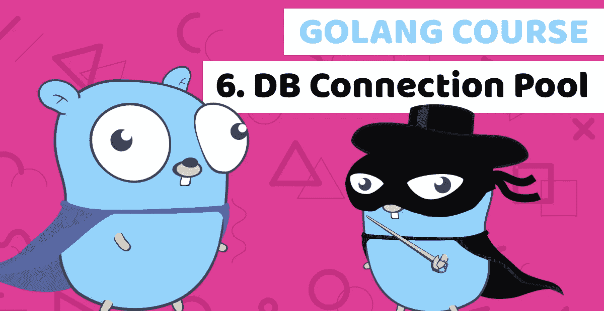

# 通过构建金融科技银行应用了解 Golang 第 6 课:数据库连接池和交易历史

> 原文：<https://itnext.io/learn-golang-by-building-a-fintech-banking-app-lesson6-db-connection-pool-and-transaction-740010e410b2?source=collection_archive---------2----------------------->



[Golang DB 连接池](https://www.blog.duomly.com/golang-course-with-building-fintech-banking-app-lesson-6-db-connection-pool-and-transactions-history/)

本文原载:
[https://www . blog . duomly . com/golang-course-with-building-fin tech-banking-app-lesson-6-d b-connection-pool-and-transactions-history/](https://www.blog.duomly.com/golang-course-with-building-fintech-banking-app-lesson-6-db-connection-pool-and-transactions-history/)

# 介绍

在 golang 课程的第 6 课中，我们将讨论数据库连接池和事务历史。

在前面的课程中，我们构建了一些使项目更大的功能。

在这里，您可以找到之前的五课:

在本课程的前几集，我们学习了如何进行迁移:

[构建金融科技银行应用的 Golang 课程——第 1 课:启动项目](https://www.blog.duomly.com/golang-course-with-building-a-fintech-banking-app-lesson-1-start-the-project/)

我们学习了如何进行用户登录:

[构建金融科技银行应用的 Golang 课程——第 2 课:登录和 REST API](https://www.blog.duomly.com/golang-course-with-building-a-fintech-banking-app-lesson-2-login-and-rest-api/)

我们学习了如何进行用户注册:

[构建金融科技银行应用的 Golang 课程——第 3 课:用户注册](https://www.blog.duomly.com/golang-course-with-building-a-fintech-banking-app-lesson-3-user-registration/)

我们建立了用户认证，并从交易开始:

[构建金融科技银行应用的 Golang 课程——第 4 课:用户认证和银行交易第 1 部分](https://www.blog.duomly.com/golang-course-with-building-a-fintech-banking-app-lesson-4-user-authentication-and-bank-transactions-part-1/)

我们完成了银行转账的可能性:

[构建金融科技银行应用的 Golang 课程——第 5 课:银行交易第 2 部分](https://www.blog.duomly.com/golang-course-with-building-a-fintech-banking-app-lesson-5-bank-transactions-part-2/)

你还需要记住我的朋友安娜创建的 Angular 9 球场:

[使用 Tailwind CSS 构建银行应用程序的角度课程—第 1 课:启动项目](https://www.blog.duomly.com/angular-course-building-a-banking-application-with-tailwind-css-lesson-1-start-the-project/)

今天，我们可以关注事务历史和数据库连接池。

这将有助于我们避免当太多的请求进入游戏时出现 DB-kills。

开始吧！

如果你喜欢视频，这是 youtube 的版本:

Golang 数据库连接池

# 创建数据库包

作为第一步，我们需要创建一个新的包来处理所有的数据库逻辑。

为此，我们需要创建一个名为“database”的目录，进入该目录后，我们需要创建一个名为“database.go”的文件，并进入该文件。

在文件内部，我们需要声明一个名为“database”的包。

```
package database
```

# 创建全局变量数据库

接下来，我们需要声明一个名为“DB”的变量，我们将用它来访问其他文件中的 DB。

```
var DB *gorm.DB
```

# 创建函数 InitDatabase

在第三步中，我们需要创建一个名为“InitDatabase”的函数，它将让我们与 DB 连接，并返回 DB 连接对象。

```
func InitDatabase() {
    database, err := gorm.Open("postgres", "host=127.0.0.1 port=5432 user=postgres dbname=bankapp password=postgres sslmode=disable")
    helpers.HandleErr(err)
    DB = database
}
```

# 设置连接池

今天课程的主要内容之一是设置适当的连接池。

我们将在这一步中完成它。

在“InitDatabase”函数中添加连接池，然后设置空闲连接数为 20，最大连接数为 200。

```
func InitDatabase() {
    database, err := gorm.Open("postgres", "host=127.0.0.1 port=5432 user=postgres dbname=bankapp password=postgres sslmode=disable")
    helpers.HandleErr(err)
    database.DB().SetMaxIdleConns(20)
    database.DB().SetMaxOpenConns(200)
    DB = database
}
```

# 在 main.go 中初始化数据库

我们已经创建了一个数据库包和数据库连接池。

接下来，我们需要通过在文件“main.go”和函数“main”中调用 InitDatabase 来开始使用它。

```
func main() {
    database.InitDatabase()
    api.StartApi()
}
```

# 从助手包中删除 ConnectDB

好了，当我们完成新的数据库设置后，我们可以进入 helpers.go 并删除函数“ConnectDB”。

# 在迁移中重构 create accounts . go 并记住始终删除关闭的数据库

现在，我们可以开始重构使用 DB 连接的逻辑了。

因为我们需要做的第一件事是 migrations.go.
中的函数“createAccounts ”,所以在重构数据库连接的每个地方，都需要记住删除数据库。Close()，否则每次调用后都会关闭 DB，应用程序将停止工作。

```
func createAccounts() {
    users := &[2]interfaces.User{
        {Username: "Martin", Email: "martin@martin.com"},
        {Username: "Michael", Email: "michael@michael.com"},
    }
    for i := 0; i < len(users); i++ {
        generatedPassword := helpers.HashAndSalt([]byte(users[i].Username))
        user := &interfaces.User{Username: users[i].Username, Email: users[i].Email, Password: generatedPassword}
        database.DB.Create(&user) account := &interfaces.Account{Type: "Daily Account", Name: string(users[i].Username + "'s" + " account"), Balance: uint(10000 * int(i+1)), UserID: user.ID}
        database.DB.Create(&account)
    }
}
```

# 重构迁移

下一步，我们需要重构函数“Migrate”。

完成这一步后，我们将在一个函数中拥有所有与迁移相关的逻辑。

```
func Migrate() {
    User := &interfaces.User{}
    Account := &interfaces.Account{}
    Transactions := &interfaces.Transaction{}
    database.DB.AutoMigrate(&User, &Account, &Transactions) createAccounts()
}
```

# 删除功能迁移事务

现在，我们不再需要“MigrateTransactions”函数。

可以删除。

# transactions.go 中的重构函数 CreateTransaction

在第四步中，我们需要重构“transactions.go”文件中的“CreateTransaction”函数，以开始使用新的数据库包。

```
func CreateTransaction(From uint, To uint, Amount int) {
    transaction := &interfaces.Transaction{From: From, To: To}
    database.DB.Create(&transaction)
}
```

# 重构函数 updateAccount 以使用数据库包

接下来，进入“updateAccount”函数，像我们之前做的一样进行重构。

```
func updateAccount(id uint, amount int) interfaces.ResponseAccount {
    account := interfaces.Account{}
    responseAcc := interfaces.ResponseAccount{} database.DB.Where("id = ? ", id).First(&account)
    account.Balance = uint(amount)
    database.DB.Save(&account) responseAcc.ID = account.ID
    responseAcc.Name = account.Name
    responseAcc.Balance = int(account.Balance)
    return responseAcc
}
```

# 重构函数 getAccount 以使用数据库包

对于新的数据库包，我们还有一些地方需要重构。

在这一步中，我们将更新“useraccounts.go”文件中的“GetAccount”。

```
func getAccount(id uint) *interfaces.Account{
    account := &interfaces.Account{}
    if database.DB.Where("id = ? ", id).First(&account).RecordNotFound() {
        return nil
    }
    return account
}
```

# 重构函数登录以使用数据库包

接下来，我们可以进入文件“users.go”，重构函数“Login”。

```
func Login(username string, pass string) map[string]interface{} {
    // Add validation to login
    valid := helpers.Validation(
        []interfaces.Validation{
            {Value: username, Valid: "username"},
            {Value: pass, Valid: "password"},
        })
    if valid {
        user := &interfaces.User{}
        if database.DB.Where("username = ? ", username).First(&user).RecordNotFound() {
            return map[string]interface{}{"message": "User not found"}
        }
        // Verify password
        passErr := bcrypt.CompareHashAndPassword([]byte(user.Password), []byte(pass)) if passErr == bcrypt.ErrMismatchedHashAndPassword && passErr != nil {
            return map[string]interface{}{"message": "Wrong password"}
        }
        // Find accounts for the user
        accounts := []interfaces.ResponseAccount{}
        database.DB.Table("accounts").Select("id, name, balance").Where("user_id = ? ", user.ID).Scan(&accounts) var response = prepareResponse(user, accounts, true); return response
    } else {
        return map[string]interface{}{"message": "not valid values"}
    }
}
```

# 重构函数寄存器以使用数据库包

这几乎是我们需要重构函数来使用新数据库包的最后一个地方。

在同一个文件“users.go”中，我们需要重构名为“Register”的函数。

```
func Register(username string, email string, pass string) map[string]interface{} {
    // Add validation to registration
    valid := helpers.Validation(
        []interfaces.Validation{
            {Value: username, Valid: "username"},
            {Value: email, Valid: "email"},
            {Value: pass, Valid: "password"},
        })
    if valid {
        generatedPassword := helpers.HashAndSalt([]byte(pass))
        user := &interfaces.User{Username: username, Email: email, Password: generatedPassword}
        database.DB.Create(&user) account := &interfaces.Account{Type: "Daily Account", Name: string(username + "'s" + " account"), Balance: 0, UserID: user.ID}
        database.DB.Create(&account) accounts := []interfaces.ResponseAccount{}
        respAccount := interfaces.ResponseAccount{ID: account.ID, Name: account.Name, Balance: int(account.Balance)}
        accounts = append(accounts, respAccount)
        var response = prepareResponse(user, accounts, true) return response
    } else {
        return map[string]interface{}{"message": "not valid values"}
    }}
```

# 重构函数 GetUser

呜哇！这是我们需要为数据库包替换 db 连接的最后一个地方。

以类似的方式重构名为“GetUser”的函数，互为补充。

```
func GetUser(id string, jwt string) map[string]interface{} {
    isValid := helpers.ValidateToken(id, jwt)
    // Find and return user
    if isValid {
        user := &interfaces.User{}
        if database.DB.Where("id = ? ", id).First(&user).RecordNotFound() {
            return map[string]interface{}{"message": "User not found"}
        }
        accounts := []interfaces.ResponseAccount{}
        database.DB.Table("accounts").Select("id, name, balance").Where("user_id = ? ", user.ID).Scan(&accounts) var response = prepareResponse(user, accounts, false);
        return response
    } else {
        return map[string]interface{}{"message": "Not valid token"}
     }
}
```

# 创建接口响应事务

恭喜，所有的数据库重构都完成了！

现在，我们可以进入交易历史。

为此，作为第一步，您需要进入 interfaces.go 并创建结构“ResponseTransaction”。

它应该有四个属性，ID 为 uint，From 为 uint，To 为 uint，Amount 为 int。

```
type ResponseTransaction struct {
    ID uint
    From uint
    To uint
    Amount int
}
```

# 创建函数 GetTransationsByAccount

下一步，我们可以进入文件“transactions.go ”,开始创建与获取事务相关的逻辑。

和第一个一样，我们需要创建一个函数“GetTransactionsByAccount”。

该函数将 id 作为 uint，并返回“ResponseTransaction”的数组。

该逻辑将查找 prop“from”或“to”等于我们作为参数传递的帐户 id 的交易。

```
func GetTransactionsByAccount(id uint) []interfaces.ResponseTransaction{
    transactions := []interfaces.ResponseTransaction{}
    database.DB.Table("transactions").Select("id, transactions.from, transactions.to, amount").Where(interfaces.Transaction{From: id}).Or(interfaces.Transaction{To: id}).Scan(&transactions)
    return transactions
}
```

# 创建函数 GetMyTransactions

我们需要创建的下一个函数应该命名为“GetMyTransactions ”,并将 id 和 jwt 作为参数，两者都是字符串。

函数应返回“map[string]interface{}”。

```
func GetMyTransactions(id string, jwt string) map[string]interface{} {}
```

# 验证 JWT

在函数“GetMyTransactions”中，我们应该验证 JWT 令牌。

如果令牌没问题，我们可以进入逻辑。如果不是，我们应该返回消息“无效令牌”的响应。

```
func GetMyTransactions(id string, jwt string) map[string]interface{} {
  isValid := helpers.ValidateToken(id, jwt)
    if isValid { } else {
        return map[string]interface{}{"message": "Not valid token"}
    }
}
```

# 查找并返回交易记录

好了，现在我们可以进入“GetMyTransactions”的逻辑了。

作为第一步，我们应该寻找与我们的用户相关的所有帐户。

接下来，我们应该遍历所有的帐户，并开始查找与该帐户相关的交易，我们将把这些交易添加到“transactions”数组中。

作为最后一步，我们应该将它们返回给用户。

```
func GetMyTransactions(id string, jwt string) map[string]interface{} {
  isValid := helpers.ValidateToken(id, jwt)
    if isValid {
        accounts := []interfaces.ResponseAccount{}
        database.DB.Table("accounts").Select("id, name, balance").Where("user_id = ? ", id).Scan(&accounts) transactions := []interfaces.ResponseTransaction{}
        for i := 0; i < len(accounts); i++ {
            accTransactions := GetTransactionsByAccount(accounts[i].ID)
            transactions = append(transactions, accTransactions...)
        } var response = map[string]interface{}{"message": "all is fine"}
        response["data"] = transactions
        return response
  } else {
        return map[string]interface{}{"message": "Not valid token"}
    }
}
```

# 在 api.go 中创建函数 getMyTransactions

我们几乎准备好了！

现在，我们可以进入文件“api.go ”,并创建函数“getMyTransactions”。

类似于“getUser”的函数应该处理“userID”和授权。

接下来，我们应该将它传递给“GetMyTransactions”函数，并将所有内容返回给用户。

```
func getMyTransactions(w http.ResponseWriter, r *http.Request) {
    vars := mux.Vars(r)
    userId := vars["userID"]
    auth := r.Header.Get("Authorization") transactions := transactions.GetMyTransactions(userId, auth)
    apiResponse(transactions, w)
}
```

# 处理 API 端点

最后一步，我们只需要处理路由中的 API 端点。

```
func StartApi() {
    router := mux.NewRouter()
    // Add panic handler middleware
    router.Use(helpers.PanicHandler)
    router.HandleFunc("/login", login).Methods("POST")
    router.HandleFunc("/register", register).Methods("POST")
    router.HandleFunc("/transaction", transaction).Methods("POST")
    router.HandleFunc("/transactions/{userID}", getMyTransactions).Methods("GET")
    router.HandleFunc("/user/{id}", getUser).Methods("GET")
    fmt.Println("App is working on port :8888")
    log.Fatal(http.ListenAndServe(":8888", router))
}
```

# 结论

恭喜你，你的代码现在看起来好多了！

我希望今天的重构教会了你项目的开始，新功能的开发很容易，但如果项目增长，维护可能会有问题。

我们构建了一些新的功能，比如事务历史，并修复了一些大代码问题，但这并不是应该修复的全部。

在接下来的几集里，我们将讨论使用 SQL 关系，这将帮助我们避免许多我们需要做的调用，只要使用 Golang 关联。

这将教会你如何在项目开始时实施一些好的实践来节省我们大量的时间和工作。

今天课程的代码可以在这里找到:
[https://github . com/Duomly/go-bank-back end/tree/Golang-course-Lesson-6](https://github.com/Duomly/go-bank-backend/tree/Golang-course-Lesson-6)


[多美滋促销代码](https://www.duomly.com?code=lifetime-80)

感谢阅读，
来自 Duomly 的 Radek