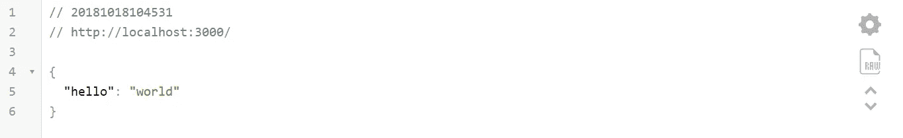
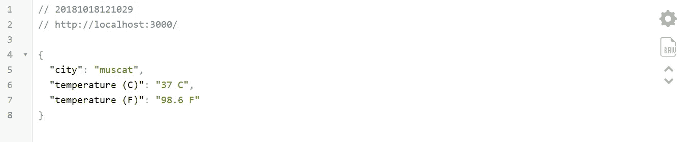
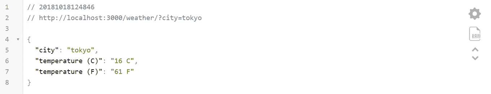

# 通过使用 JavaScript 构建一个简单的应用程序来了解全栈应用程序是如何工作的(第 1 部分)

> 原文：<https://itnext.io/learn-how-full-stack-apps-work-by-building-a-simple-one-using-javascript-part-1-38e237694012?source=collection_archive---------1----------------------->

## **通过构建一个简单的假天气 API 了解全栈应用如何工作**


图片由[克莱门特·H](https://unsplash.com/@clemhlrdt)拍摄

本教程将带你完成创建一个简单的假天气 API 的过程(假是因为我们使用的数据是虚构的)。之后，我们将构建一个简单的前端表单，并从我们的 API 获取数据。如果您是 Node 和 Express 的新手，或者是一名前端开发人员，希望了解 API 如何从工作中获取数据，那么本文适合您。

> [第 2 部分——构建一个可以从后端 API 获取数据的前端应用程序](/learn-how-full-stack-apps-work-by-building-a-simple-one-using-javascript-part-2-45b42c1f2e84)

请注意，我们正在构建的非常简单，但是我们涉及的概念与用于构建更大的应用程序的概念是相同的。

这是一个两部分的系列。你可以在这里找到第二部。在这一部分，我们将只是我们的应用程序的后端部分

# 步骤 1:项目设置

在深入学习本教程之前，您需要具备以下条件:

*   [节点](https://nodejs.org/en/)(我用的是 v10.11.0)
*   [npm](https://www.npmjs.com/get-npm) (我用的是 6.4.1)
*   一个文本编辑器(我用的是 [VS 代码](https://code.visualstudio.com/)
*   一个浏览器(我绝对推荐 [Chrome](https://www.google.com/chrome/) 或者 [Firefox](https://www.mozilla.org/en-US/firefox/new/)

请注意，您不需要像我一样拥有 Node 和 npm 的确切版本，这样就可以工作。如果你在配置这些方面有任何问题，请在下面评论，我很乐意帮助你。一旦你有了这些设置，就该下载或克隆启动代码了。你可以在我的 Github 上找到这些文件。如果您不了解存储库中每个文件的功能，请不要担心，我们将介绍每个相关文件及其功能。

# 步骤 2:理解启动文件

如果您成功地克隆了起始代码存储库，那么您应该拥有这样的文件结构:

```
/Fake-Weather-API
  .gitignore
  README.md
  data.js
  index.js
  package-lock.json
  package.json
```

首先，让我们看看我们的`package.json`文件

```
{
  "name": "fake_weather_api_starter",
  "version": "1.0.0",
  "description": "",
  "main": "index.js",
  "scripts": {
    "test": "echo \"Error: no test specified\" && exit 1"
  },
  "author": "Maher Alkendi",
  "license": "ISC",
  "dependencies": {
    "express": "^4.16.4"
  }
}
```

这个文件包含关于我们的应用程序的主要信息。注意，我们只有一个依赖，就是`express`。Express 是一个 Web 框架，它使得使用 node 构建服务器端应用程序变得很容易。点击阅读更多相关信息[。](https://expressjs.com/)

接下来我们看一下我们的`index.js`文件

```
const express = require('express'); // import express
const app = express(); // initialize express// Listen on port 3000
app.listen(3000, function() {
  console.log('listening on port 3000...');
})
```

这段代码所做的只是在端口 3000 上初始化一个 express 服务器。随着我们的发展，我们将增加更多的功能。

现在让我们签出`data.js`文件

```
const fakeWeatherData = [
  {
    'city': 'muscat',
    'temperature (C)': '37 C',
    'temperature (F)': '98.6 F',
  },
  {
    'city': 'tokyo',
    'temperature (C)': '16 C',
    'temperature (F)': '61 F',
  },
  {
    'city': 'moscow',
    'temperature (C)': '18 C',
    'temperature (F)': '64 F',
  },
  {
    'city': 'sydney',
    'temperature (C)': '17 C',
    'temperature (F)': '63 F',
  },
  {
    'city': 'london',
    'temperature (C)': '16 C',
    'temperature (F)': '66 F',
  },
  {
    'city': 'johannesburg ',
    'temperature (C)': '24 C',
    'temperature (F)': '75 F',
  },
];module.exports = fakeWeatherData;
```

这个文件包含了我们伪造的天气数据。它包含一个名为`fakeWeatherData`的对象数组。每个对象都有一个城市的关键字，摄氏温度和华氏温度。在文件的底部，我们正在导出这个数组。请注意，这是我编造的假数据。在实际应用中，这些信息很可能来自数据库。

此外，我们的`.gitignore`文件忽略了我们的`node_modules`文件夹。

好了，这些是启动代码的主要文件。现在让我们开始建立我们的假天气 API！

# 步骤 3:构建假天气 API

在我们开始编写任何代码之前，不要忘记在您的终端上键入`npm install`来安装所有的依赖项(在这种情况下，它只是 express)。现在在你的文本编辑器上打开`index.js`。让我们首先让我们的应用程序在获得根目录上的 GET 请求时返回一些 json。

```
const express = require('express'); // import express
const app = express();  // initialize express// GET route
app.get('/', function(req, res) {
  res.send({'hello': 'world'})
})// Listen on port 3000
app.listen(3000, function() {
  console.log('listening on port 3000...');
})
```

如果你在你的终端输入`node index.js`，然后打开你的网络浏览器并导航到`[http://localhost:3000/](http://localhost:3000/)`，你应该会得到一些 json



您应该得到相同的数据，但是您的 json 可能看起来不像上面的图片那么干净。如果你想让你的浏览器格式化 json 数据，那么看看这个 [chrome 扩展](https://chrome.google.com/webstore/detail/json-viewer/gbmdgpbipfallnflgajpaliibnhdgobh)。一旦你得到它，你应该自动得到干净的格式化 json。

现在让我们尝试使用我们的应用程序发送一些虚假的天气数据。首先，我们需要从我们的`data.js`文件导入假数据。然后，当发出 GET 请求时，让我们尝试发出我们的`fakeWeatherData`数组中的第一个数据项。

```
const express = require('express');   // import express
const app = express();  // initialize express
const fakeWeatherData = require('./data.js'); // import fake data// GET route
app.get('/', function(req, res) {
  res.send(fakeWeatherData[0]);
})app.listen(3000, function() {
  console.log('listening on port 3000...');
})
```

完成这些更改后，按`ctrl + C`重启 express 服务器，然后键入`node index.js`。您应该看到这个:



不错！现在，当发出 GET 请求时，我们可以向用户发送假数据。让我们允许用户输入一个城市名称，并获得温度数据，如果它可用的话。我们通过检查 URL 查询字符串来做到这一点，如果它包含的参数值与我们的城市名称相匹配，那么我们应该返回与该城市相关的数据。

如果你对 URL 查询字符串感到困惑，你可以查看这个[链接](https://howto.caspio.com/parameters/parameters-as-query-string-values/)。它将帮助你理解一个 URL 的不同方面。

为了使用 express 访问查询字符串参数，我们需要使用`req.query`参见下面的代码:

```
const express = require('express');  // import express
const app = express();  // initialize express// import our fake weather data
const fakeWeatherData = require('./data.js');// GET route
app.get('/weather', function(req, res) {
  // if no city parameter exists  
  if (!req.query.city) {
    res.send({"status": "error", "message": "Please enter a city name"})
  } else {
  res.send(fakeWeatherData[0])
  }
});app.listen(3000, function() {
  console.log('listening on port 3000...');
})
```

在我分析上面的代码之前，请注意我将路径改为现在的`http://localhost:3000/weather`。我这样做是为了让我们的 URL 更具描述性。

如果我们不为我们的应用程序提供一个带有参数`city`的查询字符串，那么我们将返回一个 json 错误消息。您可以通过重新启动 express 服务器，然后转到下面的路径`http://localhost:3000/weather/?city`来测试这一点。事实上，如果你去任何/weather 路径，你会得到这个错误信息。要解决这个问题，请访问`http://localhost:3000/weather/?city=ANYTHING`。现在，我们再次看到我们的城市数据，但我们只访问一个城市的信息。让我们研究基于 URL 查询字符串中的参数`city`获取数据的逻辑。

```
const express = require('express');  // import express
const app = express();  // initialize express// import our fake weather data
const fakeWeatherData = require('./data.js');// GET route
app.get('/weather', function (req, res) {// store the query string parameter in cityName variable
  let cityName = req.query.city.toLowerCase();// Loop through our fake data array
  for (let i = 0; i < fakeWeatherData.length; i++) {// if no city parameter exists
    if (!cityName) {
      return res.send({"status": "error", "message": "Please enter a city name"})
    } else if (cityName == fakeWeatherData[i].city.toLowerCase()) {
      return res.send(fakeWeatherData[i])
    }
  }// if city parameter isn't in our fake data set
  res.send({"status": "error", "message": "This city isn't in our database"})});app.listen(3000, function () {
  console.log('listening on port 3000...');
})
```

上面的逻辑非常简单。我们只是访问用户输入的城市名称，但是是从我们的查询字符串中获取的。该字符串存储在`req.query`中。然后，我们循环遍历我们的假天气数据数组，检查我们是否有任何匹配。如果我们这样做了，那么我们的 API 应该用与城市相关的数据来响应。

好了，现在让我们测试我们的 API！如果我们去路径`http://localhost:3000/weather/?city=tokyo`。这是我们应该看到的:



你可以用我们的假数据集中的任何城市测试它，它应该返回城市数据，如果城市数据不可用或者没有输入城市，那么我们应该得到一个适当的错误。

虽然我们接近完成，但我们还没有完全做到。应该考虑的最后一件事。我们将通过位于不同域的另一个应用程序来访问这个 API，所以我们必须启用所有跨源资源共享。幸运的是，有一个名为 [cors](https://www.npmjs.com/package/cors) 的节点包可以帮助我们。要安装它，我们只需在终端中键入以下内容:

```
npm i --save cors
```

我们最终的`package.json`现在应该是这样的:

```
{
  "name": "fake_weather_api_starter",
  "version": "1.0.0",
  "description": "",
  "main": "index.js",
  "scripts": {
    "test": "echo \"Error: no test specified\" && exit 1"
  },
  "author": "Maher Alkendi",
  "license": "ISC",
  "dependencies": {
    "cors": "^2.8.4",
    "express": "^4.16.4"
  }
}
```

要启用所有 CORS 请求，我们只需添加几行代码。我们最终的`index.js`文件现在应该是这样的:

```
const express = require('express');  // import express
const app = express();  // initialize express
const cors = require('cors'); // import cors package// import our fake weather data
const fakeWeatherData = require('./data.js');// Enable all CORS requests
app.use(cors());app.get('/weather', function (req, res) {// store the query string parameter in cityName variable
  let cityName = req.query.city.toLowerCase();// Loop through our fake data array
  for (let i = 0; i < fakeWeatherData.length; i++) {// if no city parameter exists
    if (!cityName) {
      return res.send({"status": "error", "message": "Please enter a city name"})
    } else if (cityName == fakeWeatherData[i].city.toLowerCase()) {
      return res.send(fakeWeatherData[i])
    }
  }// if city parameter isn't in our fake data set
  res.send({"status": "error", "message": "This city isn't in our database"})});app.listen(3000, function () {
  console.log('listening on port 3000...');
})
```

我们走吧！我们刚刚创造了一个假的天气预报。但这本身并不令人兴奋。让我们创建一个简单的 UI 来实际使用这些数据。

如果你能走到这一步，我向你致敬！请记住，这只是这两部分系列的第一部分。如果您想了解我们如何从我们刚刚创建的 API 和前端应用程序中访问数据。看看第二部分。

如果您有任何问题或建议，请随时在下面留言或在[我的推特](https://twitter.com/maheralkendi)上给我发消息，我将很乐意回复！