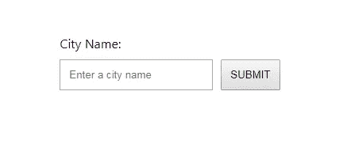
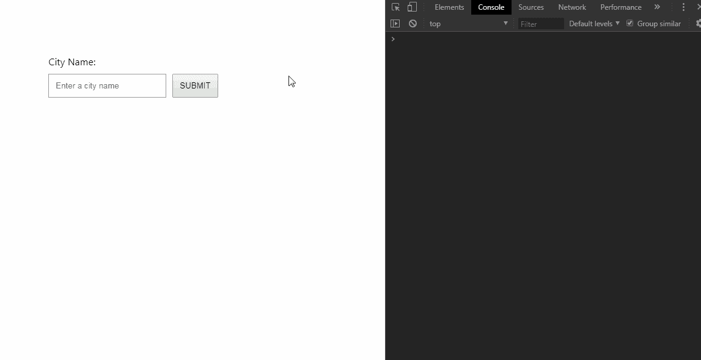
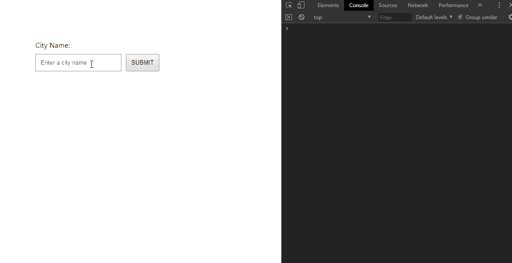
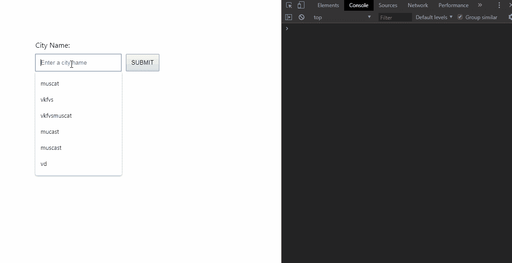
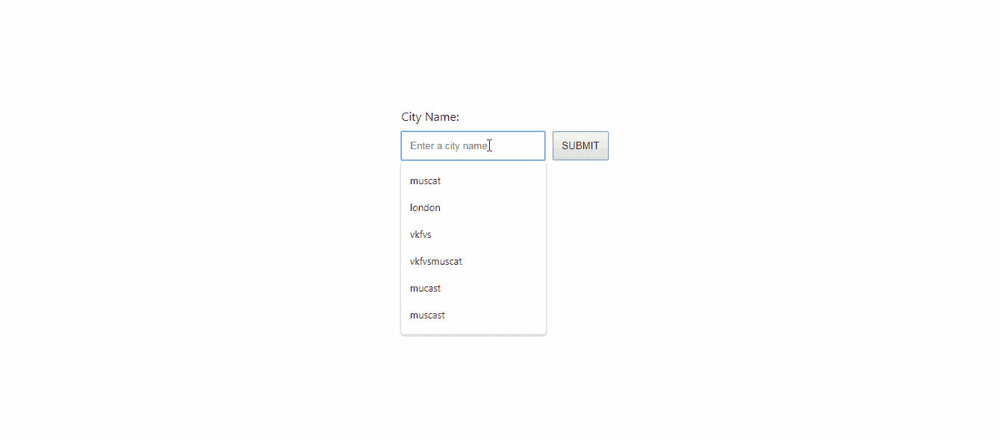

# 通过使用 JavaScript 构建一个简单的应用程序来了解全栈应用程序是如何工作的(第 2 部分)

> 原文：<https://itnext.io/learn-how-full-stack-apps-work-by-building-a-simple-one-using-javascript-part-2-45b42c1f2e84?source=collection_archive---------2----------------------->

## 构建一个可以从后端 API 获取数据的前端应用程序


照片由 [rawpixel](https://unsplash.com/@rawpixel) 拍摄

在本教程中，我们将构建一个简单的表单，它可以与我们在这个两部分系列的第一部分中创建的假天气 API 进行通信。该表单将接受一个城市名称，并返回与该城市相关的天气数据。我们正在构建的应用程序非常简单，但这些概念与用于构建大型应用程序的概念相同。

这是这个两部分系列的第二部分。如果你没有读过第一部分，你可以在这里查看一下。

# 步骤 1:设置我们的项目

要完成本教程，您需要以下内容:

*   一个文本编辑器(我用的是 [VS 代码](https://code.visualstudio.com/))
*   浏览器(我用的是 Chrome 浏览器，但是 Firefox 浏览器应该可以正常工作)
*   本系列第一部分中内置的 API

接下来，让我们得到这个项目的启动文件。你可以在我的 Github 上找到它们。

一旦你克隆或下载了文件，在你的文本编辑器中打开它们。这是您应该看到的文件结构:

```
/Fake-Weather-Form-Starter
  README.md
  index.html
  script.js
```

我们只有三个文件，其中只有两个与我们正在做的事情有关。`script.js`文件是空的，所以让我们从打开我们的`index.html`文件开始。这是你应该看到的:

```
<!DOCTYPE html>
<html><head>
  <meta charset="utf-8" />
  <meta http-equiv="X-UA-Compatible" content="IE=edge">
  <title>Fake Weather Data</title>
  <meta name="viewport" content="width=device-width, initial-scale=1">
  <style>
    body {
      font-family: 'Segoe UI', Tahoma, Geneva, Verdana, sans-serif;
    }
    form {
      display: flex;
      /* flex-direction: column; */
      justify-content: center;
      align-items: flex-end;
      margin-top: 10%;
    }
    .form-item {
      display: flex;
      flex-direction: column;
      align-items: flex-start;
    }
    label, input, button {
      padding: 10px;
      margin-left: 10px;
    }
    label {
      padding-left: 0px;
    }
    .weather-info {
      display: flex;
      flex-direction: column;
      align-items: center;
    }
    .error-message {
      color: red;
      text-align: center;
    }
  </style>
</head><body><form>
    <div class="form-item">
      <label for="city">City Name: </label>
      <input type="text" placeholder="Enter a city name" id="city" name="city" required>
    </div>
    <button type="submit">SUBMIT</button>
  </form>
  <div class="error-message"></div><div class="weather-info">
    <h1 class="cityName"></h1>
    <h4 class="celsius"></h4>
    <h4 class="fahrenheit"></h4>
  </div> <script src="script.js"></script>
</body></html>
```

html 文件的主体只包含一个带有一个输入的表单、一个提交按钮和一个包含三个空元素的 div。这些元素将显示我们的数据。此外，我们在表单下面有一个 div，它将显示任何与表单相关的错误消息。

我在 html `head`标签中添加了一些样式，让我们的表单看起来更好。这不是最好的造型方式，也不是最好的造型，但它确实有效。在本教程中，我们更关心功能而不是麻醉剂。您可以通过在浏览器上打开`index.html`来查看表格。如果您这样做，您应该会看到:



好了，现在我们准备写一些代码了！

# 步骤 2:构建主表单功能

我们将为这个项目做非常简单的 DOM 操作，所以我们将使用普通的 JavaScript 来完成。在文本编辑器上打开你的`script.js`文件，让我们开始吧。

我们希望表单在提交时检索数据，所以让我们选择表单，然后为[提交事件](https://developer.mozilla.org/en-US/docs/Web/Events/submit)添加一个事件监听器。

```
// Select our form
const form = document.querySelector('form');// When form is submitted print 'submitted' to the browser console
form.addEventListener('submit', function(e) {
  // prevent form default behavior
  e.preventDefault();
  console.log('submitted');
})
```

现在，我们的表单所要做的就是在浏览器控制台上打印出“已提交”。我们只是确保表单工作正常。如果是，您应该会看到以下内容:



不错！我们的形式有效。但是，我们希望表单能够访问用户在输入中插入的任何内容。让我们选择我们的文本输入，然后将其值存储在一个变量中。每当用户触发[输入事件](https://developer.mozilla.org/en-US/docs/Web/Events/input)时，该变量需要更新。

```
// Select text input
const textInput = document.getElementById('city');// Store the value of the input in a variable
let cityName = textInput.value;// When an input event is triggered update cityName
textInput.addEventListener('input', function(e) {
  cityName = e.target.value;
})// Select our form
const form = document.querySelector('form');// When form is submitted print 'submitted' to the browser console
form.addEventListener('submit', function(e) {
  // prevent form default behavior
  e.preventDefault();// print input value
  console.log(cityName);// clear input
  textInput.value = '';
})
```

我们的表单现在在提交时打印输入值，然后清除文本输入值。您的应用程序现在应该如下所示:



完美！现在让我们调用我们的 API。

# 步骤 3:从假天气 API 获取数据

在我们开始获取数据之前，我们需要确保我们的 API 是活动的。在这种情况下，您所要做的就是转到您的 weather API 目录，并使用`node index.js`运行它。一旦开始，你可以把它留在后台，回到我们的表单。

使用 JavaScript 进行 http 请求有很多种方法。您可以使用 [XMLHttpRequest](https://developer.mozilla.org/en-US/docs/Web/API/XMLHttpRequest/Using_XMLHttpRequest) 或 [fetch API](https://developer.mozilla.org/en-US/docs/Web/API/Fetch_API) ，但在我的情况下，我更喜欢使用 [axios](https://www.npmjs.com/package/axios) 。这里没有正确的答案，只有个人偏好。

要将 axios 添加到我们的应用程序中，我们需要做的就是在 html 文件中包含 cdn。

```
<!DOCTYPE html>
<html> ... <script src="[https://unpkg.com/axios/dist/axios.min.js](https://unpkg.com/axios/dist/axios.min.js)"></script>
  <script src="script.js"></script>
</body>
</html>
```

在我的例子中，我将它添加在我的`script.js`脚本标签的正上方。

我们现在应该能够在我们的`script.js`文件中使用 axios 向我们的 API 发出请求

```
// Select text input
const textInput = document.getElementById('city');// Store the value of the input in a variable
let cityName = textInput.value;// When an input event is triggered update cityName
textInput.addEventListener('input', function(e) {
  cityName = e.target.value;
})// Select our form
const form = document.querySelector('form');// When form is submitted print 'submitted' to the browser console
form.addEventListener('submit', function(e) {
  // prevent form default behavior
  e.preventDefault();// make request to our API
  axios.get('[http://localhost:3000/weather/?city='](http://localhost:3000/weather/?city=') + cityName)
    .then(function(response) {
      console.log(response.data);
    })
    .catch(function(error) {
      console.log(error);
    })// clear input
  textInput.value = '';
})
```

现在，当表单被提交时，我们应该会从打印在浏览器控制台上的 API 得到一个响应。



如果你得到的结果和上面显示的一样，那么恭喜你！您已经完成了本教程的大部分。现在我们需要做的就是在我们的页面上显示这些数据，而不是在浏览器控制台上。此外，当用户输入一个不在我们数据库中的城市时，我们应该得到一条错误消息。

```
// Select text input
const textInput = document.getElementById('city');// Store the value of the input in a variable
let cityName = textInput.value;// When an input event is triggered update cityName
textInput.addEventListener('input', function(e) {
  cityName = e.target.value;
})// Select our form
const form = document.querySelector('form');// When form is submitted print 'submitted' to the browser console
form.addEventListener('submit', function(e) {
  // prevent form default behavior
  e.preventDefault();// make request to our API
  axios.get('[http://localhost:3000/weather/?city='](http://localhost:3000/weather/?city=') + cityName)
    .then(function(response) {
      // select elements
      let city = document.querySelector('.cityName');
      let celsius = document.querySelector('.celsius');
      let fahrenheit = document.querySelector('.fahrenheit');
      let errorMessage = document.querySelector('.error-message');if (response.data.city) {
        city.innerHTML = 'City: ' + response.data.city;
        celsius.innerHTML = 'Temperature (C): ' + response.data['temperature (C)'];
        fahrenheit.innerHTML = 'Temperature (F): ' + response.data['temperature (F)'];
      } else {
        errorMessage.innerHTML = "This city is not in our database"
      }
    })
    .catch(function(error) {
      console.log(error);
    })// clear input
  textInput.value = '';
})
```

上面的代码应该产生以下结果。



恭喜你！如果您已经做到了这一步，那么您已经成功地构建了一个 API 和一个可以从中获取数据的前端应用程序。这是一个非常简单的演示，但我希望这能启发你构建一些更健壮、更有趣的东西。

如果你对这篇文章有任何问题或建议，欢迎在下面评论或在我的推特上找到我并给我留言！