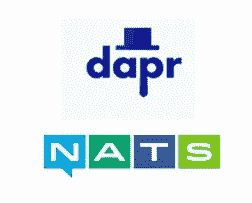
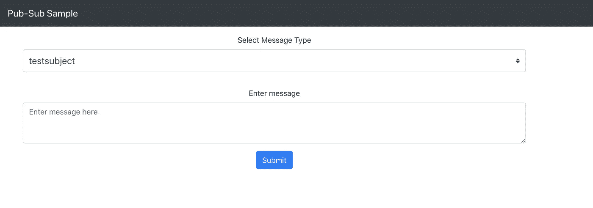

# 了解如何使用 Dapr 和 NATS 连接您的微服务

> 原文：<https://itnext.io/learn-how-to-connect-your-microservices-using-dapr-and-nats-aafea432a6e8?source=collection_archive---------3----------------------->

[Dapr 版本 0.2.0](https://github.com/dapr/dapr/blob/master/docs/release_notes/v0.2.0.md) 附带了一堆添加到运行时的[新组件。其中一个组件包括具有](https://github.com/dapr/dapr/blob/master/docs/release_notes/v0.2.0.md#dapr-runtime) [NATS](https://nats.io/) 的 pubsub 功能，这是一个基于 [Go 的](https://golang.org/)开源消息系统，用于云原生应用、物联网消息和微服务架构。这个博客将提供如何使用它的一步一步的演练。

> *代码一如既往的在 GitHub* *上* [*可用*](https://github.com/abhirockzz/dapr-nats-pubsub)

我们将在`Kubernetes` ( `minikube`)部署`Dapr`，并在`demo.nats.io:4222`使用 NATS 服务器进行演示。



# 你好 Dapr！

[**Dapr**](http://dapr.io/) 代表*分布式应用运行时*。它是一个开源、可移植的运行时，通过将构建这类应用程序的最佳实践编入独立的组件，来帮助开发人员构建有弹性的、微服务无状态和有状态的应用程序。

如果你是 Dapr 的新手，我建议你从[概述](https://github.com/dapr/docs/blob/master/overview.md)和[概念](https://github.com/dapr/docs/tree/master/concepts)开始。尝试使用[入门指南](https://github.com/dapr/docs/tree/master/getting-started)，然后继续使用[样品](https://github.com/dapr/samples/blob/master/README.md)和[操作指南](https://github.com/dapr/docs/tree/master/howto)。随着进一步深入，您可以深入了解 [Dapr 运行时 API 参考](https://github.com/dapr/docs/tree/master/reference/api)和[单个组件](https://github.com/dapr/components-contrib)

# 设置

安装 [Dapr CLI](https://github.com/dapr/cli) (需要安装`Docker`)。遵循文档-[https://github . com/dapr/docs/blob/master/getting-started/environment-setup . MD](https://github.com/dapr/docs/blob/master/getting-started/environment-setup.md)

如果你在苹果电脑上，只需:

```
curl -fsSL https://raw.githubusercontent.com/dapr/cli/master/install/install.sh | /bin/bash
```

将`Dapr`安装到`Kubernetes`(为了简单起见，我们将使用`minikube`)。如果需要，请参见安装 minikube 的文档。

一旦`minikube`设置好，确保你启动它

```
minikube start
```

现在您只需要一个命令就可以在 Kuberneres 上安装 Dapr 了！

```
dapr init --kubernetes
```

您应该会看到这条消息

```
Success! Dapr has been installed. To verify, run 'kubectl get pods -w' in your terminal
```

> *如果你想使用* `*Helm*` *安装* `*Dapr*` *，请查看*[*https://github . com/dapr/docs/blob/master/getting-started/environment-setup . MD # using-helm-advanced*](https://github.com/dapr/docs/blob/master/getting-started/environment-setup.md#using-helm-advanced)

为了确认，当 Dapr 吊舱处于`Running`状态时，使用以下命令并继续。相关的 pod 包括 Dapr 操作员、Dapr 边车注射器和 Dapr 位置

```
kubectl get pods -w
```

你已经准备好了！

# 尝试与 NATS 公共订阅 Dapr

从克隆 repo 开始，并切换到正确的目录

```
git clone https://github.com/abhirockzz/dapr-nats-pubsub
cd dapr-nats-pubsub
```

## 部署 NATS 发布订阅组件

一个`Component`是一个 Dapr CRD(自定义资源定义)。这是配置——注意，我们在`demo.nats.io:4222`使用的是由`natsURL`指定的演示 NATS 服务器

```
apiVersion: dapr.io/v1alpha1
kind: Component 
metadata:
  name: messagebus-nats
spec:
  type: pubsub.nats
  metadata:
  - name: natsURL
    value: nats://demo.nats.io:4222
```

要创建:

```
kubectl apply -f deploy/nats-pubsub.yaml
//component.dapr.io/messagebus-nats created
```

确认:

```
kubectl get component.dapr.io NAME              AGE
messagebus-nats   12s
```

# 部署订户应用程序

这是一个简单的应用程序，订阅了一个名为`testsubject`的主题。

```
http.HandleFunc(**"/dapr/subscribe"**, func(w http.ResponseWriter, r *http.Request) {
	response := `["` + natsSubject + `"]`
	fmt.Println("subscribed to NATS subject", natsSubject)
	w.Write([]byte(response))
})
```

应用程序本身被定义为 Kubernetes `Deployment`资源。它使用注释来确保 Dapr 边车是“注入”的

```
dapr.io/enabled: "true"
dapr.io/id: "natsapp"
dapr.io/port: "8080"
dapr.io/log-level: "debug"
```

要创建应用程序:

```
kubectl apply -f deploy/app.yaml
```

> *部署使用预构建的 Docker 映像(* `*abhirockzz/dapr-nats-pubsub*` *)，但是您可以使用* `*nats-app*` *文件夹*中提供的 `*Dockerfile*` *构建自己的映像*

检查新的`Pod`并等待其`transition`到`Running`状态

```
kubectl get pods -l=app=natsapp -w
```

此时，您可以检查应用程序以及 Dapr sidecar 容器的日志

```
//for the app
kubectl logs <POD_NAME> -c natsapp//logs for the Dapr sidecar
kubectl logs <POD_NAME> -c daprd
```

对于该应用程序，您应该只看到以下日志，这些日志表明该应用程序已经订阅了 NATS 主题，并且正在侦听进一步的消息

```
starting HTTP server....
subscribed to NATS subject testsubject
```

对于 Dapr sidecar，您应该看到类似这样的内容—请注意，NATS pubsub 组件设置正确，Dapr 能够连接到 NATS 并订阅组件中指定的 NATS 服务器。

```
time="2019-11-19T10:00:18Z" level=info msg="starting Dapr Runtime -- version 0.2.0 -- commit c75b111"
time="2019-11-19T10:00:18Z" level=info msg="log level set to: debug"
time="2019-11-19T10:00:18Z" level=info msg="kubernetes mode configured"
time="2019-11-19T10:00:18Z" level=info msg="dapr id: natsapp"
**time="2019-11-19T10:00:19Z" level=info msg="loaded component messagebus-nats (pubsub.nats)"** time="2019-11-19T10:00:19Z" level=info msg="application protocol: http. waiting on port 8080"
time="2019-11-19T10:00:19Z" level=info msg="application discovered on port 8080"
**time="2019-11-19T10:00:20Z" level=debug msg="connected to nats at nats://demo.nats.io:4222"
time="2019-11-19T10:00:20Z" level=debug msg="nats: subscribed to subject testsubject with queue group natsapp"** time="2019-11-19T10:00:20Z" level=warning msg="failed to init actors: actors: state store must be present to initialize the actor runtime"
time="2019-11-19T10:00:20Z" level=info msg="http server is running on port 3500"
time="2019-11-19T10:00:20Z" level=info msg="gRPC server is running on port 50001"
time="2019-11-19T10:00:20Z" level=info msg="dapr initialized. Status: Running. Init Elapsed 1211.203177ms"
```

开始跟踪应用程序日志，因为您将需要检查端到端的功能

```
kubectl logs -f <POD_NAME> -c natsapp
```

## 部署客户端应用程序

客户端应用程序是一个 React 前端应用程序，它是从 [Dapr samples repo](https://github.com/dapr/samples) 中挑选出来的，并且为了这个场景的目的已经做了非常小的修改

切换到新的终端部署客户端应用程序。这也是一个 Kubernetes `Deployment`。它还包括一个`LoadBalancer`,这样我们就可以在浏览器中访问这个应用程序

```
kubectl apply -f deploy/react-app.yaml
```

等待应用程序被部署

```
kubectl get pods -l=app=react-form -w
```

一旦部署完毕，您就可以检查端到端的事件流了。

## 使用前端应用程序制作/发布消息

由于我们使用的是`minikube`，我们可以在浏览器中打开 React 应用程序:

```
minikube service react-form
```

您应该会看到以下屏幕:



`testsubject`是我们要向其发送消息的 NATS 主题(忽略下拉列表中的其他主题)。只需输入信息并按下`Submit`按钮。这将使用 NATS 发布订阅组件的发布者部分，并向位于`demo.nats.io:4222`的 NATS 服务器发送一条消息

检查跟踪订户应用程序日志的另一个终端——您应该看到日志以及您发送的消息，例如

```
Recieved Message from NATS - {"id":"48825607-1f10-4789-8d99-84b927c1900e","source":"react-form","type":"com.dapr.event.sent","specversion":"0.3","datacontenttype":"application/json","data":{"messageType":"testsubject","message":"looking dapr"}}
```

消息封装在`Cloud Events`有效载荷中。你可以多发几条信息，复查一下结果。

## 水平缩放…

到目前为止，我们只有一个订户应用程序实例。Dapr 中的 NATS pubsub 组件作为队列订阅者工作，这意味着您可以生成更多的实例，来自 NATS 服务器的事件将在它们之间分发。这导致了可水平扩展的系统

要扩大我们的部署:

```
kubectl scale deployment/natsapp --replicas=2
```

等待新应用程序`Pod`启动

```
kubectl get pods -l=app=natsapp -w
```

一旦准备好了，就开始跟踪日志，就像第一个实例一样

```
kubectl logs -f <NAME_OF_NEW_POD> -c natsapp
```

使用前端应用程序发送消息，并确认它们将在两个实例之间分发。您可以进一步扩展应用程序，并确认行为保持不变。

## 换个应用怎么样？

想象一下，你有一个完全不同的应用程序，它也想处理来自相同主题的消息，但处理它们的方式与现有的应用程序不同。好吧，你可以创建一个新的 Dapr 驱动的应用程序，方法和现有的一样，包括你的处理逻辑，并把它部署到 Kubernetes。它也将收到与早期应用程序相同的一组消息。

# 摘要

在这篇博文中，你看到了如何使用 NATS 作为一个公共订阅层在你的 Dapr 应用之间进行通信。您的应用程序甚至不知道 NATS——它所做的只是使用 Dapr HTTP API 与 Dapr 运行时(只是一个 sidecar)进行交互！

> *使用 gRPC 或特定语言的 SDK 也是可行的*

在撰写本文时，`Dapr`处于 alpha 状态(`v0.2.0`)，并乐于接受社区贡献😃游览 https://github.com/dapr/dapr尽情享受吧！

如果你觉得这篇文章有帮助，请喜欢并关注🙌很高兴通过 [Twitter](https://twitter.com/abhi_tweeter) 获得反馈或发表评论。