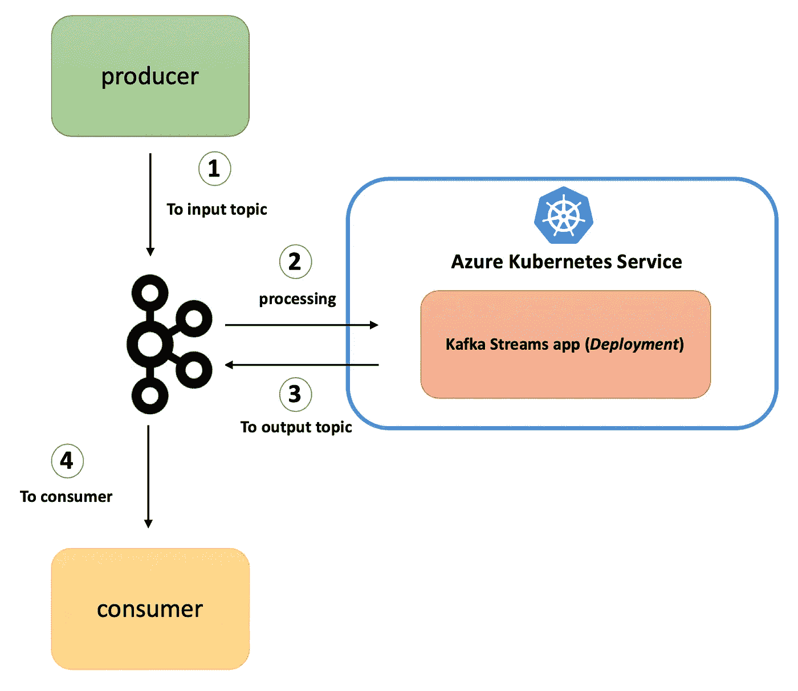

# 如何在 Kubernetes 上运行 Kafka Streams 应用程序

> 原文：<https://itnext.io/learn-how-to-develop-a-kafka-streams-application-for-data-processing-and-deploy-it-to-kubernetes-231d4cbb0688?source=collection_archive---------2----------------------->

## 开发由 Kafka 和 Kubernetes 支持的无状态数据处理应用程序

这是一个由三部分组成的博客系列，涵盖了 Kafka Streams 在 Kubernetes 上的应用

*   第 1 部分——这篇博文
*   第 2 部分— [如何在 Kubernetes 上运行有状态的 Kafka Streams 应用程序](/how-to-use-kubernetes-to-deploy-stateful-kafka-streams-applications-872c77f03c3a)
*   第 3 部分— [对 Kubernetes 上的 Kafka Streams 应用程序进行健康检查](/health-checks-for-kafka-streams-application-on-kubernetes-e9c5e8c21b0d)

本教程将指导您如何使用 [Kafka Streams](https://kafka.apache.org/documentation/streams/) 库构建无状态流处理应用程序，并在 Azure (AKS) 上的 [Kubernetes 集群中运行它。](https://docs.microsoft.com/azure/aks/?WT.mc_id=medium-blog-abhishgu)

当您完成此操作时，您将了解以下内容:

*   什么是卡夫卡溪流？
*   如何在 Azure 上设置和配置 Docker 容器注册表和 Kubernetes 集群
*   使用 Kafka 流的流处理逻辑的 Java 代码中发生了什么
*   如何在 Kubernetes 上构建和部署我们的应用程序，并最终使用 Kafka CLI 进行测试

源代码在 GitHub 上的

> *在这篇博客的最后有一个所有 CLI 命令的列表*

在我们开始之前，这里有一个最终状态的快照。



# 卡夫卡流概述

它是一个简单的轻量级客户端库，可以很容易地嵌入到任何 Java app 或微服务中，其中的输入输出数据存储在 [Kafka clusters](https://kafka.apache.org/) 中。除了 Kafka 本身和它的分区模型之外，它对其他系统没有外部依赖性，可以水平扩展处理，同时保持强大的排序保证。它支持容错本地状态，采用一次一条记录处理来实现毫秒级处理延迟，并提供必要的流处理原语，以及一个[高级流 DSL](https://kafka.apache.org/23/documentation/streams/developer-guide/dsl-api.html) 和一个[低级处理器 API](https://kafka.apache.org/23/documentation/streams/developer-guide/processor-api.html) 。“状态存储”和“交互式查询”的组合允许您从应用程序外部利用应用程序的状态。

# 先决条件:

如果你还没有，请[安装 Azure CLI](https://docs.microsoft.com/cli/azure/install-azure-cli?view=azure-cli-latest&WT.mc_id=medium-blog-abhishgu) 和 [kubectl](https://kubernetes.io/docs/tasks/tools/install-kubectl/) 。流处理应用程序是用 Java 编写的，使用 [Maven](https://maven.apache.org/install.html) ，你还需要 [Docker](https://docs.docker.com/install/) 来构建应用程序容器映像。

> *本教程假设您有一个 Kafka 集群，可以从 Azure 上的 Kubernetes 集群访问该集群*

# AKS 集群设置

你只需要一个命令就可以在 Azure 上建立一个 Kubernetes 集群。但是，在此之前，我们必须创建一个资源组

```
export AZURE_SUBSCRIPTION_ID=[to be filled]
export AZURE_RESOURCE_GROUP=[to be filled]
export AZURE_REGION=[to be filled] (e.g. southeastasia)
```

切换到您的套餐并调用`az group create`

```
az account set -s $AZURE_SUBSCRIPTION_ID
az group create -l $AZURE_REGION -n $AZURE_RESOURCE_GROUP
```

您现在可以调用`az aks create`来创建新的集群

> 为了简单起见，下面的命令创建了一个单节点集群。按照你的要求随意改变规格

```
export AKS_CLUSTER_NAME=[to be filled]az aks create --resource-group $AZURE_RESOURCE_GROUP --name $AKS_CLUSTER_NAME --node-count 1 --node-vm-size Standard_B2s --node-osdisk-size 30 --generate-ssh-keys
```

使用`az aks get-credentials`获取 AKS 集群凭证——因此，`kubectl`现在将指向您的新集群。你可以证实这一点

```
az aks get-credentials --resource-group $AZURE_RESOURCE_GROUP --name $AKS_CLUSTER_NAME
kubectl get nodes
```

> *如果你有兴趣学习 Kubernetes 和 Containers 使用* [*Azure*](https://azure.microsoft.com/services/kubernetes-service/?WT.mc_id=medium-blog-abhishgu) *，只需* [*创建一个* ***免费*** *账号*](https://azure.microsoft.com/en-us/free/?WT.mc_id=medium-blog-abhishgu) *就可以开始了！一个好的起点是使用文档中的* [*快速入门、教程和代码示例*](https://docs.microsoft.com/azure/aks/?WT.mc_id=medium-blog-abhishgu) *来熟悉该服务。我也强烈推荐查看一下* [*50 天 Kubernetes 学习路径*](https://azure.microsoft.com/resources/kubernetes-learning-path/?WT.mc_id=medium-blog-abhishgu) *。高级用户可能希望参考* [*Kubernetes 最佳实践*](https://docs.microsoft.com/azure/aks/best-practices?WT.mc_id=medium-blog-abhishgu) *或观看一些* [*视频*](https://azure.microsoft.com/resources/videos/index/?services=kubernetes-service&WT.mc_id=medium-blog-abhishgu) *以了解演示、主要功能和技术会议。*

# 设置 Azure 容器注册表

简单地说， [Azure Container Registry](https://azure.microsoft.com/services/container-registry/?WT.mc_id=medium-blog-abhishgu) (简称`ACR`)是云中的一个托管私有 Docker 注册表，它允许您为所有类型的容器部署构建、存储和管理映像。

首先创建一个 ACR 实例

```
export ACR_NAME=[to be filled]
az acr create --resource-group $AZURE_RESOURCE_GROUP --name $ACR_NAME --sku Basic
```

> *有效的 SKU 值——*`*Basic*`*`*Classic*`*`*Premium*`*`*Standard*`*。参见* [*命令文档*](https://docs.microsoft.com/cli/azure/acr?view=azure-cli-latest&WT.mc_id=medium-blog-abhishgu#az-acr-create)***

# **配置 ACR 以使用 AKS**

**要访问存储在 ACR 中的图像，您必须授予 AKS 服务主体从 ACR 提取图像的正确权限。**

**获取与您的 AKS 集群相关联的服务主体的`appId`**

```
**AKS_SERVICE_PRINCIPAL_APPID=$(az aks show --name $AKS_CLUSTER_NAME --resource-group $AZURE_RESOURCE_GROUP --query servicePrincipalProfile.clientId -o tsv)**
```

**查找 ACR 资源 ID**

```
**ACR_RESOURCE_ID=$(az acr show --resource-group $AZURE_RESOURCE_GROUP --name $ACR_NAME --query "id" --output tsv)**
```

**授予 AKS 服务主体`acrpull`权限**

```
**az role assignment create --assignee $AKS_SERVICE_PRINCIPAL_APPID --scope $ACR_RESOURCE_ID --role acrpull**
```

**关于这个话题的更多细节，请看我之前的一篇博客**

**好了，我们的 AKS 集群和 ACR 已经可以使用了！让我们换个话题，看看 Kafka Streams 代码——它很简洁，为了本教程的目的，它一直保持简单。**

# **流处理代码**

****

**处理管道做的事情非常简单。它利用了[高级流 DSL](https://kafka.apache.org/23/documentation/streams/developer-guide/dsl-api.html) API:**

*   **从输入/源 Kafka 主题接收单词**
*   **将其转换为大写**
*   **将记录存储在输出 Kafka 主题(接收器)中**

**请不要忘记，在写这篇文章的时候，最新的 Kafka Streams 库版本是`2.3.0`，这就是这个应用程序所使用的**

```
 **<dependency>
        <groupId>org.apache.kafka</groupId>
        <artifactId>kafka-streams</artifactId>
        <version>2.3.0</version>
    </dependency>**
```

**我们从`StreamsBuilder`的一个实例开始，调用它的`stream`方法来挂钩源主题(名称:`lower-case`)。我们得到的是一个`[KStream](https://kafka.apache.org/23/javadoc/org/apache/kafka/streams/kstream/KStream.html)` [对象](https://kafka.apache.org/23/javadoc/org/apache/kafka/streams/kstream/KStream.html)，它表示发送到主题`lower-case`的连续记录流。请注意，输入记录只是键值对。**

```
**StreamsBuilder builder = new StreamsBuilder();
    KStream<String, String> lowerCaseStrings = builder.stream(INPUT_TOPIC);**
```

**好了，我们有了对象形式的记录——我们该怎么处理它们呢？我们如何处理它们？在这种情况下，我们所做的就是应用一个简单的`transformation`，使用`mapValues`将记录(值，而不是键)转换成大写字母。这给了我们另一个`KStream`实例- `upperCaseStrings`，我们通过调用`to`方法将它的记录推送到一个名为`upper-case`的接收器主题。**

```
**KStream<String, String> upperCaseStrings = lowerCaseStrings.mapValues(new ValueMapper<String, String>() {
        @Override
        public String apply(String str) {
            return str.toUpperCase();
        }
    });
    upperCaseStrings.to(OUTPUT_TOPIC);**
```

**这就是建立流程和定义逻辑的全部内容。我们使用`StreamsBuilder`中的`build`方法创建一个`Topology`对象，并使用这个对象创建一个`[KafkaStreams](https://kafka.apache.org/23/javadoc/org/apache/kafka/streams/KafkaStreams.html)`实例，它是我们的应用程序本身的表示。我们使用`start`方法开始流处理**

```
**Topology topology = builder.build();
    KafkaStreams streamsApp = new KafkaStreams(topology, getKafkaStreamsConfig());
    streamsApp.start();**
```

**`getKafkaStreamsConfig()`只是一个帮助器方法，它创建一个`[Properties](https://docs.oracle.com/javase/8/docs/api/java/util/Properties.html?is-external=true)`对象，该对象包含 Kafka Streams 的特定配置，包括 Kafka broker 端点等。**

```
**static Properties getKafkaStreamsConfig() {
    String kafkaBroker = System.getenv().get(KAFKA_BROKER_ENV_VAR);
    Properties configurations = new Properties();
    configurations.put(StreamsConfig.BOOTSTRAP_SERVERS_CONFIG, kafkaBroker + ":9092");
    configurations.put(StreamsConfig.APPLICATION_ID_CONFIG, APP_ID);
    configurations.put(StreamsConfig.DEFAULT_KEY_SERDE_CLASS_CONFIG, Serdes.String().getClass().getName());
    configurations.put(StreamsConfig.DEFAULT_VALUE_SERDE_CLASS_CONFIG, Serdes.String().getClass().getName());
    configurations.put(StreamsConfig.REQUEST_TIMEOUT_MS_CONFIG, "20000");
    configurations.put(StreamsConfig.RETRY_BACKOFF_MS_CONFIG, "500"); return configurations;
}**
```

**代码到此为止。是时候部署了！**

# **从您的笔记本电脑到云中的 Docker 注册表**

**克隆 GitHub repo，切换到正确的目录并构建应用程序 JAR**

```
**git clone https://github.com/abhirockzz/kafka-streams-kubernetes
cd kafka-streams-kubernetes
mvn clean isntall**
```

> ***你应该看到* `*target*` *目录下的* `*kstreams-lower-to-upper-1.0.jar*`**

***这是我们的流处理应用程序的`Dockerfile`***

```
***FROM openjdk:8-jre
WORKDIR /
COPY target/kstreams-lower-to-upper-1.0.jar /
CMD ["java", "-jar","kstreams-lower-to-upper-1.0.jar"]***
```

***我们现在将构建一个 Docker 映像…***

```
***export DOCKER_IMAGE=kstreams-lower-to-upper:v1
export ACR_SERVER=$ACR_NAME.azurecr.io
docker build -t $DOCKER_IMAGE .***
```

***…并将其推送到 [Azure 容器注册表](https://azure.microsoft.com/services/container-registry/?WT.mc_id=medium-blog-abhishgu)***

```
***az acr login --name $ACR_NAME
docker tag $DOCKER_IMAGE $ACR_SERVER/$DOCKER_IMAGE
docker push $ACR_SERVER/$DOCKER_IMAGE***
```

***完成后，您可以使用`az acr repository list`进行确认***

```
***az acr repository list --name $ACR_NAME --output table***
```

# ***部署到 Kubernetes***

***我们的应用程序是一个无状态处理器，我们将把它部署为一个具有两个实例(副本)的 Kubernetes `Deployment`。***

***如果您对管理无状态应用程序的原生 Kubernetes 原语感兴趣，请查看这个博客***

***文件`kstreams-deployment.yaml`包含规范`Deployment`，它将代表我们的流处理应用程序。您需要修改它，根据您的环境添加以下信息***

*   ***Azure 容器注册名(您之前使用`ACR_NAME`指定的)***
*   ***您的 Kafka 经纪人的端点，例如`my-kafka:9092`***

***部署和确认***

```
***kubectl apply -f kstreams-deployment.yaml
kubectl get pods -l=app=kstream-lower-to-upper***
```

***您应该会看到两个 pod 处于`Running`状态***

# ***关键时刻到了。***

***是时候测试我们的端到端流程了。总结一下:***

*   ***您将在本地使用 Kafka CLI 向输入 Kafka 主题(`lower-case`)生成数据***
*   ***AKS 中的流处理应用程序将搅动数据，并将其放回另一个 Kafka 主题***
*   ***您的本地基于 Kafka CLI 的消费者进程将从输出主题(`upper-case`)中获取该数据***

******

***让我们先创造卡夫卡的主题***

```
***export KAFKA_HOME=[kafka installation directory]
export INPUT_TOPIC=lower-case
export OUTPUT_TOPIC=upper-case$KAFKA_HOME/bin/kafka-topics.sh --create --topic $INPUT_TOPIC --partitions 2 --replication-factor 1 --bootstrap-server $KAFKA_BROKER
$KAFKA_HOME/bin/kafka-topics.sh --create --topic $OUTPUT_TOPIC --partitions 2 --replication-factor 1 --bootstrap-server $KAFKA_BROKER$KAFKA_HOME/bin/kafka-topics.sh --list --bootstrap-server $KAFKA_BROKER***
```

# ***启动消费者流程***

```
***export KAFKA_HOME=[kafka installation directory]
export KAFKA_BROKER=[kafka broker e.g. localhost:9092]
export OUTPUT_TOPIC=upper-case$KAFKA_HOME/bin/kafka-console-consumer.sh --bootstrap-server 
$KAFKA_BROKER --topic $OUTPUT_TOPIC --from-beginning***
```

# ***启动生产者进程(不同的终端)***

```
***export KAFKA_HOME=[kafka installation directory]
export KAFKA_BROKER=[kafka broker e.g. localhost:9092]
export INPUT_TOPIC=lower-case$KAFKA_HOME/bin/kafka-console-producer.sh --broker-list $KAFKA_BROKER --topic $INPUT_TOPIC***
```

***您将看到一个提示，然后您可以开始输入值，例如***

```
***> foo
> bar
> baz
> john
> doe***
```

***等待几秒钟，检查终端窗口。你应该看到以上记录的大写形式，即`FOO`、`BAR`等。***

# ***打扫***

***清理 AKS 集群、ACR 实例和相关资源***

```
***az group delete --name $AZURE_RESOURCE_GROUP --yes --no-wait***
```

***(如承诺的那样)***

# ***方便的命令列表..***

***..供您参考***

## ***蓝色库伯内特服务***

*   ***`[az aks create](https://docs.microsoft.com/cli/azure/aks?view=azure-cli-latest&WT.mc_id=medium-blog-abhishgu#az-aks-create)` -创建新的托管 Kubernetes 集群***
*   ***`[az aks get-credentials](https://docs.microsoft.com/cli/azure/aks?view=azure-cli-latest&WT.mc_id=medium-blog-abhishgu#az-aks-get-credentials)` -获取受管 Kubernetes 集群的访问凭证***
*   ***`[az aks show](https://docs.microsoft.com/cli/azure/aks?view=azure-cli-latest&WT.mc_id=medium-blog-abhishgu#az-aks-show)` -显示被管理的 Kubernetes 集群的详细信息***

## ***Azure 容器注册表***

*   ***`[az acr create](https://docs.microsoft.com/cli/azure/acr?view=azure-cli-latest&WT.mc_id=medium-blog-abhishgu#az-acr-create)` -创建 Azure 容器注册中心***
*   ***`[az acr show](https://docs.microsoft.com/cli/azure/acr?view=azure-cli-latest&WT.mc_id=medium-blog-abhishgu#az-acr-show)` -获取 Azure 容器注册表的详细信息***
*   ***`[az acr login](https://docs.microsoft.com/cli/azure/acr?view=azure-cli-latest&WT.mc_id=medium-blog-abhishgu#az-acr-login)` -通过 Docker CLI 登录 Azure 容器注册中心***
*   ***`[az acr repository list](https://docs.microsoft.com/cli/azure/acr/repository?view=azure-cli-latest&WT.mc_id=medium-blog-abhishgu#az-acr-repository-list)` -在 Azure 容器注册表中列出存储库。***

## ***通用命令***

*   ***`[az account set](https://docs.microsoft.com/cli/azure/account?view=azure-cli-latest&WT.mc_id=medium-blog-abhishgu#az-account-set)` -将订阅设置为当前活动的订阅***
*   ***`[az group create](https://docs.microsoft.com/cli/azure/group?view=azure-cli-latest&WT.mc_id=medium-blog-abhishgu#az-group-create)` -创建新的资源组***
*   ***`[az role assignment create](https://docs.microsoft.com/cli/azure/role/assignment?view=azure-cli-latest&WT.mc_id=medium-blog-abhishgu#az-role-assignment-create)` -为用户、组或服务主体创建新的角色分配***

***如果你觉得这篇文章有帮助，请喜欢并关注！很高兴通过 [@abhi_tweeter](https://twitter.com/abhi_tweeter) 获得反馈，或者发表评论:-)***

***[](https://twitter.com/abhi_tweeter) [## 阿布舍克

### Abhishek 的最新推文(@abhi_tweeter)。云开发者🥑@Microsoft @azureadvocates |…

twitter.com](https://twitter.com/abhi_tweeter)***