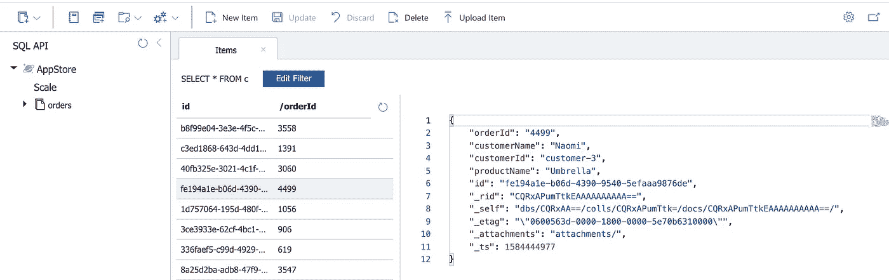

# 了解如何使用 Azure 函数处理来自 Azure Event Hubs 的数据，并持久化到 Azure Cosmos DB

> 原文：<https://itnext.io/learn-how-to-use-azure-functions-to-process-data-from-azure-event-hubs-and-persist-to-azure-cosmos-e61794776dd?source=collection_archive---------3----------------------->

[之前的一篇博客](/azure-event-hubs-multi-protocol-support-d0e41834510b)讲述了 [Azure Event Hubs](https://docs.microsoft.com/azure/event-hubs/?WT.mc_id=medium-blog-abhishgu) 如何支持[多协议](https://docs.microsoft.com/azure/event-hubs/event-hubs-exchange-events-different-protocols?WT.mc_id=devto-blog-abhishgu)进行数据交换的一些概念。在这篇博客中，我们将通过一个例子来看看它的实际应用。借助示例应用程序，您将看到如何将实时数据接收组件与无服务器处理层结合起来。

示例应用程序具有以下组件:

*   Azure 事件中心[和 Kafka 端点](https://docs.microsoft.com/azure/event-hubs/event-hubs-for-kafka-ecosystem-overview?WT.mc_id=devto-blog-abhishgu)
*   将数据推送到事件中心主题的生产者应用程序
*   一个使用 [Azure Functions](https://docs.microsoft.com/azure/azure-functions/?WT.mc_id=devto-blog-abhishgu) 构建的无服务器应用程序，它从事件中心消费、丰富并最终存储在 [Azure Cosmos DB](https://docs.microsoft.com/azure/cosmos-db/?WT.mc_id=devto-blog-abhishgu) 中

为了跟进并将该解决方案部署到 Azure，您将需要一个 [Microsoft Azure](https://docs.microsoft.com/azure/cosmos-db/create-cosmosdb-resources-portal?WT.mc_id=devto-blog-abhishgu) 帐户。[还没有的可以免费抢一个](https://azure.microsoft.com/free/?WT.mc_id=devto-blog-abhishgu)！

## 应用程序组件

让我们来看看应用程序的各个组件

> *一如既往的，* [*代码在 GitHub*](https://github.com/abhirockzz/eventhubs-functions-cosmosdb-example) 上可用

**生产者成分**

这非常简单——这是一个 Go 应用程序，它使用 [Sarama Kafka 客户端](https://github.com/Shopify/sarama)向 Azure Event Hubs (Kafka 主题)发送(模拟)`"orders"`。为便于使用，它以 [Docker 图像](https://hub.docker.com/r/abhirockzz/eventhubs-kafka-producer)的形式提供(详情见下一节)

以下是相关的代码片段:

```
order := Order{OrderID: "order-1234", CustomerID: "customer-1234", Product: "product-1234"}b, err := json.Marshal(order)msg := &sarama.ProducerMessage{Topic: eventHubsTopic, Key: sarama.StringEncoder(oid), Value: sarama.ByteEncoder(b)}
producer.SendMessage(msg)
```

(从上面的片段中)省略了很多细节——你可以在这里搜索[的完整代码](https://github.com/abhirockzz/eventhubs-functions-cosmosdb-example/blob/master/eventhubs-kafka-producer/producer.go)。总而言之，创建一个`Order`，将其转换(编组)成 JSON ( `bytes`)并发送到事件中心 Kafka endpoint。

**无服务器组件**

`Serverless`部分是一个 [Java Azure 函数](https://docs.microsoft.com/azure/azure-functions/functions-reference-java?WT.mc_id=devto-blog-abhishgu)。它利用了以下功能:

*   [Azure 事件中心触发](https://docs.microsoft.com/azure/azure-functions/functions-bindings-event-hubs-trigger?tabs=java&WT.mc_id=devto-blog-abhishgu)，以及
*   [Azure Cosmos DB 输出绑定](https://docs.microsoft.com/azure/azure-functions/functions-bindings-cosmosdb-v2-output?tabs=java&WT.mc_id=devto-blog-abhishgu)

*触发器*允许 Azure 函数逻辑在`order`事件被发送到 Azure 事件中心时被调用。*输出绑定*负责所有繁重的工作，比如建立数据库连接、伸缩、并发等。剩下我们要构建的就是业务逻辑，在这种情况下，它非常简单——在从 Azure Event Hubs 接收到`order`数据后，该函数用额外的信息(在这种情况下是客户和产品名称)丰富它，并将它保存在一个 [Azure Cosmos DB 容器](https://docs.microsoft.com/azure/cosmos-db/databases-containers-items?WT.mc_id=devto-blog-abhishgu)中。

你可以在 Github 上查看`[OrderProcessor](https://github.com/abhirockzz/eventhubs-functions-cosmosdb-example/blob/master/consumer-azure-function/src/main/java/com/abhirockzz/OrderProcessor.java)` [代码，不过这里是要点:](https://github.com/abhirockzz/eventhubs-functions-cosmosdb-example/blob/master/consumer-azure-function/src/main/java/com/abhirockzz/OrderProcessor.java)

```
@FunctionName("storeOrders")
public void storeOrders( @EventHubTrigger(name = "orders", eventHubName = "", connection = 
  "EventHubConnectionString", cardinality = Cardinality.ONE) 
  OrderEvent orderEvent, @CosmosDBOutput(name = "databaseOutput", databaseName = "AppStore", 
  collectionName = "orders", connectionStringSetting = 
  "CosmosDBConnectionString") 
  OutputBinding<Order> output, final ExecutionContext context) {
....Order order = new Order(orderEvent.getOrderId(),Data.CUSTOMER_DATA.get(orderEvent.getCustomerId()), orderEvent.getCustomerId(),Data.PRODUCT_DATA.get(orderEvent.getProduct());
output.setValue(order);....
}
```

`storeOrders`方法用`[@FunctionName](https://docs.microsoft.com/java/api/com.microsoft.azure.functions.annotation.functionname?view=azure-java-stable&WT.mc_id=devto-blog-abhishgu)`注释，它以`OrderEvent`对象的形式从事件中心接收数据。多亏了`[@EventHubTrigger](https://docs.microsoft.com/java/api/com.microsoft.azure.functions.annotation.eventhubtrigger?view=azure-java-stable&WT.mc_id=devto-blog-abhishgu)`注释，平台负责将事件中心的有效负载转换成 Java `POJO`(类型为`OrderEvent`)并正确路由它。`connection = "EventHubConnectionString"`部分指定[事件集线器连接字符串](https://docs.microsoft.com/azure/event-hubs/event-hubs-get-connection-string?WT.mc_id=devto-blog-abhishgu)在名为`EventHubConnectionString`的[功能配置/设置](https://docs.microsoft.com/azure/azure-functions/functions-how-to-use-azure-function-app-settings?WT.mc_id=devto-blog-abhishgu#settings)中可用

`[@CosmosDBOutput](https://docs.microsoft.com/java/api/com.microsoft.azure.functions.annotation.cosmosdboutput?view=azure-java-stable&WT.mc_id=devto-blog-abhishgu)`注释用于持久化 Azure Cosmos DB 中的数据。它包含 Cosmos DB 数据库和容器名，以及将从函数中的`CosmosDBConnectionString`配置参数中选取的连接字符串。POJO(在本例中是`Order`)通过对`[OutputBinding](https://docs.microsoft.com/java/api/com.microsoft.azure.functions.outputbinding?view=azure-java-stable&WT.mc_id=devto-blog-abhishgu)`对象的一个`setValue`方法调用被持久化到 Cosmos DB——这个平台让这变得非常简单，但是在幕后还有很多事情要做！

让我们换个话题，学习如何将解决方案部署到 Azure

## 先决条件

*注*

*   *理想情况下，所有组件(事件中心、Cosmos DB、存储和 Azure 功能)应该在同一个区域*
*   *建议* [*创建一个新的资源组*](https://docs.microsoft.com/cli/azure/group?view=azure-cli-latest&WT.mc_id=devto-blog-abhishgu#az-group-create) *对这些服务进行分组，以便于定位和删除*

以下是先决条件:

*   [微软 Azure](https://docs.microsoft.com/azure/cosmos-db/create-cosmosdb-resources-portal?WT.mc_id=devto-blog-abhishgu) 账号(如开头所述)
*   [创建一个支持 Kafka 的事件中心命名空间](https://docs.microsoft.com/azure/event-hubs/event-hubs-quickstart-kafka-enabled-event-hubs?WT.mc_id=devto-blog-abhishgu#create-a-kafka-enabled-event-hubs-namespace)
*   [创建 Azure Cosmos DB 组件](https://docs.microsoft.com/azure/cosmos-db/create-cosmosdb-resources-portal?WT.mc_id=devto-blog-abhishgu):账户、数据库和容器(请确保 Cosmos DB 数据库的名称是`AppStore`并且容器被命名为`orders`，因为这是 Azure 函数逻辑使用的)
*   创建一个 Azure 存储帐户 —这将由 Azure 函数使用

## 部署订单处理器功能

这个例子使用了 [Azure Functions Maven 插件](https://github.com/microsoft/azure-maven-plugins/wiki/Azure-Functions)进行部署。首先，更新`pom.xml`来添加所需的配置。

更换`<appSettings>`部分，更换`AzureWebJobsStorage`、`EventHubConnectionString`和`CosmosDBConnectionString`参数值

> [*使用 Azure CLI*](https://docs.microsoft.com/cli/azure/?view=azure-cli-latest&WT.mc_id=devto-blog-abhishgu) *轻松获取所需的详细信息*

*   对于`AzureWebJobsStorage`:获取 [Azure 存储连接字符串](https://docs.microsoft.com/cli/azure/storage/account?view=azure-cli-latest&WT.mc_id=devto-blog-abhishgu#az-storage-account-show-connection-string)
*   对于`EventHubConnectionString`:获取[事件中枢连接字符串](https://docs.microsoft.com/cli/azure/eventhubs/eventhub/authorization-rule/keys?view=azure-cli-latest&WT.mc_id=devto-blog-abhishgu#az-eventhubs-eventhub-authorization-rule-keys-list)
*   对于`CosmosDBConnectionString`:获取 [Cosmos DB 连接字符串](https://docs.microsoft.com/cli/azure/cosmosdb/keys?view=azure-cli-latest&WT.mc_id=devto-blog-abhishgu#az-cosmosdb-keys-list)

对于`configuration`部分，更新以下内容:

*   `resourceGroup`:要部署功能的资源组
*   `region`:您要部署功能的 Azure 区域([获取位置列表](https://docs.microsoft.com/cli/azure/account?view=azure-cli-latest&WT.mc_id=devto-blog-abhishgu#az-account-list-locations))

要进行部署，您需要两个命令:

*   `mvn clean package` -准备部署神器
*   `mvn azure-functions:deploy` -部署到 Azure

> *您可以使用 Azure CLI* `[*az functionapp list --query "[?name=='orders-processor']"*](https://docs.microsoft.com/cli/azure/functionapp?view=azure-cli-latest&WT.mc_id=devto-blog-abhishgu#az-functionapp-list)` *或门户*进行确认

## 运行事件中心生成器

设置环境变量:

```
export EVENTHUBS_BROKER=<namespace>.servicebus.windows.net:9093
export EVENTHUBS_TOPIC=<event-hub-name>
export EVENTHUBS_CONNECTION_STRING="Endpoint=sb://<namespace>.servicebus.windows.net/;SharedAccessKeyName=RootManageSharedAccessKey;SharedAccessKey=<primary_key>"
```

运行 Docker 映像

```
docker run -e EVENTHUBS_BROKER=$EVENTHUBS_BROKER -e EVENTHUBS_TOPIC=$EVENTHUBS_TOPIC -e EVENTHUBS_CONNECTION_STRING=$EVENTHUBS_CONNECTION_STRING abhirockzz/eventhubs-kafka-producer
```

> *按* `*ctrl+c*` *停止生产事件*

## 在 Azure Cosmos DB 中确认结果

您可以使用 [Azure Cosmos DB 数据浏览器](https://docs.microsoft.com/azure/cosmos-db/data-explorer?WT.mc_id=devto-blog-abhishgu) (web 界面)来检查容器中的项目。您应该会看到类似如下的结果:



## 打扫

假设您将所有服务放在同一个资源组中，您可以使用一个[命令](https://docs.microsoft.com/cli/azure/group?view=azure-cli-latest&WT.mc_id=devto-blog-abhishgu#az-group-delete)删除它们:

```
export RESOURCE_GROUP_NAME=<enter the name>
az group delete --name $RESOURCE_GROUP_NAME --no-wait
```

感谢阅读🙂很高兴通过 Twitter 获得您的反馈，或者发表评论🙏🏻敬请关注更多内容！