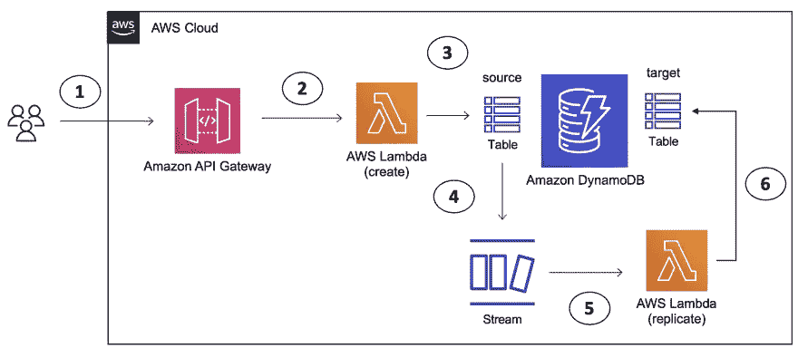
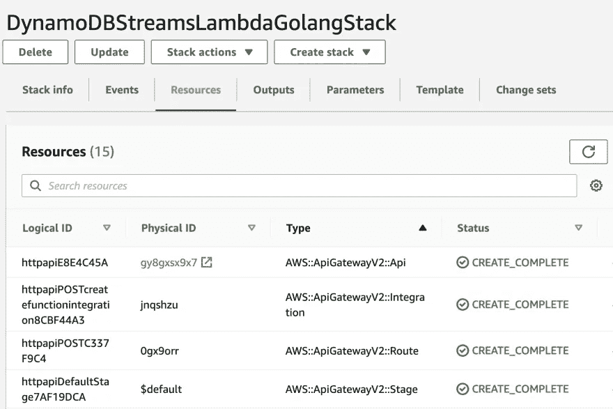
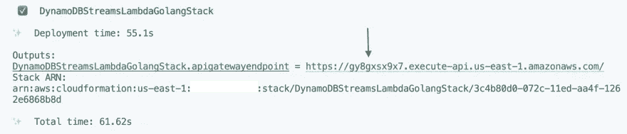
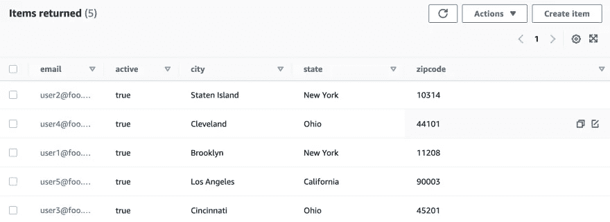
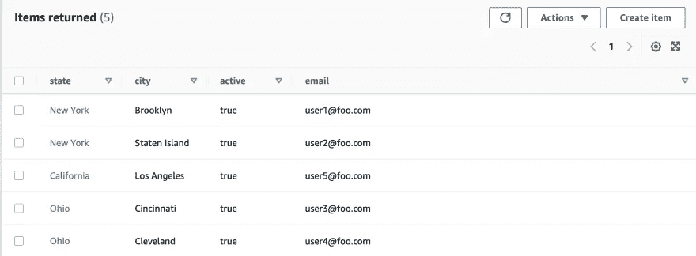

# 了解如何通过 AWS Lambda 和 Go 使用 DynamoDB 流

> 原文：<https://itnext.io/learn-how-to-use-dynamodb-streams-with-aws-lambda-and-go-f7abcee4d987?source=collection_archive---------3----------------------->

## 将 DynamoDB 数据从一个表复制到另一个表

这篇博文将帮助你使用 [Go](https://go.dev/) 快速开始使用 [DynamoDB 流](https://docs.aws.amazon.com/amazondynamodb/latest/developerguide/Streams.html)和 [AWS Lambda](https://docs.aws.amazon.com/lambda/latest/dg/welcome.html) 。它将介绍如何使用 AWS CDK 部署整个解决方案。

这里展示的用例非常简单。有几个`DynamoDB`表，目标是捕获其中一个表(也称为`source`表)中的数据，并将它们复制到另一个表(也称为`target`表)中，以便它可以服务于不同的查询。为了演示一个端到端的流程，还有一个 [Amazon API 网关](https://docs.aws.amazon.com/apigateway/latest/developerguide/welcome.html)，它前端有一个 Lambda 函数，该函数将数据保存在源`DynamoDB`表中。该表中的变化将触发另一个 Lambda 函数(多亏了 DynamoDB 流),该函数最终将数据复制到目标表中。



高层建筑

> [*全局或局部*](https://docs.aws.amazon.com/amazondynamodb/latest/developerguide/SecondaryIndexes.html) *二级指标提供类似功能。*

现在，您已经大致了解了我们在这里想要实现的目标…

# ..让我们开始吧！

在你继续之前，确保你已经安装了 [Go 编程语言](https://go.dev/dl/) ( **v1.16** 或更高版本)和 [AWS CDK](https://docs.aws.amazon.com/cdk/v2/guide/getting_started.html#getting_started_install) 。

克隆项目并切换到正确的目录:

```
git clone https://github.com/abhirockzz/dynamodb-streams-lambda-golangcd cdk
```

**开始部署…**

..你所需要做的就是运行一个命令(`cdk deploy`，然后等待一会儿。您将看到将要创建的资源列表，需要您确认才能继续。

不要担心，在下一部分，我将解释发生了什么。

```
cdk deploy# outputBundling asset DynamoDBStreamsLambdaGolangStack/ddb-streams-function/Code/Stage...✨  Synthesis time: 5.94sThis deployment will make potentially sensitive changes according to your current security approval level (--require-approval broadening).
Please confirm you intend to make the following modifications://.... omittedDo you wish to deploy these changes (y/n)? y
```

这将开始创建我们的应用程序所需的 AWS 资源。

> *如果您想查看将在后台使用的 AWS CloudFormation 模板，运行* `*cdk synth*` *并检查* `*cdk.out*` *文件夹*

您可以在终端中跟踪进度或导航到 AWS 控制台:`CloudFormation > Stacks > DynamoDBStreamsLambdaGolangStack`



AWS 云信息堆栈

一旦创建了所有的资源，您就可以试用这个应用程序了。你应该有:

*   两个λ函数
*   两个 DynamoDB 表(源和目标)
*   一个 API 网关(也是路由、集成)
*   以及其他一些人(如我的角色等。)

在继续之前，获取您将需要使用的 API 网关端点。它在堆栈输出中可用(在终端或 AWS CloudFormation 控制台的**输出**选项卡中，用于您的堆栈):



cdk 部署输出

# 端到端解决方案…

**首先在(源)DynamoDB 表中创建几个用户**

为此，使用适当的`JSON`有效负载调用 API 网关(HTTP)端点:

```
# export the API Gateway endpoint
export APIGW_ENDPOINT=<replace with API gateway endpoint above># for example:
export APIGW_ENDPOINT=https://gy8gxsx9x7.execute-api.us-east-1.amazonaws.com/# invoke the endpoint with JSON datacurl -i -X POST -d '{"email":"user1@foo.com", "state":"New York","city":"Brooklyn","zipcode": "11208"}' -H 'Content-Type: application/json' $APIGW_ENDPOINTcurl -i -X POST -d '{"email":"user2@foo.com", "state":"New York","city":"Staten Island","zipcode": "10314"}' -H 'Content-Type: application/json' $APIGW_ENDPOINTcurl -i -X POST -d '{"email":"user3@foo.com", "state":"Ohio","city":"Cincinnati","zipcode": "45201"}' -H 'Content-Type: application/json' $APIGW_ENDPOINTcurl -i -X POST -d '{"email":"user4@foo.com", "state":"Ohio","city":"Cleveland","zipcode": "44101"}' -H 'Content-Type: application/json' $APIGW_ENDPOINTcurl -i -X POST -d '{"email":"user5@foo.com", "state":"California","city":"Los Angeles","zipcode": "90003"}' -H 'Content-Type: application/json' $APIGW_ENDPOINT
```

导航到 AWS 控制台中的`DynamoDB`表，并确保已创建记录:

> *如果你对 AWS CLI 得心应手，你也可以试试* `*aws dynamodb scan --table <name of table>*`



源 DynamoDB 表中的数据

如果一切顺利，我们的复制功能应该也能工作。为了确认，您需要检查目标`DynamoDB`表。



目标 DynamoDB 表中的数据

> *请注意，* `*zipcode*` *属性丢失了——这是在本演示中故意这样做的。您可以挑选想要包含在目标表中的属性，并相应地编写函数逻辑。*

目标`DynamoDB`表将`state`作为分区键，将`city`作为排序键，您可以用不同的方式对其进行查询(相比之下，源表只能基于`email`进行查询)。

# 别忘了打扫卫生！

完成后，要删除所有服务，只需使用:

```
cdk destroy#output prompt (choose 'y' to continue)Are you sure you want to delete: DynamoDBStreamsLambdaGolangStack (y/n)?
```

厉害！您能够设置并尝试完整的解决方案。在我们结束之前，让我们快速浏览一下代码的一些重要部分，以便更好地理解幕后发生的事情。

# 代码走查

因为我们将只关注重要的部分，大量的代码(打印语句，错误处理等。)为简洁起见省略/注释掉。

**使用自动气象站 CDK 和 Go 进行红外线编码！**

> *你可以在这里参考* [*CDK 代码*](https://github.com/abhirockzz/dynamodb-streams-lambda-golang/blob/master/cdk/cdk.go)

我们首先创建一个 DynamoDB 表，并确保 DynamoDB 流是**启用的**。

```
sourceDynamoDBTable := awsdynamodb.NewTable(stack, jsii.String("source-dynamodb-table"),
        &awsdynamodb.TableProps{
            PartitionKey: &awsdynamodb.Attribute{
                Name: jsii.String("email"),
                Type: awsdynamodb.AttributeType_STRING},
            Stream: awsdynamodb.StreamViewType_NEW_AND_OLD_IMAGES}) sourceDynamoDBTable.ApplyRemovalPolicy(awscdk.RemovalPolicy_DESTROY)
```

然后，我们处理 Lambda 函数(*这将负责构建和部署函数*)，并确保我们为它提供适当的权限来写入`DynamoDB`表。

```
createUserFunction := awscdklambdagoalpha.NewGoFunction(stack, jsii.String("create-function"),
        &awscdklambdagoalpha.GoFunctionProps{
            Runtime:     awslambda.Runtime_GO_1_X(),
            Environment: &map[string]*string{envVarName: sourceDynamoDBTable.TableName()},
            Entry:       jsii.String(createFunctionDir)})sourceDynamoDBTable.GrantWriteData(createUserFunction)
```

创建了 API 网关(HTTP API ),以及 HTTP-Lambda 函数集成和适当的路由。

```
api := awscdkapigatewayv2alpha.NewHttpApi(stack, jsii.String("http-api"), nil) createFunctionIntg := awscdkapigatewayv2integrationsalpha.NewHttpLambdaIntegration(jsii.String("create-function-integration"), createUserFunction, nil) api.AddRoutes(&awscdkapigatewayv2alpha.AddRoutesOptions{
        Path:        jsii.String("/"),
        Methods:     &[]awscdkapigatewayv2alpha.HttpMethod{awscdkapigatewayv2alpha.HttpMethod_POST},
        Integration: createFunctionIntg})
```

我们还需要`target` DynamoDB 表——注意这个表有一个复合主键(`state`和`city`):

```
targetDynamoDBTable := awsdynamodb.NewTable(stack, jsii.String("target-dynamodb-table"),
        &awsdynamodb.TableProps{
            PartitionKey: &awsdynamodb.Attribute{
                Name: jsii.String("state"),
                Type: awsdynamodb.AttributeType_STRING},
            SortKey: &awsdynamodb.Attribute{
                Name: jsii.String("city"),
                Type: awsdynamodb.AttributeType_STRING},
        }) targetDynamoDBTable.ApplyRemovalPolicy(awscdk.RemovalPolicy_DESTROY)
```

最后，我们创建负责数据复制的第二个 Lambda 函数，授予它适当的权限，最重要的是，添加`DynamoDB`作为事件源。

```
replicateUserFunction := awscdklambdagoalpha.NewGoFunction(stack, jsii.String("replicate-function"),
        &awscdklambdagoalpha.GoFunctionProps{
            Runtime:     awslambda.Runtime_GO_1_X(),
            Environment: &map[string]*string{envVarName: targetDynamoDBTable.TableName()},
            Entry:       jsii.String(replicateFunctionDir)}) replicateUserFunction.AddEventSource(awslambdaeventsources.NewDynamoEventSource(sourceDynamoDBTable, &awslambdaeventsources.DynamoEventSourceProps{StartingPosition: awslambda.StartingPosition_LATEST, Enabled: jsii.Bool(true)}))targetDynamoDBTable.GrantWriteData(replicateUserFunction)
```

**Lambda 函数—创建用户**

> *这里可以参考*[*λ功能码*](https://github.com/abhirockzz/dynamodb-streams-lambda-golang/blob/master/create-function/main.go)

函数逻辑非常简单——它将传入的 JSON 有效负载转换成 Go `struct`,然后调用 [DynamoDB PutItem API](https://pkg.go.dev/github.com/aws/aws-sdk-go-v2/service/dynamodb#Client.PutItem) 来持久化数据。

```
func handler(ctx context.Context, req events.APIGatewayV2HTTPRequest) (events.APIGatewayV2HTTPResponse, error) {
    payload := req.Body
    var user User err := json.Unmarshal([]byte(payload), &user)
    if err != nil {//..handle} item := make(map[string]types.AttributeValue) item["email"] = &types.AttributeValueMemberS{Value: user.Email}
    item["state"] = &types.AttributeValueMemberS{Value: user.State}
    item["city"] = &types.AttributeValueMemberS{Value: user.City}
    item["zipcode"] = &types.AttributeValueMemberN{Value: user.Zipcode}
    item["active"] = &types.AttributeValueMemberBOOL{Value: true} _, err = client.PutItem(context.Background(), &dynamodb.PutItemInput{
        TableName: aws.String(table),
        Item:      item,
    }) if err != nil {//..handle}
    return events.APIGatewayV2HTTPResponse{StatusCode: http.StatusCreated}, nil
}
```

**λ函数—复制数据**

> *这里可以参考*[*λ功能码*](https://github.com/abhirockzz/dynamodb-streams-lambda-golang/blob/master/replicate-function/main.go)

数据复制函数的处理程序接受 [DynamoDBEvent](https://pkg.go.dev/github.com/aws/aws-lambda-go/events#DynamoDBEvent) 作为参数。它提取新添加的记录并创建一个新记录，该记录可以保存到`target` DynamoDB 表中。检查每个属性的数据类型，并进行相应的处理。虽然代码只显示了`String`和`Boolean`类型，但这也可以用于其他 [DynamoDB 数据类型](https://docs.aws.amazon.com/amazondynamodb/latest/developerguide/HowItWorks.NamingRulesDataTypes.html#HowItWorks.DataTypes)，如`Map` s、`Set` s 等。

```
func handler(ctx context.Context, e events.DynamoDBEvent) {
    for _, r := range e.Records {
        item := make(map[string]types.AttributeValue) for k, v := range r.Change.NewImage {
            if v.DataType() == events.DataTypeString {
                item[k] = &types.AttributeValueMemberS{Value: v.String()}
            } else if v.DataType() == events.DataTypeBoolean {
                item[k] = &types.AttributeValueMemberBOOL{Value: v.Boolean()}
            }
        } _, err := client.PutItem(context.Background(), &dynamodb.PutItemInput{
            TableName: aws.String(table),
            Item:      item}) if err != nil {//..handle}
    }
}
```

> 这里有一些你可以尝试的东西
> 
> -在源表中插入更多数据-寻找向 DynamoDB 表中批量插入数据的方法
> 
> -基于`state`、`city`或两者在目标表中执行查询。

# 包裹

在这篇博客中，您看到了一个简单的例子，展示了如何结合使用 DynamoDB 流和 Lambda 函数，利用 DynamoDB 流对表数据的变化做出近乎实时的反应。您还使用 AWS CDK 部署了整个基础设施，包括 API 网关、Lambda 函数、`DynamoDB`表、集成以及 Lambda 事件源映射。

所有这些都是使用 Go 编程语言完成的，这在 [DynamoDB](https://pkg.go.dev/github.com/aws/aws-sdk-go-v2/service/dynamodb) 、 [AWS Lambda](https://pkg.go.dev/github.com/aws/aws-lambda-go) 和 [AWS CDK](https://docs.aws.amazon.com/cdk/v2/guide/work-with-cdk-go.html) 中得到了很好的支持。

快乐大厦！