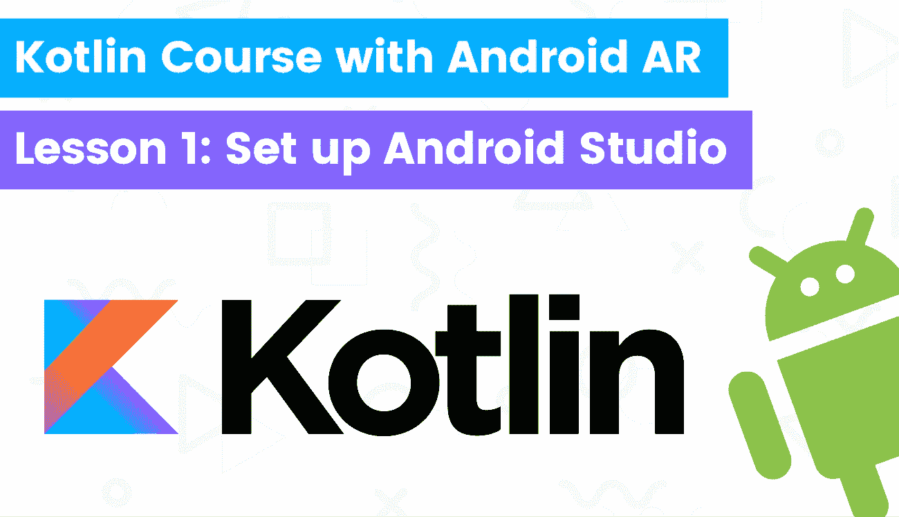

# 通过构建 Android AR 应用了解 kot Lin——第 1 课:Android Studio 设置

> 原文：<https://itnext.io/learn-kotlin-by-building-android-ar-app-lesson1-android-studio-setup-d51a3568453a?source=collection_archive---------8----------------------->



[科特林课程](https://www.blog.duomly.com/kotlin-course-with-building-android-augmented-reality-app-lesson1-how-to-setup-android-studio-and-arcore-for-augmented-reality-project/)

本文原载:
[https://www . blog . duomly . com/kot Lin-course-with-building-Android-augmented-reality-app-lesson 1-how-to-setup-Android-studio-and-arcore-for-augmented-reality-project/](https://www.blog.duomly.com/kotlin-course-with-building-android-augmented-reality-app-lesson1-how-to-setup-android-studio-and-arcore-for-augmented-reality-project/)

# 介绍

今天我们将开始 Kotlin 课程，在这里我们将构建 Android 增强现实移动应用程序。作为今天的大部分课程，我们将学习如何使用 ARCore 为增强现实项目设置 Android Studio。

Kotlin 编程语言是现在最流行的语言之一。

Kotlin 类似于 Java，并与该语言紧密合作，但我要说，Kotlin 给了我们更大的机会。

在 Kotlin 中，我们不仅可以构建后端，还可以构建跨平台的移动应用程序，与数据科学合作，进行纯 android 开发，甚至进行 web 开发。

你准备好参加科特林课程的第一课了吗？

开始吧！

如果你喜欢视频，这是 youtube 的版本:

科特林课程——第 1 课

# 如何获得 Android Studio

在我们进入编码之前，我们需要建立一个环境，我们将使用它来运行模拟器，在这里我们将能够测试我们的代码，而不需要使用真实的设备。

我们将使用它来构建应用程序，如果我们愿意，我们可以使用 Android Studio 作为一个完整的 IDE 和代码编辑器。

我们需要做的第一步是下载 3.1 或更高版本的 Android Studio。

[https://developer.android.com/studio/index.html](https://developer.android.com/studio/index.html)

接下来，我们需要开始安装这个工具集，运行它，并开始配置。

# 如何安装 SDK

当我们的 Android Studio 启动时，我们对 IDE 做了一个简单的概述，我们可以开始配置将用于我们项目的 SDK。

要进入 SDK 管理器，我们需要单击“配置”，然后单击“SDK 管理器”。

接下来，我们应该选择应该安装的依赖项。

如果你有 Mac OS，你需要知道不支持 x86_64 版本。

所以，你只需要用 x86 的安卓。

我们将使用两个选项卡，第一个是“SDK 平台”，在这里我们需要检查下面列表中的项目。

**SDK 平台:**

*   Android 8.1(奥利奥)API 级别 27
*   Android SDK 平台 27
*   Android 27 的来源
*   Google Apis 英特尔 x86 凌动系统映像

第二个选项卡称为“SDK 工具”，我们应该从下面的列表中选择项目。

**SDK 工具:**

*   Android SDK 构建工具 30
*   Android 模拟器
*   Android SDK 平台-工具
*   Google Play 服务
*   英特尔 x86 模拟器加速器(HAXM 安装程序)

# 如何设置 AVD

当我们的 SDK 配置好后，我们应该进入 AVD 管理器。

要进入此窗口，我们应该做与 SDK 管理器相同的步骤，只需选择“AVD 管理器”。

接下来，我们需要单击“创建虚拟设备”，并配置我们的虚拟设备。

作为第一步，您需要选择您想要的设备类型。

我会选择谷歌 Pixel 2。

接下来，您需要选择将安装在该设备上的操作系统。

**记住:**

在 mac 上不支持 x86_64，您需要使用 x86 27 API，我们已经在 SDK 管理器中配置了该 API。

选择操作系统后，您将进入“验证配置”选项卡。

在这里，你应该点击“高级设置”，并确保“背部摄像头”字段的值为“虚拟场景”。

# 运行模拟器

太好了，您的设备已创建！

现在，我们需要通过单击绿色三角形按钮来运行模拟器。

您需要等待一段时间(取决于您的机器)，大约一分钟后，您应该已经启动了一个可用于测试和开发目的的移动设备。

# 如何为 AR 下载 Google Play 服务

我们可以使用 Google Play，但最简单(也是最可靠)的方法是下载 APK，并通过命令行将其安装到设备上。

转到 URL

```
[https://github.com/google-ar/arcore-android-sdk/releases](https://github.com/google-ar/arcore-android-sdk/releases)
```

并下载名为的 APK 文件

```
"Google_Play_Services_for_AR_1.18.0_x86_for_emulator.apk"
```

把它保存在某个地方。

# 如何在已启动的模拟器上安装 Google Play 服务

现在，我们需要安装下载的 APK。

有几种方法可以做到这一点，但我更喜欢命令行方式。

要安装该文件，您需要打开模拟器。

接下来，进入终端窗口，进入包含下载文件的目录，并键入:

```
adb install -r Google_Play_Services_for_AR_1.18_x86_for_emulator.apk
```

# 如何从 ARCore 下载示例 AR 项目

我们对虚拟设备很满意，不再需要在那里进行配置。

让我们进入 AR 项目。

在今天的课程中，我们将使用 ARCore Android SDK 中的示例项目。

最简单的方法是通过 git 克隆整个存储库，在项目目录中打开终端，然后输入:

```
git clone [https://github.com/google-ar/arcore-android-sdk.git](https://github.com/google-ar/arcore-android-sdk.git)
```

接下来，您可以访问该文件夹，并进入“samples”目录。

我们今天要运行一些项目。

# 打开项目

现在，您需要打开我们将运行的项目，就像第一个测试项目一样。

我们这样做是为了看看你的 Android Studio 是否配置为运行增强现实项目。

当然，稍后会有更多的配置，我们将能够踢，不太相关的工具，更多的是你要写的代码。

示例项目将位于 arcore-Android-SDK-1 . 18 . 0/samples 中

选择“hello_ar_java”项目，用 Android Studio 打开。

如果一切正常，您应该进入下一步，在这里您将能够添加配置或对代码进行任何更改。

# 添加配置

通过打开 Android Studio，首次使用的应用程序会要求您添加配置。

您需要点击“添加配置”，下一个名为“应用程序”的模块将被创建。

运行应用程序时，您将使用“应用程序”。

# 如何运行 Android Studio 项目

现在，是时候测试我们的配置并开始娱乐了。

当我们完成所有配置，并打开项目后，我们就可以运行它了。

要运行我们的应用程序，我们只需进入菜单的“运行”位置，并选择位置“运行‘应用程序’”。

如果我们已经正确地完成了所有的设置，应用程序应该开始将它安装到模拟器中。

安装完成后，我们应该会看到正在运行的增强现实应用程序的屏幕。

# 结论

恭喜你！

您已经完成了增强现实应用程序的 Android Studio 设置！

在接下来的几集中，我们将能够从 Kotlin 代码开始，我将向您展示如何启动 Kotlin 项目，我们将编写第一行。

当想到增强现实可以给我们带来的可能性时，我非常兴奋，并且迫不及待地向你展示这一切。


[Duomly 促销代码](https://www.duomly.com?code=lifetime-80)

感谢您的阅读，
来自 Duomly 的 Radek