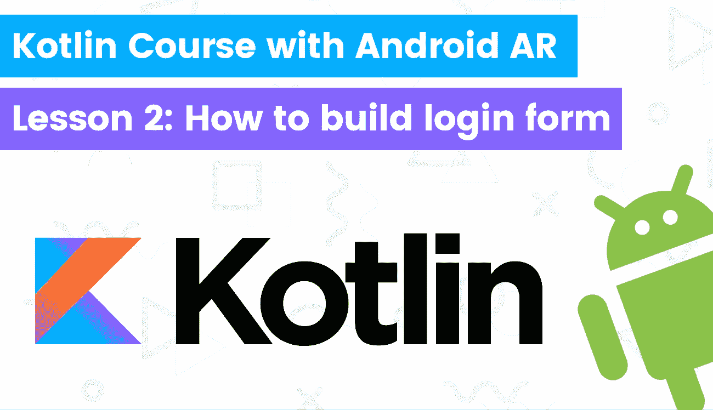

# 通过构建 Android AR 应用程序学习 kot Lin——第 2 课:如何构建登录表单

> 原文：<https://itnext.io/learn-kotlin-by-building-android-ar-app-lesson2-how-to-build-login-form-725dcafbd00d?source=collection_archive---------9----------------------->



[Duomly —编程在线课程](https://www.blog.duomly.com)

本文原载于[https://www . blog . duomly . com/kot Lin-course-with-building-Android-augmented-reality-app-lessons 2-how-to-build-log in-form-in-Android](https://www.blog.duomly.com//kotlin-course-with-building-android-augmented-reality-app-lesson2-how-to-build-login-form-in-android)/

# 介绍如何使用 Kotlin 和 Android 构建登录表单

在 Kotlin 课程的第二课中，我们将学习如何构建一个登录表单。

以下是 Kotlin 课程上一课的 URL，我们在这里学习了如何为增强现实项目设置 Android Studio 和 ARCore:

[构建 Android AR 应用的 Kotlin 课程——第 1 课:如何为增强现实项目设置 Android Studio 和 ARCore](https://www.blog.duomly.com/kotlin-course-with-building-android-augmented-reality-app-lesson1-how-to-setup-android-studio-and-arcore-for-augmented-reality-project/)

在今天的节目中，我们不仅要构建一个登录表单。当然，我们会做得更多。

我们将需要从头开始创建 Android 项目，配置一切，并编写 Kotlin 代码。

我们今天要学习的下一件事是在 Android Studio 中使用 design，构建布局，并放置元素。

开始吧！

如果你更喜欢视频，这里是 youtube 的一步一步，我们会告诉你怎么做:

# 如何在 Android Studio 中创建 Kotlin 项目

我们甚至还没有创建一个项目。

我们需要做的第一步是在 Android studio 中创建 Kotlin 项目。

为此，我们需要打开 Android Studio，并选择:

“启动一个新的 Android Studio 项目”

在“选择项目模板”选项卡中，我们需要选择:

"空活动"

在“配置您的项目”选项卡中，我们只需要确保语言是否为“Kotlin”，给出应用程序名称，为 API 27 设置最低 SDK，然后单击“完成”按钮。

# 如何向 build.gradle 添加依赖项

下一步，我们应该进入 build.gradle 文件，这个文件带有(module: app)。

在文件内部，我们应该找到 dependencies 对象，并在那里添加四个依赖项。

第一个是 Google AR Core，第二个是 AppCompat，第三个是“设计”，最后一个是 javaGL。

让我们看一下代码示例:

```
implementation 'com.google.ar:core:1.18.0'
implementation 'com.android.support:appcompat-v7:28.0.0'
implementation 'com.android.support:design:28.0.0'
implementation 'de.javagl:obj:0.2.1'
```

# 如何将 maven 添加到 build.gradle 和 sync

下一步，我们应该做的是打开下一个 build.gradle 文件(这个文件包含 Project: DuomlyAR)。

接下来，我们应该将一个 maven 存储库添加到存储库中。

```
allprojects {
    repositories {
        mavenLocal()
        maven {
            url "https://maven.springframework.org/release"
        }
        google()
        jcenter()
    }
}
```

# 如何在 AndroidManifest.xml 中添加权限

当然，增强现实需要我们的摄像头，所以我们需要获得用户的许可才能使用它。

我们将在接下来的几集中关注所有的相机权限类，今天我们将在 AndroidManifest.xml 文件中声明 uses-permission 和特性。

```
<uses-permission android:name="android.permission.CAMERA"/>
<uses-feature android:name="android.hardware.camera.ar" android:required="true"/>
<uses-feature android:glEsVersion="0x00020000" android:required="true" />
```

# 如何在 Kotlin 中编写登录函数(记住关于视图:视图)在主活动中

太好了，看起来大部分“文书工作”都没问题。

现在我们可以更深入地研究编码。

因为我们要创建的第一个代码是登录函数。

这是一个非常简单的假登录，没有 API 调用(我们将在下一集关注后端连接)。

我们只需要从登录表单中获取数据，比较是否符合硬编码的值，如果符合，就重定向到下一个屏幕，

如果没有，我们应该显示一个带有错误消息的祝酒词。

请记住将“view: View”作为参数传递。否则，您将无法从 XML 布局访问该函数。

您可以在这里使用监听器和导入 XML 来完成这项工作，但是第一种方法要快得多。

```
fun login(view: View) {
    val email = findViewById<EditText>(R.id.login_email).text.toString()
    val password = findViewById<EditText>(R.id.login_password).text.toString() if(email == "email@duomly.com" && password == "duomly") {
        val intent = Intent(this, DashboardActivity::class.java)
        startActivity(intent)
    } else {
        Toast.makeText(this, "Invalid email or password", Toast.LENGTH_SHORT).show()
    }
}
```

# 如何在 Android studio 中创建图像

你用 Kotlin 写的登录逻辑准备好了，恭喜！

我们需要创建一个可绘制的图像，以便能够在 Android 应用程序中使用它。

非常简单，我们只需要在“res/drawable”目录下点击鼠标右键，选择新建>矢量资产。

接下来，您需要从桌面上选择 SVG 图形，并将其上传到 Android studio。

单击“完成”按钮后，您应该有一个可绘制的 XML 图像。

# 如何在 Kotlin 中创建字符串

在 Android 应用程序中，我们甚至可以以简单的硬编码形式添加文本，但我建议您将它们作为字符串添加，因为这种方法更适合以后添加翻译。

让我们添加一些我们稍后将在应用程序中使用的字符串。

进入 values/strings.xml，并添加字符串，如下例所示:

```
<string name="login_logo">Learn coding with Duomly</string>
<string name="login_email">Email</string>
<string name="login_password">Password</string>
<string name="login_button">Login</string>
<string name="dashboard_title">Dashboard page</string>
```

# 如何在 Android 布局中添加 Logo

在接下来的几个步骤中，我们将使用 XML 布局。

在本文中，我将添加布局的代码版本，这是创建布局的一个更具挑战性的版本，但是您将学习其中的两个版本。

要查看我们如何使用拖放设计方法，请进入 youtube 的插曲。

进入 activity_main.xml，在布局中，您需要添加 ImageView 元素，其属性如下例所示:

```
<ImageView
    android:id="@+id/imageView"
    android:layout_width="69dp"
    android:layout_height="69dp"
    app:layout_constraintBottom_toTopOf="@+id/textView2"
    app:layout_constraintEnd_toEndOf="parent"
    app:layout_constraintHorizontal_bias="0.5"
    app:layout_constraintStart_toStartOf="parent"
    app:layout_constraintTop_toTopOf="parent"
    app:srcCompat="@drawable/ic_logo" />
```

# 如何在 Android 布局中添加文本

与上一步一样，我们需要在同一个文件中创建一些代码，但是在本例中，我们将创建一个简单的文本元素。

让我们举下面的例子:

```
<TextView
    android:id="@+id/textView2"
    android:layout_width="wrap_content"
    android:layout_height="wrap_content"
    android:text="@string/login_logo"
    app:layout_constraintBottom_toBottomOf="parent"
    app:layout_constraintEnd_toEndOf="parent"
    app:layout_constraintHorizontal_bias="0.5"
    app:layout_constraintStart_toStartOf="parent"
    app:layout_constraintTop_toBottomOf="@+id/imageView" />
```

# 如何在 Android 布局中创建表单

在这一步中，我们可以关注表单的代码。

在 Android 中构建表单非常容易，我们只需要在名为“View”的容器中打包一些输入。

在这种情况下，我已经使用了 ConstraintLayout 组件(如果您想了解它是如何从视图中转换出来的，请查看 youtube 那一集)。

```
<androidx.constraintlayout.widget.ConstraintLayout
    android:id="@+id/view"
    android:layout_width="409dp"
    android:layout_height="220dp"
    app:layout_constraintBottom_toTopOf="@+id/button"
    app:layout_constraintEnd_toEndOf="parent"
    app:layout_constraintHorizontal_bias="0.5"
    app:layout_constraintStart_toStartOf="parent"
    app:layout_constraintTop_toBottomOf="@+id/view2"> <EditText
        android:id="@+id/login_email"
        android:layout_width="wrap_content"
        android:layout_height="wrap_content"
        android:ems="10"
        android:hint="@string/login_email"
        android:inputType="textEmailAddress"
        app:layout_constraintBottom_toTopOf="@+id/login_password"
        app:layout_constraintEnd_toEndOf="parent"
        app:layout_constraintHorizontal_bias="0.5"
        app:layout_constraintStart_toStartOf="parent"
        app:layout_constraintTop_toTopOf="parent" /> <EditText
        android:id="@+id/login_password"
        android:layout_width="wrap_content"
        android:layout_height="wrap_content"
        android:ems="10"
        android:hint="@string/login_password"
        android:inputType="textPassword"
        app:layout_constraintBottom_toBottomOf="parent"
        app:layout_constraintEnd_toEndOf="parent"
        app:layout_constraintHorizontal_bias="0.5"
        app:layout_constraintStart_toStartOf="parent"
        app:layout_constraintTop_toBottomOf="@+id/login_email" />
</androidx.constraintlayout.widget.ConstraintLayout>
```

# 如何在 Android 布局中创建按钮

我们几乎有了所有的布局，但是没有“提交”按钮，我们怎么提交表单呢？

我们需要创造一个！

要创建按钮，我们只需要使用“button”组件和一些属性，如文本、颜色或大小。

查看下面的例子，我是如何在布局中添加按钮的:

```
<Button
    android:id="@+id/button"
    android:layout_width="wrap_content"
    android:layout_height="wrap_content"
    android:background="#2196F3"
    android:text="@string/login_button"
    android:textColor="#FFFFFF"
    app:layout_constraintBottom_toBottomOf="parent"
    app:layout_constraintEnd_toEndOf="parent"
    app:layout_constraintHorizontal_bias="0.5"
    app:layout_constraintStart_toStartOf="parent"
    app:layout_constraintTop_toBottomOf="@+id/view" />
```

# 如何从 onClick 调用 Kotlin 函数

我们已经创建了一个按钮，但它不可能运行任何逻辑。

我们需要添加将被触发的函数并定义事件，事件应该负责调用函数。

在这种情况下，我们将调用函数“login”，它应该被触发为“onClick”。

让我们看看你应该如何看待“android:onClick”按钮的代码。

```
<Button
    android:id="@+id/button"
    android:layout_width="wrap_content"
    android:layout_height="wrap_content"
    android:background="#2196F3"
    android:onClick="login"
    android:text="@string/login_button"
    android:textColor="#FFFFFF"
    app:layout_constraintBottom_toBottomOf="parent"
    app:layout_constraintEnd_toEndOf="parent"
    app:layout_constraintHorizontal_bias="0.5"
    app:layout_constraintStart_toStartOf="parent"
    app:layout_constraintTop_toBottomOf="@+id/view" />
```

# 如何在 Android Studio 布局中定位元素

我们的布局看起来几乎准备好了，有我们需要的所有元素，但定位看起来很糟糕。

我们需要尽快修复它。

为此，我们需要添加更多的容器，并设置与其他对象相关的位置。

接下来，所有的都要居中。

```
<?xml version="1.0" encoding="utf-8"?>
<androidx.constraintlayout.widget.ConstraintLayout xmlns:android="http://schemas.android.com/apk/res/android"
    xmlns:app="http://schemas.android.com/apk/res-auto"
    xmlns:tools="http://schemas.android.com/tools"
    android:layout_width="match_parent"
    android:layout_height="match_parent"
    tools:context=".MainActivity">
 <Button
        android:id="@+id/button"
        android:layout_width="wrap_content"
        android:layout_height="wrap_content"
        android:background="#2196F3"
        android:onClick="login"
        android:text="@string/login_button"
        android:textColor="#FFFFFF"
        app:layout_constraintBottom_toBottomOf="parent"
        app:layout_constraintEnd_toEndOf="parent"
        app:layout_constraintHorizontal_bias="0.5"
        app:layout_constraintStart_toStartOf="parent"
        app:layout_constraintTop_toBottomOf="@+id/view" /> <androidx.constraintlayout.widget.ConstraintLayout
        android:id="@+id/view2"
        android:layout_width="409dp"
        android:layout_height="160dp"
        app:layout_constraintBottom_toTopOf="@+id/view"
        app:layout_constraintEnd_toEndOf="parent"
        app:layout_constraintHorizontal_bias="0.5"
        app:layout_constraintStart_toStartOf="parent"
        app:layout_constraintTop_toTopOf="parent"> <ImageView
            android:id="@+id/imageView"
            android:layout_width="69dp"
            android:layout_height="69dp"
            app:layout_constraintBottom_toTopOf="@+id/textView2"
            app:layout_constraintEnd_toEndOf="parent"
            app:layout_constraintHorizontal_bias="0.5"
            app:layout_constraintStart_toStartOf="parent"
            app:layout_constraintTop_toTopOf="parent"
            app:srcCompat="@drawable/ic_logo" /> <TextView
            android:id="@+id/textView2"
            android:layout_width="wrap_content"
            android:layout_height="wrap_content"
            android:text="@string/login_logo"
            app:layout_constraintBottom_toBottomOf="parent"
            app:layout_constraintEnd_toEndOf="parent"
            app:layout_constraintHorizontal_bias="0.5"
            app:layout_constraintStart_toStartOf="parent"
            app:layout_constraintTop_toBottomOf="@+id/imageView" />
    </androidx.constraintlayout.widget.ConstraintLayout> <androidx.constraintlayout.widget.ConstraintLayout
        android:id="@+id/view"
        android:layout_width="409dp"
        android:layout_height="220dp"
        app:layout_constraintBottom_toTopOf="@+id/button"
        app:layout_constraintEnd_toEndOf="parent"
        app:layout_constraintHorizontal_bias="0.5"
        app:layout_constraintStart_toStartOf="parent"
        app:layout_constraintTop_toBottomOf="@+id/view2"> <EditText
            android:id="@+id/login_email"
            android:layout_width="wrap_content"
            android:layout_height="wrap_content"
            android:ems="10"
            android:hint="@string/login_email"
            android:inputType="textEmailAddress"
            app:layout_constraintBottom_toTopOf="@+id/login_password"
            app:layout_constraintEnd_toEndOf="parent"
            app:layout_constraintHorizontal_bias="0.5"
            app:layout_constraintStart_toStartOf="parent"
            app:layout_constraintTop_toTopOf="parent" /> <EditText
            android:id="@+id/login_password"
            android:layout_width="wrap_content"
            android:layout_height="wrap_content"
            android:ems="10"
            android:hint="@string/login_password"
            android:inputType="textPassword"
            app:layout_constraintBottom_toBottomOf="parent"
            app:layout_constraintEnd_toEndOf="parent"
            app:layout_constraintHorizontal_bias="0.5"
            app:layout_constraintStart_toStartOf="parent"
            app:layout_constraintTop_toBottomOf="@+id/login_email" />
    </androidx.constraintlayout.widget.ConstraintLayout></androidx.constraintlayout.widget.ConstraintLayout>
```

# 如何在 Android 中添加第二个视图

现在，我们可以创建下一个视图，我们将在成功登录后重定向应用程序。

让我们把这个页面命名为“仪表板”。

为此，我们需要创建下一个名为“activity_dashboard.xml”的文件。

将文件添加到“main”布局所在的目录中，并在那里添加文本组件。

```
<?xml version="1.0" encoding="utf-8"?>
<androidx.constraintlayout.widget.ConstraintLayout xmlns:android="http://schemas.android.com/apk/res/android"
    xmlns:app="http://schemas.android.com/apk/res-auto"
    xmlns:tools="http://schemas.android.com/tools"
    android:layout_width="match_parent"
    android:layout_height="match_parent"
    tools:context=".DashboardActivity"> <TextView
        android:id="@+id/textView"
        android:layout_width="wrap_content"
        android:layout_height="wrap_content"
        android:text="@string/dashboard_title"
        app:layout_constraintBottom_toBottomOf="parent"
        app:layout_constraintEnd_toEndOf="parent"
        app:layout_constraintHorizontal_bias="0.5"
        app:layout_constraintStart_toStartOf="parent"
        app:layout_constraintTop_toTopOf="parent" />
</androidx.constraintlayout.widget.ConstraintLayout>
```

接下来，我们需要创建名为“DashboardActivity”的 Kotlin 类。

您应该在“java”目录中创建该类(与 MainActivity 类相同)。

在该类中，我们应该定义将呈现我们的布局的函数。

```
package com.example.duomlyar_devimport android.os.Bundle
import androidx.appcompat.app.AppCompatActivityclass DashboardActivity: AppCompatActivity() {
    override fun onCreate(savedInstanceState: Bundle?) {
        super.onCreate(savedInstanceState)
        setContentView(R.layout.activity_dashboard)
    }
}
```

# 如何将第二个视图添加到 Android 清单中

恭喜你，这是最后一步，你做了很多！

在最后一个编码步骤中，我们应该在 AndroidManifest.xml 文件中定义新视图。

让我们在下面的例子中看看我是如何做到的:

```
<?xml version="1.0" encoding="utf-8"?>
<manifest xmlns:android="http://schemas.android.com/apk/res/android"
    package="com.example.duomlyar_dev"><!--    Add permissions-->
    <uses-permission android:name="android.permission.CAMERA"/>
    <uses-feature android:name="android.hardware.camera.ar" android:required="true"/>
    <uses-feature android:glEsVersion="0x00020000" android:required="true"/>
    <application
        android:allowBackup="true"
        android:icon="@mipmap/ic_launcher"
        android:label="@string/app_name"
        android:roundIcon="@mipmap/ic_launcher_round"
        android:supportsRtl="true"
        android:theme="@style/AppTheme">
        <activity android:name=".MainActivity">
            <intent-filter>
                <action android:name="android.intent.action.MAIN" /> <category android:name="android.intent.category.LAUNCHER" />
            </intent-filter>
        </activity>
        <activity android:name=".DashboardActivity"/>
    </application></manifest>
```

# 总结如何使用 Kotlin 和 Android 构建登录表单

恭喜您，您已经学会了如何在 Kotlin 中构建登录表单，以及如何在 Android Studio 中创建 Kotlin 项目！

我们的应用程序已经初具雏形，我很自豪你已经完成了！

在接下来的几集中，我们将关注更多的功能，如仪表板和学习模块，我们将在应用程序中实现增强现实，并将应用程序与后端连接起来。

如果你想比较你的代码和我的，你可以在这里找到当前课程的 GitHub 库:
[https://GitHub . com/Duomly/kot Lin-course/tree/kot Lin-course-Lesson-2](https://github.com/Duomly/kotlin-course/tree/Kotlin-course-Lesson-2)

保持更新，让我们一起打造一款优秀的 app！


[多美滋促销代码](https://www.duomly.com?code=lifetime-80)

感谢你和我们一起编码，

Duomly 的 Radek