# 用 Koans 学习或回忆 Dart。第一部分。

> 原文：<https://itnext.io/learn-or-recall-dart-with-koans-part-1-f54c5f26c60?source=collection_archive---------6----------------------->

# 介绍

在[之前的文章](https://medium.com/@adrobnych/flutter-builds-in-the-cloud-2bdb284114e5)中，我们看到了如何使用 [FlutLab.io](https://flutlab.io) 在线 IDE 构建和运行 Flutter 程序。让我们使用相同的工具进行一次新的有趣的冒险:让我们试试 Flutter 框架的核心编程语言 Dart 的味道。

我们将从经典语言教程中脱颖而出，使用 Koans，这是一种流行的自学方法，发明于[古代中国](https://en.wikipedia.org/wiki/K%C5%8Dan)，并由 [Ruby 社区](http://rubykoans.com/)重新发明。从技术上讲，Dart Koans 只是单元测试，它不是针对实现代码运行的，而是针对 Dart 语言本身和您对这种语言的了解。


禅画(通常与公案联系在一起)。

考安是一种实用的学习飞镖的方法。你是一步一步来的。每一步都从某个损坏的(红色)单元测试开始。你必须用你的直觉和谷歌搜索来修复它。下一步是考虑这个测试，玩一玩。这种方式导致持久的记忆和**实践**经验。

# 开始吧！

打开 [https://flutlab.io](https://flutlab.io) 。如果以前没有注册过，请注册一个新用户。

现在最好创建一个新项目来玩 Koans。单击当前项目名称左侧的“加号”图标:

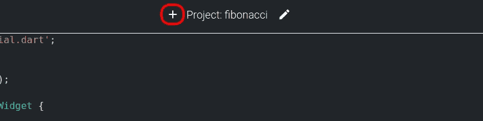

“创建新项目”按钮。

选择“开始新项目”:


创建新项目的可能方法。

从“无状态 Hello World”代码库中选择其来源:

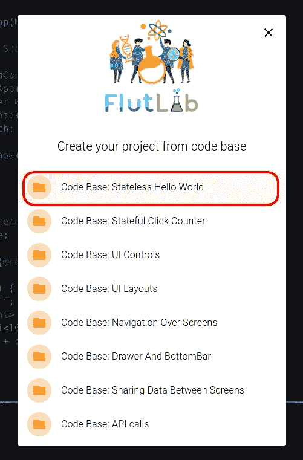

选择一些代码库。

为你的项目和它的包起一个热门的名字:

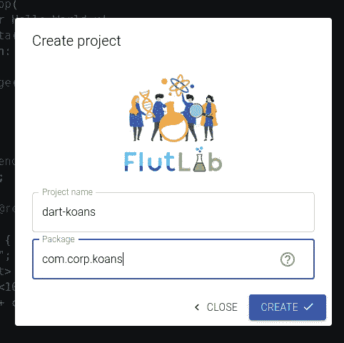

项目名称和包。

因此，您可以看到一个新项目，为您的实验做好了准备。点击“扩展”按钮:

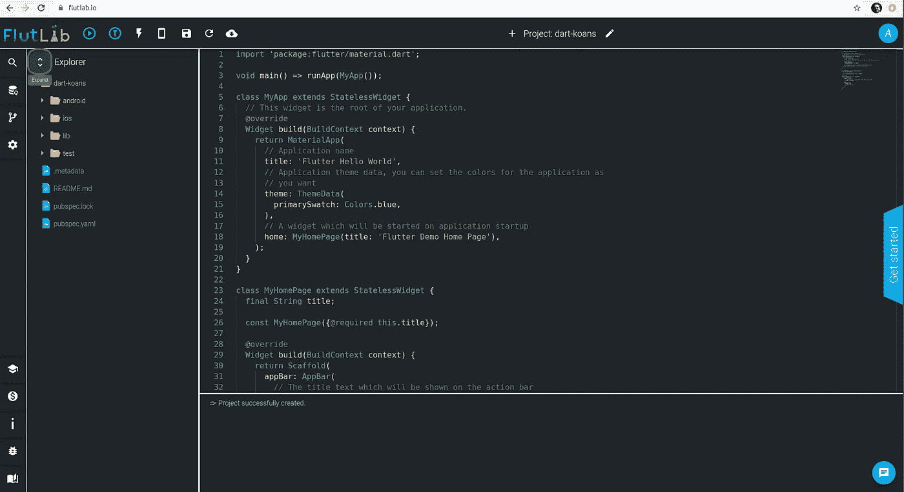

Dart Koans 的新项目。

项目树将被展开，您可以很容易地找到单元测试 dart 文件:

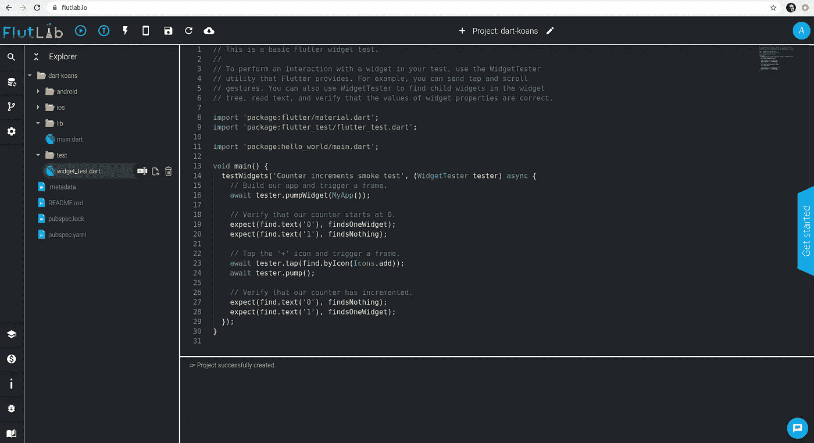

小部件 _ 测试.飞镖

现在，让我们用以下代码片段替换 widget_test.dart 的现有代码:

```
import 'package:flutter_test/flutter_test.dart';const ___ = "FILL ME IN";void *main*() { **test**('hello world Koans way', () { expect(___, "Hello World!"); });}
```

这是我们旅程的起点:Dart Koans 风格的 Hello World:

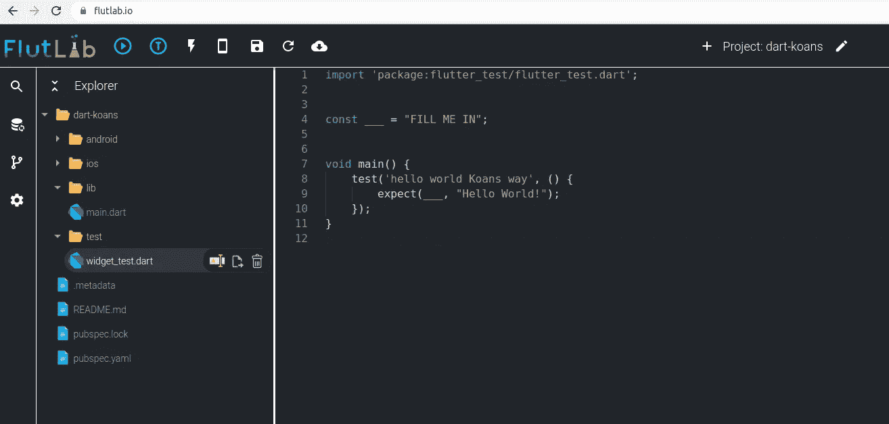

你好，世界公案

# 公案是如何运作的

首先，它有函数 **main** 是任何 Dart 程序的执行点。

在这个函数之前，我们可以看到 **import** 命令从外部库**注入一些代码，flutter_test** 。这个库使这样的结构能够工作:

```
**test**('hello world Koans way', () {});
```

这是一个针对飞镖和颤振的**单元测试**。名为 **test** 的函数有两个参数:描述性字符串(解释“我在这里测试什么”)和 lambda(无名函数)，它保存测试的代码。

**颤振 _ 测试**也是一个框架。这个框架正在监听测试的执行，并呈现关于哪些测试通过(绿色)和哪些测试失败(红色)的最终报告。

颤振 _ 测试框架的另一个重要功能是**期待**。它有两个参数:

*   预期值
*   实际价值

如果值相同，则测试通过。如果它们不同，则测试失败。

让我们运行我们的公案。按下“运行测试”按钮:


运行测试按钮。

您将看到熟悉的构建和运行画面，但这次它将比应用程序构建更快:

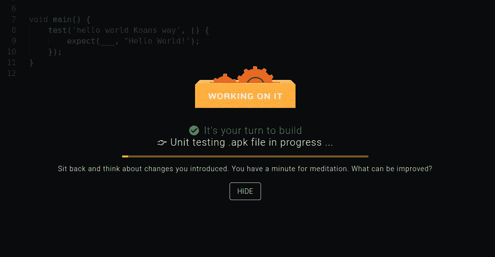

公案处决。

几秒钟后，你会看到这个公案失败了(红色):

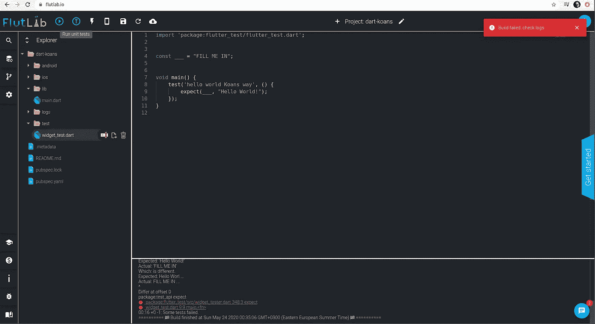

Koan 失败了。

让我们检查包含单元测试报告的结果框架:

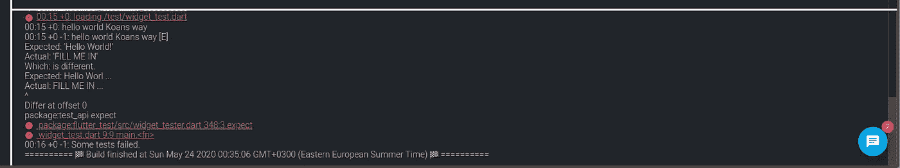

单元测试报告。

您可以看到失败测试的名称“hello world Koans way”和失败的**原因**:

```
Expected: 'Hello World!'Actual: 'FILL ME IN'Which: is different.
```

等等，我在 **expect** 函数中看到了“Hello World”部分，但是“FILL ME IN”是从哪里来的呢？

是 **main** 函数之前定义的常量“**_ _ _ _ _ _**”(三条下划线)的值！看:

```
const ___ = "FILL ME IN";
```

常量是编程语言中一种特殊的变量，它的值一直保持到程序结束。要在 Dart 中创建常数，请键入“const ”,然后键入新常数的名称，最后键入“=”运算符和要存储在此常数中的值。例如:

```
const pi = 3.1416;
```

我们的常量的这个奇怪的名字“__”是有意选择的。这就像某种形式的空白字段需要**填写**。

那么我们应该在这个“空”字段中输入什么呢？

```
expect(___, "Hello World!");
```

对！我们需要在那里放另一个“Hello World”字符串。从而使**预期**功能中的预期值和实际值相同。禅就是平衡！

继续修复 Koan:

```
import 'package:flutter_test/flutter_test.dart';const ___ = "FILL ME IN";void *main*() {test('hello world Koans way', () { expect(***"Hello World!"***, "Hello World!"); });}
```

并再次运行它:

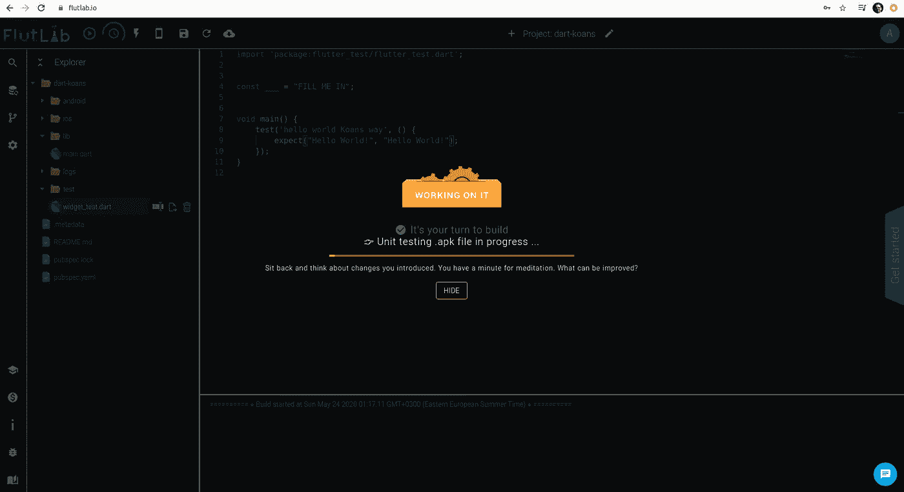

公案的第二轮。

而且是绿色的！

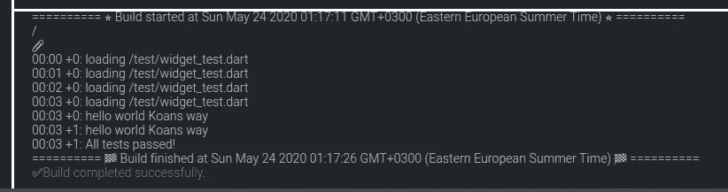

所有测试都通过了。

# 冥想时间

我们刚刚完成了第一个 Dart Koan。让我们试着修改一下这个 Koan 的代码:

```
import 'package:flutter_test/flutter_test.dart';const ___ = "FILL ME IN"; void main() { test('hello world Koans way', () { ***const hello = "Hello World!";*** expect("Hello World!", ***hello***); });}
```

运行该测试并确保“绿灯”。

我们只是将来自 **expect** 函数参数的“Hello world”字符串提取到一个常量中。现在我们的 Koan 有了一些深刻的含义:它不仅教导 Koan 是什么，而且还展示了 Dart 如何使用常量！

# 下一步

我们已经了解了 Dart 单元测试、Koans 和 Dart 常量。很好的成绩！

请继续关注 Dart Koans 的下一部分[。它将涉及变量、数据类型和对象。](https://medium.com/@adrobnych/learn-or-recall-dart-with-koans-part-2-21b8cf8105d0)