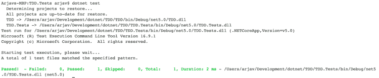
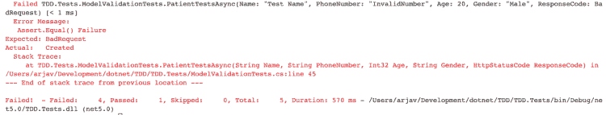
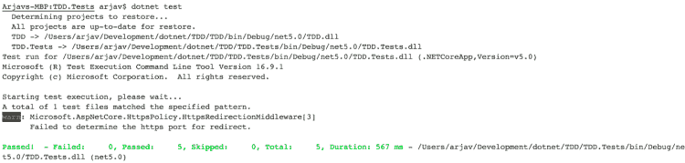

# 通过集成测试学习 TDD。NET 5.0

> 原文：<https://itnext.io/learn-tdd-with-integration-tests-in-net-5-0-937f126e7220?source=collection_archive---------1----------------------->

开发一个真实世界的病人入院系统


用 TDD 组织

TDD(测试驱动开发)在技术行业是一个备受争议的词。像*你是否应该做 TDD 这样的争论？*或*有多大优势？*相当受欢迎。简单地说，TDD 是开发前的测试。

现在，关于什么类型的测试包括在 TDD 中，什么不包括在 TDD 中，有许多不同的观点。例如，它应该包括单元测试、集成测试、系统测试甚至 UAT 吗？

在本文中，我们将通过一个真实的例子来说明如何在。NET 5.0 与 TDD 方法论。

# 项目要求

TDD 要求对工作范围有非常清晰的理解。如果不清晰，所有的测试用例可能都不会被覆盖。

我们来定义一下工作范围。我们将为一家医院开发一个*病人入院系统*。

## 业务需求

*   一家医院有 X 间 ICU 病房、Y 间高级病房和 Z 间普通病房。
*   ICU 和高级病房一次只能容纳一名患者，而普通病房可以容纳两名患者。每个房间都有房间号。
*   入院时，病人必须提供姓名、年龄、性别和电话号码。
*   可以通过姓名或电话号码搜索患者。
*   同一患者不能在住院期间入住多张病床。
*   如果所有的房间都住满了，病人就不能住院。

## 模型验证规则

基于上述要求，有两种模式，即病人和房间。

*   病人的年龄在 0 到 150 岁之间。名称的长度应该在 2 到 40 之间。性别可以是男性、女性和其他。电话号码的长度应该在 7 到 12 之间，并且应该都是数字。
*   房间类型可以是“ICU”、“高级”或“普通”。

## 测试案例

现在，我们已经定义了规则和需求，让我们开始创建测试用例。因为这是一个基本的 CRUD 应用程序，所以我们主要进行集成测试。

病人

*   做所有的模型验证测试。
*   同一病人入院两次
*   两次检查同一个病人。
*   允许同一患者同时进入多个房间。
*   用电话号码和姓名搜索患者。

# TDD 设置

在上面的部分中，我们收集了需求。其次，我们定义了模型。最后，我们创建了将要实现的测试用例列表。

打开您的终端并运行下面的脚本来创建和设置一个新项目。

上面的脚本创建了一个名为 *TDD.sln* 的解决方案文件。其次，我们为 TDD & TDD.Tests 创建 2 个项目，然后我们为每个项目添加依赖项。最后，我们将项目添加到解决方案中，并在 VS 代码中打开项目。

在我们开始测试之前，还需要一些设置。基本上，集成测试是在不模仿的情况下测试特定的模块。所以我们将通过 TestServer 来模拟我们的应用程序。

## 定制晶片

为了模仿测试服务器，有一个名为[web application factory](https://docs.microsoft.com/en-us/dotnet/api/microsoft.aspnetcore.mvc.testing.webapplicationfactory-1?view=aspnetcore-5.0)(WAF)的类在内存中引导应用程序。

在你的 ***TDD。测试*项目用下面的代码创建一个名为 *PatientTestsDbWAF.cs* 的文件。**

我们正在删除应用程序 DbContext，并在内存中添加一个**db context。这是一个必要的步骤，因为我们不想干扰原始数据库。**

其次，我们用一些虚拟数据初始化数据库。

由于 DataContext 是一个自定义类，它会给编译器带来错误。所以，我们需要创造它。

## 数据上下文

因此，在您的 **TDD 项目**中，用下面的代码创建一个名为 *DataContext.cs* 的文件。

在这里，Patient、Room & RoomPatient 是具有所需属性的实体类，我们将在接下来创建它们。

## 病人

同样，在您的 **TDD 项目**中，创建一个名为 *Patient.cs* 的文件，并粘贴以下代码。

## 房间

用下面的代码创建另一个名为 *Room.cs* 的文件。

## 病房病人

用下面的代码创建最后一个模型文件 *RoomPatient.cs* 。

现在你不应该得到任何编译错误。

最后，删除 *WeatherForecast.cs* 和*weather forecast controller . cs*文件。

在 VS 代码中进入您的终端，运行下面的命令。

```
cd TDD.Tests
dotnet test
```

您将看到一个漂亮的绿色结果，表示 1 项测试通过。



## 患者控制器

不幸的是。NET 没有提供直接测试模型本身的方法。因此，我们必须创建一个控制器来测试它。

继续使用下面的代码在 **TDD 项目**的 Controllers 文件夹中创建 *PatientController.cs* 。

我们创建了一个 api 来添加一个病人。为了测试我们的模型，我们将调用这个 api。

这就是开始测试所需的全部内容。

# 模型验证测试

既然我们已经设置了测试的基本代码，让我们编写一个失败的测试。我们将从模型验证测试开始我们的测试。

## 失败(红色)状态

让我们在您的 **TDD 中创建一个名为 *PatientTests.cs* 的新文件。测试项目**并删除名为 *UnitTest1.cs* 的文件。将下面的代码复制到你的文件中。

属性允许我们为我们的测试提及不同的参数。因此，我们不必为所有的组合编写不同的测试。

此外，DBUtilities 是一个实用程序类，用于将数据库重新初始化到其初始状态。当我们有 1 或 2 个测试时，这可能看起来微不足道，但是当我们添加更多的测试时，这就变得至关重要了。

## DBUtilities

DBUtilities 类将用 1 个病人和 3 个不同类型的房间初始化您的数据库。

在您的 ***TDD 中创建一个名为 *DBUtilities.cs* 的文件。用下面的代码测试*项目。**

继续运行 ***dotnet test*** 命令，您将看到 1 个测试通过，4 个测试失败。这是因为 4 个测试预期的是 BadRequest，但得到的是 Created 结果。



让我们修理它！

## 成功(绿色)状态

为了解决这些问题，我们需要向我们的 *Patient.cs* 类添加属性。

如下更新 *Patient.cs* 文件。

这里，我们已经添加了所需的属性。我们还实现了 *IValidatableObject* 接口，这样我们就可以验证*性别*。

运行 ***点网测试*** 命令的时间。您将看到一条漂亮的绿线，表示通过了 8 项测试。



您可以在 *InlineData* 中添加更多边缘案例场景，以彻底测试患者模型验证测试。

# 重复患者测试

我们现在将创建一个测试，当我们试图添加一个重复的患者时，该测试会失败。

## 失败(红色)测试

在您的类中创建另一个测试 *PatientTests。添加下面的代码。*

我们在这里使用了一个[事实]属性，而不是[理论]属性，因为我们不想用不同的参数测试相同的方法。相反，我们希望两次提出相同的请求。

运行 ***dotnet 测试*** 来运行我们新创建的测试。测试将失败，并显示消息*断言。Equal()故障*。是时候解决了。

## 成功(绿色)测试

为了修复失败的测试，我们需要在 *PatientController.cs* 中添加 AddPatient 方法的实现。如下所示更新文件的代码。

再次运行 ***dotnet 测试*** ，你会看到测试已经通过。

# 重要注意事项

随着您添加更多的模型/领域，如医生、员工、仪器等。您将不得不创建更多的测试。确保为它们中每一个拥有不同的 WAF、实用包装器和不同的测试文件。

其次，同一个文件中的测试不会并行运行。但是，来自不同文件的测试确实是并行运行的。因此，每个晶片应该具有不同数据库名称，以便数据不会被错误配置。

最后，到原始数据库的连接仍然需要在主项目中设置。

# 思维过程

为所有场景创建测试的思维过程是相似的。

也就是说，您应该首先确定需求。然后，建立一个没有实现的方法和类的框架。编写测试来验证实现。最后，根据需要重构并重新运行测试。

本教程不包括 api 的认证和授权。你可以[在这里](https://arjavdave.com/2021/03/31/net-5-setup-authentication-and-authorisation/)阅读如何设置它。

因为不可能覆盖所有的测试用例，所以我在 Github 上创建了一个[库。它涵盖了所有测试用例的实现以及实现。](https://github.com/shenanigan/tdd-demo)

你可以在这里找到[项目](https://github.com/shenanigan/tdd-demo)。

# 结论

为了让 TDD 有效，你真的需要对需求有一个清晰的概念。如果需求持续变化，维护测试和项目会变得非常困难。

TDD 主要涵盖单元、集成和功能测试。在上线之前，您仍然需要进行 UAT、配置和生产测试。

话虽如此，TDD 确实有助于让您的项目摆脱 bug。其次，它增强了你对实施的信心。只要测试通过，你就可以修改你的代码。最后，它为您的项目提供了一个更好的架构。

[查看更多教程。网在这里。](https://arjavdave.com)