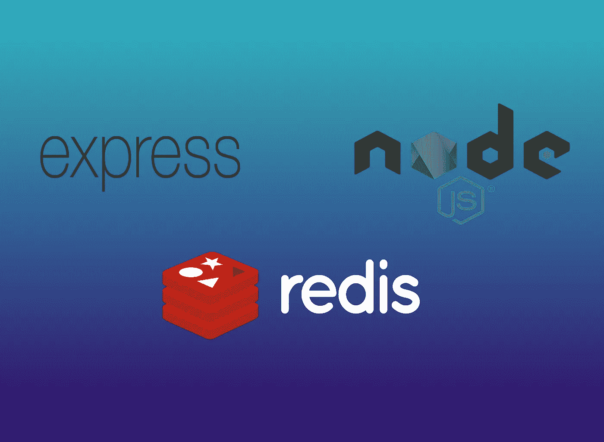
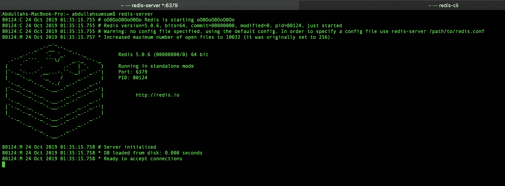
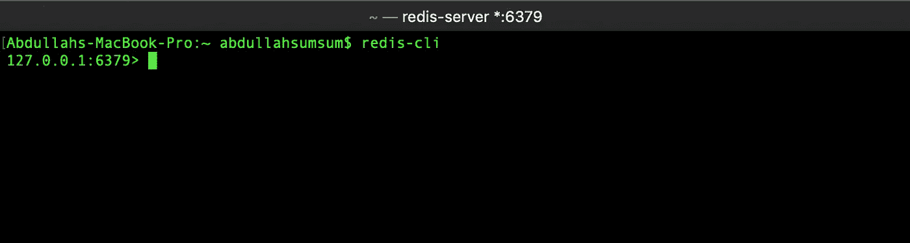
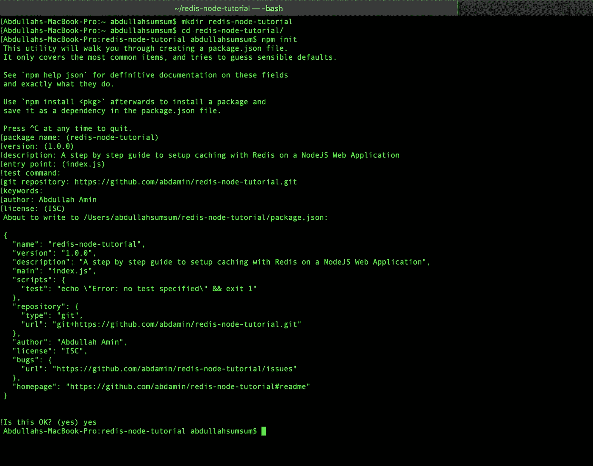
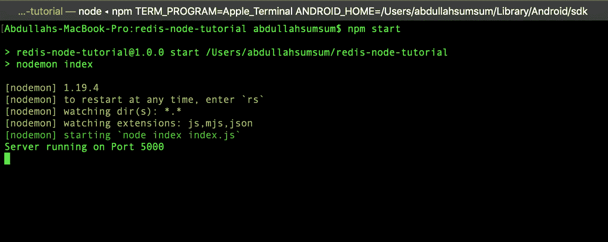
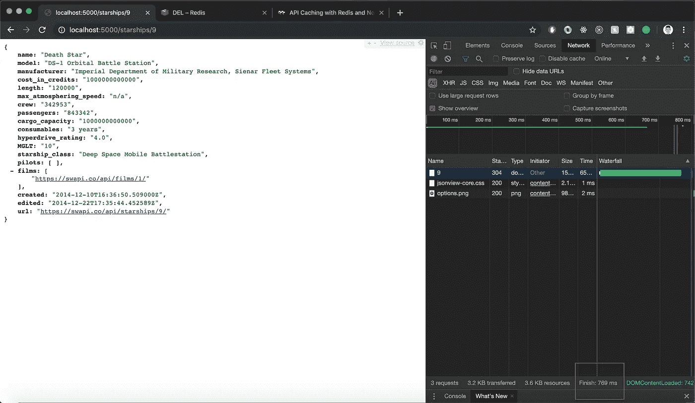
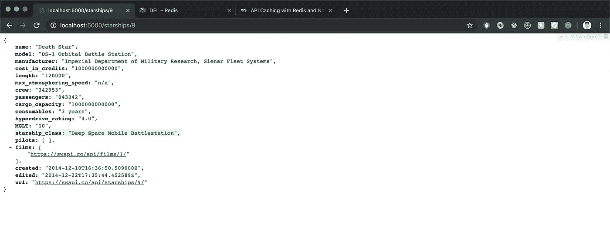
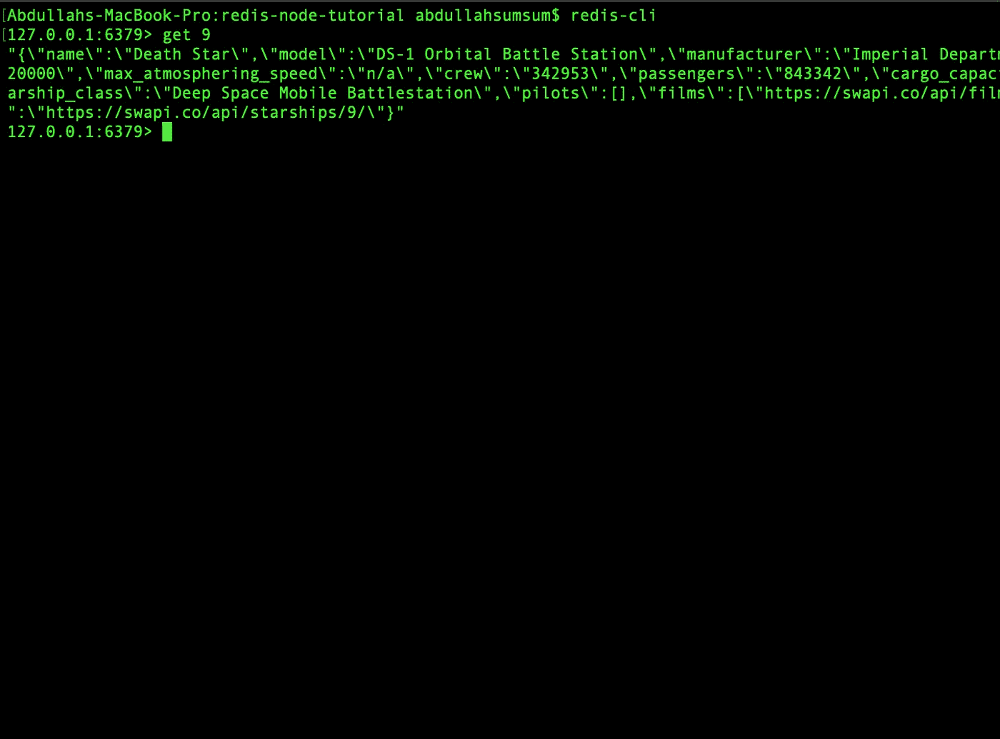
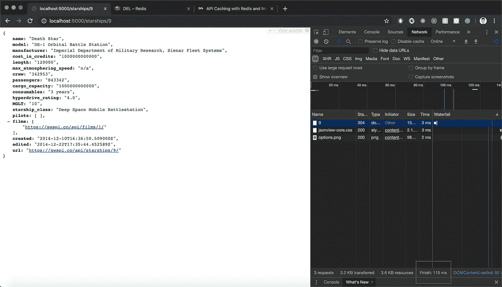

# 学会用 Redis 在 6 分钟内缓存你的 NodeJS 应用！

> 原文：<https://itnext.io/learn-to-cache-your-nodejs-application-with-redis-in-6-minutes-745a574a9739?source=collection_archive---------0----------------------->



缓存您的 web 应用程序是非常必要的，并且可以在您扩展时获得高性能增益。无论是**搜索引擎**还是 **URL 缩短器**或者是**社交网络**或者是一个从第三方 web API 请求数据的非常简单的 web 服务器，如果你想以最小的延迟响应频繁请求的查询，缓存数据将会非常有效！

# Redis 是什么？为什么使用 Redis？

**Redis** 是一个高性能开源 **NoSQL** 数据库，主要用作各种类型应用程序的缓存解决方案。令人惊讶的是，它将所有数据存储在 RAM 中，并承诺高度优化数据读取和写入。Redis 还支持许多不同的数据类型和基于不同编程语言的客户机。你可以在这里找到更多关于**Redis**的信息。

# 概观

今天，我们将在一个从[**星球大战 API**](https://swapi.co) 请求**星球大战星际飞船**信息的 **NodeJS** web 应用上实现一个基本的缓存机制。我们将学习如何将频繁请求的星舰数据存储到我们的缓存中。来自我们 web 服务器的未来请求将首先搜索缓存，如果缓存不包含所请求的数据，则仅向 [**星球大战 API**](https://swapi.co) 发送请求。这将允许我们向第三方 API 发送更少的请求，并总体上加快我们的应用程序。为了确保我们的缓存是最新的，缓存的值将设置一个生存时间(TTL ),并在一段确定的时间后过期。听起来很刺激？我们开始吧！

# Redis 设置

如果您已经在本地机器上安装了 Redis，或者如果您正在使用 Redis 云托管解决方案，请随意跳过这一步。

## 在 Mac 上安装

Redis 可以使用**自制软件**安装在你的 Mac 上。如果您的 Mac 上没有安装 Homebrew，您可以在终端上运行以下命令来安装它，

```
/usr/bin/ruby -e "$(curl -fsSL https://raw.githubusercontent.com/Homebrew/install/master/install)"
```

现在，您可以通过在终端上运行以下命令来安装 Redis，

```
brew install redis
```

## 在 Ubuntu 上安装

你可以使用这个简单的指南在你的 Ubuntu 机器上安装 Redis。

## 在 Windows 上安装

你可以使用这个[简单指南](https://redislabs.com/blog/redis-on-windows-8-1-and-previous-versions/)在你的 Windows 机器上安装 Redis。

# 启动 Redis 服务器和 Redis CLI

在您的终端上，您可以运行以下命令来本地启动 Redis 服务器，

```
redis-server
```



启动 Redis 服务器

要访问 Redis CLI，您可以在单独的终端窗口/选项卡上运行以下命令，

```
redis-cli
```



Redis CLI

就像本地安装在您机器上的任何其他数据库解决方案一样，您可以使用它的 CLI 与 Redis 进行交互。我推荐你在 [Redis 网站](https://redis.io/topics/rediscli)上查看这个指南。然而，我们将只关注将 Redis 设置为 NodeJS web 应用程序的缓存解决方案，并且只通过我们的 web 服务器与它进行交互。

# NodeJS 项目设置

在一个单独的文件夹中，运行 **npm init** 来设置 NodeJS 项目。



使用 **npm init** 设置 NodeJS 应用程序

## 项目相关性

我们将在 NodeJS 应用程序中使用一组依赖项。从您的 our 目录在终端中运行以下命令，

```
npm i express redis axios
```

**Express** 将帮助我们设置服务器。我们将使用 **redis** 包将我们的应用程序连接到在我们机器上本地运行的 redis 服务器，并且我们将使用 **axios** 向 [**星球大战 API**](https://swapi.co) 请求获取数据。

## 开发依赖项

我们还将使用 **nodemon** 作为我们的**开发依赖性**来保存和运行我们对服务器的更改，而不必重启它。从我们的项目目录在终端中运行以下命令，

```
npm i -D nodemon
```

## package.json 中的安装启动脚本

用下面的脚本替换 **package.json** 中的现有脚本，这样我们就可以用 **nodemon** 运行我们的服务器，

```
"start": "nodemon index"
```

package.json 文件

## 设置我们的初始服务器入口点:index.js

在终端中从我们的项目目录运行下面的命令来创建 **index.js** 文件，

```
touch index.js
```

下面是我们的 **index.js** 文件添加一些代码后的样子，

如果你以前使用过 **NodeJS** 和 **ExpressJS** ，这应该看起来很简单。首先，我们设置以前使用 npm 安装的依赖项。其次，我们设置我们的端口常量并创建我们的 Redis 客户机。此外，我们在**端口 6379** 上配置我们的 Redis 客户端，在**端口 5000** 上配置我们的 Express 服务器。我们还在服务器上设置了 **Body-Parser** 来解析 JSON 数据。您可以在终端中运行以下命令，使用来自 **package.json** 的启动脚本来运行 web 服务器，

```
npm start
```

**注意**如前所述，我们的 Redis 服务器应该运行在另一个终端上，以便成功地将我们的 NodeJS 应用程序连接到 Redis。

现在，您应该能够在终端上看到以下输出，表明您的 web 服务器正在运行于**端口 5000** ，



# 设置服务器端点向 Star Wars API 发送请求

现在我们有了项目设置，让我们写一些代码来设置一个端点，向**星球大战 API** 发送一个 **GET** 请求来获取星际飞船数据。

注意，我们将向 https://swapi.co/api/starships/**:id**的 [**发出 GET 请求，以获取与我们的 URL 中的标识符 **id** 相对应的星际飞船的数据。**](https://swapi.co/api/starships/${id})

下面是我们的端点看起来的样子，

```
// Endpoint:  GET /starships/:id// @desc Return Starships data for particular starship idapp.get("/starships/:id", async (*req*, *res*) *=>* { try { *const* { id } = req.params; *const* starShipInfo = await axios.get( `https://swapi.co/api/starships/${id}`
       ); //get data from response *const* starShipInfoData = starShipInfo.data; return res.json(starShipInfoData); } 
  catch (error) {

       *console*.log(error); return res.status(500).json(error); }});
```

我们将使用带有 try 和 catch 块的传统**异步**回调函数，使用 **axios** 向**星球大战 API** 发出 GET 请求。如果成功，我们的端点将返回与 URL 中的 id 对应的 Starship 的数据。否则，我们的端点将响应一个错误。简单。

添加端点后的 index.js

让我们通过搜索 id=9 的星际飞船来运行我们的端点。



http://localhost:5000/starships/9

哇哦。那行得通。但是你有没有注意到完成这个请求所花的时间？为了做到这一点，你可以检查浏览器中 chrome 开发者工具下的网络选项卡。

**769 女士**那就是慢！这就是 **Redis** 前来救援的地方。

# 为我们的端点实现 Redis 缓存

## 添加到缓存

由于 Redis 将数据存储在键值对中，我们需要确保每当向 Star Wars API 发出请求并且我们收到成功的响应时，我们都将 Starship id 及其数据存储在缓存中。

为了做到这一点，我们将在收到来自 Star Wars API 的响应后，向我们的端点添加以下代码行，

```
//add data to Redisredis_client.setex(id, 3600, JSON.stringify(starShipInfoData));
```

上面的命令允许我们将 **key=id** 和 **expiration=3600 秒**以及 **value= JSON Stringified 格式的星舰**数据添加到缓存中。这就是我们的 **index.js** 现在的样子，

现在，如果我们转到浏览器，对 Starship 发出 GET 请求，它的数据也会被添加到 Redis 缓存中。



获取星际飞船 id 9 的请求

如前所述，您可以使用以下命令从终端访问 Redis CLI，

```
redis-cli
```



运行命令 **get 9** 显示我们的 id=9 的 Starship 数据确实被添加到了缓存中！

## 从缓存中检查和检索

现在，如果我们需要的数据在缓存中不存在，我们只需要向**星球大战 API** 发送 GET 请求。我们将使用 **Express 中间件**来实现一个功能，该功能在端点内执行代码之前检查我们的缓存。该函数将作为第二个参数**传递给我们的端点函数。**

中间件功能将如下，

```
//Middleware Function to Check CachecheckCache = (*req*, *res*, *next*) *=>* { *const* { id } = req.params;

       //get data value for key =id redis_client.get(id, (*err*, *data*) *=>* { if (err) { *console*.log(err); res.status(500).send(err); }
           //if no match found if (data != null) { res.send(data); } 
           else {
               //proceed to next middleware function next(); } });};
```

添加 checkCache 中间件功能后的 index.js

让我们再次对 id=9 的 Starship 发出 GET 请求。



**115 ms**这几乎是一个 **7x** 的性能提升！

# 结论

值得注意的是，我们在本教程中仅仅触及了皮毛，Redis 还可以提供更多的东西！我强烈推荐查看它的官方文档。这是 [**链接**](https://github.com/abdamin/redis-node-tutorial) 到 **Github** **存储库**，包含我们应用程序的完整代码。

如果您有任何问题，请随时发表评论。此外，如果这帮助了你，请喜欢并与他人分享。我定期发表与 web 开发相关的文章。考虑 [**在此输入您的电子邮件**](https://abdullahsumsum.com/subscribe) 以了解与 web 开发相关的最新文章和教程。你也可以找到更多关于我在 abdullahsumsum.com 做的事情