# 使用 Localstack 和 Reactive Kotlin 学习 AWS 邮票和硬币实现

> 原文：<https://itnext.io/learning-aws-with-localstack-and-reactive-kotlin-a-stamps-and-coins-implementation-d10278f98587?source=collection_archive---------2----------------------->


至少从 2002 年开始，亚马逊网络服务就已经存在，提供商业上可用的云计算。无论是在概念上还是在物理上，云计算的名称可以追溯到 1996 年**。这是第一份明确提及云计算的文件出现在**康柏**商业计划文件中的地方。如果我们认为**云计算**来自于计算机科学中另一个重要的概念，叫做**分布式计算**，那么我们必须追溯到更远的 20 世纪 60 年代**才能找到这些概念的真正早期起源。正是在 1963 年，J. C. R. Licklider 分发了一份备忘录，概述了在网络系统中实现实时计算的挑战。利克里德是高级研究计划局(ARPA )信息处理技术办公室(IPTO )的负责人。从这一点开始，现在向前看，我们看到高级研究计划局网络( **ARPANET** )开始发展，其第一台计算机于 1969 年**连接，并最终于 1970 年**建立。计算机科学网络( **CSNET** )随后在 **1981** 建立，并导致了 **ARPANET** 在大学和科学中心的扩展。国家科学基金会网络( **NSFNET** )成立于 **1986** 年，是对 **ARPANET** 的补充。ARPANET 的扩展和向公众开放导致它于 1990 年在 T42 退役，让位于万维网，也就是我们现在所知的互联网。让每个人都可以使用互联网迅速带来了业务增长和商业模式的改变。因此，毫不奇怪，人们开始探索在网上拓展业务的可能性。这导致了 1994 年**亚马逊**和杰夫·贝索斯**作为一个极其简单的在线书店的诞生。这比 1996 年**创造云计算这个术语早了两年。因此，在 **8** 年的时间跨度内，**亚马逊**的工程师们创建了他们第一部分的测试版，这在当时被称为“***Amazon.com 网络服务*** *”。*该服务允许客户通过 **XML** 信封和 **SOAP** web 服务连接并获取产品信息。在 **2000** ，**罗伊·菲尔丁**提交了一篇关于一种叫做表述性状态转移( **REST** )的新通信协议的博士论文。稍后，它将开始取代使用 **SOAP** ( **简单对象访问协议**)协议，尽管 **SOAP** 作为一种被废弃的技术至今仍在大量使用。从 **2002** 到现在，我们与 **Webservices** 和 **AWS** 合作的方式发生了进一步的极端变化，就像任何其他**云**提供商一样，已经相当独立地发展，但保持了基本概念的洞察力。比如说。说到在**云中存储文件** , **AWS** 现在提供 **S3** ，自 2006 年**3 月 14 日**开始提供。自 2012 年 1 月**起**一个 **NoSQL** 数据库已经可用。 **AWS** ，作为一个云系统，在**云**中工作会非常复杂。这主要是因为一旦**免费层**结束，我们就必须为 **AWS** 的使用付费，根据我们决定注册的计划，费用可能会波动，并且在很大程度上取决于您作为**系统经理**的选择。这就是 **Localstack** 的用武之地，它的第一个版本在 GitHub 上注册为 2016 年 12 月 11 日**。很快，我们现在享受到了云计算的好处，以及一个系统的好处，我们可以像真正的云一样，使用相同的语法、消息格式和配置在本地运行。目前， **AWS** 云服务提供了 50 多种不同类型的服务，它们似乎都是 **Localstack** 设立的目标。**************

我想先介绍一下，因为认识到这一点也很重要，尽管我们现在遇到了许多本地系统，但我们必须认识到在本地运行的想法已经过时了。云计算的概念早在 1996 年**、**就有了，而一些服务，如云存储，如**、**，早在 2006 年**、**就已经出现了。这意味着所有需要关注性能、资源使用、成本降低、高可用性、弹性、可维护性、容量和反应能力的系统都不应该在本地使用。在最好的情况下，我们可以控制我们在本地所做的一切，而在最糟糕的情况下，我们将无法承担与在本地维护这样一个系统相关的费用。当然，除非我们想为我们的家人、朋友和熟人提供一个私人使用的小型私人网站。那么你很可能不需要任何云计算来支持这个。在本文中，我们将看看我在 [GitHub](https://github.com/jesperancinha/staco-app) 上创建的一个例子。

# 1.为什么要使用 Localstack？

在本文中，我们将探索两个项目，它们使用了 **LocalStack** 的 3 个特性，也可以在 **AWS** 中找到。这些是 **S3** ( **简单存储服务**)、 **DynamoDB** 和**参数存储**。

我选择了这三种技术的用法，并且只选择了这些，因为我写这篇文章的时候想到了已经在使用 **AWS** 的人，或者刚刚开始使用它并且正在努力理解它背后的"*"魔法的人。*

*尤其是在工作中，出于多种原因，按照我们预期的方式使用 **AWS** 甚至只是探索它都是一种挑战:*

*   *您没有权限创建、编写或更改任何内容*
*   *您的系统管理员可能会根据您的期望更改配置或属性*
*   *添加服务、资源并查看它们是如何工作的，这可能意味着增加贵公司的 AWS 使用成本，而这些成本可能并不包括在内。*
*   *您希望检查性能测试的预演是否有效，并且不希望冒因性能测试实现中的错误而导致不必要的峰值使用的风险。*
*   *你只是想探索，可能还不想将你的电子邮件与 AWS 帐户相关联，甚至可能永远不会。*
*   *你不希望花时间直接调整云中的东西，而是希望确保在转移到云中之前知道自己在做什么，以便尽可能平稳地完成过渡过程。*
*   *你想用 **AWS** 组件进行集成测试，但不使用真正的组件。本质上，您只是想使用某种虚拟环境，在其中可以使用这些组件或类似的组件。*
*   *在你的项目中，所有的事情都是由某个已经离开团队的人替你和你的队友想出来的，而这个人现在已经联系不上了。他们已经设计并创建了供你使用的库，这一切看起来都很完美。除了现在你需要解决一个问题，但你只知道一些属性的工作，但不知道他们如何使用和他们得到应用。*

# *2.为什么使用 DynamoDB*

*多年来，我们已经习惯于思考关于外键、主键以及与实体关系模型相关的所有事物的概念。 **Hibernate** 和 **JPA** 库，甚至是反应式 **CRUD** 库，帮助我们做到这一点。然而，当我们有大量的数据，而这些数据在表之间没有太多的关系时，使用 **ER** 模型就变得不那么相关了。它们让一切都变得缓慢，而且很多时候它们并没有被应用到用例中。在**或**模式下，拥有大量数据的数据库表现不佳。我们看到即使我们在后端使用微调 **ORM** (对象关系映射)。有时我们甚至敢于在代码中使用原生查询，因为它给我们一种性能有了很大提高的感觉。如果我们必须提供大量数据，我们可能不需要使用很多关系。这就是 **DynamoDB** 的用武之地。其中 DynamoDB 被提升为具有或导致:*

1.  *高度可扩展*
2.  *适合 OLTP(在线事务处理)*
3.  *快速读写易于实现*
4.  *自动化高可用性*
5.  *操作系统工作量的减少*
6.  *高水平的耐用性*
7.  *管理不可预测的高峰负载*

*值得一提的是， **DynamoDB** 在 Localstack 中是免费的。然而，这使得我的文章也是关于 DynamoDB 的，这也是事实，我们检索的数据没有任何关系。我们还使用来自大量邮票和硬币的数据来模拟管理大量数据。最终，我们在 **PostgreSQL** 和 **DynamoDB** 中只得到一个表来服务所有这些数据。由于数据在不规则的时间间隔内不断出现，这也符合我们对 DynamoDB 的需求。*

# *3.目标*

*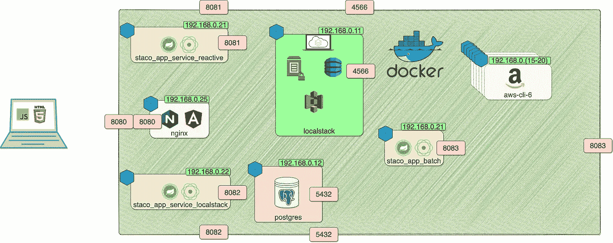*

*StaCo 应用程序概述*

*从上面的例子中，我们了解了将要检查的组件、它们的相关代码和配置，最后，我们将检查这在网络环境中是如何工作的。*

*在这一点上，我假设您知道协程如何工作以及协程反应库如何工作的基础知识。*

*在图中，我们看到了所有使用的容器的布局。本文中我们重点关注的是“***【local stack】***容器。这就是我上面提到的容器，它模拟了一个真实的 AWS 云环境。如果你能认出容器内的符号，你可以很容易地认出绿色的**参数库**，蓝色的**发电机 DB** ，红色的 **S3** 。*

*我们有一个 **PostgreSQL** 数据库，它从大量与邮票和硬币相关的数据开始。该项目的第一部分的最终想法是从 **PostgreSQL** 加载所有数据，并通过 **Quartz 作业**将其传输到 **DynamoDB** 。为了让它工作，我们将使用 S3 作为中介。我们将从 **PostgreSQL** 数据库中读取数据，用该数据的所有内容创建一个 CSV 文件，将其压缩为 **GZip** 文件格式，并将该文件发送到 S3。一旦完成，另一个任务将从 **S3** 下载文件，处理它们，当完成时，文件将从 **S3** 中删除。在这种情况下，处理意味着解压缩文件并将 **CSV** 内容加载到 **DynamoDB** 。旧邮票和硬币将被更新，并用它们的**主键** ( **主键**)进行识别*

*为了能够访问 **PostgreSQL** 并能够登录，我们将使用参数存储来保存我们需要的凭证。我们可以在参数存储中保存几种类型的数据。在这种情况下，我们使用它来保存和访问凭证*

*最后，我们希望了解代码在想要在前端可视化分页内容方面有何不同。为此，我们将看看用 **SpringWebFlux** 和协程实现的两种不同的服务。一个使用分页直接访问**PostgreSQL**数据库，另一个使用异步客户端直接访问 **DynamoDB** 。这两种服务都是以被动的方式实现的。*

# *4.履行*

*换句话说，这个项目的实现就是对这些库的研究:*

*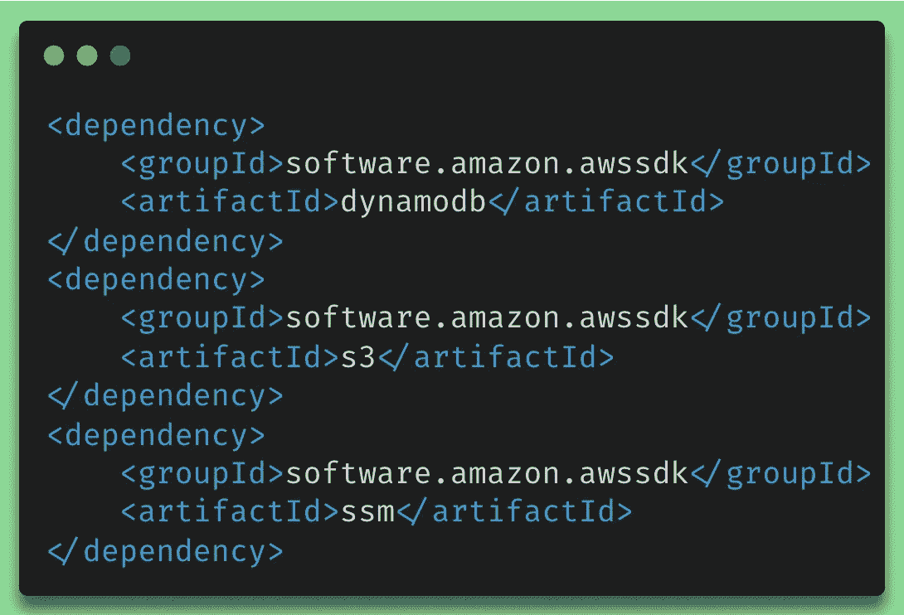*

*这些库是名为 AWS SDK for Java V.2 的库集合的一部分。*

*虽然我们可以使用自动配置来访问 AWS，但是我们必须使用手动配置来访问`**Localstack**`。多亏了 V.2，可以手动配置 AWS 的位置和我们想要使用的凭证。`**Localstack**`，使用`**test**`作为凭证来识别在我们的容器中运行的云环境。*

*代码运行所需的一些配置通过非常小的容器加载到 **Localstack** 中，容器运行一些命令。这将在参数存储中为我们的应用程序、PostgreSQL 的用户名和密码创建一个 bucket、用户名和密码。迪纳摩数据库表将在任何一个使用依赖关系**邮票和硬币公共云**的 Spring Boot 运行进程中创建*

*在下面，我们将只检查代码。我会详细解释每一个代码。然后我们将看到如何运行演示。我做了一个视频，你可以在下面看看。最后，我们将看看一些直接指向 Localstack 的`**aws**`命令，我们将解释返回的结果。*

*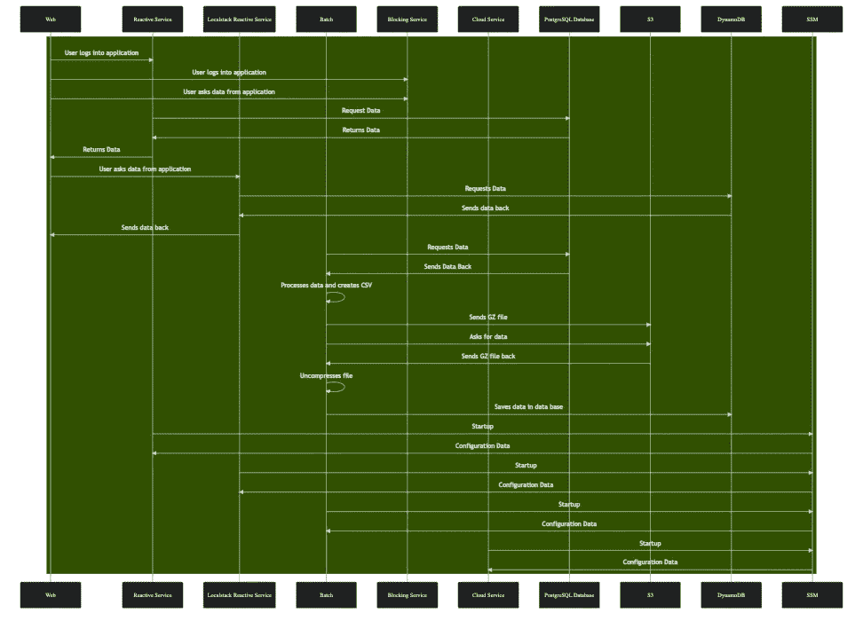*

*在 [GitHub](https://github.com/jesperancinha/staco-app) 上完成序列图*

# *4.1.参数存储*

*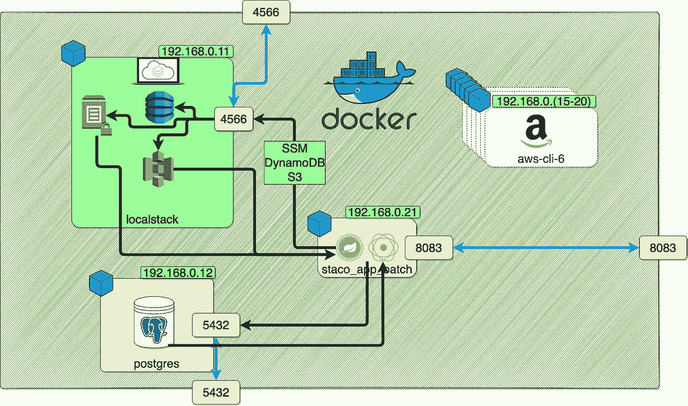*

*读取器和加载器域*

*为了用 **AWS** 做任何事情，我们需要意识到我们使用参数存储的可能性非常高。这是因为参数存储正是我们可以讲述我们想要与我们决定运行的服务一起使用的属性的地方。在 google 上进行搜索，我们可以找到几个关于如何在使用由 **Spring** 提供的 **Value** **Inject** 的同时手动实现对参数存储的访问的实现。我更喜欢添加一个**environment postprocessor**作为处理我们属性的最后一个元素。*

*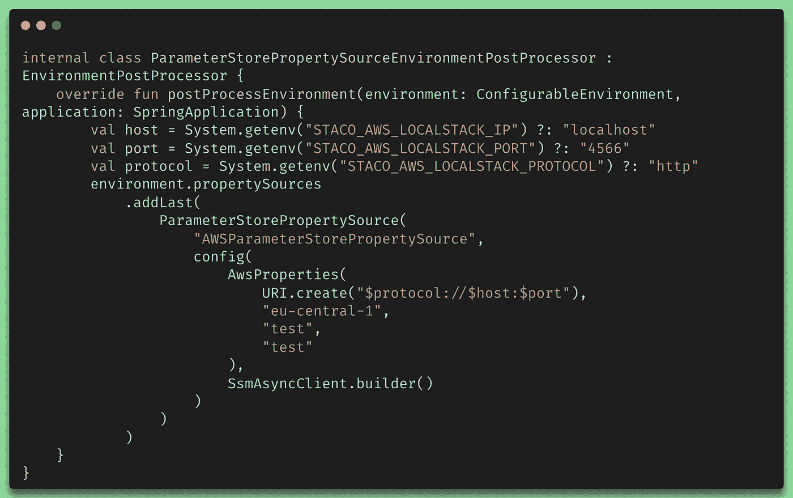*

*在这种情况下，我创建了代码，这样我们也可以通过环境变量配置我们的 **Localstack** 实例的位置。我们可以将它添加到我们的 **spring.factories** 中，以便添加这个**环境后处理器**。这将确保我们能够在 AWS 中找到所有尚未分配的属性。这是由**参数 StorePropertySource** 完成的。这是该系统的实际实现。我让 **config** 成为一个通用方法，以同样的方式创建实例。因为它们在本文中有共同的特征，所以这样做是有意义的。这样，我们的客户端实例 **SSM** 、 **S3、**和 **DynamoDB** 将被创建为指向同一个 Localstack，我们不必担心额外的实现。*

*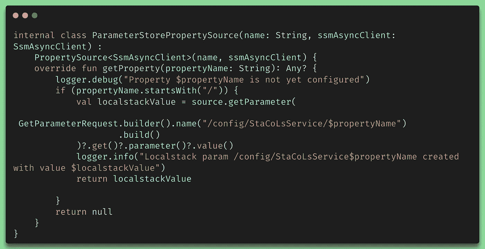*

*在我们的实现中，我们将只考虑以反斜杠开头的属性。在现实生活中，在 AWS 中，SSM 参数存储属性通常以 **/aws/** 开始。在我们的例子中，我们正在制作非常定制的东西，所以我们的属性都将从**/config/StaCoLsService/**开始。*

*既然我们理解了这些变化，现在我们可以简单地将这个公共依赖添加到存储库中，在那里我们需要从**参数存储库**中读取属性。*

# *4.2.S3 —简单存储服务—阅读器*

*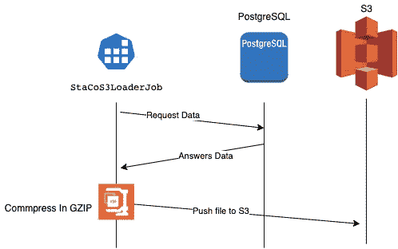*

*Dynamo 数据库加载程序的序列图*

*读取器和装载器作业位于同一个模块中，即模块**邮票和硬币批次**。这个模块本质上是一个独立的 Spring Boot 进程，确保我们的数据被临时存储在 **S3** 中，然后被下载并发送到 **DynamoDB** 。正如我上面提到的，我对所有的 Localstack 服务使用一个通用的配置方法，假设所有的服务碰巧共享相同的配置:*

*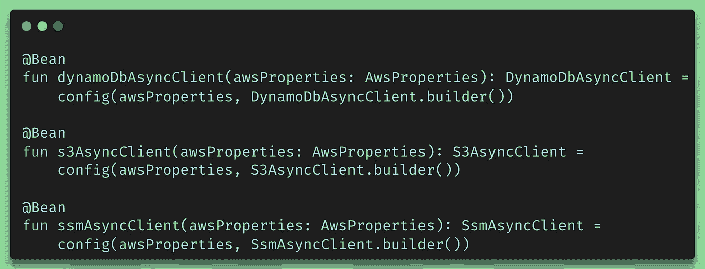*

*我们的作业从 ***执行*** 点开始，在协程上下文 ***IO*** 中启动，然后从数据库中检索所有数据。此时，可能没有必要使用协程，因为不幸的是，为了处理一个文件的所有内容，我们需要阻塞这个过程:*

*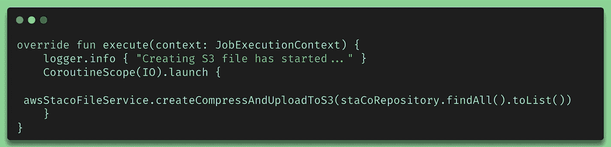*

*列表加载到内存中后，我们现在创建我们的文件。这是事情变得非常困难的地方，取决于你有多少可用的资源。有许多不同的解决方案可以将大量数据处理到不同的文件或分区中，但这超出了本文的范围。让我们假设我们的数据不会超过高数据量的阈值。记住，我们将所有数据转换成一个 **CSV** 文件，并将每行记录打印到该文件中。您的文件将保存在系统定义的临时文件夹中。这通常是 **$TMPDIR** 。*

*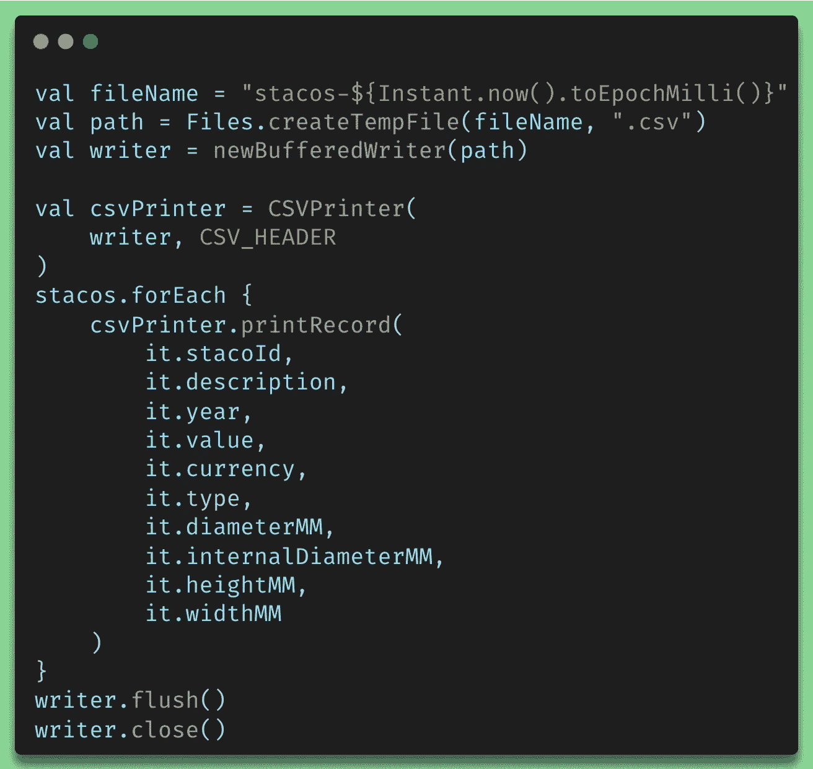*

*在这一点上，您可能会认为，假设我们将每个记录写入该文件，这实际上可以在没有阻塞的情况下实现。不幸的是，我们仍然需要 ***引蛇出洞*** 和 ***接近*** 我们的作家。同时，另一个解决方案是实现一个订阅者，它将在作业完成后被触发。然而，这样做意味着我们的作业订阅了一个被动的发布者。所有这些技术都可以在这里使用，但这仍然是一个没有任何资源竞争的作业，因此反应性和高性能的范例并不真正适用于这种情况。*

*然后我们创建一个流。为了将一个文件发送到 S3，我们所需要的只是一个给定格式的字节流。我们在这里选择 GZIP，但是在 S3 什么都可以。*

*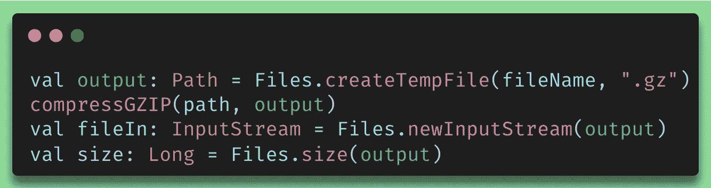*

*还有，我们需要一个桶。我们称我们的桶为“***stacos-bucke***t”。这个特定的存储桶是在演示开始时创建的。我将进一步解释这个桶是如何创建的，但是现在，对我们来说重要的是知道一个不同的过程将创建这个桶。*

*我们最终获得了流并将文件上传到桶中。*

*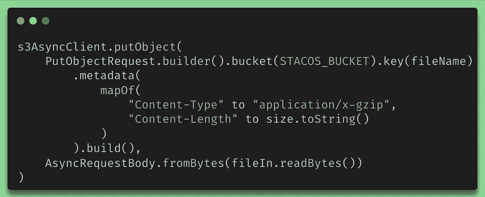*

*加载过程的第一部分到此结束。我们现在在 **S3** 有了我们的文件，我们准备在另一个任务中下载它，解包并将数据发送到**迪纳摩数据库。***

# *3.3.迪纳摩 DB —加载器*

*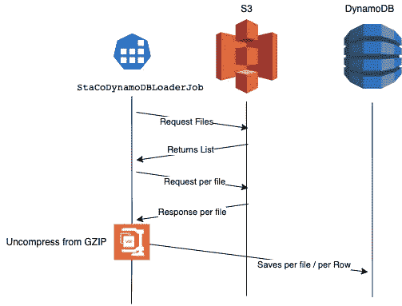*

*Dynamo 数据库加载程序的序列图*

*为了能够可视化数据，将数据加载到数据库中至关重要。当这样做时，根据我们的算法，我们只需下载所需的文件。我们需要哪些文件？对于我们这个简单的例子，我们把它简化了，所以我们需要所有的。这是通过代码列出它们的一种方式:*

*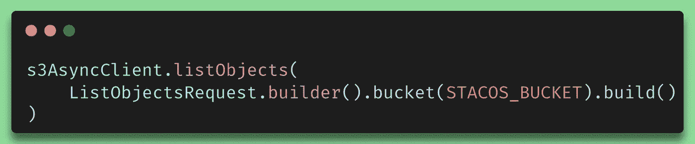*

*有了完整的文件列表，我们就可以遍历所有的文件*

*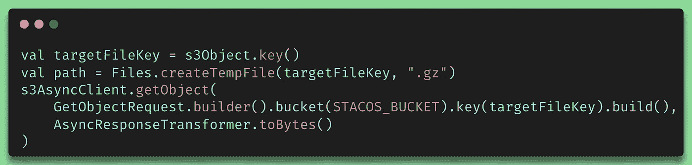*

*对于每次迭代，我们得到一个 ***字节数组*** 。这只代表我们文件的内容。我们给它一个名字，从它们中读取，并写到 **DynamoDB:***

*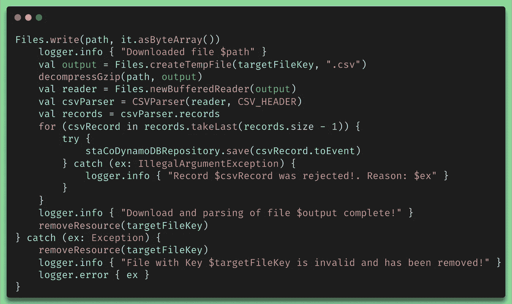*

*您会注意到，在整个代码中，我使用了几个扩展函数，以便在具有相同数据信息的不同类型的对象之间进行转换。在这种情况下，我们希望将 CSV 文件中接收到的数据转换成一个映射，该映射作为参数被接受给 **DynamoDB** 客户端:*

*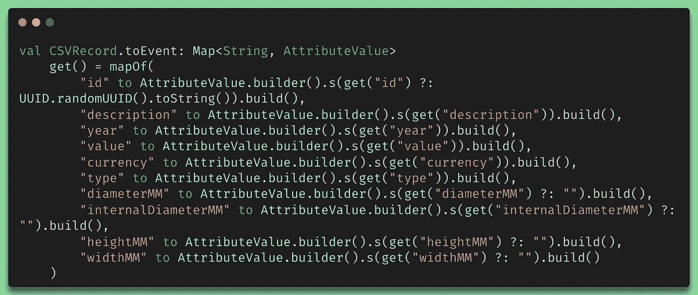*

*我们进行的转换基于我们如何定义表。在本演示的代码中，该表是以编程方式创建的:*

*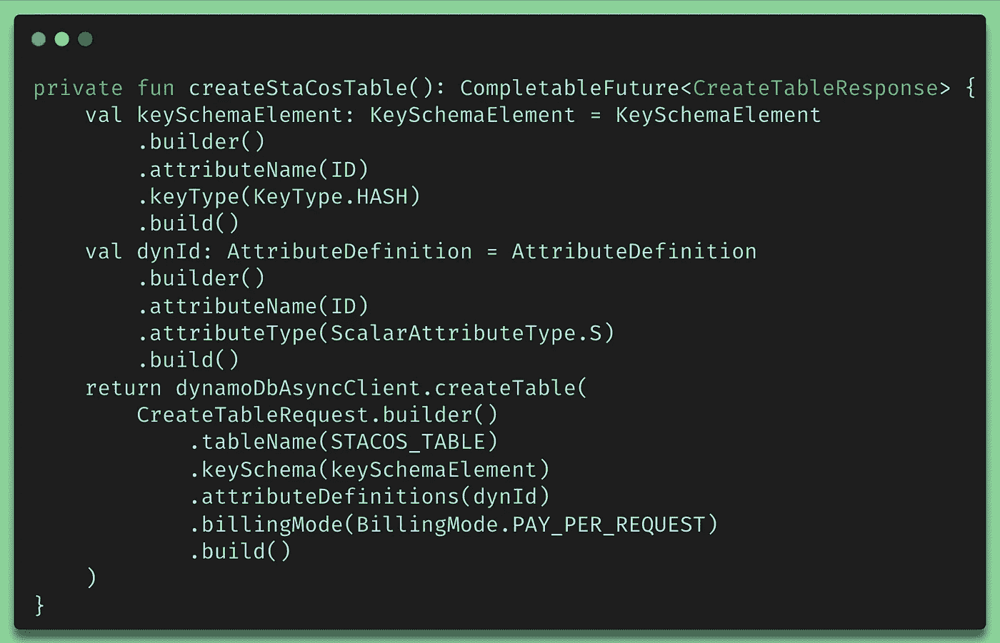*

*在 **DynamoDB** 中创建表格并不简单。对于 SQL 数据库和许多 **NoSQL** 数据库，我们已经习惯了先创建表，然后在开发过程中进行修改的想法。如前所述，DynamoDB 并不真正适合 RDBC**连接和 SQL** 数据库。在这一点上，我们需要知道我们将如何提供我们的数据。正如我们将在本文中进一步看到的，DynamoDB 的工作方式值得单独写一篇文章。 **DynamoDB** 允许分区配置，查询的工作方式非常不同，我们需要在潜在的查询之前定义我们的模式键，如果我们做得正确，我们将得到一个性能非常好的数据库。然而，这也是本文的题外话。现在让我们记住这样一个想法，我们的模式只有一个键 **ID，**，并且这个键的类型是***Scala attributetype。*年代**。正是在这个 ID 的基础上，我们将能够进行分页。*

# *3.4.走向反应式分页*

*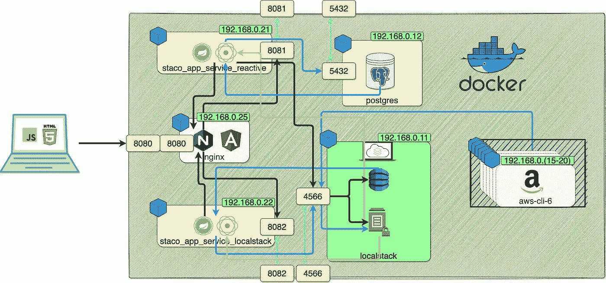*

*演示中所有可能的用户交互案例*

*在这个项目中，我创建了一个看似与本文无关的模块，名为:**邮票和硬币阻塞服务**。在本模块中，我们将通过传统的 **JPA** 存储库访问数据库:*

*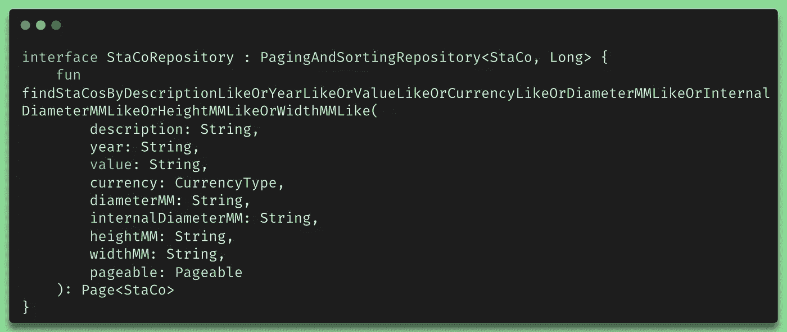*

*如您所见，通过使用 **Pageable** 参数，然后使用 **Page** 作为返回参数，可以非常容易地实现分页。有了这些对象，我们可以不断地发送分页的结果请求，并不断地交换当前页面的值、页面的大小以及我们想要过滤的内容。我们也在过滤表中的所有元素。*

*当试图将此翻译到**反应库**并且仍然针对同一个 **PostgreSQL** 数据库时，我们可能会开始质疑 return 参数。**反应式编程**，无论是用协程还是用 **WebFlux** 实现，在处理多个返回行时都有很大不同。我们不再返回行。相反，我们返回一个 **Flux** 或一个 **Flow** ，它们在稍后被处理，从而使服务对更多的请求可用，因此更加**被动**。然而，我们可以使用 Pageable still 返回与一个页面相关的结果。我们仍然失去了一个宝贵的结果，这就是找到的 ***总行数*** :*

*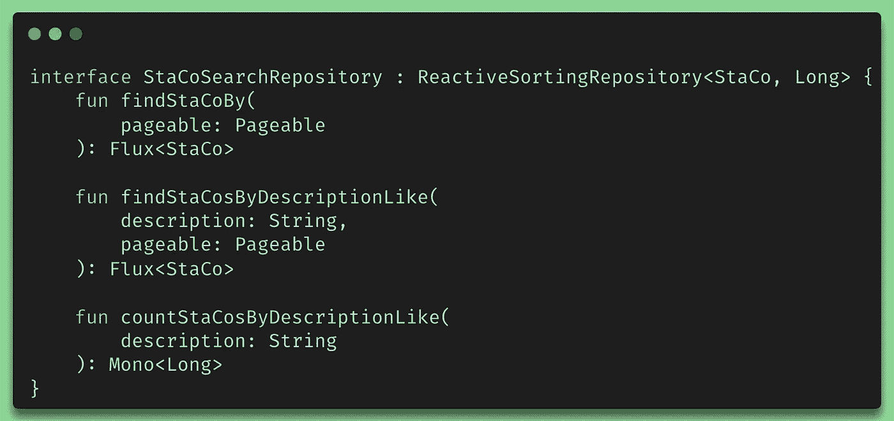*

*所以在这种情况下，我发现让应用程序知道有多少页面的唯一方法是执行另一个计数请求。这个请求只是基于我们最初请求的一个计数。从上面可以看出，两者都请求返回发布者，这意味着两者都以一种被动的方式工作。*

*这意味着我实际上是在执行另一个查询，只是为了根据我的搜索标准检查数据库中有多少元素。但是，以这种方式执行分页有一些改进。返回的计数是一个**单声道**，过滤后的结果作为**通量**返回。这些对反应式协同例程实现的争夺者也使得应用程序具有难以置信的反应性。然而，如果我们想使用反应式存储库进行分页等操作，它们似乎不是现成的。我们仍然可以使用 **Pageable** ，但是对于一个网站来说。我们确实必须执行两个独立的请求，但是它们没有阻塞，因此有理由期望我们的应用程序变得更有性能。我的观点是，变得被动也意味着变得不那么琐碎。我们越是提升技术来让应用程序尽可能反应性地工作，似乎我们也增加了复杂性。在我继续之前，我只想说这样很好。我们当然不需要把事情复杂化，但是我们所理解的复杂性确实因人而异。我个人更愿意把这种“复杂性”解释为只是一些我们不习惯的新事物。但是继续:*

*同样重要的是，当从一个针对 **PostgreSQL** 的反应式存储库转移到一个针对 **DynamoDB** 的 **DynamoDB** 存储库时会发生什么。例如，保存操作(**创建和更新**)是这样实现的:*

*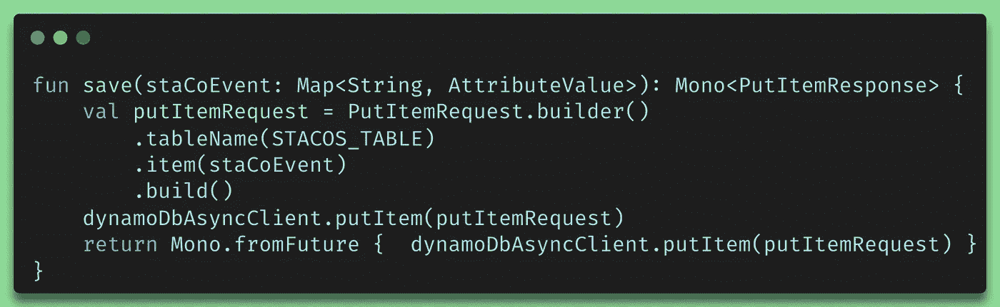*

*正如我们之前看到的，保存请求的有效负载是键**字符串**值**属性值**的**映射**。这又从客户端使用 ***putItem*** 和***putItem request***来执行。让我们思考一下这个问题。每一个对 ***Localstack*** 的请求，以及对 ***AWS*** 的请求，似乎都依赖于同一个常量构建器模式。 ***Async*** 实现使用 ***Futures*** ，我们可以很容易地适应 **WebFlux** 框架，并且我们可以对它们做出反应请求。这就是为什么我们将**单声道**视为*的包装器。此外，我们应该在这一点上看到，从*的角度来看，***dynamoDBAsyncClient***的工作方式非常相似，正如我们之前看到的***s3AsyncClient***一样。事实上，我们已经在阅读器和加载器中使用了这样的方法。***

**这只是对 ***保存*** 方法如何工作的简短介绍。我们仍然希望将这一点与我们在 ***DynamodDB*** 中如何做到这一点进行比较。因为我们本质上只是在做这方面的速成课程，并没有深入到如何搜索、扫描和查询数据的细节，这就是我在这里可以做分页的方法。**

**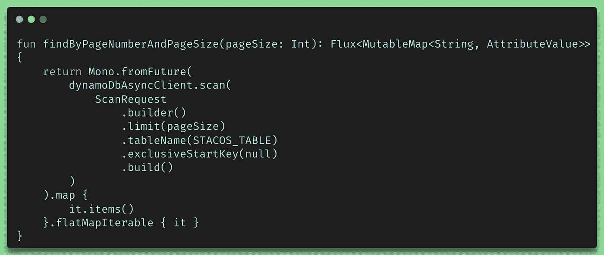**

**我们可以看到，我们实际上并没有发出传统意义上的分页请求。我们在这里做的是在 **SQL** 查询中使用类似于**限制**的东西。我们也没有使用**查询**。**查询**和**扫描**在 **DynamoDB** 中是不同的东西。这里的语义非常重要，因为当我们谈论 **DynamoDB** 中的**查询**时，我们谈论的是访问和搜索分区中的数据。当我们谈论**扫描**时，我们谈论的是在整个表空间中访问和搜索数据。这意味着在编程层面上，我们可以得到相同的结果，但是执行**扫描**通常比执行**查询**要昂贵得多。我们已经在上面讨论过，云服务器上更多的工作负载意味着更多的计费成本。因此，尽管我坚持避免使用扫描，但我们仍将在本例中使用它来理解为什么我们仅通过创建一个包含所有默认和最小配置的表并仅使用**扫描**而受到如此限制。**

**由于已经提到的原因，我决定在本文中不使用**查询**，我想出了一个解决方案。如果我们只是在我们想要开始我们的页面之前对记录进行第一次扫描会怎么样？然后我们可以像以前一样用**限制**操作限制结果。我们找到了。效率非常低，但在 **DynamoDB** 中可以分页:**

**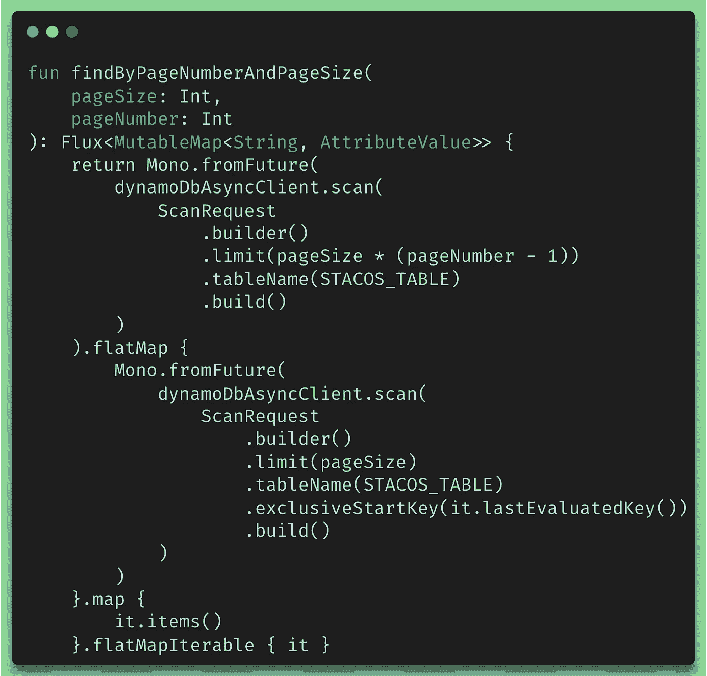**

**不管效率有多低，我们得到了一个我想在这里讨论的概念。还记得我们在上面定义的**模式键**吗？嗯，这个**键，**又名 **ID，**就是我们用来定义***exclusive startkey***的。专属启动键是什么？这是我们开始查询的地方。在这种情况下，我们将从初始查询的最后一个结果元素开始。通过将这些方法链接在一起，并使用 **ID** 作为关键字，我们实际上是为每次页码大于 1 时创建两个查询。**

**我们不需要对第一页进行两次查询，但是使用**扫描**，我们没有太多其他选择。您将在演示中看到这是可行的。然而，我们正在进行两个查询。为了做到这一点，我们必须深入到***【dynamo db】***中的**查询**的世界中，这是一个与本文非常不相干的主题。**

**从 **JPA** ，穿越**反应** **CRUD** 仓库，最后到达 **DynamoDB** 同样令人瞩目的是，技术的发展是如此美丽和伟大。我们的 **DynamoDB** 解决方案，尽管在获取数据方面并不完美，但它仍然是反应式的。我们还在用 **Future 的**，我们还在用 Flux。我们现在使用 3 个查询，但还没有过滤器。**

# **4.开始演示**

**我构建了一个应用程序，一个小的 GUI，只是为了测试两个前端面向后端的 Spring Boot 服务。我已经创建了一个 **Makefile** ,它包含了许多执行测试、构建、清理和启动容器的重要命令。我用它来保存对重要命令的引用，同时也使事情变得简单一些。**

**说到这里，让我们用下面的命令一次启动所有的东西:**

```
**make docker-clean-build-start**
```

**假设一切顺利，您应该在 [http://localhost:8080](http://localhost:8080) 上看到这个屏幕:**

**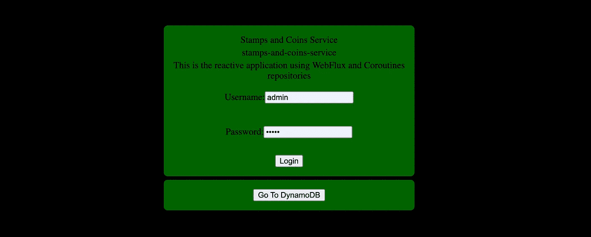**

**StaCo 应用程序 GUI**

**如果您使用 **admin** / **admin** 登录，并记住这是在参数存储中配置的，您将进入反应式保护应用程序。这个应用程序以一种被动的方式直接通过 R2DBC 访问 Postgres。**

**一旦你进入，你会看到这个屏幕**

**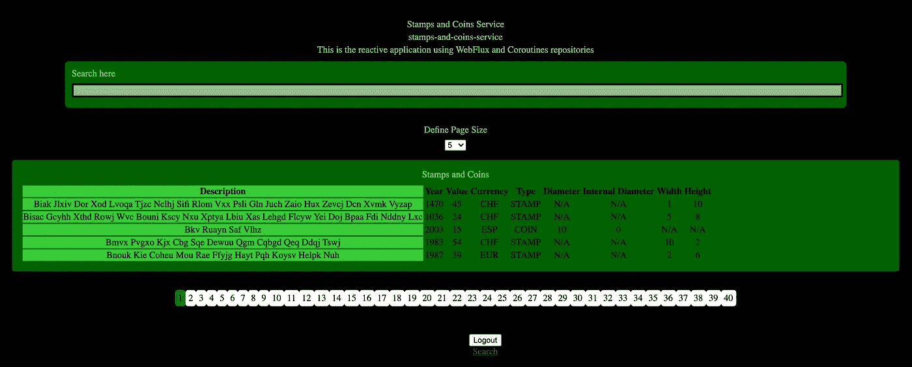**

**StaCo 应用程序对 PostgreSQL 的被动访问**

**您可以在这里测试我们的过滤器。这就是我们在讨论分页时提到的过滤器:**

**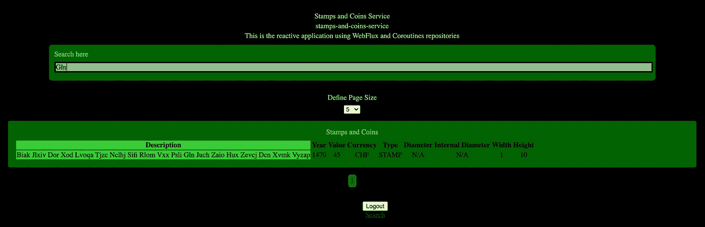**

**StaCo 应用程序过滤了对 PostgreSQL 的被动访问**

**如果您使用 logout 按钮返回主屏幕，只需点击 Go To DynamoDB，您将看到以下屏幕:**

****

**StaCo 应用程序过滤对 DynamoDB 的反应式访问**

**正如我们之前讨论过的，没有过滤器。然而，分页有一种可能的实现方式。这是用我们之前讨论过的算法完成的。**

**如果您想观看演示并检查我是如何启动容器的，我在 YouTube 上制作了一个视频，演示了为本文创建的应用程序:**

**使用 Localstack 和 Reactive Kotlin 学习 AWS 演示——邮票和硬币实现**

# **5.发出 AWS 命令**

**如果你有兴趣针对 **Localstack** 尝试 AWS 的命令行，首先需要设置环境变量: **AWS_ACCESS_KEY_ID** 、 **AWS_SECRET_ACCESS_KEY、**和 **AWS_DEFAULT_REGION** 。我为此编写了一个脚本，并将它放在项目根目录下的 **bash** 文件夹中。**

**如果您使用以下命令运行该脚本:**

```
**. ./bash/docker-setup.sh**
```

**您将拥有所有需要配置的变量。**

**现在，我们可以在运行 **Localstack** 的情况下练习下面的命令列表。记住 **Localstack** 是在 **Localhost** 上运行的。因为我们不需要运行所有的服务来测试 **Localstack** ，所以请从根目录运行:**

```
**make docker-localstack**
```

**或者，如果您喜欢手动启动它，您可以这样做:**

```
**docker-compose rm -svf
docker-compose rm localstack
docker-compose up -d --build --remove-orphans localstack**
```

**在运行了 **Localstack** 之后，我们可以试着看看我们得到的结果:**

**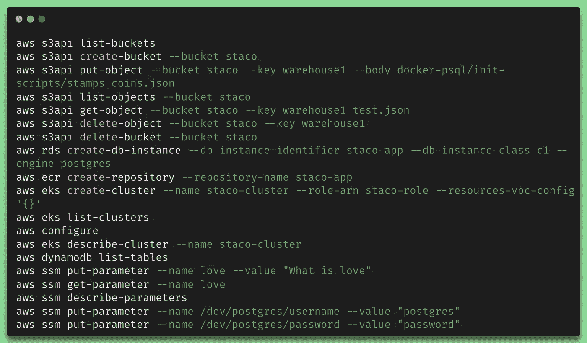**

# **6.通过 Web REST 服务发送图像**

**我们可以讨论的另一件事是如何在服务背后使用 DynamoDB。一种方法是通过 REST 调用和使用字节流来存储我们的邮票和硬币。通过这种方式，我们可以创建标准的抽象，进而使用 AWS 提供的抽象。我们在**邮票和硬币服务**模块中有这个***rest controller***:**

**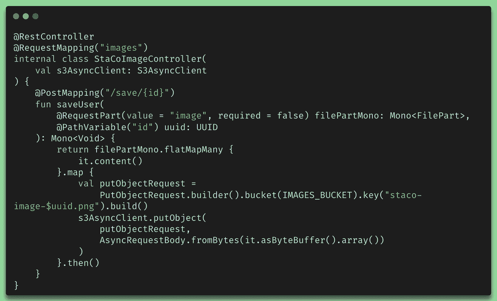**

**在这种情况下，我使用来自我们已经讨论过的 **s3AsyncClient** 的 ***putObject*** 请求，以一种被动的方式来实现这一点。在 ***邮票和硬币演示*** 中，我们可以发送一些示例图片:**

```
**curl -v -F "image=@stamp-sample.png" http://localhost:8082/api/staco/ls/images/save/$(uuidgen)**
```

**然后我们得到这样的回应:**

```
***   Trying ::1:8082...
* Connected to localhost (::1) port 8082 (#0)
> POST /api/staco/ls/images/save/88D0A1B2-561D-46CB-BB7A-A8381437E8E2 HTTP/1.1
> Host: localhost:8082
> User-Agent: curl/7.71.1
> Accept: */*
> Content-Length: 31250
> Content-Type: multipart/form-data; boundary=------------------------0ee837c95bbe60e3
> 
* We are completely uploaded and fine
* Mark bundle as not supporting multiuse
< HTTP/1.1 200 
< Content-Length: 0
< Date: Wed, 01 Dec 2021 19:03:43 GMT
< 
* Connection #0 to host localhost left intact**
```

**读到这里，似乎我们的图像已经去了 S3。现在让我们列出所有容器:**

```
**{
    "Buckets": [
        {
            "Name": "images",
            "CreationDate": "2021-12-01T18:39:39.000Z"
        },
        {
            "Name": "stacos",
            "CreationDate": "2021-12-01T18:39:39.000Z"
        }
    ],
    "Owner": {
        "DisplayName": "webfile",
        "ID": "bcaf1ffd86f41161ca5fb16fd081034f"
    }
}**
```

**我们可以看到我们有一个**图像**桶。现在让我们列出其中的对象:**

```
**aws s3api list-objects --bucket images**
```

**这个桶里的东西是:**

```
**{
    "Contents": [
        {
            "Key": "staco-image-88d0a1b2-561d-46cb-bb7a-a8381437e8e2.png",
            "LastModified": "2021-12-01T19:03:43.000Z",
            "ETag": "\"ed8d3bffef907bd61ed0c29c7696deea\"",
            "Size": 31056,
            "StorageClass": "STANDARD",
            "Owner": {
                "DisplayName": "webfile",
                "ID": "75aa57f09aa0c8caeab4f8c24e99d10f8e7faeebf76c078efc7c6caea54ba06a"
            }
        }
    ]
}**
```

**我们的钥匙的名字是**staco-image-88d0a1b2–561d-46cb-bb7a-a8381437e8e2.png**。我们创造了这把钥匙。让我们下载刚刚上传的图片:**

```
**aws s3api get-object --bucket images --key staco-image-88d0a1b2-561d-46cb-bb7a-a8381437e8e2.png download.png**
```

**回应是:**

```
**{
    "AcceptRanges": "bytes",
    "LastModified": "Wed, 01 Dec 2021 19:03:43 GMT",
    "ContentLength": 31056,
    "ETag": "\"ed8d3bffef907bd61ed0c29c7696deea\"",
    "ContentLanguage": "en-US",
    "ContentType": "application/octet-stream",
    "Metadata": {}
}**
```

**如果我们打开结果文件，我们会得到:**

****

# **7.结论**

**在本文中，我们已经看到了一些非常简单的方法，可以使用 **Localstack** 来模拟 **AWS** 云环境。我们只触及了 **S3** 、 **DynamoDB** 和**参数库**的表面。对于一个典型的工程师来说，即使到达表面也是一项复杂的任务，他非常熟悉编程语言的工作方式、架构和设计，并且第一次看到**云**。**

**我认为这是因为**云**就在这里，它不会消失。 **AWS** 就在这里，可能永远不会消失。在云中工作和学习可能是一种非常有趣的体验，但也非常昂贵。考虑到关于成本和许可的最常见的原因，它也可能是限制性的。在 **DevSecOps** 环境中工作，权限总是一个问题。如果你的团队中有角色明确的成员，很可能你会发现自己在请求**系统管理员**授予你在云环境中执行某些任务的权限。在许多情况下，你只是获得临时许可，而许可的速度往往跟不上你的学习进度。**

**正如我们所见，这就是 **Localstack** 发挥巨大作用的地方。我们没有非常完整的在线 **AWS** 的 **GUI** ，但是几乎所有我们可以在远程 **AWS** 上做的事情，我们也可以在 **Localstack** 上做。这给了我们理解 **AWS** 的杠杆，犯错误，改正错误，开发和测试新的想法和概念。 **Localstack** 对于 **POC** ( **概念验证**)或者 **MVP** ( **最小可行产品**)来说非常棒。它也是进行集成测试的一个极好的工具。在这个项目中开发了相当多的集成测试。他们都使用[测试容器](https://www.testcontainers.org/)作为支撑框架。**

**我已经把这个应用程序的所有源代码放到了 [GitHub](https://github.com/jesperancinha/staco-app)**

**我希望你能像我喜欢写这篇文章一样喜欢它。我尽量让它简洁明了，并省略了许多小细节。**

**我很想听听你的想法，所以请在下面留下你的评论。**

**提前感谢阅读！**

# **8.参考**

**[](https://www.alexdebrie.com/posts/dynamodb-filter-expressions/) [## 何时使用(以及何时不使用)DynamoDB 过滤器表达式

### 在过去的几年里，我帮助人们设计他们的 DynamoDB 表。对许多人来说，这是一场忘却…

www.alexdebrie.com](https://www.alexdebrie.com/posts/dynamodb-filter-expressions/) [](https://mediatemple.net/blog/cloud-hosting/brief-history-aws/) [## AWS 简史-媒体圣殿博客

### 有时候，它会让人觉得 1200 亿美元的云产业是凭空出现的，似乎是在一夜之间。但是亚马逊…

mediatemple.net](https://mediatemple.net/blog/cloud-hosting/brief-history-aws/) [](http://jeff-barr.com/2014/08/19/my-first-12-years-at-amazon-dot-com/) [## 我在 Amazon.com 的头 12 年

### 十二年前的今天，我开车来到西雅图，开始在 Amazon.com 工作。今天似乎是一个很好的时机来告诉…

jeff-barr.com](http://jeff-barr.com/2014/08/19/my-first-12-years-at-amazon-dot-com/) [](https://www.scality.com/solved/the-history-of-cloud-computing/) [## 云计算的历史-已解决

### 我们生活在无处不在的云计算时代。它提供了灵活性、更低的成本和更好的资源访问…

www.scality.com](https://www.scality.com/solved/the-history-of-cloud-computing/) [](https://www.technologyreview.com/2011/10/31/257406/who-coined-cloud-computing/) [## 谁创造了云计算？

### 云计算是技术领域最热门的词汇之一。它在互联网上出现了 4800 万次。但是在…

www.technologyreview.com](https://www.technologyreview.com/2011/10/31/257406/who-coined-cloud-computing/) [](https://www.dynamicsonline.nl/erp-software/wat-is-on-premise-en-wat-is-de-cloud/) [## Wat 是内部部署的云吗？|动态在线

### 我想要一个 ERP 系统应用程序，我想在云的前提下…

www.dynamicsonline.nl](https://www.dynamicsonline.nl/erp-software/wat-is-on-premise-en-wat-is-de-cloud/)**