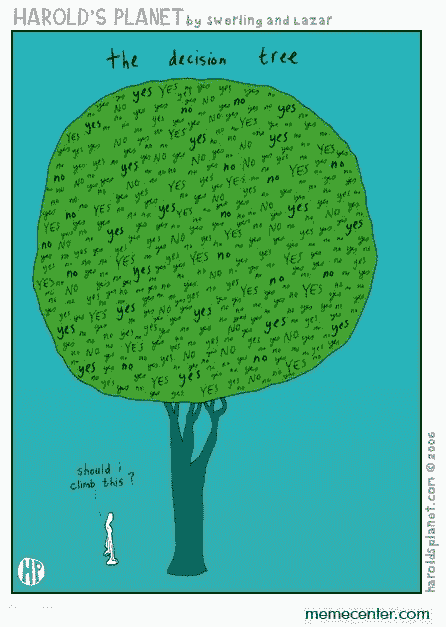
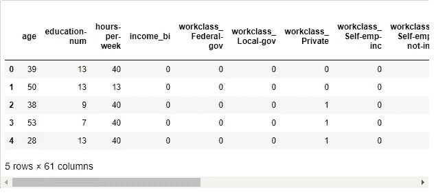

# 学习数据科学—用决策树预测成人收入

> 原文：<https://itnext.io/learning-data-science-predict-adult-income-with-decision-tree-ae8dd57a76cc?source=collection_archive---------2----------------------->



[决策树](https://en.wikipedia.org/wiki/Decision_tree)是一种决策支持工具，使用决策及其可能结果的树状模型，包括偶然事件结果、资源成本和效用。这是显示只包含条件控制语句的算法的一种方式。

决策树是机器学习中一个非常简单而强大的工具。让我们来看一个来自[成为人类的例子:](https://becominghuman.ai/understanding-decision-trees-43032111380f)


该树由以下组件组成:

*   问题/条件是节点。
*   是/否选项表示边。
*   终端动作是树的叶子。

在这篇文章中，我将使用这种有监督的机器学习方法——决策树分类——来预测一个成年人的收入是否大于 50K/年。

**获取数据**

成人普查数据来自加州大学欧文分校。

```
Listing of attributes: 

>50K, <=50K. 

age: continuous. 
workclass: Private, Self-emp-not-inc, Self-emp-inc, Federal-gov, Local-gov, State-gov, Without-pay, Never-worked. 
fnlwgt: continuous. 
education: Bachelors, Some-college, 11th, HS-grad, Prof-school, Assoc-acdm, Assoc-voc, 9th, 7th-8th, 12th, Masters, 1st-4th, 10th, Doctorate, 5th-6th, Preschool. 
education-num: continuous. 
marital-status: Married-civ-spouse, Divorced, Never-married, Separated, Widowed, Married-spouse-absent, Married-AF-spouse. 
occupation: Tech-support, Craft-repair, Other-service, Sales, Exec-managerial, Prof-specialty, Handlers-cleaners, Machine-op-inspct, Adm-clerical, Farming-fishing, Transport-moving, Priv-house-serv, Protective-serv, Armed-Forces. 
relationship: Wife, Own-child, Husband, Not-in-family, Other-relative, Unmarried. 
race: White, Asian-Pac-Islander, Amer-Indian-Eskimo, Other, Black. 
sex: Female, Male. 
capital-gain: continuous. 
capital-loss: continuous. 
hours-per-week: continuous. 
native-country: United-States, Cambodia, England, Puerto-Rico, Canada, Germany, Outlying-US(Guam-USVI-etc), India, Japan, Greece, South, China, Cuba, Iran, Honduras, Philippines, Italy, Poland, Jamaica, Vietnam, Mexico, Portugal, Ireland, France, Dominican-Republic, Laos, Ecuador, Taiwan, Haiti, Columbia, Hungary, Guatemala, Nicaragua, Scotland, Thailand, Yugoslavia, El-Salvador, Trinadad&Tobago, Peru, Hong, Holand-Netherlands.
```

**安装依赖关系**

```
import pandas as pd
import numpy as np
from sklearn import tree
import graphviz
from sklearn.model_selection import cross_val_score
```

决策树功能来自 sklearn。

**数据准备**

```
*# Load dataset* 
df = pd.read_csv('adult.csv', sep=',')
len(df) # 32561
```

许多行包含问号“？”。我会开始移除它们。

```
# Remove invalid data from table
df = df[(df.astype(str) != ' ?').all(axis=1)]
len(df) # 30162
```

大约有 2399 行被删除。

接下来，出于预测的目的，我将把收入列改为二进制，有几列对我的预测方法没有真正的贡献。

```
*# Create a new income_bi column* df['income_bi'] = df.apply(lambda row: 1 if '>50K'in row['income'] else 0, axis=1)*# Remove redundant columns*
df = df.drop(['income','fnlwgt','capital-gain','capital-loss','native-country'], axis=1)
```

为了建立预测模型，我们还需要将分类值转换为数值。

```
# Use one-hot encoding on categorial columns
df = pd.get_dummies(df, columns=['workclass', 'education', 'marital-status', 'occupation', 'relationship', 'race', 'sex'])
```



**构建决策树模型**

我们大约有 30，000 行，我将按 80/20 划分训练集和测试集。

```
*# shuffle rows*
df = df.sample(frac=1)# split training and testing data
d_train = df[:25000]
d_test = df[25000:]d_train_att = d_train.drop(['income_bi'], axis=1)
d_train_gt50 = d_train['income_bi']d_test_att = d_test.drop(['income_bi'], axis=1)
d_test_gt50 = d_test['income_bi']d_att = df.drop(['income_bi'], axis=1)
d_gt50 = df['income_bi']*# number of income > 50K in whole dataset:*
print("Income >50K: %d out of %d (%.2f%%)" % (np.sum(d_gt50), len(d_gt50), 100*float(np.sum(d_gt50)) / len(d_gt50)))# Income >50K: 7508 out of 30162 (24.89%)
```

我们大约有 24.89%的人年薪超过 5 万英镑。

现在，我们开始训练模型。我会在这篇文章的最后向你解释我为什么选择 max_depth=7。

```
*# Fit a decision tree*
t = tree.DecisionTreeClassifier(criterion='entropy', max_depth=7)
t = t.fit(d_train_att, d_train_gt50)
```

如果你想可视化决策树，你可以使用 [graphviz](https://graphviz.org/) 工具。

```
*# Visualize tree*
dot_data = tree.export_graphviz(t, out_file=None, label='all', impurity=False, proportion=True, 
                               feature_names=list(d_train_att), class_names=['lt50K', 'gt50K'],
                               filled=True, rounded=True)
graph = graphviz.Source(dot_data)
graph
```

在我们建立模型后，我们可以检验它的准确性。结果显示~82%是非常好的。

```
t.score(d_test_att, d_test_gt50)
# 0.820030995738086
```

我们可以进一步通过[交叉验证](https://scikit-learn.org/stable/modules/generated/sklearn.model_selection.cross_val_score.html)来评估分数。

```
scores = cross_val_score(t, d_att, d_gt50, cv=5)*# Show avarage score and +/- two standard deviations away (covering 95% or scores)*
print('Accuracy: %0.2f (+/- %0.2f)' % (scores.mean(), scores.std()*2))# Accuracy: 0.83 (+/- 0.00)
```

**开始预测**

我们可以通过在修改后保存数据框的第一行来准备预测模板。

```
*# Create a sample csv for prediction*
df.iloc[[0]].to_csv('prediction.csv', sep=',', encoding='utf-8', index=False)
```

现在我们有了一个 CSV 文件，其中包含了开始预测所需的数据。您可以修改行值以获得合适的用户配置文件。

```
*# Prepare user profile*
sample_df = pd.read_csv('prediction.csv', sep=',')
sample_df = sample_df.drop(['income_bi'], axis=1)*# Start predicting* 
predict_value = sample_df.iloc[0]
y_predict = t.predict([predict_value.tolist()])
y_predict[0] #0
```

对于我测试的用户，他们的工资不到 50K。

**如何为决策树选择正确的深度**

正确的方法是测试几个深度，以便为您的模型找到正确的最大深度。

```
for max_depth in range(1, 20):
    t = tree.DecisionTreeClassifier(criterion='entropy', max_depth=max_depth)
    scores = cross_val_score(t, d_att, d_gt50, cv=5)
    print("Max depth: %d, Accuracy: %0.2f (+/- %0.2f)" % (max_depth, scores.mean(), scores.std()*2))*# Results*
Max depth: 1, Accuracy: 0.75 (+/- 0.00)
Max depth: 2, Accuracy: 0.82 (+/- 0.01)
Max depth: 3, Accuracy: 0.81 (+/- 0.01)
Max depth: 4, Accuracy: 0.82 (+/- 0.01)
Max depth: 5, Accuracy: 0.82 (+/- 0.01)
Max depth: 6, Accuracy: 0.82 (+/- 0.01)
Max depth: 7, Accuracy: 0.83 (+/- 0.00)
Max depth: 8, Accuracy: 0.83 (+/- 0.00)
Max depth: 9, Accuracy: 0.83 (+/- 0.01)
Max depth: 10, Accuracy: 0.82 (+/- 0.01)
Max depth: 11, Accuracy: 0.82 (+/- 0.01)
Max depth: 12, Accuracy: 0.82 (+/- 0.01)
Max depth: 13, Accuracy: 0.82 (+/- 0.01)
Max depth: 14, Accuracy: 0.81 (+/- 0.01)
Max depth: 15, Accuracy: 0.81 (+/- 0.01)
Max depth: 16, Accuracy: 0.81 (+/- 0.01)
Max depth: 17, Accuracy: 0.80 (+/- 0.01)
Max depth: 18, Accuracy: 0.80 (+/- 0.01)
Max depth: 19, Accuracy: 0.80 (+/- 0.00)
```

如您所见，7–9 的最大深度产生了最好的结果— 83%。这就是为什么我选择 7 作为训练模型的 max_depth。

在这篇文章中，我们学习了如何建立一个决策树模型，并根据他们的特征对成年人的工资进行分类/预测——你可以从我的 github 中查看这个项目的笔记本[。](https://github.com/dalenguyen/python-for-data-science/blob/master/week-9-final-project/income-prediction/income-prediction.ipynb)