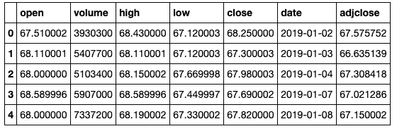
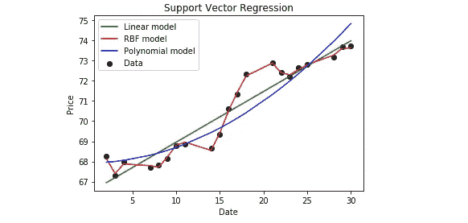

# 学习数据科学—使用支持向量回归(SVR)预测股票价格

> 原文：<https://itnext.io/learning-data-science-predict-stock-price-with-support-vector-regression-svr-2c4fdc36662?source=collection_archive---------0----------------------->


*免责声明:这是一个研究项目，请不要将此作为您的交易顾问。*

**为什么选择支持向量回归**

[支持向量机](https://en.wikipedia.org/wiki/Support-vector_machine) (SVM)分析是一个流行的分类和回归的机器学习工具，它支持线性和非线性回归，我们可以称之为 [SVR](https://scikit-learn.org/stable/modules/generated/sklearn.svm.SVR.html) 。

在这篇文章中，我将使用 SVR 来预测 TD 股票(TD US Small-Cap Equity-I)在 Python v3 和 Jupyter Notebook 下一个日期的价格。

**导入依赖关系**

```
**import** **numpy** **as** **np**
**from** **sklearn.svm** **import** SVR 
**import** **matplotlib.pyplot** **as** **plt** 
**import** **pandas** **as** **pd** 

%matplotlib inline
```

如果您有任何未找到的模块，请使用 pip 安装它。

**准备数据**

我将使用 [stockai](https://github.com/dalenguyen/stockai) 包从 Yahoo！金融。价格从 2019 年 1 月 1 日到 2019 年 1 月 30 日。

```
from stockai import Stock

td = Stock('TD.TO')
prices_list = td.get_historical_prices('2019-01-01', '2019-01-30')

df = pd.DataFrame.from_dict(prices_list)
df.head()
```



```
*# Get data function***def** get_data(df):  
    data = df.copy()
    data['date'] = data['date'].str.split('-').str[2]
    data['date'] = pd.to_numeric(data['date'])
    **return** [ data['date'].tolist(), data['close'].tolist() ] *# Convert Series to list*dates, prices = get_data(df)
```

**建立模型并开始预测**

这是一个非常简单的任务，我将使用日期和价格数据来预测 TD 股票的下一个日期价格，即 2019 年 1 月 31 日。

请记住，这是一个非常简单的预测方法，仅供研究之用。有很多东西需要考虑，比如情绪分析、基本面分析、技术分析、递归神经网络(RNN)、时间延迟神经网络(TDNN)……***所以我不把这作为你的投资方法。***

在这个例子中，我将使用三种模型:线性、多项式和径向基函数(SVR 的默认内核)。

```
*# predict and plot function*def predict_prices(dates, prices, x):
    dates = np.reshape(dates,(len(dates), 1)) *# convert to 1xn dimension*
    x = np.reshape(x,(len(x), 1))

    svr_lin  = SVR(kernel='linear', C=1e3)
    svr_poly = SVR(kernel='poly', C=1e3, degree=2)
    svr_rbf = SVR(kernel='rbf', C=1e3, gamma=0.1)

    *# Fit regression model*
    svr_lin .fit(dates, prices)
    svr_poly.fit(dates, prices)
    svr_rbf.fit(dates, prices)

    plt.scatter(dates, prices, c='k', label='Data')
    plt.plot(dates, svr_lin.predict(dates), c='g', label='Linear model')
    plt.plot(dates, svr_rbf.predict(dates), c='r', label='RBF model')    
    plt.plot(dates, svr_poly.predict(dates), c='b', label='Polynomial model')

    plt.xlabel('Date')
    plt.ylabel('Price')
    plt.title('Support Vector Regression')
    plt.legend()
    plt.show()

    return svr_rbf.predict(x)[0], svr_lin.predict(x)[0], svr_poly.predict(x)[0]
```

**获得预测并绘制预测模型**

```
predicted_price = predict_prices(dates, prices, [31])# (73.18055746816138, 74.23818331643184, 75.30920098568245)
```



如果我们想查看 TD 股票在 2019 年 1 月 31 日的收盘价，我们可以使用 [stockai](https://github.com/dalenguyen/stockai) 来获取。

```
from stockai import Stock
price = td.get_historical_prices('2019-01-31', '2019-01-31')print(price['close']) # $74.0
```

我很惊讶线性模型的预测显示了最佳匹配，因为股票价格通常不遵循线性模型。然而，预测价格非常接近真实价格。

这就是我对这个课题的研究和实践的结束。如果您有任何建议，请随时开始讨论。我很想听听你的想法，这是[这个股票预测例子](https://github.com/dalenguyen/stockai/blob/master/examples/support_vector_regression.ipynb)的代码。