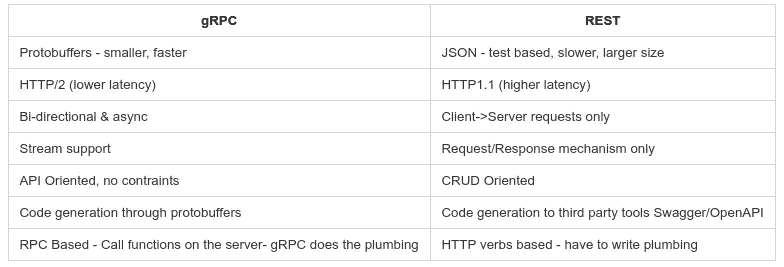
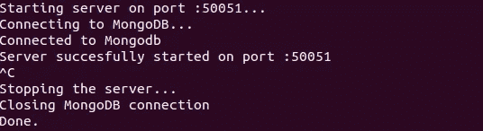
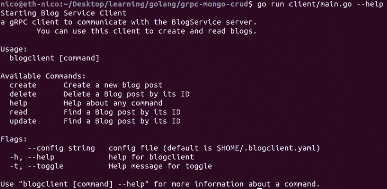

# 学习 Go:使用 gRPC 的 MongoDB CRUD

> 原文：<https://itnext.io/learning-go-mongodb-crud-with-grpc-98e425aeaae6?source=collection_archive---------0----------------------->


比利时的一只地鼠

# 去

过去几周，我一直在忙着玩我最喜欢的新玩具:Go。它是谷歌在 2007 年创建的一种开源编程语言。它在 Google 中被大量使用，并且在公开发布之前经过了实战测试，到目前为止，它被认为是一种非常稳定的语言。Go 试图在人类和机器之间找到一个最佳生产率和性能的中间地带。许多人认为这是后端开发和微服务的未来。

虽然 Go 还相对年轻，但它已经在分布式系统世界中受到了热烈欢迎。Docker，Kubernetes，InfluxDB，Go-Ethereum，…都是内置在 Go 里的。

这是经典的“为什么去？”列表:

*   使用 GoRoutines 和通道的优雅并发
*   多核支持
*   非常好的原始 CPU 和内存性能
*   类型并不麻烦
*   内置测试框架
*   静态代码分析
*   编译/部署

在这篇博客中，我不会教你如何用 go 编写“Hello World ”,相反，我们将使用官方的 mongodb-go-driver 和 gRPC 编写一个 CRUD API。在继续之前，确保你已经安装了 Golang、MongoDB、RoboMongo(为了方便使用)和协议缓冲区(链接在下面)。为了从本教程中获得最大收益，你应该熟悉一点 Go 语法和指针。


一只明显能举起

# gRPC 和 HTTP2

安息吧，这个街区有一个新的孩子，他叫 gRPC。gRPC 是一种基于 HTTP2 的现代协议，它使用一种称为协议缓冲区的强类型二进制数据格式而不是 JSON 来提供远程过程调用语义。

解析 JSON 是非常 CPU 密集型的，据估计，对于 RESTful 服务，它占用了所有 CPU 资源的 45%。结合 HTTP/2 提供的升级，gRPC API 估计比 RESTful 快**5-25 倍**。

gRPC 是从头开始构建的，以利用 HTTP/2 带来的所有好东西，并再次经过 Google 的战斗测试，每秒处理 100 亿个请求。下面是 HTTP/2 带来的一些有趣的东西:

*   多路复用(HTTP/1 为每个请求打开一个 TCP 连接)
*   服务器推送
*   报头压缩(HTTP/1 中的明文，随每个请求一起发送)
*   二进制而不是文本(非常适合协议缓冲区)
*   SSL 是一等公民

# gRPC 与 REST

将 gRPC 与 REST 进行全面的比较本身就是一篇博文的素材，所以这里有一个概述:



# 协议缓冲区

如前所述，协议缓冲区(简称 protobufs)是一种强类型、语言和平台中立的二进制数据格式。您可以在一次*中定义您想要的数据结构。proto* 文件，然后使用特殊生成的源代码轻松地为多种语言创建服务器和客户端存根。proto 文件是 API 契约的标准格式。根据 google 的说法，**proto buf 比 XML 小 3-10 倍，快 20-100 倍。**

协议缓冲区用于在*中定义**消息**(数据、请求和响应)和**服务** (RPC 端点)。proto* 文件。

要了解更多关于协议缓冲区的信息，请查阅大量的[文档](https://developers.google.com/protocol-buffers/docs/overview)。

# 言归正传:博客服务 API

在这篇博文的剩余部分，我们将为博客服务构建一个简单的 CRUD API。由于 MongoDB 刚刚发布了他们的官方 Go 驱动程序，我们将使用 MongoDB。我们将使用 Cobra 为客户机创建一个服务器和一个小型 CLI 应用程序。让我们把手弄脏吧！

*   Cobra 还不支持生成子命令的 go-modules，因此对于本教程，我们将使用好的 ol' $GOPATH:)。
*   你的文件夹结构应该是这样的:
    *$ GOPATH*/grpc-mongo-crud/
    -server
    -client
    -proto
*   或者，您可以在您的 *$GOPATH* 中生成子命令文件，并将代码复制粘贴到您自己的存储库中，并使用相对路径(这是我采用的方法)。

[你可以在我的 github 上找到代码库](https://github.com/kyriediculous/go-grpc-mongodb)。


# 1.创建原型文件

在你的 *$GOPATH* 中建立一个新的工作目录后，在 proto 文件夹中创建一个新的文件，姑且称之为 *blog.proto* 。为了简单起见，我们将为每个请求/响应创建单独的消息，尽管有些会重叠。

首先是一些样板文件，表明我们使用 protbufs v3，我们的包称为 blog，我们生成的 go 包将称为 blogpb(blog protocol buffer 的缩写)。

我们需要 5 个服务，每个服务接收一个请求并返回一个响应:

*   创建博客(一元)
*   ReadBlog(一元)
*   更新博客(一元)
*   删除博客(一元)
*   列表博客(服务器流)

*CreateBlog、ReadBlog* 和 *UpdateBlog* 将在它们的响应中返回一个*博客条目*，因此我们需要一个博客消息类型。消息可以嵌套，所以我们可以在请求/响应消息中使用我们的博客消息。

**创建博客请求/响应**

请求和响应都由一个`Blog`消息组成，主要的区别是在请求中，ID 将为空，因为它是由 MongoDB 在数据库中创建文档时创建的。在响应中，将填写 ID。

**更新博客请求/响应**

非常类似于 CreateBlog，但是我们请求中的 Blog 消息已经包含了在我们的数据库中查找和更新特定项目的 id。响应将返回更新的文档。

**ReadBlog 请求/响应**

我们将保持简单明了，只通过 Id 搜索博客。不过，也可以使用[](https://developers.google.com/protocol-buffers/docs/proto3#using-oneof)**之一在单个请求消息中使用 id 或标题。**

***删除博客请求/响应***

*请求对象与 ReadBlog 相同，我们通过 id 找到 Blog 并删除它(这里也可以使用 oneof)。如果成功，我们返回`true`，否则返回一个错误。*

***列表博客请求/响应***

*这个是特别的，ListBlogs 将列出我们数据库中的所有博客。我们以前的所有服务都是一元的，这意味着它们遵循经典的请求/响应机制。当数据很小时，它工作得很好，但是对于大的数据流，它更好。列表博客将使用服务器流；对于一条请求消息，服务器将发回多条博客消息。*

***协议编译器:协议***

*现在我们已经创建了我们的*。proto* 定义是时候在 Go 中生成我们的客户机和服务器存根了。我们使用结合了 protocol-gen-go 插件的[协议缓冲编译器来实现这一点。](https://github.com/golang/protobuf)*

*您可以检查安装是否成功:*

```
*$ protoc — version
libprotoc 3.7.1*
```

*如果是的话，你可以把你的原型文件编译成 Go stubs，这将会在`/proto`文件夹中产生一个新文件:`blog.pb.go`*

```
*protoc proto/blog.proto --go_out=plugins=grpc:.*
```

*我建议您浏览一下新生成的文件，您将看到服务器和客户机的类型和接口、创建新服务器和客户机的方法、要实例化的类型(请求、响应和博客)以及这些结构的字段的 getters。*

*您还会在文件的顶部看到这一行，请牢记在心:*

```
*// Code generated by protoc-gen-go. DO NOT EDIT.*
```

# ***2。服务器实现***

***启动/停止服务器** 首先，我们需要一些样板文件来创建 gRPC 服务器和 mongoDB 连接，向控制台提供一些反馈，并通过*关闭挂钩*处理用户关闭服务器的操作。*

*我们将在我们的 main()函数中设置所有这些，您可以自己随意做一些代码拆分和清理工作。*

1.  *当我们使用日志包时，添加文件名和行号标志*
2.  *启动我们的监听器*
3.  *启动一个尚未注册服务的新 gRPC 服务器。*
4.  *创建一个博客服务并注册到我们新的 gRPC 服务器。*
5.  *连接到 MongoDB。*
6.  *接受侦听器上的传入连接*
7.  *处理用户启动的服务器关闭(CTRL+C)*

*现在让我们开始创建我们的`main()`函数。*

*现在让我们启动一个新的 gRPC 服务器并注册我们的博客服务。为了实现这一点，我们将使用 *grpc 包*以及通过编译我们的*创建的 *blogpb 包*。原型*文件。我们的 *blogpb 包*有一个名为*RegisterBlogServiceServer*的方法，该方法接收一个指向新 gRPC 服务器的指针和一个 *BlogServiceServer 结构*，该结构遵循我们生成的 *blog.pb.go* 文件中的 *BlogServiceServer 接口*。*

*干得好！现在我们将创建我们的 mongodb 连接，所以请确保您已经安装了 MongoDB 以及我们将使用的官方[*MongoDB-go-driver*](https://github.com/mongodb/mongo-go-driver)。如果您曾经使用过另一种语言的 mongodb 驱动程序，您会发现它非常相似。*

*最后但同样重要的是，我们将服务侦听器接受传入的连接，并使用 goroutine 和 channel 阻塞主通道，直到用户按下 CTRL+C。*

*我们完事了。您现在可以启动运行`go run server/main.go`的服务器，但是要确保预先运行`sudo service mongod start`或 *db。Ping()* 将返回一个错误。然后，您可以通过按 CTRL+C 关闭服务器。*

*如果一切顺利，您应该会看到如下内容:*

**

****注意:您可能需要在下一节中添加空方法来避免编译错误，因为 BlogServiceServer 还没有遵循它的接口(在 blog.pb.go 中)。**

## *创建我们的原型服务处理程序*

*现在我们已经准备好了我们的服务器，是时候为我们在*中定义的服务添加方法了。原型*文件。这些方法将我们的 BlogServiceServer 作为接收方，因此它将遵守它的接口。*

*在函数体中，我们通常使用以下工作流:*

*Protbuf 消息(请求)→常规 Go 结构→转换为 BSON + Mongo 动作→prot buf 消息(响应)*

*目前缺少的是表示博客的常规 go 结构，它可以转换成 BSON。所以让我们在 main 函数之上创建这个类型，并添加一些标签，这样 bson 包将使用元信息来分配键。*

*现在让我们用 **CreateBlog** 方法。它接受一个*上下文*和一个请求，在本例中是 *CreateBlogReq。*首先，我们将从请求消息中提取博客消息，并将其转换为常规的 go 结构。使用我们提供的元标签，InsertOne() 将为我们把它转换成 *BSON* 。来自 *InsertOne()* 的结果返回我们的*集合*中新*文档*的*对象 ID* ，然后我们可以将它添加到我们的 *Blog protobuf 消息*中，以包装在一个 *CreateBlogResponse* 中。*

*接下来我们将执行**read blog()**,*read blogreq*将接收博客的*对象 ID* 并从我们的集合中检索该文档。MongoDB *FindOne()* 方法接受一个上下文和一个过滤器，这是一个 *BSON 文档*，通过它的键对其进行过滤。我们只需将找到的文档解码成一个常规的 go 结构，这样我们就可以将它转换回 protobuffer 消息。*

*既然我们可以创建和阅读博客，我们也应该能够删除一个。对于 **DeleteBlog** ，我们将使用 mongodb *DeleteOne()* 方法，该方法接收要移除的文档的对象 ID 。如果移除成功，我们将返回一个布尔值，否则返回一个错误。*

*对于我们的最后一个 CRUD 操作，我们需要方法来**更新博客**。为了简单起见，我们将使用根据我们的请求编码的文档来完全替换集合中的现有文档。在真实的场景中，我们会对参数进行 nil 检查，以便实际上只更新已填充的字段(使用 MongoDB 中的 set 关键字)。第二个怪癖是 Mongo 的 *FindOneAndUpdate()* 返回旧文档，所以我们必须显式地告诉它返回新文档。*

*我们将实现的最后一个方法， **ListBlogs** ，略有不同。我们之前的操作是*一元 CRUD 操作*，这意味着它们使用经典的 *1 响应 1 请求机制*。*

*然而，如果我们想列出所有博客，数据负载可能会变得太大而无法在一个响应中返回，因此我们将通过 gRPC 实现 ***服务器流*** 。对于一个列出博客的请求，服务器将保持博客消息的流式传输，直到所有的博客都被发送回客户机。*

*MongoDB 通过其*光标*特性在这方面非常有用。MongoDB 中的游标是指向查询结果的指针，而不是内存中的所有结果。*

> *指向查询结果集的指针。客户端可以遍历游标来检索结果。*

*所以我们要做的是使用*游标迭代游标。Next()* 并将每个博客作为消息发送给客户端，直到光标不再显示结果，此时我们将关闭服务器端的流。当您看到代码时，事情变得更加简单:*

*干得好，这就是我们的整个服务器实施。你正在成为一个超级地鼠！接下来，我们将开始使用 [Cobra](https://github.com/spf13/cobra) 开发 CLI 客户端应用程序。*

**

# *3.客户端实现*

***Cobra** 如前所述，我们将使用 Cobra 为我们的客户制作一个 CLI 应用程序。它附带了一个方便的生成器来为我们生成样板文件。*

*cobra 生成器还不能与 go 模块一起工作，所以我们将在我们的 *$GOPATH* 中生成命令文件，然后将它们复制粘贴到我们正在创建项目的 */client* 文件夹中(如果您从一开始就在 *$GOPATH* 中启动，那么您可以从 */client* 文件夹中运行生成器)。*

*首先，安装眼镜蛇。这将在 *$GOPATH/bin* 中创建一个可执行文件，我们可以在终端的任何地方运行它(如果您的设置正确的话)。*

```
*$ go get github.com/spf13/cobra/cobra*
```

*一旦 Cobra 成功安装，我们就可以启动一个新项目。*

```
*$ cobra init*
```

*这将生成一个 *main.go* 文件和一个 */cmd* 文件夹。main.go 文件除了调用位于 */cmd/root.go 中的根命令上的*执行*之外不做任何事情。**

*在 */cmd/root.go* 中有两件事对我们很重要，那就是 *rootCmd struct* (一条*眼镜蛇。Command* type)，它包含命令名和描述以及 *init()* 函数，我们将在这里初始化客户端。由于*子命令*被绑定到 r *oot 命令*，Cobra 总是在执行*子命令*之前启动一个客户端。*

*为您的根命令命名并提供一些描述:*

*并初始化客户端:*

*如果我说这是我们客户最难的部分，我不是在开玩笑，非常简单，对吗？您可以随意添加标志或命令来使用 Cobra，您也可以使用现成的“帮助”标志。在我们完成的应用程序中，当被调用时，它看起来像这样:*

**

***创建博客命令** 现在我们的根命令已经设置好了，让我们创建第一个子命令，这样我们就可以将博客添加到我们的数据库中了。*

```
*$ cobra add create*
```

*这将创建一个新文件， */cmd/create.go* ，其布局与 *root.go* 大致相同。有一个类型为 *cobra 的结构。命令*和一个 *init()* 函数。*

*在 *init* ()函数中，我们将定义我们的标志。每个博客条目都需要一个作者、标题和内容，所以让我们把这些标志也设为必需的。要添加一个标志，我们首先需要该命令的*标志集*，使用 *StringP(name，速记，defaultVal，description)* 我们可以添加一个有速记的标志(例如，“a”代表“作者”)。在 *init()* 函数的末尾，我们将子命令绑定到*根*。*

*为了运行与 create 命令相关联的方法，我们的 *cobra。命令* struct 将获得一个附加属性 *RunE* 。这允许我们执行一个返回错误的方法，因为记住我们返回的是内部 gRPC 错误。与命令(*命令)相关联的*标志集*。Flags()* )允许我们很容易地检索给定标志的参数。*

*从这些标志中，我们可以创建我们的请求， *CreateBlogReq* 并在客户端调用 *CreateBlog* 方法。这将通过网络发送 RPC 请求并返回一个响应。*

*Gist 似乎不喜欢正确的对齐方式…*

***阅读博客命令**
那很简单吧？让我们继续做一些更简单直接的事情，尤其是现在你已经掌握了窍门！阅读博客的命令；这将接受一个标志，即博客对象 Id。*

*类似于我们的*创建命令*的 *init()* 函数，我们将为 *id* 创建我们的标志，并将子命令绑定到我们的根。*

*在我们的命令结构中，我们将设置适当的名称和描述。我们的*符文*方法也会类似。我们将从*标志集*中检索 *id* ，从中创建我们的请求( *ReadBlogReq* )并调用 RPC 调用。*

***更新博客命令** 在客户端更新博客与创建博客几乎是一样的，只是增加了 id 标志，因为我们需要告诉 mongoDB 要更新哪个文档。让我们调用`cobra add update`并编辑生成的文件。*

***删除博客命令** 类似于 read 命令，该命令采用一个标志，即博客 id，并将其从数据库中删除。除了调用的客户端方法之外，代码几乎完全相同。*

***列出博客命令***

*这一个会略有不同，因为如果你记得它是一个使用服务器端流的 RPC 方法。调用 ListBlogs 将返回一个 grpc 客户端流。如果你想了解更多，我建议你查看 gRPC 包中的界面。但本质上是列出所有的博客，我们将循环，直到我们到达流的末尾。*

# *4.收尾工作*

*这是一条漫长的道路，但我们已经到了终点。现在，您实际上可以开始使用您制作的 CLI 应用程序了。如果你已经从你的 *$GOPATH* 开始工作，你可以*去安装*CLI 应用程序并直接从终端使用 root 命令。否则，您可以像这样调用命令:*

```
*go run client/main.go create -a “Nico Vergauwen” -t “Learning Go” -c “The quick brown fox jumps over the lazy dog”*
```

*就这样，你正在成为 Go 和 gRPC 的王者！感谢您的阅读，希望您喜欢！*

**