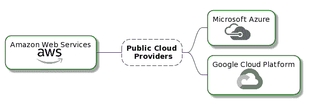
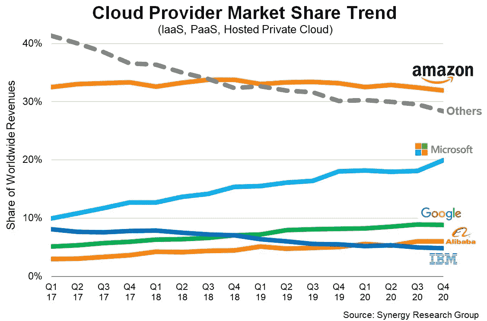
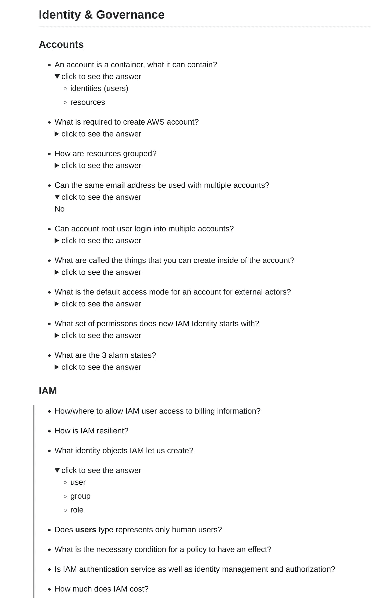
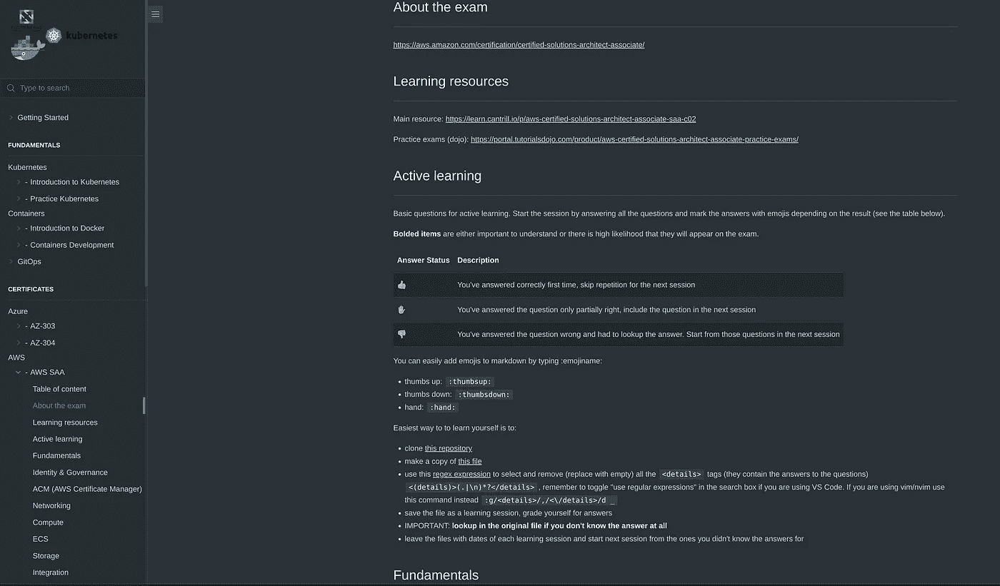

# 学习指南:AWS 认证解决方案架构师助理

> 原文：<https://itnext.io/learning-guide-aws-certified-solutions-architect-associate-ec95d1debba8?source=collection_archive---------1----------------------->

安德烈·德·森蒂斯峰在 [Unsplash](https://unsplash.com/?utm_source=unsplash&utm_medium=referral&utm_content=creditCopyText) 上拍摄的照片

SAA 二氧化碳

## [简介](http://localhost:3000/#/aws_saa_co2?id=about-the-exam)

云认证可以帮助你实现职业目标，在日常工作中学习和提高，如果你正在找工作，还可以增加你的机会。

为什么要学习 AWS 认证？在 3 家主要的云提供商中，AWS 拥有最大的市场份额，约为 **50%** ，并保持着健康的年增长率。

3 家主要的云提供商

来源:[协同研究小组](https://www.srgresearch.com/articles/cloud-market-ends-2020-high-while-microsoft-continues-gain-ground-amazon)

如果你在 LinkedIn 上寻找全球范围内的架构师职位，那么在撰写这篇博客的时候，AWS 已经有了 62%的职位空缺。

LinkedIn 上的架构师职位招聘信息:

*   [AWS](https://www.linkedin.com/jobs/search/?f_C=2382910&geoId=92000000&keywords=architect&location=Worldwide) (5154)
*   天蓝色 (2490)
*   [GCP](https://www.linkedin.com/jobs/search/?f_C=1441&geoId=92000000&keywords=architect&location=Worldwide&sortBy=R) (567)

## [关于考试](http://localhost:3000/#/aws_saa_co2?id=about-the-exam)

> 该证书有助于组织识别和培养具备实施云计划关键技能的人才。获得 AWS 认证的解决方案架构师-助理验证在 AWS 上设计和实施分布式系统的能力。

你可以在本页阅读有关考试的内容。

 [## AWS 认证解决方案架构师助理认证

### 了解有关此认证和 AWS 资源的更多信息，这些资源可以帮助您准备此证书，帮助组织…

aws.amazon.com](https://aws.amazon.com/certification/certified-solutions-architect-associate/) 

## [学习资源](http://localhost:3000/#/aws_saa_co2?id=learning-resources)

作为主要的学习资源，我强烈推荐阿德里安·坎特里尔的课程:

 [## AWS 认证解决方案架构师助理(SAA-C02)

### 我有多长时间可以学习这门课程？终身访问听起来怎么样？注册后，您可以无限制地访问…

learn.cantrill.io](https://learn.cantrill.io/p/aws-certified-solutions-architect-associate-saa-c02) 

这门课程的特别之处在于，它不仅让你为考试做好准备，还教会你**实用技能**，因此你将为作为一名架构师的真实生活场景做好更好的准备。还有一个非常有用的 Slack 频道，你可以在这里提出问题并快速获得帮助！

第二个非常有价值的资源是教程 Dojo 中的练习考试。

 [## AWS 认证解决方案架构师助理实践考试 2021 -教程 Dojo

### 成为 AWS 解决方案架构师助理！390 AWS 认证解决方案架构师助理(SAA-C02)实践考试…

portal.tutorialsdojo.com](https://portal.tutorialsdojo.com/product/aws-certified-solutions-architect-associate-practice-exams/) 

我的存储库和网页，包含基本问题和帮助您入门。

 [## GitHub - Piotr1215/dca-prep-kit:云计算和 it 认证的准备说明和技巧

### 此时您不能执行该操作。您已使用另一个标签页或窗口登录。您已在另一个选项卡中注销，或者…

github.com](https://github.com/Piotr1215/dca-prep-kit)  [## IT 认证指南

### 描述

www.itcertificationsguide.com](https://www.itcertificationsguide.com/#/aws_saa_co2) 

关于学习方法的说明:

主动回忆和基于空间的重复是伟大而有效的学习方法。

> 你可以在[这个博客](https://e-student.org/active-recall-study-method/)或者[这个 Youtube 视频](https://www.youtube.com/watch?v=fDbxPVn02VU&ab_channel=AliAbdaal)中找到关于这个方法的更多细节

## [自定进度研究](http://localhost:3000/#/aws_saa_co2?id=active-learning)

以下是我对如何开始并成功通过考试的建议:

*   将[我的存储库与学习资料](https://github.com/Piotr1215/dca-prep-kit)
*   制作此文件的副本
*   开始看阿德里安的训练
*   当你写下并回答问题时
*   使用这个[正则表达式](https://stackoverflow.com/a/16880892)选择并删除(替换为空)所有的`
`标签(它们包含问题的答案)`<(details)>(.|\n)*?
`，如果使用 VS 代码，记得在搜索框中切换“使用正则表达式”。如果你正在使用 vim/nvim，使用这个命令代替`:g/
/,/<\/details>/d _`
*   将文件保存为学习课程，为自己的答案打分
*   重要提示:如果你完全不知道答案，可以在原始文件中查找
*   留下每节课的日期文件，从你不知道答案的那节开始下一节课
*   一旦你觉得自己掌握了基础知识，就开始浏览 Dojo 教程材料(这比考试难多了)

回答问题时，我喜欢使用基于表情符号的评分(见下表)。

你也可以加粗那些理解起来很重要或者很有可能出现在考试中的问题。

*   给自己一个👍如果你第一次回答正确，下次就不要重复了
*   标记答案 with✋if，你只回答了问题的一部分，请在下一节课中回答这个问题
*   👎如果你答错了问题，必须查找答案。下节课从这些问题开始

您可以通过键入表情名称轻松地将表情添加到 markdown:

*   竖起大拇指:`:thumbsup:`
*   拇指向下:`:thumbsdown:`
*   手:`:hand:`

这里你可以看到一个降价文件中的学习材料的例子。

## 为什么不直接跳到教程道场？

经常收到这样的问题，为什么自己创建问答，不用教程 Dojo。答案是你创造的问题是你的问题，它们代表了你不知道、不感兴趣或不想了解的点点滴滴。这些问题也更简单，通常涉及 AWS 的基本工作原理。

教程 Dojo 问题很棒，但它们是考试的特定场景，通常要难得多。

## 捐助

正如你在[https://www.itcertificationsguide.com/#/](https://www.itcertificationsguide.com/#/)上看到的，我收集了不同认证(Azure、Kubernetes、Terraform 等)的学习材料，但也保留了许多有用资源的链接。

如果你正在为考试而学习，或者已经是一名专家，并愿意做出贡献，请随时提交一份个人简历，我很乐意将你的笔记包括在准备文档中。

我的希望是，这将有利于每个试图准备云和云原生认证的人。

如果你想接触，你可以在这里评论或在推特上找到我[https://twitter.com/Piotr1215](https://twitter.com/Piotr1215)。

祝考试好运:)

[https://www.itcertificationsguide.com/#/aws_saa_co2](https://www.itcertificationsguide.com/#/aws_saa_co2)