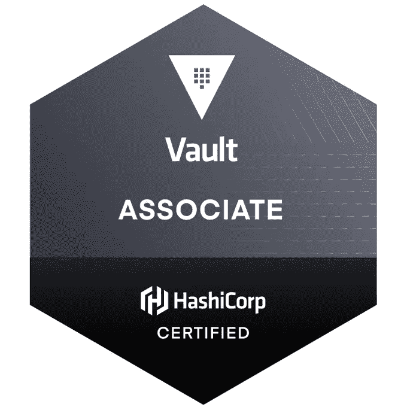
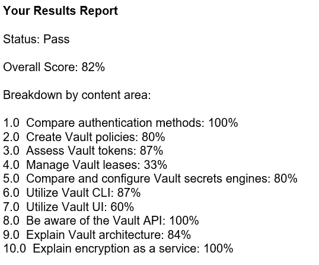

# 学习 HashiCorp 跳马和备考

> 原文：<https://itnext.io/learning-hashicorp-vault-and-exam-prep-a8e0588690be?source=collection_archive---------5----------------------->

成功！

最近，我参与了一个项目，在这个项目中，我们将把 GKE 与 Vault 集成在一起。

过去曾在 AKS 上与外部秘密解决方案合作过，这是扩展我的知识并将其应用于 GKE/金库的一个很好的起点。

我也热衷于了解跳马带来的兴奋…所以我想我应该学习它并参加哈希公司的跳马考试。

# 准备内容

HashiCorp 在文档方面做得非常好，所以学习他们的技术很容易。更进一步，他们的学习指南非常透彻…而且说实话，省去了我自己做指南的麻烦！

在线课程 —我看了 ACG 的跳马课程。很多实验室都很好。我发现作者是重复的，从头到尾都有点“无聊”。用 1.5 倍的速度观看，然后快进。【https://acloudguru.com/course/hashicorp-vault 号

**幻灯片—** 斯塔尼斯拉斯·夸斯坦纳制作了很多精彩的学习指南，通常还有幻灯片。这张幻灯片多达 300 多张。强烈推荐。[https://Stanislas . io/2020/09/22/preparation-guide-for-hashi corp-certified-vault-associate/](https://stanislas.io/2020/09/22/preparation-guide-for-hashicorp-certified-vault-associate/)

**HashiCorp 内容:**

*   **学习指南** —您获取与考试相关的所有 Vault 文档的途径。[https://learn . hashi corp . com/tutorials/vault/associate-review？in =保险库/认证](https://learn.hashicorp.com/tutorials/vault/associate-review?in=vault/certification)
*   **样题** — 11 道题让你感受一下考试的形式。我发现这很准确。[https://learn . hashi corp . com/tutorials/vault/associate-questions？in =保险库/认证](https://learn.hashicorp.com/tutorials/vault/associate-questions?in=vault/certification)
*   **教程** —大量的教程列表，您可以实时执行或按照说明进行操作。获得实践经验的好方法。[https://learn.hashicorp.com/vault](https://learn.hashicorp.com/vault)

我尝试了一些 Katacoda 演示/动手实验。我个人有很多问题，比如设置不完整，服务没有启动，或者根本无法浏览内容。我将解释一遍，因为意图是好的。

# 亲自动手

除了 ACG 课程、HashiCorp Learn 和 Katacoda 中的在线实验室之外，在您自己的环境中学习跳马也非常容易。下载库并在开发模式下运行 vault。您拥有一个成熟的堆栈，可以在其中使用 auth 方法、引擎和 CLI。显然，生产设置要复杂得多…但是为了学习，您不需要一个具有复制和灾难恢复功能的 7 节点集群！考试需要一些关于生产拓扑的知识，但不需要有这方面的经验。

# 考试

考试有 57 道混合选择题，对/错，点击 UI 截图，选择多个答案。考试质量和问题的广度给我留下了深刻的印象。使用我上面提供的示例问题链接来感受一下。

你有 60 分钟来写试卷，这已经足够了。大概 35 分钟就写好了。

用 PSI 监考…肯定不如皮尔森 Vue。办理登机手续花了整整 15 分钟。

我对我的考试成绩非常满意。令人惊讶的是，HashiCorp 并没有宣传最低及格分数。所以只能自省> 80%是安全的:)

