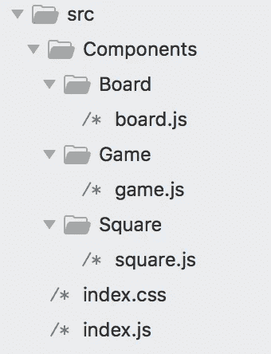
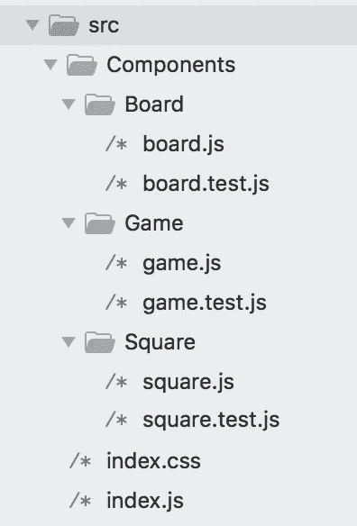

# 以 React Tic Tac Toe 应用程序为例学习编写 React 测试

> 原文：<https://itnext.io/learning-to-write-react-tests-on-example-of-react-tic-tac-toe-app-acf7ae2b94b8?source=collection_archive---------1----------------------->


为应用程序编写测试和编写代码本身一样重要。它帮助您捕捉恼人的错误，并使您的代码更易于维护和理解。

我们将尝试使用脸书开发的 [Jest npm 包](https://facebook.github.io/jest/docs/en/tutorial-react.html)和 AirBnb 创建的[酶测试工具](https://www.npmjs.com/package/enzyme)为一个简单的反应井字游戏应用程序编写测试。你可以遵循官方的 [React 文档](https://reactjs.org/tutorial/tutorial.html)关于构建基本井字游戏的教程，或者只使用同一链接下提供的最终代码。

在我们开始之前，如果您没有安装 **yarn** package manager，我建议您在终端中运行以下命令来安装它:

```
npm install -g yarn
```

接下来，为了能够测试单独的组件，我们将不得不修改这个应用程序的结构，并将每个组件移动到相应命名的单独文件夹中。

在您的 **/src** 文件夹中创建一个新的**组件**文件夹，结构如下:



不要忘记为每个组件添加导出默认值，包括 React 的导入和在每个父组件中重用的子组件。

您的 index.js 基本上应该只将我们的主要容器组件游戏呈现给 React DOM:

```
import React from 'react';
import ReactDOM from 'react-dom';
import Game from './Components/Game/game'
import './index.css';// ========================================ReactDOM.render(<Game />, document.getElementById("root"));
```

假设您遵循文档中的说明，并使用 **create-react-app** 包来创建您的新应用，您应该知道 **jest** 测试环境**已经包含在该包中**。单独安装 **jest** 会破坏您的测试并导致以下错误:

```
TypeError: environment.setup is not a function
```

但是 Enzyme 需要单独安装，所以运行:

```
yarn add enzyme enzyme-adapter-react-16 react-test-renderer
```

适配器也需要配置，创建一个名为 **setUpTests.js** 的新文件，并在其中插入以下内容:

```
import { configure } from 'enzyme';import Adapter from 'enzyme-adapter-react-16';configure({ adapter: new Adapter() });
```

在我们最终开始编写测试之前的最后一步。除了组件文件之外，在每个组件文件夹中创建一个测试文件，分别命名为 board.test.js、game.test.js 和 square.test.js。你可以在这里了解更多关于测试文件名约定[的信息。](https://github.com/facebook/create-react-app/blob/master/packages/react-scripts/template/README.md#filename-conventions)

您的/src 文件夹结构现在应该如下所示:



让我们从每个组件最简单的测试开始，看看它们是否都没有错误地呈现:

```
*// Game/game.test.js*
import React from 'react'
import Game from './game'
import {shallow} from 'enzyme'it('renders without crashing', () => {
  shallow(<Game />);
});*// Board/board.test.js*
import React from 'react'
import Board from './board'
import {shallow} from 'enzyme'it('renders without crashing', () => {
  shallow(<Board />);
});*// Square/square.test.js* import React from 'react'
import Square from './square'
import {shallow} from 'enzyme'it('renders without crashing', () => {
  shallow(<Square/>);
});
```

请注意，**浅层**渲染用于隔离的单元测试，但是如果您想要创建一些完整的渲染测试来确保组件正确集成，Enzyme package 也提供了 [**挂载**](http://airbnb.io/enzyme/docs/api/mount.html) 功能。

在您的终端中通过 **npm test** 运行测试。现在，您应该看到游戏和方块通过了两个测试，但是棋盘有一个测试失败:

```
TypeError: Cannot read property '0' of undefined
```

如上所述，我们正在使用独立的单元测试，我们的电路板组件需要一个**正方形**道具传递给它，以便正确渲染。为了查看该组件是否正确呈现，让我们在测试中显式地将 squares prop 传递给它:

```
import React from 'react'
import Board from './board'
import {shallow} from 'enzyme'it('renders without crashing', () => {
  **let squares = Array(9).fill(null)**
  shallow(<Board **squares={squares}**/>);
});
```

这三项测试现在都应该通过了！请注意，没有必要在每次做出更改时都重新启动测试。运行 **npm test** 命令时，jest 测试环境将自动启动，前缀为`--watch`，字面意思是**观察**文件的变化，并重新启动与这些变化的文件相关的测试。

接下来，让我们测试一下，单击棋盘方格时会触发 on click 事件。由于 Board 渲染 Square 组件并将 onClick 事件作为道具传递给它们，我们将需要渲染我们的 Board 组件及其子 Square 组件，因此我们将使用 Enzyme 提供的 **mount()** 函数，而不是 **shallow()** 。我们还必须创建一个“假”onClick 事件，我们通常会使用 jest mock 函数`jest.fn()`将该事件从游戏组件传递到电路板。我们还将利用 Enzyme 的[**find()**](http://airbnb.io/enzyme/docs/api/ReactWrapper/find.html)**选择器找到我们要模拟的组件点击使用**[**simulate()**](http://airbnb.io/enzyme/docs/api/ShallowWrapper/simulate.html)。最后，我们将通过使用 Jest 的[**toBeCalledWith()**](https://facebook.github.io/jest/docs/en/expect.html)来查看 onClick 是否被实际调用以及使用了哪些参数。****

```
**import React from 'react'
import Board from './board'
import {shallow, **mount**} from 'enzyme'it('renders without crashing', () => {
  let squares = Array(9).fill(null)
  shallow(<Board squares={squares}/>);
});it('**calls onClick event on click of a board square**', () =>{
  let squares = Array(9).fill(null)
  const onClick = **jest.fn()**;
  let wrapper = mount(<Board squares={squares} **onClick={onClick}**/>);
  wrapper.**find**('button.square').first().**simulate**('click');
  expect(onClick).**toBeCalledWith(0)**
})**
```

****请注意，您需要在文件顶部导入挂载函数。此外，我们希望 0 是调用 onClick 事件的参数，因为我们模拟的是在棋盘的第一个方格上单击，该方格在方格数组中的索引为 0。****

****检查您的终端，看看这个测试现在也通过了！****

****在我们的下一个测试中，我们将检查游戏状态是否正确呈现。现在，我们将从简单检查“下一个玩家:”开始，并确保在游戏开始前，下一个玩家是 X，在第一步移动后，它变为 o。在这种情况下，我们将不得不再次安装所有组件，因此将 **mount** 添加到您的酶导入中。****

```
**import React from 'react'
import Game from './game'
import {shallow, **mount**} from 'enzyme'it('renders without crashing', () => {
  shallow(<Game />);
});it('**renders game status correctly**', () => {
  const wrapper = mount(<Game/>)
  const firstPlayer = wrapper.find('div.game-info').children().first().text()
  **expect**(firstPlayer).**toEqual('Next player: X')**const button = wrapper.find('button.square').first()
  button.simulate('click')
  const secondPlayer = wrapper.find('div.game-info').children().first().text()
  **expect**(secondPlayer).**toEqual('Next player: O')**
})**
```

****在这种情况下，我们利用 jest 提供的 toEqual()方法来确定特定元素(div.game-info)的文本内容是否是我们所期望的。****

****我们必须添加到状态检查中的最后一件事是在游戏结束时宣布获胜者。我们将不得不模拟方块上的点击，使用 Enzyme 的**指定方块数。at(index)** 方法，该方法应在当前包装器的给定索引处返回节点周围的包装器(< Game / >)。由于我们已经在第一个方块上点击了一次，使我们的前半部分测试生效，我们将继续从第二个回合开始轮流进行。因此，让我们用以下内容更新我们的测试:****

```
**it('renders game status correctly', () => {
  const wrapper = mount(<Game/>)
  const firstPlayer = wrapper.find('div.game-info').children().first().text()
  expect(firstPlayer).toEqual('Next player: X')const button = wrapper.find('button.square').first()
  button.simulate('click')
  const secondPlayer = wrapper.find('div.game-info').children().first().text()
  expect(secondPlayer).toEqual('Next player: O')//player 2
  const **turn2** = wrapper.find('button.square')**.at(1)**
  turn2.simulate('click')
  //player 1
  const **turn3** = wrapper.find('button.square')**.at(4)**
  turn3.simulate('click')
  //player 2
  const **turn4** = wrapper.find('button.square')**.at(5)**
  turn4.simulate('click')
  //player 1
  const **turn5** = wrapper.find('button.square')**.at(8)**
  turn5.simulate('click')

  const **winner** = wrapper.find('div.game-info').children().first().text()
  expect(**winner**).**toEqual('Winner: X')**
})**
```

****如果你遵循正确的，你所有的测试现在应该通过！如果你认为你错过了什么，这里有一个链接到我的[**Github repo**](https://github.com/nothingisfunny/tic-tac-toe-react-writing-tests)**与最终代码**。********

****这篇博客文章提供了 Jest 和酶测试环境如何与 React 一起工作的简短概述，应该足以让您入门。点击下面的官方文档链接，了解更多信息:****

****[**笑话**](https://facebook.github.io/jest/docs/en/api.html)****

****[**酶**](http://airbnb.io/enzyme/docs/api/)****