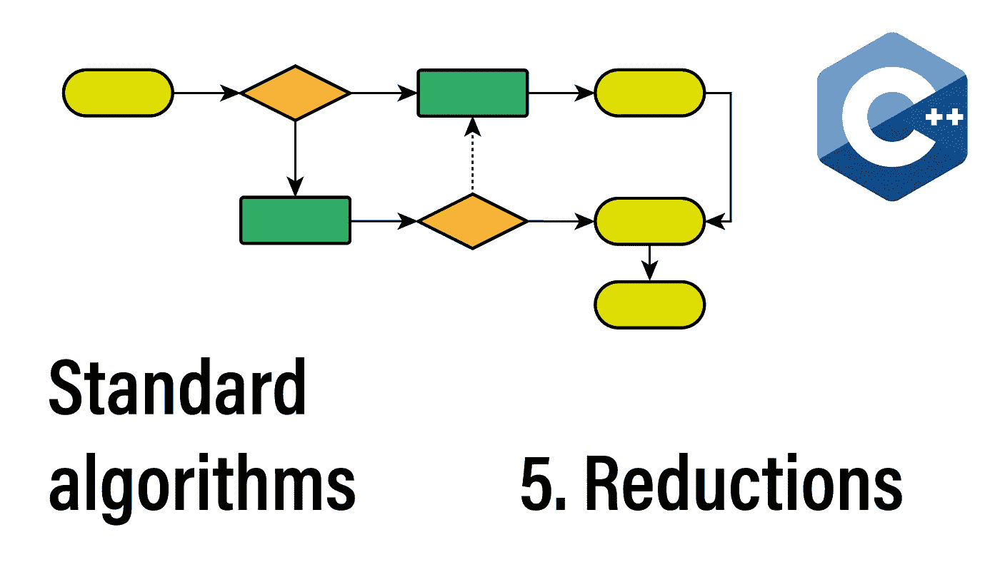
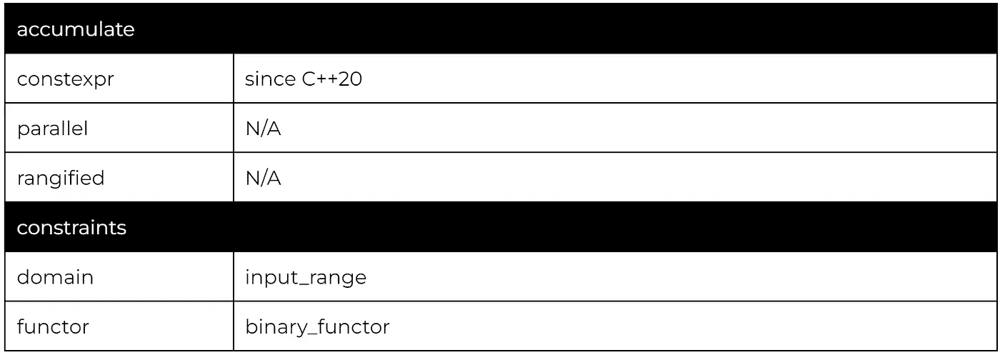
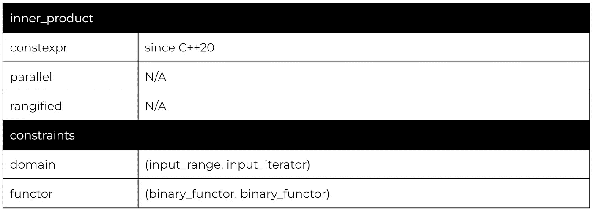
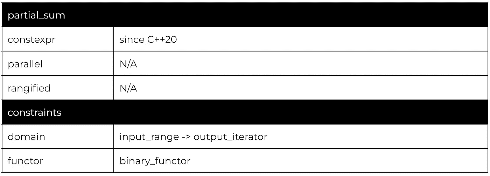
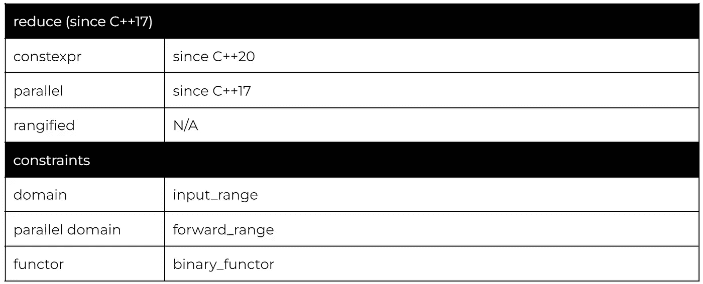
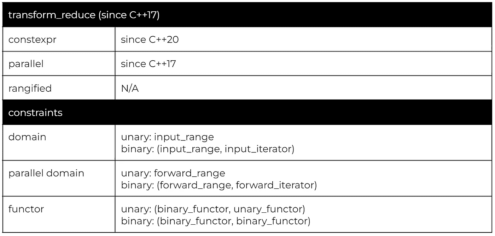
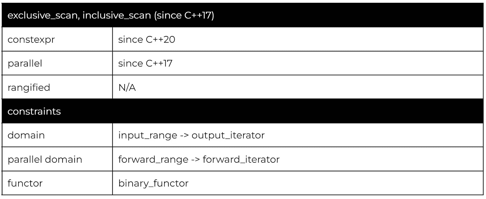
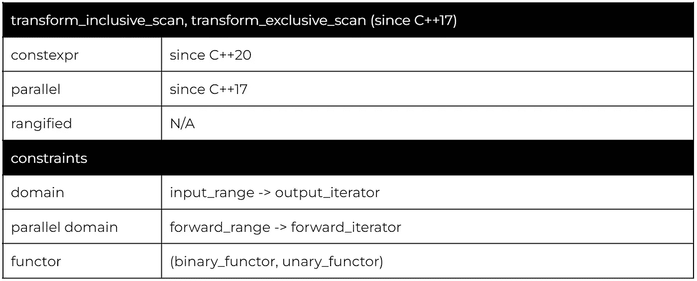
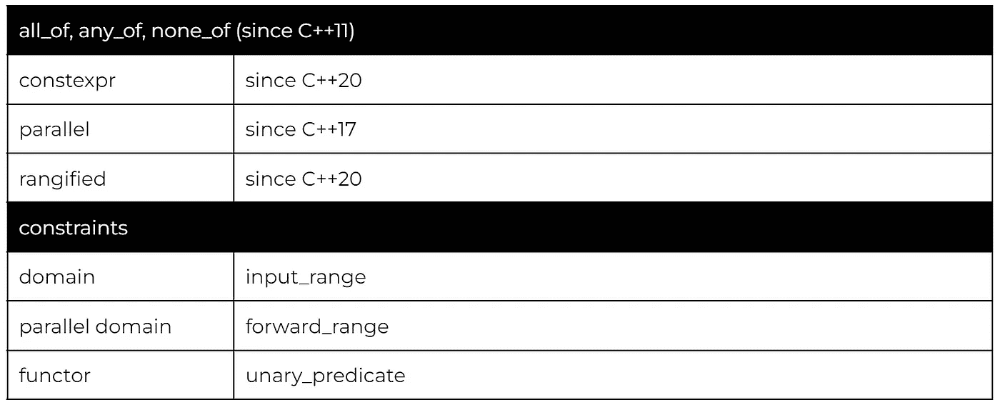
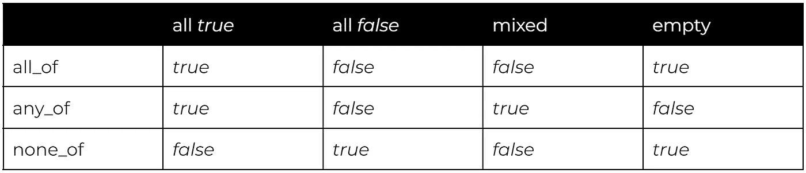

# 左折叠和其他简化:114 C++算法系列

> 原文：<https://itnext.io/left-folds-and-other-reductions-the-114-c-algorithms-series-6195724d324?source=collection_archive---------0----------------------->

欢迎学习 114 种标准 C++算法的第五部分。在本章中，我们将讨论归约算法，即将一个范围归约为单个值的算法。

我们将涵盖三组算法，严格线性运算的左折叠，C++17 的广义归约和布尔归约。我们还会稍微绕一下路，谈谈在 C++中混合数值类型的注意事项。

## 该系列:

*   [简介](/the-114-standard-c-algorithms-introduction-2a75a2df4300)
*   [排序和分割算法](/sorting-partitioning-the-114-c-algorithms-series-6503ad41cede)
*   [对排序或分区范围进行操作的算法](/divide-conquer-and-sets-the-114-c-algorithms-series-d0085a38046e)
*   [转换算法](/transformations-the-114-c-algorithms-series-deacdbd4c373)
*   左折叠和其他减少
*   [生成器、副本和移动](/generators-copies-and-moves-the-114-c-algorithms-series-1d0774472877)
*   [堆和堆](/heap-and-heap-the-114-c-algorithms-series-1d4215ae9f0d)
*   [搜索和最小值-最大值](https://medium.com/@simontoth/8a6ed951ad40)
*   结论(即将发布)

我们今天要讨论的所有算法(除了布尔约简)都来自于 *<数字>* 头，在 C++20 ranges 库中没有对应的内容(在 C++23 中有一些支持)。

# 累积，内积

我们从左折叠开始，算法严格从左到右操作，为每个元素计算*累加器= op(累加器，元素)*并返回最终的*累加器*值。

由于严格的线性运算，我们无法获得这些算法的并行版本。默认版本的 accumulate 使用二元*操作符+* ，如果指定，二元仿函数不允许修改范围内的元素或使迭代器无效。

要把任何一个左折叠算法变成右折叠，我们可以使用 *rbegin()* 和 *rend()* (只要范围是双向的)。

通过添加另一个范围和一个连接操作，我们得到了*内积*。左折叠操作变为 *accumulator = op(accumulator，join(elem1，elem2))* ，其中 *elem1* 来自第一范围， *elem2* 来自第二范围。

默认版本使用*运算符+* 进行累加，使用*运算符** 进行连接。如果指定，则不允许任何一个函子修改元素或使迭代器无效。

当然，我们也可以使用单个范围的*内积*，例如，计算连续元素之间的绝对差之和:

## 短暂的算术迂回

*<数字>* 标题中的算法可以有尖锐的边缘。这主要与 C++处理混合数值类型的方式以及模板演绎的工作方式有关。例如，下面是一个容易犯的错误:

因为我们传递了一个 *0* 作为累加器的初始值，它是一个类型为 *int* 的常量，所以累加器以 *int* 结束。然后，每个 fold 操作将一个整数和一个双精度数相加，得到一个浮点值。但是，它会立即将其存储在一个整数变量中，截断该值。

如果你想避免这个问题，你需要熟悉文字后缀:

*   [整数文字后缀](https://en.cppreference.com/w/cpp/language/integer_literal#The_type_of_the_literal)
*   [浮点文字后缀](https://en.cppreference.com/w/cpp/language/floating_literal)
*   [固定大小的整数文字宏](https://en.cppreference.com/w/cpp/header/cstdint#Function_macros_for_integer_constants)

第二个问题出现在混合不同的整数类型时，尤其是有符号和无符号整数。同样，只要不混合类型，就不会遇到问题，但是要记住，重要的类型是元素类型、初始累加器值、仿函数参数和返回类型。

这些可以说是非常合成的例子，不应该出现在产品代码库中。

如果你对整数转换和提升的更多细节感兴趣，hackingcpp 有一个关于这个主题的极好的[备忘单。](https://twitter.com/hackingcpp/status/1492242039110524935/photo/1)

# 部分总和

*partial_sum* 算法在这里有点离群，因为它不是一个严格的归约算法。相反，它计算给定范围的部分和。第*n*个生成元素是源范围内前 *n* 个元素的和。

输出迭代器允许作为输入范围的开始迭代器。默认操作是二进制加号，不允许自定义仿函数修改元素或使迭代器无效。

# 减少，转换 _ 减少

前面讲的算法都是左折叠。它们从左到右严格地线性求值，这消除了并行执行的任何可能性。

然而，当我们处理关联运算 *op(a，op(b，c)) == op(op(a，b)，c)* 和交换运算 *op(a，b) == op(b，a)* 时，元素的排列和运算的顺序并不重要，我们总是会得到相同的结果。

在 C++17 中，与其他并行算法一起，我们收到了 *reduce* 、 *inclusive_scan* 和 *exclusive_scan、*，它们是 *accumulate* 、 *inner_product* 和 *partial_sum* 的宽松版本，需要关联和交换操作来产生确定性结果。

除了*累加*等效值之外，我们还得到一个重载，去掉了初始累加器值，减少了前面提到的数值问题。

累加器将属于范围元素的类型，并将进行值初始化。因此，在本例中，累加器将为 double 类型，并初始化为零。

当然，这也适用于自定义类型:

累加器的初始值将是“嘎嘎”的。加上另外两只鸭子，我们最终得到了“呱呱呱呱”。

与 *inner_product* 相对应的是 *transform_reduce* ，增加了一元情况(单范围)的额外重载。

与 *reduce* 相同，前提是函子不能修改元素或使迭代器无效。此外，归约函子必须是结合的和交换的。

# 排除扫描，包含扫描，转换排除扫描，转换包含扫描

最后一个没有平行对位的左折算法是 *partial_sum* 。

与*partial _ sum*1:1 对应的是 *inclusive_scan，*遵循相同的逻辑:*第 n 个*生成元素是前 *n 个*源元素的和。除此之外，我们还得到 *exclusive_scan* ，其中第*个*生成的元素是前*个 n-1 个*源元素的总和。或者:包含版包含第*n*位的元素，独占版不包含。

因此，对于 *exclusive_scan* 算法，我们必须指定累加器的初始值，这将是第一个生成元素的值。

*inclusive_scan* 和 *exclusive_scan* 的变换变体对每个元素应用一元变换。不幸的是，我们没有得到可以在两个输入范围上操作的重载(以 *inner_product* 的风格)。

# 所有的，任何的，没有的

最后，我们切换回 *<算法>* 头，这里我们有三个布尔约简。

算法遵循预期的布尔逻辑。

请注意，的*any _ 需要正存在；如果谓词至少有一个元素在空范围内返回*真*和*假*，那么它只返回*真*。*

# 感谢您的阅读

不要忘记关注，这样你就不会错过本系列的其他文章。例如，下一篇文章将讨论生成值的算法和复制或移动元素的算法。

我也在 YouTube 上发布视频。你有问题吗？在 Twitter 或 LinkedIn 上联系我。