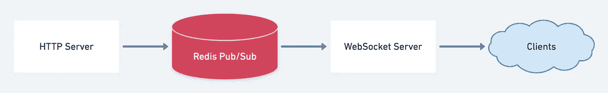
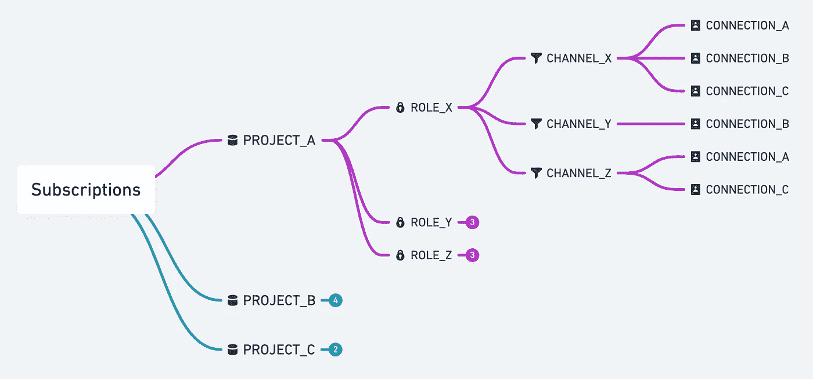
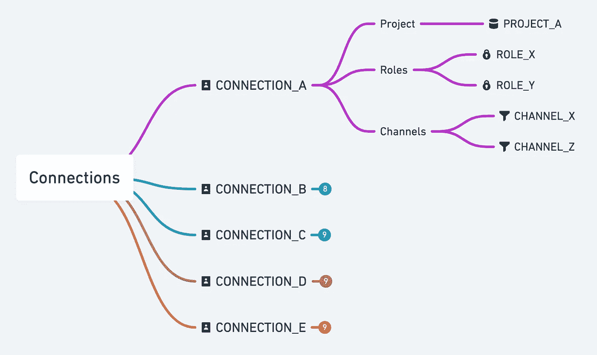

# 构建 WebSocket 服务器的经验教训

> 原文：<https://itnext.io/lessons-learned-from-building-a-websocket-server-e9bc0bd3ef80?source=collection_archive---------0----------------------->


Appwrite 是一个开源、自托管的后端即服务，旨在通过各种编程语言提供的 SDK 简化应用开发。

在 0.10.0 版本的实时 API 发布之前，应用程序只能与我们的 REST API 通信。

[](https://dev.to/appwrite/it-s-here-announcing-appwrite-0-10-and-the-new-appwrite-realtime-api-lbm) [## 它在这里！宣布 Appwrite 0.10 和新的实时 API！

### 经过长时间的期待和我们在 alpha 发布期间从 Appwrite 社区得到的巨大反馈，我们非常激动…

开发到](https://dev.to/appwrite/it-s-here-announcing-appwrite-0-10-and-the-new-appwrite-realtime-api-lbm) 

REST APIs 在过去一直是数据交付的流行架构。那么，为什么我们现在需要实时呢？

我们的 REST API 工作得很好，也很简单，但是为了让我们允许更多的灵活性，并允许开发人员创建新的用例，如游戏开发和反应式应用程序，我们需要添加一个新的 API 层来进行实时交互。

API 客户机不是在下一次查询时才获得新数据，而是立即将新数据推送给它们。如果开发人员已经在查询 REST API 的数据变化，这不仅仅意味着他们想要更快地访问数据，而是强烈地表明他们真的想要一个实时 API。

实时 API 提供了更令人愉快的开发体验，可以显著降低应用程序处理开销和代码复杂性。一旦数据被实时传输到系统中，您就可以让开发人员专注于为产品增加价值。

# 体系结构

因为实时服务是在已经存在的 REST API 之上实现的，所以通过实时发送的所有消息都是从 HTTP 服务器触发的。这意味着如果一个资源被创建或更新，WebSocket 服务器将被触发发送这个动作给它的订阅者。

REST 和 WebSocket 之间数据交换的主干是一个 [Redis](https://redis.io) 实例。我们使用一个单一的 [Pub/Sub](https://redis.io/topics/pubsub) 频道，这是 WebSocket 服务器的真实来源。如果通过 REST API 添加新资源，HTTP 服务器将在这个通道中发布有效负载和元数据。WebSocket 服务器订阅通道，处理消息，决定允许哪个客户端接收消息，并将其发送到目标客户端。



体系结构

# 数据流

在 Appwrite 中，来自 REST API 的资源由项目分隔，由权限保护，事件在通道中分类。当客户端建立到实时服务器的连接时，项目标识符将与信息一起发送，以验证到用户的连接以及客户端将通过其接收消息的通道。下面我们以**汽车**资源为例，告诉 WebSocket 服务器订阅**汽车**频道。

WebSocket 服务器现在将用户、项目和通道的所有角色分配给客户端的唯一连接标识符。

如果**汽车**资源现在通过 REST API 得到更新，HTTP 服务器将这个事件及其有效负载发布到 Redis 通道。然后，WebSocket 服务器将接收这个事件，并开始检查这个事件的接收者是谁。

客户端需要满足以下条件:
-项目 ID 必须相等。
-资源的权限必须符合用户的角色。
-必须订阅该频道。

然后，WebSocket 服务器会将资源的有效负载发送给所有满足条件的客户端。

# 数据结构

速度对于构建实时更新的应用程序至关重要。我们的数据结构需要尽可能快地被处理，以决定哪个客户机应该并被允许接收一个事件。为此，我们在内存中维护 2 个散列表。其中一个保存所有**订阅**，另一个保存所有**连接**。



捐款

看前面的条件，我们可以看到这个树反映的模式。您可能会意识到这种结构有一个缺点，即连接 ID 有许多重复的数据条目。但是，这个缺点是故意的，有特定的原因——速度。

在 WebSocket 服务器中，用内存换取速度是必不可少的。这种结构允许我们，即使有大量的订阅者，也能快速识别他们并将消息转发给他们，即使这可能会占用更多的内存。

下面是我们实现的一个例子，它将订阅者平均分布在 20 个不同的通道上，然后使用一个事件来收集该事件的所有订阅者。

```
+----------------+-------------+--------------+
| Subscriptions  |  Time used  |  Memory used |
+----------------+-------------+--------------+
|        10,000  |  0.022ms    |  11MB        |
|       100,000  |  0.238ms    |  90MB        |
|       500,000  |  1.525ms    |  427MB       |
|     1,000,000  |  3.678ms    |  852MB       |
|     5,000,000  |  19.334ms   |  4,289MB     |
+----------------+-------------+--------------+
```

这些数字对于日常应用来说已经足够快了，尤其是考虑到一台 WebSocket 服务器不可能同时维护超过一百万个连接。由于 WebSocket 服务器是无状态的，并且只管理自己的订阅，所以它可以很容易地进行水平伸缩，平衡工作。

现在我们来看下一个数据结构，以及我们首先需要它的原因。

让我们假设一个客户端连接到我们的 WebSocket 服务器并订阅了一些频道。一段时间后，客户端断开连接，我们必须清理他们，并从所有通道中删除他们的连接。



连接

为了避免识别每一个遗留物的无休止的循环，我们有一个辅助数据表来保存项目和每个连接的角色，以便于我们访问。使用这些数据，我们可以删除订阅者的所有信息，而不需要太多的搜索。

# 绊脚石

当然，我们第一次并没有把所有事情都做对。每当我们遇到并解决了一个障碍，下一个就已经在那里等着我们了。

## 权限变更

我们遇到的第一个障碍是:如果用户的权限在连接时发生变化，会发生什么？如果用户被停用，而连接仍然打开，该怎么办？

WebSocket 服务器不会知道这一变化，并将继续发送用户在连接开始时被允许接收的所有消息。这将导致向未被授权读取资源的人公开该资源。

为了防止这种现象，我们在发送到 WebSocket 服务器的消息中添加了一个标志，该标志指示特定用户的权限是否已经更改。当 WebSocket 服务器收到这个消息时，它会检查这个用户当前是否已连接，并将他们的角色与后端的角色进行匹配。

## 操作系统

Linux 的网络栈为许多工作负载提供了相同的缺省值，但是该栈没有针对 100 多万个并发连接进行调整。我们预计会面临某种形式的 [C10k 问题](https://en.wikipedia.org/wiki/C10k_problem)，所以我们提前准备了我们的系统[【1】](https://www.ibm.com/support/pages/tuning-and-debugging-maximum-connections-accepted-messagesight-v20)[【2】](https://www.linkedin.com/pulse/ec2-tuning-1m-tcp-connections-using-linux-stephen-blum/)[【3】](https://cromwell-intl.com/open-source/performance-tuning/tcp.html):
-增加了系统的默认 TCP 缓冲区大小
-增加了默认 IPv4 端口范围
-增加了打开文件和文件句柄的限制

尽管进行了这种调整，我们还是达到了大约 260，000 个连接的极限——超过这个极限，HTTP 服务器就停止响应我们的客户机。我们观察到我们的服务器没有完成 [TCP 三次握手](https://docs.microsoft.com/en-us/troubleshoot/windows-server/networking/three-way-handshake-via-tcpip):它将从客户端接收 SYN 数据包(正如用 [tcpdump](https://www.tcpdump.org/) 观察到的，但是没有用 ACK 响应。

经过几个小时毫无结果的调试后，我们联系了其他维护人员来关注这个问题。通过开源协作的力量，我们在几分钟内就找到了罪犯:

```
 $ cat /proc/sys/net/netfilter/nf_conntrack_max
262144 
```

因为 WebSocket 连接是长期的，所以我们需要增加网络堆栈中的连接跟踪限制。一旦增加，我们轻松地一路航行到 100 万连接。

## 异步交付

当我们检查发送消息的性能时，一切都进行得很顺利，也就是说，直到我们运行更高规模的测试，并对非常差的结果感到惊讶。罪魁祸首是我们串行发送每条消息，而不是并行发送。

幸运的是，解决方案只需要几行代码。

## 使用 Cookies 进行身份验证

WebSocket 服务器的第一个实现只进行单向通信，即向客户端发送更新。回想起来，这是一个问题，因为我们当前的实现使用了 HTTP-only cookie，该 cookie 通过握手传输到 WebSocket 服务器。

后来，在开发一个演示应用程序时，我们注意到在某些情况下这个 cookie 不会被发送，例如，当客户机和服务器在不同的域上时。

经过一番研究，我们发现握手根本不是一种身份验证的方法。原因可以从 Chrome 的 WebSocket 实现的维护者那里找到。这个问题可以通过 WebSocket 协议上的消息进行额外的身份验证来解决。如果用户没有通过 cookie 进行身份验证，我们决定通过消息进行身份验证，并将 cookie 的令牌发送到 WebSocket 服务器。

因此，仅仅依靠握手进行身份验证显然不是一个好主意。

## 外卖食品

当然，上述方法可能并不适用于每一个用例——但是在这一点上它们适用于我们。正如 [Donald Knuth](https://en.wikipedia.org/wiki/Donald_Knuth) 在他的书*计算机编程的艺术*中所说:

> 真正的问题是程序员在错误的地方和错误的时间花了太多的时间担心效率；过早的优化是编程中所有罪恶(或者至少是大部分罪恶)的根源。

我们可以对我们的数据结构进行微优化，让更多的用户获得更好的结果。但是，在负载平衡器后面添加 WebSocket 服务器的另一个实例并进行水平扩展会更容易。

只要这对我们有用，我们就会听从唐纳德的建议。

# 信用

感谢您的关注，我们希望您喜欢这篇文章！

以下是一些关于 Appwrite 的便捷链接:

- [Appwrite 首页](https://appwrite.io)
-[Appwrite Github](https://github.com/appwrite)-[Appwrite 不和](https://appwrite.io/discord)