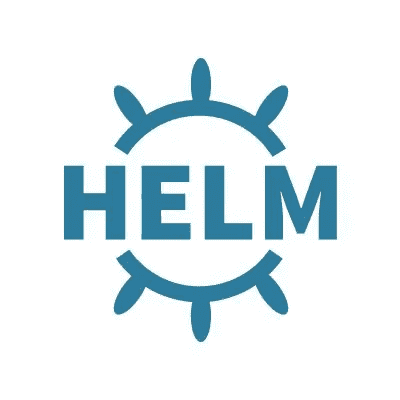

# 从分叉 Helm 项目中吸取的经验教训

> 原文：<https://itnext.io/lessons-learned-from-forking-a-helm-project-743ad48112e7?source=collection_archive---------2----------------------->

头盔对我来说并不陌生。写自己的东西或参与图表项目也不是。然而，最近对我来说很新鲜的一件事是派生一个上游图表项目，并在其上添加特性。我学到了一些艰难但也非常有用的经验，应该会使未来的贡献过程变得容易得多。在这篇文章中，我将解释我在过去的一周里在一个分叉图项目中所学到的东西。我会用一个决议来解释每一个教训。我不认为我会从这样一个简单的任务中学到一些有价值的经验。



helm.sh

## 您还必须将您的 fork 添加为 Github 页面。

这是我不确定的事情，因为我还没有*分叉*一个使用 [Github 页面](https://pages.github.com/)的项目。对于上下文，Helm 使用 Github 页面托管[图表库](https://helm.sh/docs/topics/chart_repository/#github-pages-example)。一旦我分叉了回购，我就检查我的回购是否继承了 Github 页面设置，并立即得到一个“ *404 Not Found* ”错误。

```
> helm repo add test [https://geekbass.github.io/aws-efs-csi-driver/helm/Chart.yaml](https://geekbass.github.io/aws-efs-csi-driver/helm/Chart.yaml)
W0112 16:02:38.753252   55521 loader.go:223] Config not found: admin.conf
Error: looks like "[https://geekbass.github.io/aws-efs-csi-driver/helm/Chart.yaml](https://geekbass.github.io/aws-efs-csi-driver/helm/Chart.yaml)" is not a valid chart repository or cannot be reached: failed to fetch [https://geekbass.github.io/aws-efs-csi-driver/helm/Chart.yaml/index.yaml](https://geekbass.github.io/aws-efs-csi-driver/helm/Chart.yaml/index.yaml) : 404 Not Found
```

我还从我的 repo 中的 Settings UI 确认它还没有发布。为 Helm repo 设置 Github 页面时，请务必查看 [Helm 站点](https://helm.sh/docs/topics/chart_repository/#github-pages-example)上的文档，并确保使用指定的分支“gh-pages”。请注意，在简单地分叉一个项目后，Github 不会正确地托管您的分叉项目，并且需要上面的额外步骤。

## **分叉时，您可能看不到版本中的所有工件。**

尽管我已经是 Github 的用户很长时间了，并参与了许多项目，但这对我来说还是有点震惊。我完全期望，如果我分叉一个项目，它会有完全相同的工件。在我的例子中，最初的项目在每个版本中都将图表打包在一个名为***helm-chart . tgz***的归档文件中。Helm 希望提取该文件，然后根据分支“gh-pages”上托管的***index . YAML***中的***URL****v*alue 部署版本。因为我假设当我测试图表的初始部署时，所有工件，或者每个 Github 发布页面 UI 的“资产”都在那里，所以我最终得到了另一个 404。**

```
*Warning  DriverDeployFailure  4m36s (x2 over 7m13s)  kubeaddons-controller  failed to fetch [https://github.com/geekbass/aws-efs-csi-driver/releases/download/v1.0.0/helm-chart.tgz](https://github.com/geekbass/aws-efs-csi-driver/releases/download/v1.0.2/helm-chart.tgz) : 404 Not Found*
```

*我不确定为什么在我进行回购后没有包括所有的资产，但我能够确认所有相同的发行都存在，但没有 ***helm-chart.tgz*** 文件(资产)。也许这是因为它是一个定制的工件，需要额外的工作来上传它？我没有对此做进一步的调查，因为调查并不重要，而是为将来做准备。*

*我只是能够从原始回购中下载缺失的资产(helm-chart.tgz ),在我的分叉回购中编辑 1.0.0 版本并上传它。一旦我上传了它，测试图表的部署就像预期的那样工作了！*

## ***密切关注发布，而不仅仅是主分支上存在的内容。***

*在我开始成功部署图表之后，我准备开始添加我自己的特性，然后最终删除我自己构建的版本。我最初的思考过程和我立即开始做的事情是基于师父创建一个新的分支。一旦我对特性感到满意，我就会将那个分支合并回主版本，然后根据我合并到主版本中的变更，剪切出一个新的版本。根据我的经验，这是非常普通的流程，但是我没有考虑到的是，到目前为止，*我只在最新的图表发布版本*上进行测试。从那以后，master 做了一些其他的改变，而且自上一个版本以来，很多东西都发生了变化。因为我没有考虑到这些变化，所以在我的初始部署中到处都是错误。不同组件的版本关闭，在这种情况下，驱动程序部署因此出现故障。*

```
*> k logs -f -n kube-system efs-csi-controller-6c65c6674f-4j6n5 csi-provisioner
I0113 18:57:49.472377       1 csi-provisioner.go:121] Version: v2.0.2
I0113 18:57:49.472472       1 csi-provisioner.go:135] Building kube configs for running in cluster...
I0113 18:57:49.478396       1 connection.go:153] Connecting to unix:///var/lib/csi/sockets/pluginproxy/csi.sock
I0113 18:57:49.478854       1 common.go:111] Probing CSI driver for readiness
I0113 18:57:49.478874       1 connection.go:182] GRPC call: /csi.v1.Identity/Probe
I0113 18:57:49.478878       1 connection.go:183] GRPC request: {}
I0113 18:57:49.480539       1 connection.go:185] GRPC response: {}
I0113 18:57:49.480586       1 connection.go:186] GRPC error: <nil>
I0113 18:57:49.480595       1 connection.go:182] GRPC call: /csi.v1.Identity/GetPluginInfo
I0113 18:57:49.480601       1 connection.go:183] GRPC request: {}
I0113 18:57:49.480882       1 connection.go:185] GRPC response: {"name":"efs.csi.aws.com","vendor_version":"v1.0.0-dirty"}
I0113 18:57:49.480933       1 connection.go:186] GRPC error: <nil>
I0113 18:57:49.480947       1 csi-provisioner.go:182] Detected CSI driver efs.csi.aws.com
W0113 18:57:49.480957       1 metrics.go:142] metrics endpoint will not be started because `metrics-address` was not specified.
I0113 18:57:49.480966       1 connection.go:182] GRPC call: /csi.v1.Identity/GetPluginCapabilities
I0113 18:57:49.480976       1 connection.go:183] GRPC request: {}
I0113 18:57:49.481196       1 connection.go:185] GRPC response: {}
I0113 18:57:49.481230       1 connection.go:186] GRPC error: <nil>
I0113 18:57:49.481237       1 connection.go:182] GRPC call: /csi.v1.Controller/ControllerGetCapabilities
I0113 18:57:49.481242       1 connection.go:183] GRPC request: {}
I0113 18:57:49.481523       1 connection.go:185] GRPC response: {}
I0113 18:57:49.481578       1 connection.go:186] GRPC error: rpc error: code = Unimplemented desc = unknown service csi.v1.Controller
F0113 18:57:49.481597       1 csi-provisioner.go:188] Error getting CSI driver capabilities: rpc error: code = Unimplemented desc = unknown service csi.v1.Controller*
```

*如上所述，经过进一步调查，这是由于不兼容的版本。然后我意识到我应该把我的特性建立在我玩的上一个版本上，而不是 master 上当前的版本。这对于我正在做的事情来说很好。*

*因为这不是你的回购，你可能不了解也不知道发行流程是怎么运作的。我现在将尝试识别最新版本和 master 之间的差异。此外，如果可能的话，我会试着更好地理解发布过程，以避免意外的问题。*

## *检查 Github 操作目录。*

*这适用于任何回购分叉，而不仅仅是从这个经验。始终注意项目根目录下的`.github/`目录，因为这是用于 [Github 动作](https://github.com/features/actions)的。我在提交或合并时没有遇到任何问题或意想不到的事情，除了我每次都会收到一封烦人的电子邮件，说我的回购出现了“*故障”*。这里的要点是，不注意这一点可能会导致意想不到的事情发生，而你最初并没有意识到。只是想在这里指出这一点。在我的特殊情况下，这是用于归档 **helm-chart.tgz** 文件并剪切新版本的工作流。*

## ***舵图中的范围流量控制。***

*最初分叉这个项目的主要原因是因为我想添加一个特性，允许图表部署一个或多个 [PersistentVolumes](https://kubernetes.io/docs/concepts/storage/persistent-volumes/) (PVs)、[persistent volume claims](https://kubernetes.io/docs/concepts/storage/persistent-volumes/)(PVCs)和/或一个 [StorageClass](https://kubernetes.io/docs/concepts/storage/storage-classes/) 。在查看了所有 Kubernetes 资源的规范之后，我决定需要一种方法来创建同一资源的多个实例，同时只使用一个模板文件。(例如:当用户想要创建两个 PV 时，它将使用相同的 **persistent-volume.yaml** 模板文件来创建这两个 PV。)这最好通过键值对的循环条件(在本例中是一个映射)来实现，但是不确定如何在 Helm 中实现。首先谷歌搜索揭示了[范围](https://helm.sh/docs/chart_template_guide/control_structures/#looping-with-the-range-action)流控制结构。*

*从这里开始，我决定如何在一个 **values.yaml** 文件中分配这些值，我得到了如下的结果(有点简化):*

```
*peristentVolumes:
  pv1:
    annotations:
      provisioned-by: efs-csi-driver
    storageCapacity: 5Gi
    storageClass: efs-storageclass
    fileSystemId: fs-blahblah
  pv2:
    storageCapacity: 10Gi
    storageClass: efs-sc
    fileSystemId: fs-woohoo*
```

*上面的想法是创建两个名为“pv1”和“pv2”的 PVs，并根据其贴图分配下面的属性。我们需要“循环”通过每个映射(pv1，pv2)，然后每个键值对来得到我们想要的。我们将此设置为`{{- range $k, $v := .Values.peristentVolumes }}`的舵变量。(更多信息见 [Go 模板变量](https://golang.org/pkg/text/template/#hdr-Variables))我得出的最终解决方案如下图`./templates/pv.yaml`:*

```
*{{- range $k, $v := .Values.peristentVolumes }}
apiVersion: v1
kind: PersistentVolume
metadata:
  {{- if $v.annotations }}
  annotations: {{ toYaml $v.annotations | nindent 4 }}
  {{- end }}
  name: {{ $k }}
spec:
  capacity:
    storage: {{ $v.storageCapacity }}
  volumeMode: Filesystem
  accessModes:
    - ReadWriteMany
  persistentVolumeReclaimPolicy: Retain
  storageClassName: {{ $v.storageClass }}
  csi:
    driver: efs.csi.aws.com
    volumeHandle: {{ $v.fileSystemId }}
---
{{- end }}*
```

*要在本地测试这一点，看看我们的模板是否如预期的那样工作:*

```
*> helm template ./
W0117 09:14:26.723511   43895 loader.go:223] Config not found: admin.conf
---
# Source: foochart/templates/pv.yaml
apiVersion: v1
kind: PersistentVolume
metadata:
  annotations:
    provisioned-by: efs-csi-driver
  name: pv1
spec:
  capacity:
    storage: 5Gi
  volumeMode: Filesystem
  accessModes:
    - ReadWriteMany
  persistentVolumeReclaimPolicy: Retain
  storageClassName: efs-storageclass
  csi:
    driver: efs.csi.aws.com
    volumeHandle: fs-blahblah
---
# Source: foochart/templates/pv.yaml
apiVersion: v1
kind: PersistentVolume
metadata:
  name: pv2
spec:
  capacity:
    storage: 10Gi
  volumeMode: Filesystem
  accessModes:
    - ReadWriteMany
  persistentVolumeReclaimPolicy: Retain
  storageClassName: efs-sc
  csi:
    driver: efs.csi.aws.com
    volumeHandle: fs-woohoo*
```

*这里还有一件令人尴尬的事情需要注意。在我的例子中，因为我想从一个模板文件中创建多个相同的资源，我忘了用`---`来分隔资源。K8s API 不喜欢这种格式。*

*没有什么比把自己投入到本该如此简单的事情中，最后却把头撞向键盘，质疑自己的职业选择更好的了。我是说真的(在很大程度上)。每一次斗争都会增长知识，不管多小。这让我作为一名工程师脚踏实地。我从未期望从这个小小的旅程中学到一些简单的教训，但希望这篇文章中有一些东西可以帮助其他人摆脱他们的键盘。*