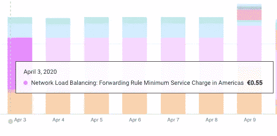
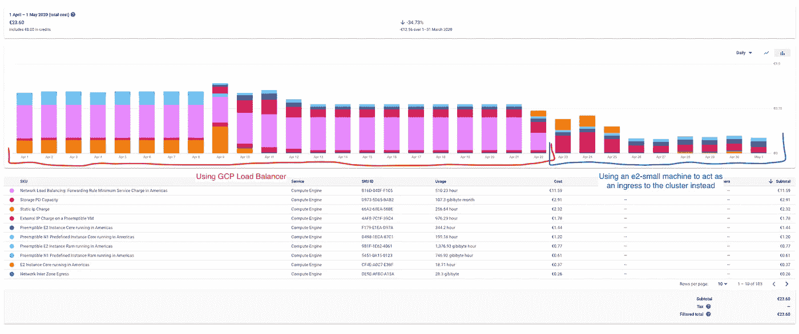

# 从为附带项目管理 Kubernetes 集群中获得的经验教训

> 原文：<https://itnext.io/lessons-learned-from-managing-a-kubernetes-cluster-for-side-projects-780fbbacf36c?source=collection_archive---------0----------------------->

截至 2020 年 11 月，我已经花了将近一年的时间管理一个非常小的 Kubernetes 集群来部署一些东西:

*   我的网址在 [https://armand1m.dev](https://armand1m.dev)
*   [我自己的网址缩写](https://go.d1m.dev/source)在 [https://go.d1m.dev](https://go.d1m.dev)
*   电报和懒人机器人。
*   [咕哝服务器](https://hub.docker.com/r/vimagick/murmur)
*   [三角帆](http://spinnaker.io/)
*   [无人机 CI](http://drone.io/)
*   我不时做的其他实验

简而言之:我使用 Kubernetes 来部署我可能想要部署的任何东西。它就像是我的个人游乐场，让互联网上的事物变得鲜活起来。

在做这些事情的时候，我最终学到了很多关于 Kubernetes、生态系统以及它如何与云提供商集成的知识。

我不是 SRE、系统管理员或 DevOps 工程师。我只是一个喜欢构建和管理分布式应用程序的软件工程师。

在这篇文章中，我的目的是介绍我在这一年中与 GKE 一起管理我自己的 Kubernetes 集群时学到的一些经验。

**免责声明:**如果你还不习惯 Kubernetes，你可能会觉得有点可怕。

## 习惯是需要时间的。

Kubernetes 是相当快节奏和复杂的。当我开始做这个的时候，Kubernetes 是 1.15 版，当前的最新版本是 1.19 版。像`CrashLoopBackOff`这样的错误在开始时会让你头晕目眩。

您与可用的 API 交互得越多，使用 Kubernetes 对象来部署和管理不同类型的应用程序的次数越多，这种差距就越小，并且越熟悉。

## Terraform 是一个好朋友

Terraform 让我能够在集群中规划和应用变化。添加新的节点池，在某个时间段内打开/关闭节点池中的可抢占类型，将节点更新到更新版本的`kube-proxy`等等。

但是，我不通过 Terraform 与集群对象进行交互。我将它的使用限制为管理集群及其节点，仅此而已。

## GKE 帮助你，但是你必须习惯它。

GKE 管理着部署和管理集群的大部分艰难工作。自动扩展节点，确保`kube-proxy`被适当配置，节点的健康检查是它的一些好的部分。

如果你习惯于管理你的节点，`ssh`进入它们或者使用类似`salt`的东西，你可能也会喜欢这个。

如果您习惯于只管理一个节点，以前从未管理过集群，您可能需要一段时间来适应这种情况。

## 使用云提供商的负载平衡器可能会很昂贵。

在 GCP，负载平衡器的成本可能相当高。部署一项`LoadBalancer`服务可能会花费你每天 0.55 欧元。

所以我做的是:

*   创建一个节点池，其中包含一个 e2-small 类型的节点和一个 taint，以便只执行入口工作负载
*   设置`kubeip`总是为入口节点分配一个静态 IP 地址，以防我需要重新创建它(或者使用一个可抢占的地址)
*   使用适当的节点关联和配置设置我的入口网关部署，以使用主机网络充当我的负载平衡器。

完成此操作后，您会在账单图表中看到相当大的变化:

这让我成为一个快乐的人

## Kubernetes 不仅仅是管理容器。

我曾经把 Kubernetes 看作是 Docker Compose 之类的东西的演化:一个分布式容器编排器。但是有了 Kubernetes 对象和 Operator 模式，Kubernetes 可以管理的远不止这些。

列举一些我在我的集群中完成的事情:

*   部署`kubeip`为特定节点自动分配静态 IP 地址。
*   供应和更新让我们通过`Certificate`和`ClusterIssuer`对象用`cert-manager`自动加密发布的 SSL 证书
*   通过`PersistentVolumeClaim`对象在 GCP 创建和删除持久磁盘
*   使用`VolumeSnapshot`对象从`PersistentVolumeClaim`对象在 GCP 创建磁盘快照
*   使用`snapscheduler`自动创建和终止`VolumeSnapshot`对象
*   使用`external-dns`实现云中 DNS 管理的自动化

我总是发现上面的很多东西非常手动且容易出错，Kubernetes 帮助我找到了将它们描述为我的应用程序的合理默认值的方法。

如今，我把 Kubernetes 视为一个国家调解人。我可以告诉集群我的工作负载、机密、外部服务的理想状态是什么，Kubernetes 将尽力使当前状态与之匹配。它会告诉你是否出了问题，这样你就可以采取行动。

## 当事情看起来不可思议时，检查集群事件

`kubectl get events`将向您显示群中的最新活动。这个命令对我进行故障排除和理解在我的集群中发生的事情非常重要。

这些对象的大多数协调器会将事件记录到集群中，您可以在这里看到其中的大多数。

## 可抢占的实例更便宜，但是有龙

可抢占实例可以比标准实例便宜 3.25 倍。你肯定想利用这些，因为你不仅想让自己快乐，还想让你的口袋快乐。

但是，默认情况下，在重新创建节点的过程中会有一些停机时间。在部署一些应用程序时，如果他们没有准备好处理这种行为，你可能会遇到麻烦。如果您的应用程序必须挂载一个磁盘，那么您需要考虑这一点以及重新创建节点和初始化工作负载的部分开始时间。

出于稳定性的考虑，有时你会倾向于使用标准的机器。

## 镜头太神奇了

我已经用了[镜头](https://k8slens.dev/)有一段时间了，非常棒。它与`kubectl`、`helm`和您所有的本地配置完美集成。

如果您在集群中正确配置了 Prometheus 和 metrics server，并且对集群中部署和发生的一切都有一个令人惊叹的可视化，那么您就可以很好地监控您的工作负载。

我喜欢 CLI，我相信`kubectl`是令人惊奇的，但是 Lens 提供的 UI 的便利性在诸如 Kubernetes 集群这样的复杂环境中是惊人的。

## Kubernetes 使本地与服务的交互更加容易

`kubectl`提供对运行服务时的常见任务非常有用的实用程序。

当您想在本地访问集群中的服务而不必公开它们时,`kubectl port-forward`非常有用。我经常用它来:

*   访问我用来管理集群的内部服务，而不必通过我的入口暴露它们(如 Grafana、Jaeger、Kiali 等)
*   从我的本地机器上舒适地运行 PostgreSQL 实例或者将转储恢复到 PostgreSQL 实例。

`kubectl cp`非常有助于在本地文件系统和已部署工作负载的文件系统之间复制文件。我经常使用它来访问工作负载的文件系统，以检查一些文件，甚至对挂载的持久磁盘进行一些更改。

`kubectl exec`是我最喜欢的一个，因为它可以让我创建一个几乎像 ssh 连接一样的交互式 shell，下面是一个例子:

`kubectl exec -it [pod-name] [container-name] -- /bin/sh`

您还可以使用它在容器本身中运行命令。以下是如何在运行 PostgreSQL 的 pod 中直接执行 SQL 文件的示例:

`kubectl exec -i [postgres-pod-name] postgres -- psql --username [postgres-user] --password [postgres-password] --dbname [database-name] < ./dump-backup.sql`

这些只是你可以用`kubectl`做的几件事，会给你的心带来一些快乐。

—

**简而言之:**到目前为止，这是一个有趣的探索。我不建议大多数人这样做，因为这是一个很大的工程，但是如果你想在工作之外了解更多关于 Kubernetes 的知识，这绝对是值得的。

还有更多的东西，我希望随着我了解的更多，继续更新这篇文章，但是现在，就这样了。到目前为止非常有趣，我已经打破了我的头很多，但我相信我现在做得很好。

我的下一步是尝试编写自己的 Kubernetes 操作符。希望我能够在新的文章中继续这些内容。

非常感谢你阅读这篇文章，我希望你在这些疯狂的时刻安然无恙。下次见！